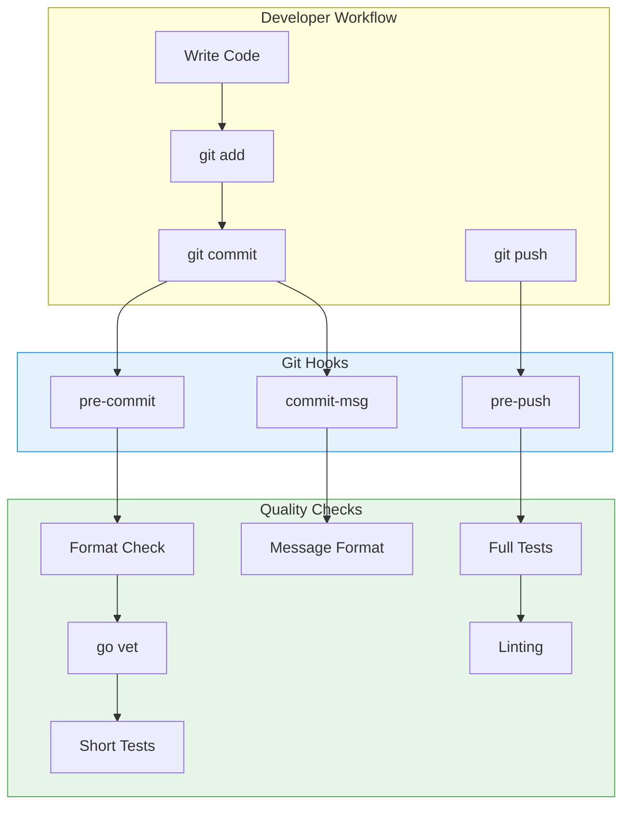
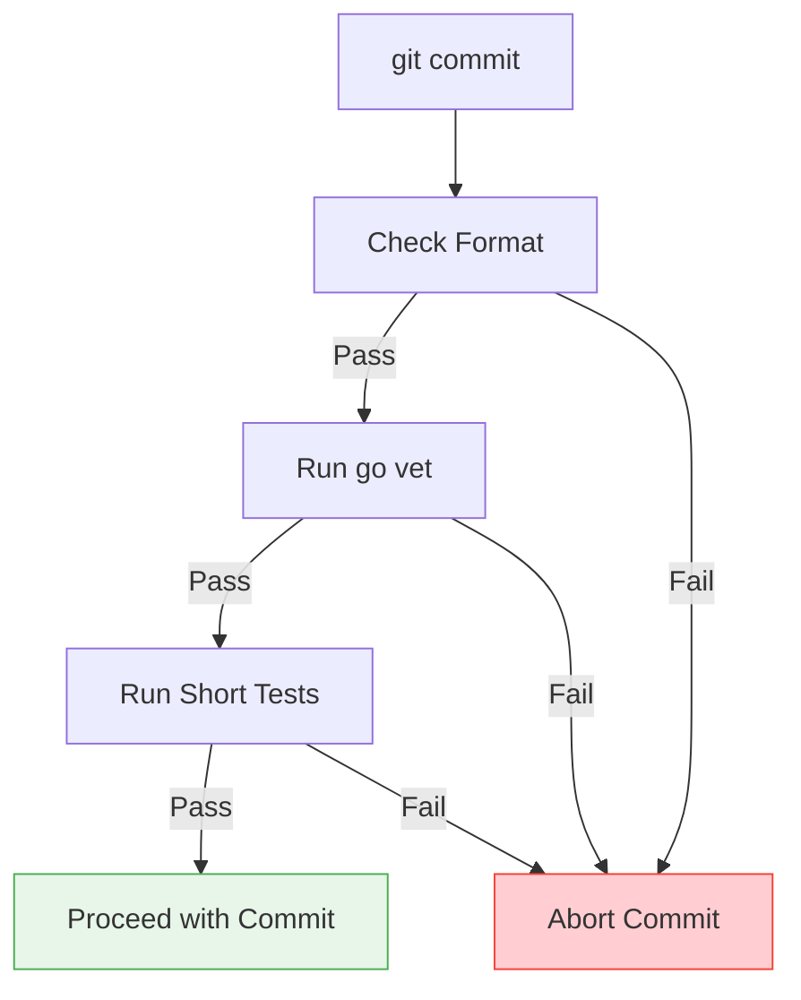
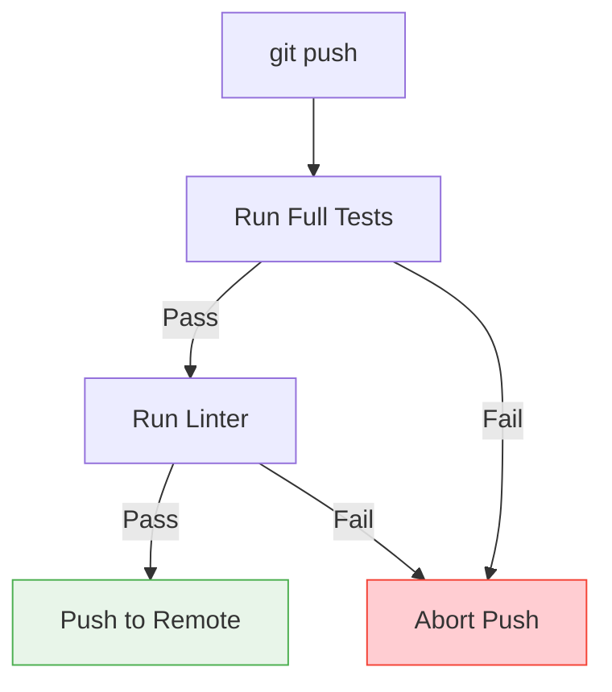

# TFO-MCP Git Hooks

> Git hooks documentation for TelemetryFlow MCP Server

---

## Table of Contents

- [Overview](#overview)
- [Available Hooks](#available-hooks)
- [Installation](#installation)
- [Hook Details](#hook-details)
- [Customization](#customization)
- [Troubleshooting](#troubleshooting)

---

## Overview

Git hooks are scripts that run automatically when certain Git events occur. TFO-MCP provides pre-configured hooks to ensure code quality and consistency.

### Hook Architecture



---

## Available Hooks

| Hook         | Trigger              | Purpose                        |
| ------------ | -------------------- | ------------------------------ |
| `pre-commit` | Before commit        | Format check, vet, short tests |
| `commit-msg` | After commit message | Validate message format        |
| `pre-push`   | Before push          | Full tests, linting            |

---

## Installation

### Automatic Installation

```bash
# Run the development setup script
./scripts/setup-dev.sh hooks
```

### Manual Installation

```bash
# Copy hooks to Git hooks directory
cp docs/githooks/pre-commit .git/hooks/
cp docs/githooks/commit-msg .git/hooks/
cp docs/githooks/pre-push .git/hooks/

# Make them executable
chmod +x .git/hooks/pre-commit
chmod +x .git/hooks/commit-msg
chmod +x .git/hooks/pre-push
```

### Verify Installation

```bash
# List installed hooks
ls -la .git/hooks/

# Test pre-commit hook
.git/hooks/pre-commit
```

---

## Hook Details

### pre-commit

Runs before each commit to ensure code quality.



**Checks performed:**

1. **Format Check**: Ensures all Go files are properly formatted
2. **go vet**: Static analysis for common errors
3. **Short Tests**: Quick unit tests

**Script:**

```bash
#!/usr/bin/env bash
set -e

echo "Running pre-commit checks..."

# Format check
echo "Checking code format..."
UNFORMATTED=$(gofmt -l . 2>&1 | grep -v vendor || true)
if [[ -n "${UNFORMATTED}" ]]; then
    echo "Error: Files not formatted:"
    echo "${UNFORMATTED}"
    echo "Run: gofmt -w ."
    exit 1
fi

# Run vet
echo "Running go vet..."
go vet ./...

# Run short tests
echo "Running short tests..."
go test -short -race ./...

echo "Pre-commit checks passed!"
```

### commit-msg

Validates commit message format follows Conventional Commits.

**Format:**

```
<type>(<scope>): <subject>

[optional body]

[optional footer]
```

**Valid types:**

- `feat`: New feature
- `fix`: Bug fix
- `docs`: Documentation
- `style`: Formatting
- `refactor`: Code restructuring
- `test`: Tests
- `chore`: Maintenance
- `perf`: Performance
- `ci`: CI/CD
- `build`: Build system
- `revert`: Revert commit

**Examples:**

```
feat(tools): add file search tool

fix(session): resolve timeout issue

docs: update README
```

**Script:**

```bash
#!/usr/bin/env bash

COMMIT_MSG_FILE=$1
COMMIT_MSG=$(cat "$COMMIT_MSG_FILE")

# Check commit message format
PATTERN="^(feat|fix|docs|style|refactor|test|chore|perf|ci|build|revert)(\(.+\))?: .+"

if ! echo "$COMMIT_MSG" | grep -qE "$PATTERN"; then
    echo "Error: Invalid commit message format"
    echo ""
    echo "Expected: <type>(<scope>): <subject>"
    echo ""
    echo "Types: feat, fix, docs, style, refactor, test, chore, perf, ci, build, revert"
    echo ""
    echo "Examples:"
    echo "  feat(tools): add new search tool"
    echo "  fix(session): resolve timeout issue"
    exit 1
fi

echo "Commit message format valid"
```

### pre-push

Runs before pushing to remote to ensure all tests pass.



**Checks performed:**

1. **Full Test Suite**: All tests with race detection
2. **Linting**: golangci-lint (if available)

**Script:**

```bash
#!/usr/bin/env bash
set -e

echo "Running pre-push checks..."

# Run full tests
echo "Running full test suite..."
go test -race ./...

# Run linter if available
if command -v golangci-lint &> /dev/null; then
    echo "Running linter..."
    golangci-lint run ./...
fi

echo "Pre-push checks passed!"
```

---

## Customization

### Skipping Hooks

```bash
# Skip pre-commit hook
git commit --no-verify -m "feat: urgent fix"

# Skip pre-push hook
git push --no-verify
```

> **Warning**: Use `--no-verify` sparingly. CI will still run checks.

### Modifying Hooks

1. Edit the hook file in `.git/hooks/`
2. Or modify source in `docs/githooks/` and re-run setup

### Adding New Hooks

1. Create hook script in `docs/githooks/`
2. Add to setup script
3. Document the hook

**Available Git hooks:**

- `applypatch-msg`
- `pre-applypatch`
- `post-applypatch`
- `pre-commit`
- `pre-merge-commit`
- `prepare-commit-msg`
- `commit-msg`
- `post-commit`
- `pre-rebase`
- `post-checkout`
- `post-merge`
- `pre-push`
- `post-receive`
- `update`
- `post-update`

---

## Troubleshooting

### Hook Not Running

```bash
# Check if hook is executable
ls -la .git/hooks/pre-commit

# Make executable
chmod +x .git/hooks/pre-commit

# Check shebang line
head -1 .git/hooks/pre-commit
# Should be: #!/usr/bin/env bash
```

### Hook Failing

```bash
# Run hook manually to see output
.git/hooks/pre-commit

# Run with debug
bash -x .git/hooks/pre-commit
```

### Common Issues

| Issue                | Solution                                |
| -------------------- | --------------------------------------- |
| Permission denied    | `chmod +x .git/hooks/*`                 |
| Command not found    | Install required tool (go, gofmt, etc.) |
| Tests failing        | Fix tests before committing             |
| Format check failing | Run `gofmt -w .`                        |

### Resetting Hooks

```bash
# Remove all hooks
rm -f .git/hooks/*

# Reinstall
./scripts/setup-dev.sh hooks
```

---

## Related Documentation

- [Development Guide](../DEVELOPMENT.md)
- [Git Workflow](GIT-WORKFLOW.md)
- [Contributing Guide](../../CONTRIBUTING.md)

---

<div align="center">

**[Back to Documentation Index](../README.md)**

</div>
