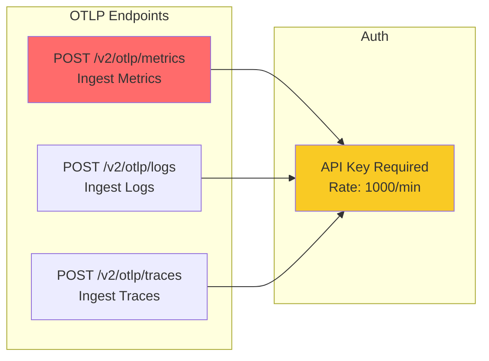
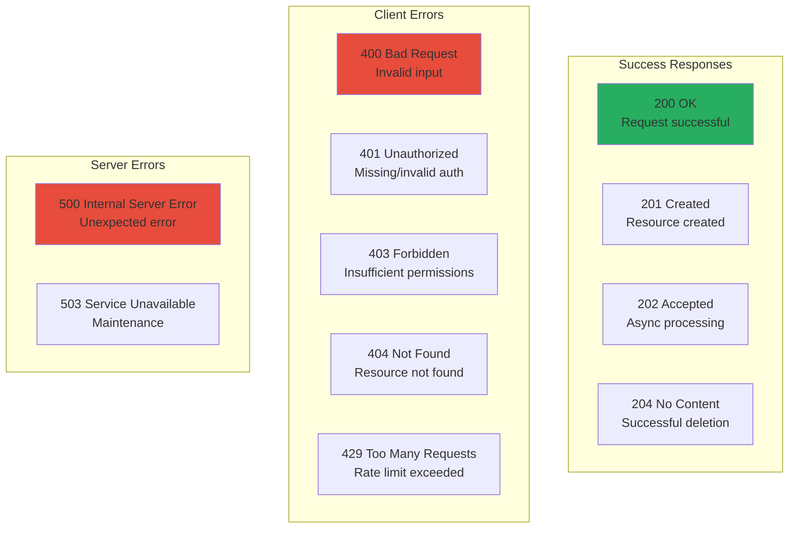
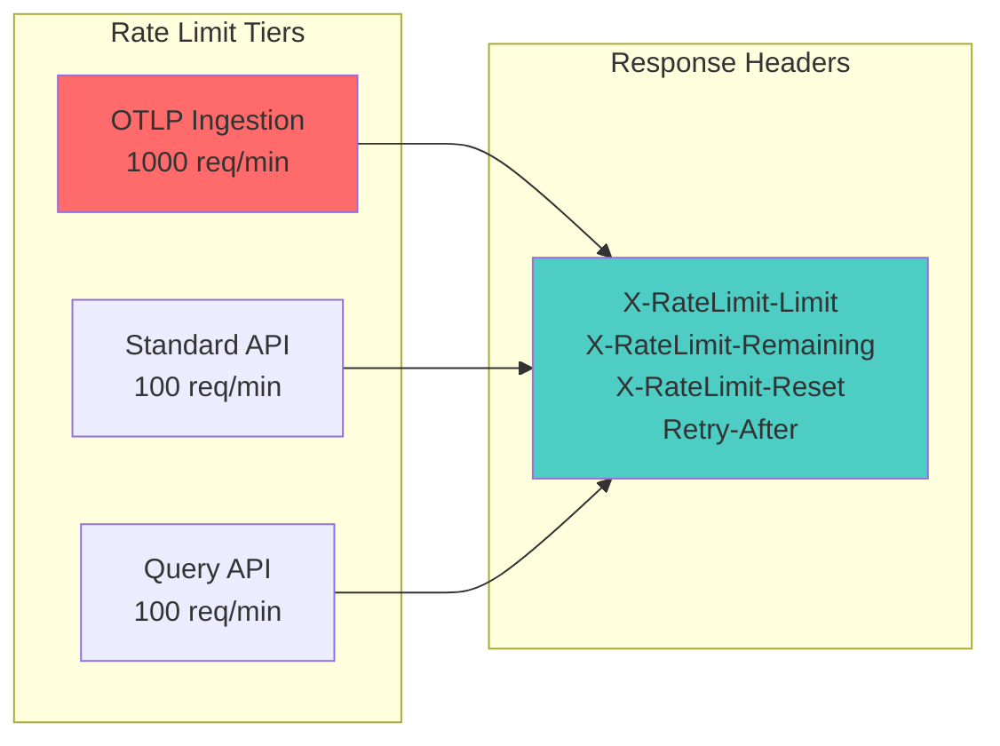

# API Reference

- **Version:** 1.1.2-CE
- **Last Updated:** January 01st, 2026
- **Base URL:** `http://localhost:3000/api/v2`

---

## Authentication

### JWT Token

```bash
# Login to get JWT token
curl -X POST http://localhost:3000/api/v2/auth/login \
  -H "Content-Type: application/json" \
  -d '{
    "email": "admin@telemetryflow.id",
    "password": "your-password"
  }'

# Response:
{
  "accessToken": "eyJhbGc...",
  "refreshToken": "eyJhbGc...",
  "expiresIn": 900
}

# Use token in subsequent requests
curl -H "Authorization: Bearer eyJhbGc..."
```

### API Key

```bash
# Use API Key for OTLP ingestion
curl -X POST http://localhost:3000/api/v2/otlp/metrics \
  -H "X-API-Key-ID: tfk-abc123..." \
  -H "X-API-Key-Secret: tfs-xyz789..." \
  -H "Content-Type: application/json"
```

---

## Core Endpoints

### OTLP Ingestion



### Users (IAM)

| Endpoint | Method | Auth | Permission | Description |
|----------|--------|------|------------|-------------|
| `/users` | POST | JWT | `user:write` | Create user |
| `/users` | GET | JWT | `user:read` | List users |
| `/users/:id` | GET | JWT | `user:read` | Get user details |
| `/users/:id` | PUT | JWT | `user:write` | Update user |
| `/users/:id` | DELETE | JWT | `user:delete` | Delete user |

### Metrics

| Endpoint | Method | Auth | Permission | Description |
|----------|--------|------|------------|-------------|
| `/telemetry/metrics/ingest` | POST | Public | None | Ingest metrics (OTEL) |
| `/telemetry/metrics/query` | GET | JWT | `metrics:read` | Query metrics |
| `/telemetry/metrics/timeseries` | GET | JWT | `metrics:read` | Time series data |
| `/telemetry/metrics/names` | GET | JWT | `metrics:read` | List metric names |

### Logs

| Endpoint | Method | Auth | Permission | Description |
|----------|--------|------|------------|-------------|
| `/telemetry/logs/query` | GET | JWT | `logs:read` | Query logs |
| `/telemetry/logs/export` | GET | JWT | `logs:read` | Export logs (CSV/JSON) |

### Alerts

| Endpoint | Method | Auth | Permission | Description |
|----------|--------|------|------------|-------------|
| `/alerts/rules` | POST | JWT | `alerts:write` | Create alert rule |
| `/alerts/rules` | GET | JWT | `alerts:read` | List alert rules |
| `/alerts/rules/:id` | GET | JWT | `alerts:read` | Get rule details |
| `/alerts/rules/:id` | PUT | JWT | `alerts:write` | Update rule |
| `/alerts/rules/:id` | DELETE | JWT | `alerts:delete` | Delete rule |
| `/alerts/incidents` | GET | JWT | `alerts:read` | List incidents |

### Dashboards

| Endpoint | Method | Auth | Permission | Description |
|----------|--------|------|------------|-------------|
| `/dashboards` | POST | JWT | `dashboards:write` | Create dashboard |
| `/dashboards` | GET | JWT | `dashboards:read` | List dashboards |
| `/dashboards/:id` | GET | JWT | `dashboards:read` | Get dashboard |
| `/dashboards/:id` | PUT | JWT | `dashboards:write` | Update dashboard |
| `/dashboards/:id` | DELETE | JWT | `dashboards:delete` | Delete dashboard |

---

## Common Request Examples

### Ingest Metrics (OTLP)

```json
POST /v2/otlp/metrics
Headers:
  X-API-Key-ID: tfk-abc123...
  X-API-Key-Secret: tfs-xyz789...
  Content-Type: application/json

Body:
{
  "resourceMetrics": [{
    "resource": {
      "attributes": [
        {"key": "service.name", "value": {"stringValue": "api-gateway"}},
        {"key": "telemetryflow.tenant.id", "value": {"stringValue": "tenant-123"}}
      ]
    },
    "scopeMetrics": [{
      "metrics": [{
        "name": "http_requests_total",
        "unit": "1",
        "sum": {
          "dataPoints": [{
            "timeUnixNano": "1704067200000000000",
            "asInt": "1500"
          }]
        }
      }]
    }]
  }]
}
```

### Query Metrics

```bash
GET /telemetry/metrics/query?metricName=cpu_usage&startTime=2025-01-01T00:00:00Z&endTime=2025-01-02T00:00:00Z
Headers:
  Authorization: Bearer eyJhbGc...
```

### Create Alert Rule

```json
POST /alerts/rules
Headers:
  Authorization: Bearer eyJhbGc...

Body:
{
  "name": "High CPU Alert",
  "metricName": "cpu_usage",
  "condition": "avg",
  "threshold": 80,
  "operator": ">",
  "evaluationWindow": "5m",
  "severity": "warning",
  "channels": ["email", "slack"]
}
```

---

## Response Codes



| Code | Status | Meaning |
|------|--------|---------|
| **200** | OK | Request successful |
| **201** | Created | Resource created successfully |
| **202** | Accepted | Accepted for async processing |
| **204** | No Content | Successful deletion, no content |
| **400** | Bad Request | Invalid input or validation error |
| **401** | Unauthorized | Missing or invalid authentication |
| **403** | Forbidden | Insufficient permissions |
| **404** | Not Found | Resource doesn't exist |
| **429** | Too Many Requests | Rate limit exceeded |
| **500** | Internal Server Error | Unexpected server error |
| **503** | Service Unavailable | Server maintenance |

---

## Rate Limits



| Endpoint Type | Rate Limit | Window |
|---------------|------------|--------|
| **OTLP Ingestion** | 1000 requests | 60 seconds |
| **Standard API** | 100 requests | 60 seconds |
| **Authentication** | 10 requests | 60 seconds |

**Rate Limit Headers:**
```
X-RateLimit-Limit: 100
X-RateLimit-Remaining: 45
X-RateLimit-Reset: 1704067200
Retry-After: 15
```

---

## Error Response Format

```json
{
  "statusCode": 400,
  "message": "Validation failed",
  "error": "Bad Request",
  "details": {
    "field": "metricName",
    "constraint": "must follow OTEL naming convention"
  },
  "timestamp": "2025-01-15T10:30:00.000Z",
  "path": "/api/v2/telemetry/metrics/query"
}
```

---

## Pagination

```bash
GET /users?page=1&limit=20

Response:
{
  "data": [...],
  "meta": {
    "page": 1,
    "limit": 20,
    "total": 150,
    "totalPages": 8
  }
}
```

---

## Quick Links

- [Full API Reference](./API-REFERENCE.md) - Complete endpoint documentation
- [Authentication Guide](../architecture/04-SECURITY.md) - Auth flows
- [OTLP Ingestion Guide](./OTLP-INGESTION.md) - OTLP integration
- [Backend Overview](../backend/00-BACKEND-OVERVIEW.md) - Architecture

---

- **File Location:** `./shared/API-REFERENCE.md`
- **Maintained By:** DevOpsCorner Indonesia
