# Database Schema Documentation

- **Version:** 1.1.1-CE
- **Last Updated:** December 12, 2025
- **Status:** ✅ Production Ready

---

## Table of Contents

1. [Overview](#overview)
2. [PostgreSQL Schema (Metadata)](#postgresql-schema-metadata)
3. [ClickHouse Schema (Telemetry)](#clickhouse-schema-telemetry)
4. [Schema Relationships](#schema-relationships)
5. [Indexing Strategy](#indexing-strategy)
6. [Migration Strategy](#migration-strategy)

---

## Overview

TelemetryFlow uses a **dual-database architecture**:
- **PostgreSQL**: ACID-compliant relational data (metadata, configuration)
- **ClickHouse**: Columnar time-series data (metrics, logs, traces)

**Total Tables:**
- PostgreSQL: 30+ tables
- ClickHouse: 10+ tables

---

## PostgreSQL Schema (Metadata)

### IAM & Multi-Tenancy (100-core)

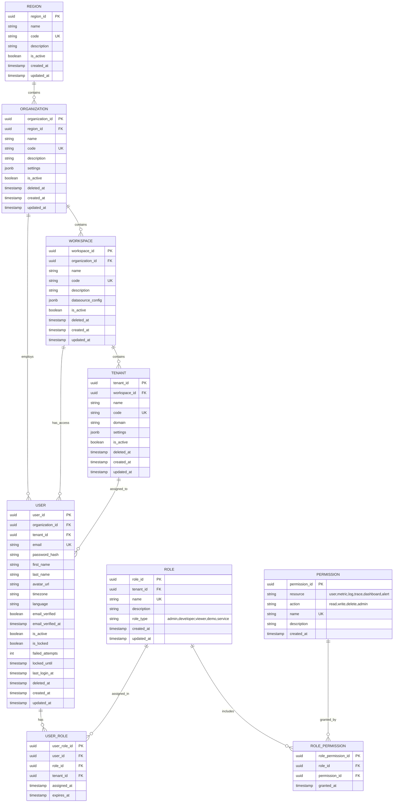
```mermaid
erDiagram
    REGION ||--o{ ORGANIZATION : contains
    ORGANIZATION ||--o{ WORKSPACE : contains
    WORKSPACE ||--o{ TENANT : contains
    ORGANIZATION ||--o{ USER : employs
    WORKSPACE ||--o{ USER : has_access
    TENANT ||--o{ USER : assigned_to
    USER ||--o{ USER_ROLE : has
    ROLE ||--o{ USER_ROLE : assigned_in
    ROLE ||--o{ ROLE_PERMISSION : includes
    PERMISSION ||--o{ ROLE_PERMISSION : granted_by

    REGION {
        uuid region_id PK
        string name
        string code UK
        string description
        boolean is_active
        timestamp created_at
        timestamp updated_at
    }

    ORGANIZATION {
        uuid organization_id PK
        uuid region_id FK
        string name
        string code UK
        string description
        jsonb settings
        boolean is_active
        timestamp deleted_at
        timestamp created_at
        timestamp updated_at
    }

    WORKSPACE {
        uuid workspace_id PK
        uuid organization_id FK
        string name
        string code UK
        string description
        jsonb datasource_config
        boolean is_active
        timestamp deleted_at
        timestamp created_at
        timestamp updated_at
    }

    TENANT {
        uuid tenant_id PK
        uuid workspace_id FK
        string name
        string code UK
        string domain
        jsonb settings
        boolean is_active
        timestamp deleted_at
        timestamp created_at
        timestamp updated_at
    }

    USER {
        uuid user_id PK
        uuid organization_id FK
        uuid tenant_id FK
        string email UK
        string password_hash
        string first_name
        string last_name
        string avatar_url
        string timezone
        string language
        boolean email_verified
        timestamp email_verified_at
        boolean is_active
        boolean is_locked
        int failed_attempts
        timestamp locked_until
        timestamp last_login_at
        timestamp deleted_at
        timestamp created_at
        timestamp updated_at
    }

    ROLE {
        uuid role_id PK
        uuid tenant_id FK
        string name UK
        string description
        string role_type "admin,developer,viewer,demo,service"
        timestamp created_at
        timestamp updated_at
    }

    USER_ROLE {
        uuid user_role_id PK
        uuid user_id FK
        uuid role_id FK
        uuid tenant_id FK
        timestamp assigned_at
        timestamp expires_at
    }

    PERMISSION {
        uuid permission_id PK
        string resource "user,metric,log,trace,dashboard,alert"
        string action "read,write,delete,admin"
        string name UK
        string description
        timestamp created_at
    }

    ROLE_PERMISSION {
        uuid role_permission_id PK
        uuid role_id FK
        uuid permission_id FK
        timestamp granted_at
    }
```

### Authentication (200-auth)

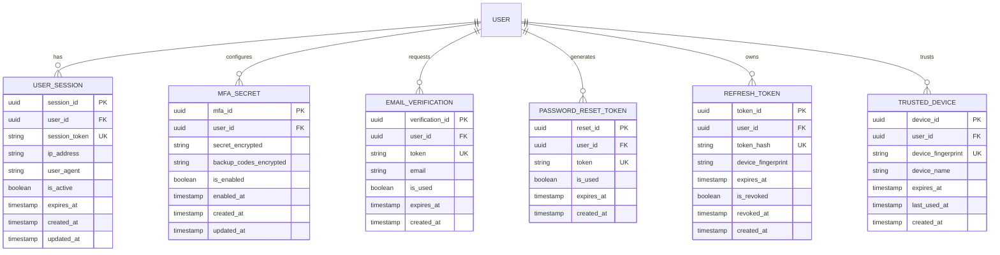
```mermaid
erDiagram
    USER ||--o{ USER_SESSION : has
    USER ||--o{ MFA_SECRET : configures
    USER ||--o{ EMAIL_VERIFICATION : requests
    USER ||--o{ PASSWORD_RESET_TOKEN : generates
    USER ||--o{ REFRESH_TOKEN : owns
    USER ||--o{ TRUSTED_DEVICE : trusts

    USER_SESSION {
        uuid session_id PK
        uuid user_id FK
        string session_token UK
        string ip_address
        string user_agent
        boolean is_active
        timestamp expires_at
        timestamp created_at
        timestamp updated_at
    }

    MFA_SECRET {
        uuid mfa_id PK
        uuid user_id FK
        string secret_encrypted
        string backup_codes_encrypted
        boolean is_enabled
        timestamp enabled_at
        timestamp created_at
        timestamp updated_at
    }

    EMAIL_VERIFICATION {
        uuid verification_id PK
        uuid user_id FK
        string token UK
        string email
        boolean is_used
        timestamp expires_at
        timestamp created_at
    }

    PASSWORD_RESET_TOKEN {
        uuid reset_id PK
        uuid user_id FK
        string token UK
        boolean is_used
        timestamp expires_at
        timestamp created_at
    }

    REFRESH_TOKEN {
        uuid token_id PK
        uuid user_id FK
        string token_hash UK
        string device_fingerprint
        timestamp expires_at
        boolean is_revoked
        timestamp revoked_at
        timestamp created_at
    }

    TRUSTED_DEVICE {
        uuid device_id PK
        uuid user_id FK
        string device_fingerprint UK
        string device_name
        timestamp expires_at
        timestamp last_used_at
        timestamp created_at
    }
```

### API Keys (300-api-keys)

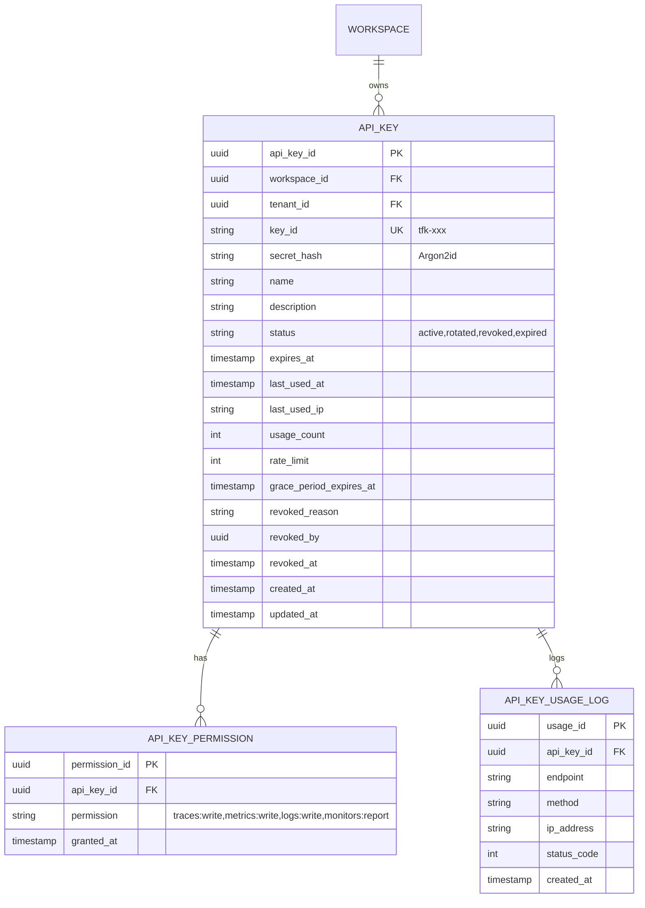
```mermaid
erDiagram
    WORKSPACE ||--o{ API_KEY : owns
    API_KEY ||--o{ API_KEY_PERMISSION : has
    API_KEY ||--o{ API_KEY_USAGE_LOG : logs

    API_KEY {
        uuid api_key_id PK
        uuid workspace_id FK
        uuid tenant_id FK
        string key_id UK "tfk-xxx"
        string secret_hash "Argon2id"
        string name
        string description
        string status "active,rotated,revoked,expired"
        timestamp expires_at
        timestamp last_used_at
        string last_used_ip
        int usage_count
        int rate_limit
        timestamp grace_period_expires_at
        string revoked_reason
        uuid revoked_by
        timestamp revoked_at
        timestamp created_at
        timestamp updated_at
    }

    API_KEY_PERMISSION {
        uuid permission_id PK
        uuid api_key_id FK
        string permission "traces:write,metrics:write,logs:write,monitors:report"
        timestamp granted_at
    }

    API_KEY_USAGE_LOG {
        uuid usage_id PK
        uuid api_key_id FK
        string endpoint
        string method
        string ip_address
        int status_code
        timestamp created_at
    }
```

### Alerts (600-alerts)

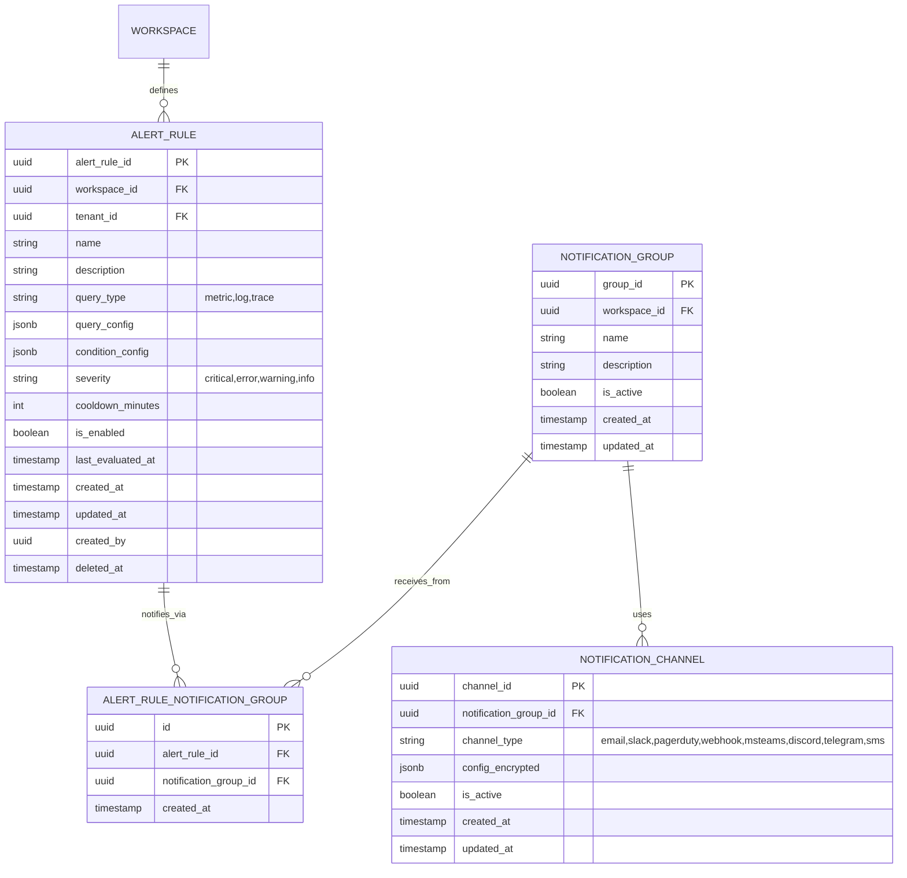
```mermaid
erDiagram
    WORKSPACE ||--o{ ALERT_RULE : defines
    ALERT_RULE ||--o{ ALERT_RULE_NOTIFICATION_GROUP : notifies_via
    NOTIFICATION_GROUP ||--o{ ALERT_RULE_NOTIFICATION_GROUP : receives_from
    NOTIFICATION_GROUP ||--o{ NOTIFICATION_CHANNEL : uses

    ALERT_RULE {
        uuid alert_rule_id PK
        uuid workspace_id FK
        uuid tenant_id FK
        string name
        string description
        string query_type "metric,log,trace"
        jsonb query_config
        jsonb condition_config
        string severity "critical,error,warning,info"
        int cooldown_minutes
        boolean is_enabled
        timestamp last_evaluated_at
        timestamp created_at
        timestamp updated_at
        uuid created_by
        timestamp deleted_at
    }

    NOTIFICATION_GROUP {
        uuid group_id PK
        uuid workspace_id FK
        string name
        string description
        boolean is_active
        timestamp created_at
        timestamp updated_at
    }

    ALERT_RULE_NOTIFICATION_GROUP {
        uuid id PK
        uuid alert_rule_id FK
        uuid notification_group_id FK
        timestamp created_at
    }

    NOTIFICATION_CHANNEL {
        uuid channel_id PK
        uuid notification_group_id FK
        string channel_type "email,slack,pagerduty,webhook,msteams,discord,telegram,sms"
        jsonb config_encrypted
        boolean is_active
        timestamp created_at
        timestamp updated_at
    }
```

### Dashboards (900-dashboard)

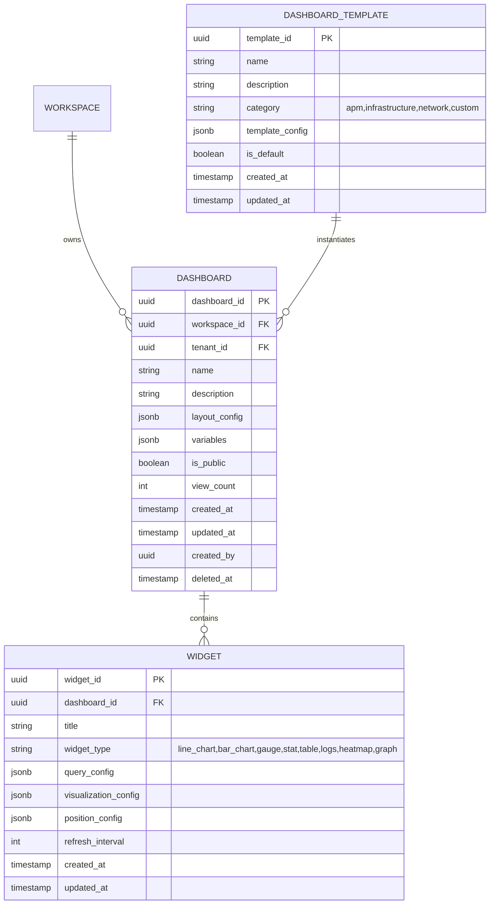
```mermaid
erDiagram
    WORKSPACE ||--o{ DASHBOARD : owns
    DASHBOARD ||--o{ WIDGET : contains
    DASHBOARD_TEMPLATE ||--o{ DASHBOARD : instantiates

    DASHBOARD {
        uuid dashboard_id PK
        uuid workspace_id FK
        uuid tenant_id FK
        string name
        string description
        jsonb layout_config
        jsonb variables
        boolean is_public
        int view_count
        timestamp created_at
        timestamp updated_at
        uuid created_by
        timestamp deleted_at
    }

    WIDGET {
        uuid widget_id PK
        uuid dashboard_id FK
        string title
        string widget_type "line_chart,bar_chart,gauge,stat,table,logs,heatmap,graph"
        jsonb query_config
        jsonb visualization_config
        jsonb position_config
        int refresh_interval
        timestamp created_at
        timestamp updated_at
    }

    DASHBOARD_TEMPLATE {
        uuid template_id PK
        string name
        string description
        string category "apm,infrastructure,network,custom"
        jsonb template_config
        boolean is_default
        timestamp created_at
        timestamp updated_at
    }
```

### Monitoring (500-monitoring)

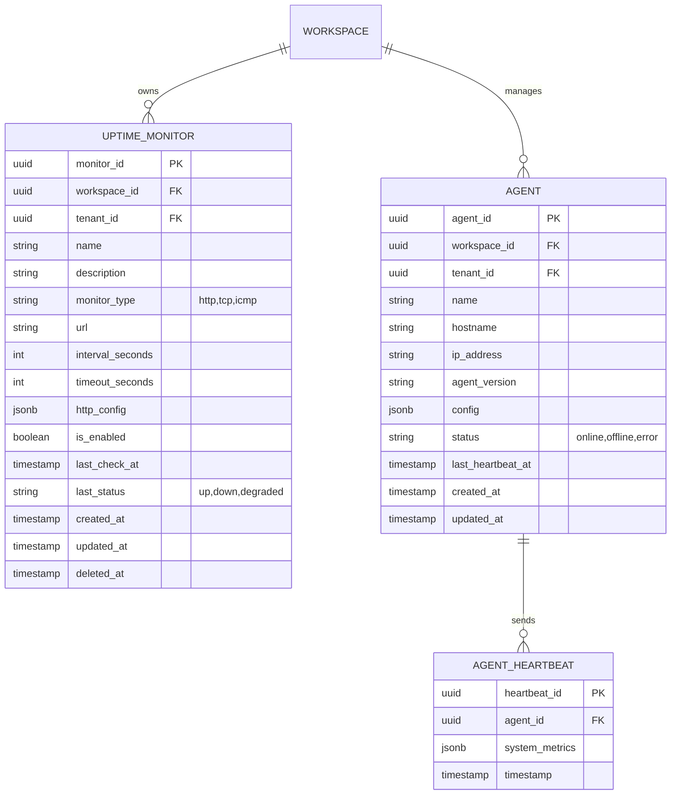
```mermaid
erDiagram
    WORKSPACE ||--o{ UPTIME_MONITOR : owns
    WORKSPACE ||--o{ AGENT : manages
    AGENT ||--o{ AGENT_HEARTBEAT : sends

    UPTIME_MONITOR {
        uuid monitor_id PK
        uuid workspace_id FK
        uuid tenant_id FK
        string name
        string description
        string monitor_type "http,tcp,icmp"
        string url
        int interval_seconds
        int timeout_seconds
        jsonb http_config
        boolean is_enabled
        timestamp last_check_at
        string last_status "up,down,degraded"
        timestamp created_at
        timestamp updated_at
        timestamp deleted_at
    }

    AGENT {
        uuid agent_id PK
        uuid workspace_id FK
        uuid tenant_id FK
        string name
        string hostname
        string ip_address
        string agent_version
        jsonb config
        string status "online,offline,error"
        timestamp last_heartbeat_at
        timestamp created_at
        timestamp updated_at
    }

    AGENT_HEARTBEAT {
        uuid heartbeat_id PK
        uuid agent_id FK
        jsonb system_metrics
        timestamp timestamp
    }
```

### Subscription (1000-subscription)

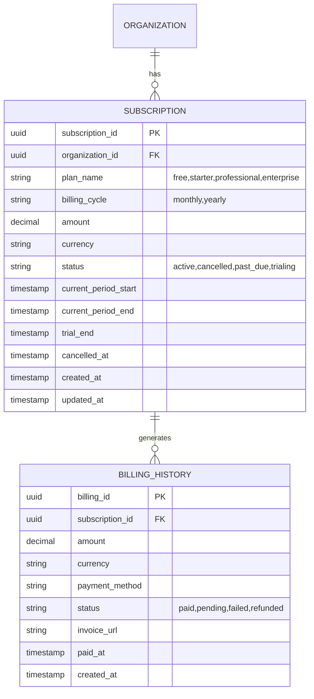
```mermaid
erDiagram
    ORGANIZATION ||--o{ SUBSCRIPTION : has
    SUBSCRIPTION ||--o{ BILLING_HISTORY : generates

    SUBSCRIPTION {
        uuid subscription_id PK
        uuid organization_id FK
        string plan_name "free,starter,professional,enterprise"
        string billing_cycle "monthly,yearly"
        decimal amount
        string currency
        string status "active,cancelled,past_due,trialing"
        timestamp current_period_start
        timestamp current_period_end
        timestamp trial_end
        timestamp cancelled_at
        timestamp created_at
        timestamp updated_at
    }

    BILLING_HISTORY {
        uuid billing_id PK
        uuid subscription_id FK
        decimal amount
        string currency
        string payment_method
        string status "paid,pending,failed,refunded"
        string invoice_url
        timestamp paid_at
        timestamp created_at
    }
```

---

## ClickHouse Schema (Telemetry)

### Metrics Storage (400-telemetry)

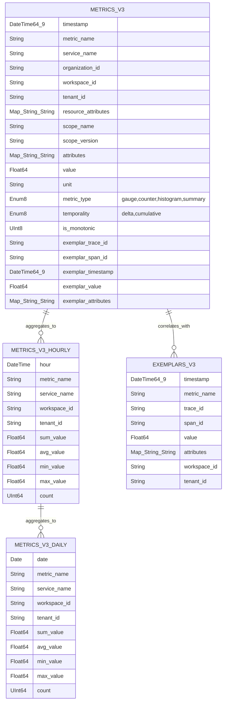
```mermaid
erDiagram
    METRICS_V3 ||--o{ METRICS_V3_HOURLY : aggregates_to
    METRICS_V3_HOURLY ||--o{ METRICS_V3_DAILY : aggregates_to
    METRICS_V3 ||--o{ EXEMPLARS_V3 : correlates_with

    METRICS_V3 {
        DateTime64_9 timestamp
        String metric_name
        String service_name
        String organization_id
        String workspace_id
        String tenant_id
        Map_String_String resource_attributes
        String scope_name
        String scope_version
        Map_String_String attributes
        Float64 value
        String unit
        Enum8 metric_type "gauge,counter,histogram,summary"
        Enum8 temporality "delta,cumulative"
        UInt8 is_monotonic
        String exemplar_trace_id
        String exemplar_span_id
        DateTime64_9 exemplar_timestamp
        Float64 exemplar_value
        Map_String_String exemplar_attributes
    }

    METRICS_V3_HOURLY {
        DateTime hour
        String metric_name
        String service_name
        String workspace_id
        String tenant_id
        Float64 sum_value
        Float64 avg_value
        Float64 min_value
        Float64 max_value
        UInt64 count
    }

    METRICS_V3_DAILY {
        Date date
        String metric_name
        String service_name
        String workspace_id
        String tenant_id
        Float64 sum_value
        Float64 avg_value
        Float64 min_value
        Float64 max_value
        UInt64 count
    }

    EXEMPLARS_V3 {
        DateTime64_9 timestamp
        String metric_name
        String trace_id
        String span_id
        Float64 value
        Map_String_String attributes
        String workspace_id
        String tenant_id
    }
```

### Histogram Metrics

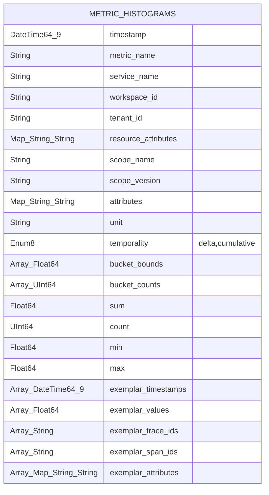
```mermaid
erDiagram
    METRIC_HISTOGRAMS {
        DateTime64_9 timestamp
        String metric_name
        String service_name
        String workspace_id
        String tenant_id
        Map_String_String resource_attributes
        String scope_name
        String scope_version
        Map_String_String attributes
        String unit
        Enum8 temporality "delta,cumulative"
        Array_Float64 bucket_bounds
        Array_UInt64 bucket_counts
        Float64 sum
        UInt64 count
        Float64 min
        Float64 max
        Array_DateTime64_9 exemplar_timestamps
        Array_Float64 exemplar_values
        Array_String exemplar_trace_ids
        Array_String exemplar_span_ids
        Array_Map_String_String exemplar_attributes
    }
```

### Logs Storage (400-telemetry)

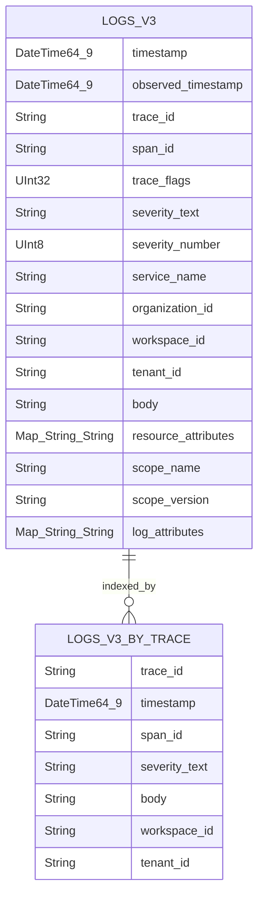
```mermaid
erDiagram
    LOGS_V3 ||--o{ LOGS_V3_BY_TRACE : indexed_by

    LOGS_V3 {
        DateTime64_9 timestamp
        DateTime64_9 observed_timestamp
        String trace_id
        String span_id
        UInt32 trace_flags
        String severity_text
        UInt8 severity_number
        String service_name
        String organization_id
        String workspace_id
        String tenant_id
        String body
        Map_String_String resource_attributes
        String scope_name
        String scope_version
        Map_String_String log_attributes
    }

    LOGS_V3_BY_TRACE {
        String trace_id
        DateTime64_9 timestamp
        String span_id
        String severity_text
        String body
        String workspace_id
        String tenant_id
    }
```

### Traces Storage (400-telemetry)

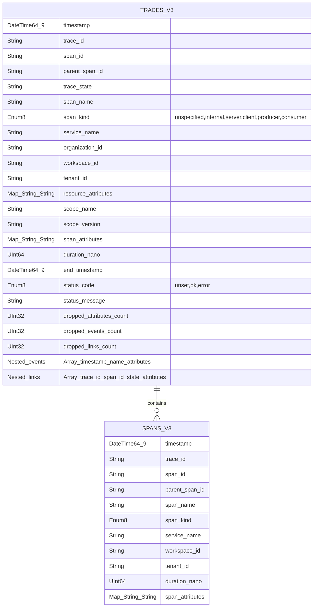
```mermaid
erDiagram
    TRACES_V3 ||--o{ SPANS_V3 : contains

    TRACES_V3 {
        DateTime64_9 timestamp
        String trace_id
        String span_id
        String parent_span_id
        String trace_state
        String span_name
        Enum8 span_kind "unspecified,internal,server,client,producer,consumer"
        String service_name
        String organization_id
        String workspace_id
        String tenant_id
        Map_String_String resource_attributes
        String scope_name
        String scope_version
        Map_String_String span_attributes
        UInt64 duration_nano
        DateTime64_9 end_timestamp
        Enum8 status_code "unset,ok,error"
        String status_message
        UInt32 dropped_attributes_count
        UInt32 dropped_events_count
        UInt32 dropped_links_count
        Nested_events Array_timestamp_name_attributes
        Nested_links Array_trace_id_span_id_state_attributes
    }

    SPANS_V3 {
        DateTime64_9 timestamp
        String trace_id
        String span_id
        String parent_span_id
        String span_name
        Enum8 span_kind
        String service_name
        String workspace_id
        String tenant_id
        UInt64 duration_nano
        Map_String_String span_attributes
    }
```

### System Tables

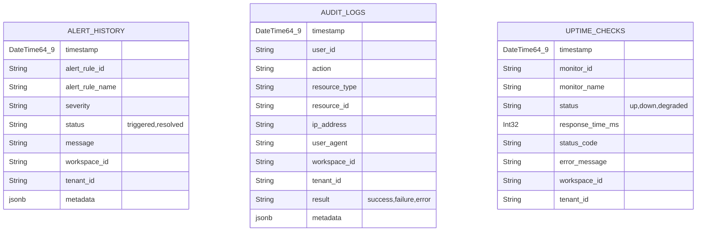
```mermaid
erDiagram
    ALERT_HISTORY {
        DateTime64_9 timestamp
        String alert_rule_id
        String alert_rule_name
        String severity
        String status "triggered,resolved"
        String message
        String workspace_id
        String tenant_id
        jsonb metadata
    }

    AUDIT_LOGS {
        DateTime64_9 timestamp
        String user_id
        String action
        String resource_type
        String resource_id
        String ip_address
        String user_agent
        String workspace_id
        String tenant_id
        String result "success,failure,error"
        jsonb metadata
    }

    UPTIME_CHECKS {
        DateTime64_9 timestamp
        String monitor_id
        String monitor_name
        String status "up,down,degraded"
        Int32 response_time_ms
        String status_code
        String error_message
        String workspace_id
        String tenant_id
    }
```

---

## Schema Relationships

### Cross-Database Relationships

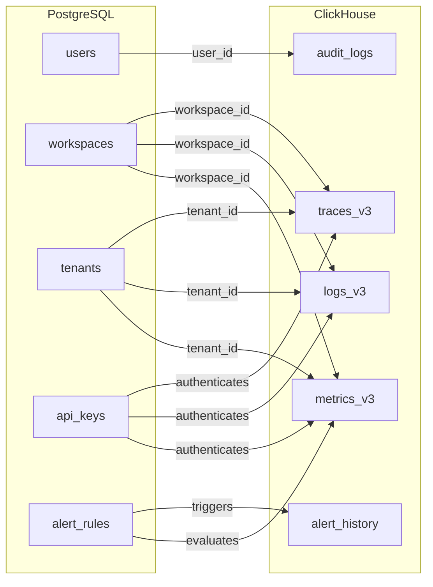
```mermaid
graph LR
    subgraph PostgreSQL
        A[users]
        B[workspaces]
        C[tenants]
        D[api_keys]
        E[alert_rules]
    end

    subgraph ClickHouse
        F[metrics_v3]
        G[logs_v3]
        H[traces_v3]
        I[alert_history]
        J[audit_logs]
    end

    A -->|user_id| J
    B -->|workspace_id| F
    B -->|workspace_id| G
    B -->|workspace_id| H
    C -->|tenant_id| F
    C -->|tenant_id| G
    C -->|tenant_id| H
    D -->|authenticates| F
    D -->|authenticates| G
    D -->|authenticates| H
    E -->|evaluates| F
    E -->|triggers| I
```

### Multi-Tenant Isolation

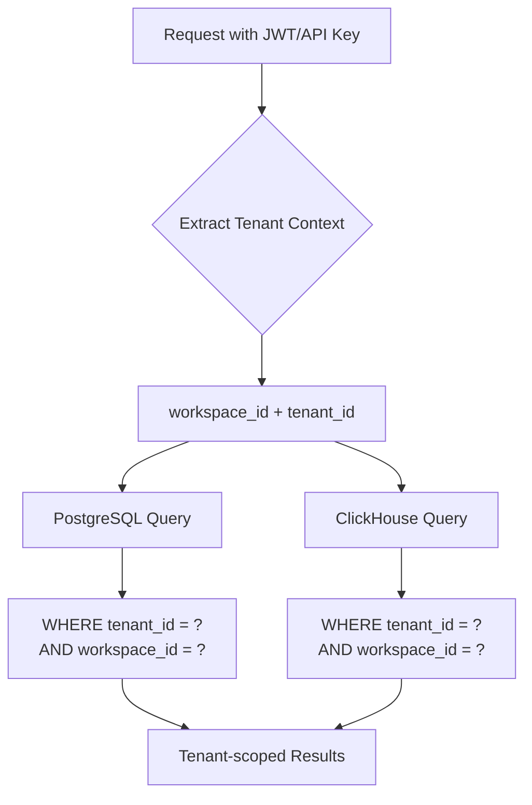
```mermaid
graph TD
    A[Request with JWT/API Key] --> B{Extract Tenant Context}
    B --> C[workspace_id + tenant_id]

    C --> D[PostgreSQL Query]
    C --> E[ClickHouse Query]

    D --> F[WHERE tenant_id = ? <br/>AND workspace_id = ?]
    E --> G[WHERE tenant_id = ? <br/>AND workspace_id = ?]

    F --> H[Tenant-scoped Results]
    G --> H
```

---

## Indexing Strategy

### PostgreSQL Indexes

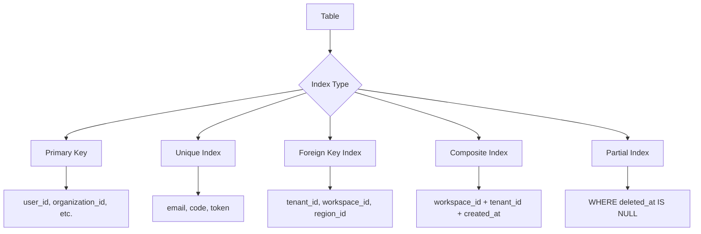
```mermaid
graph TD
    A[Table] --> B{Index Type}

    B --> C[Primary Key]
    B --> D[Unique Index]
    B --> E[Foreign Key Index]
    B --> F[Composite Index]
    B --> G[Partial Index]

    C --> C1[user_id, organization_id, etc.]
    D --> D1[email, code, token]
    E --> E1[tenant_id, workspace_id, region_id]
    F --> F1[workspace_id + tenant_id + created_at]
    G --> G1[WHERE deleted_at IS NULL]
```

**Key Indexes:**
- `users(email)` - Unique, for login
- `users(organization_id, is_active)` - Composite, for org users
- `users(tenant_id, deleted_at)` - Partial, for active tenant users
- `api_keys(key_id)` - Unique, for API key lookup
- `user_sessions(session_token)` - Unique, for session validation
- `alert_rules(workspace_id, is_enabled)` - Composite, for active rules

### ClickHouse Indexes

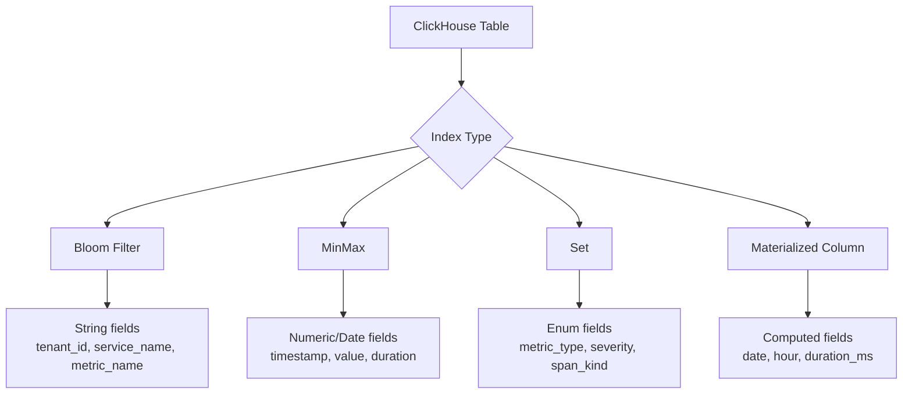
```mermaid
graph TD
    A[ClickHouse Table] --> B{Index Type}

    B --> C[Bloom Filter]
    B --> D[MinMax]
    B --> E[Set]
    B --> F[Materialized Column]

    C --> C1[String fields<br/>tenant_id, service_name, metric_name]
    D --> D1[Numeric/Date fields<br/>timestamp, value, duration]
    E --> E1[Enum fields<br/>metric_type, severity, span_kind]
    F --> F1[Computed fields<br/>date, hour, duration_ms]
```

**Key Indexes:**

**metrics_v3:**
- Bloom Filter: `tenant_id`, `workspace_id`, `organization_id`, `service_name`, `metric_name`
- MinMax: `timestamp`, `value`
- Set: `metric_type`, `temporality`
- Materialized: `date = toDate(timestamp)`, `hour = toStartOfHour(timestamp)`

**logs_v3:**
- Bloom Filter: `tenant_id`, `workspace_id`, `service_name`, `trace_id`, `body`
- MinMax: `timestamp`, `severity_number`
- Set: `severity_text`

**traces_v3:**
- Bloom Filter: `tenant_id`, `workspace_id`, `service_name`, `trace_id`, `span_id`, `parent_span_id`
- MinMax: `timestamp`, `duration_nano`
- Set: `span_kind`, `status_code`

---

## Migration Strategy

### PostgreSQL Migrations (TypeORM)

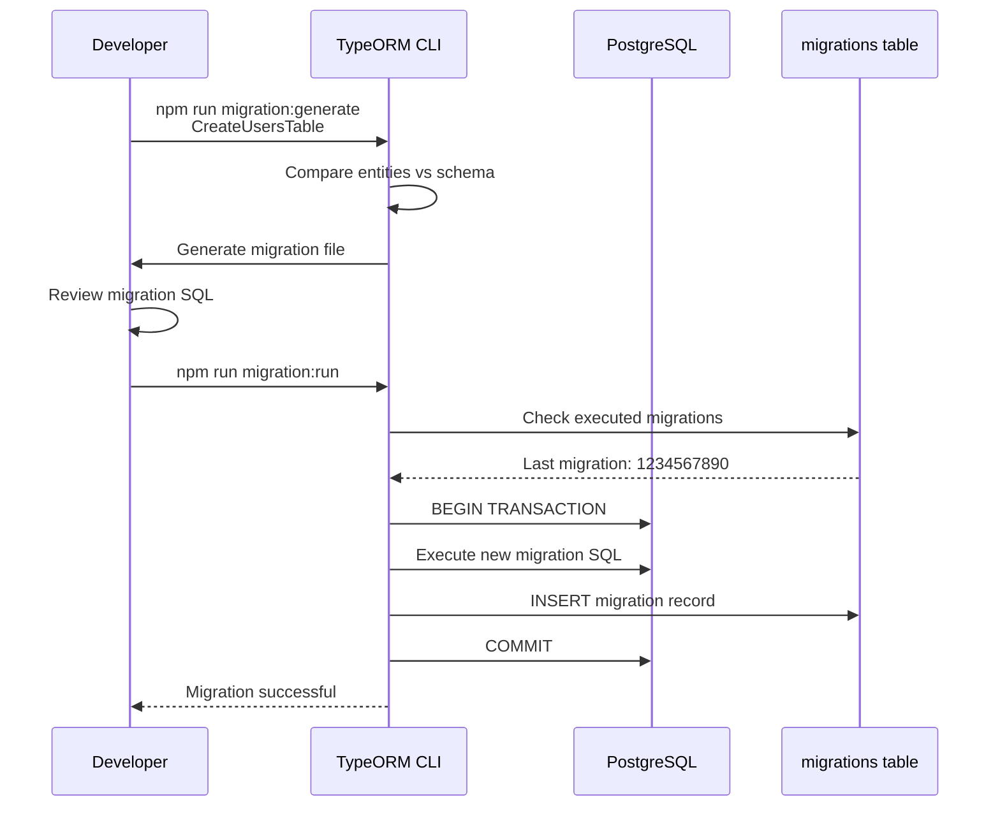
```mermaid
sequenceDiagram
    participant Dev as Developer
    participant CLI as TypeORM CLI
    participant DB as PostgreSQL
    participant Table as migrations table

    Dev->>CLI: npm run migration:generate<br/>CreateUsersTable
    CLI->>CLI: Compare entities vs schema
    CLI->>Dev: Generate migration file
    Dev->>Dev: Review migration SQL
    Dev->>CLI: npm run migration:run
    CLI->>Table: Check executed migrations
    Table-->>CLI: Last migration: 1234567890
    CLI->>DB: BEGIN TRANSACTION
    CLI->>DB: Execute new migration SQL
    CLI->>Table: INSERT migration record
    CLI->>DB: COMMIT
    CLI-->>Dev: Migration successful
```

**Migration Files:**
- Location: `backend/src/database/postgres/migrations/`
- Naming: `{timestamp}-{description}.ts`
- Example: `1704240000106-create-users-table.ts`

**Best Practices:**
- Always test migrations on dev environment first
- Use transactions for atomicity
- Include both `up()` and `down()` methods
- Never modify executed migrations
- Add indexes separately after table creation

### ClickHouse Migrations (Custom)

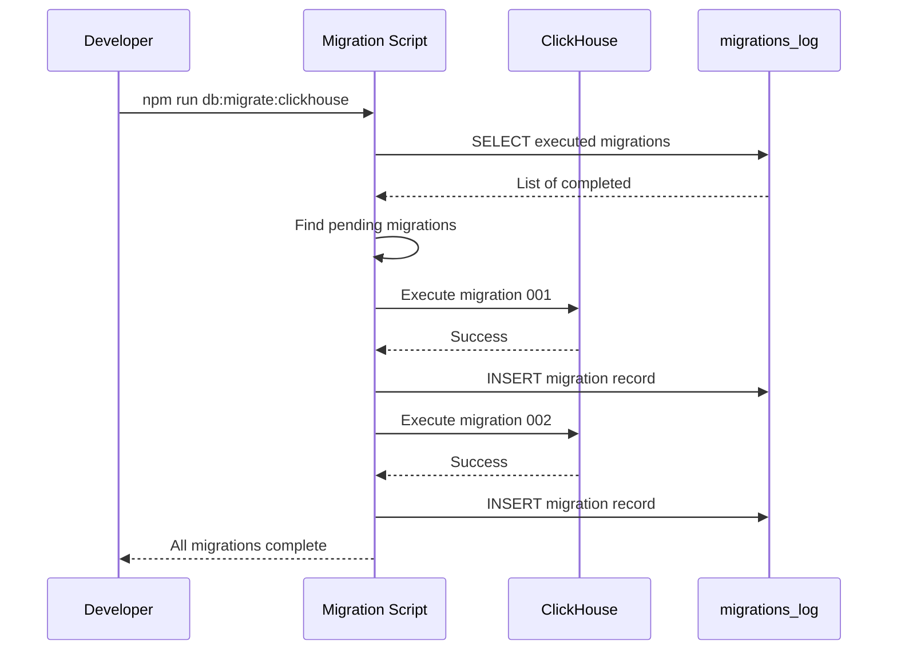
```mermaid
sequenceDiagram
    participant Dev as Developer
    participant Script as Migration Script
    participant CH as ClickHouse
    participant Table as migrations_log

    Dev->>Script: npm run db:migrate:clickhouse
    Script->>Table: SELECT executed migrations
    Table-->>Script: List of completed
    Script->>Script: Find pending migrations
    Script->>CH: Execute migration 001
    CH-->>Script: Success
    Script->>Table: INSERT migration record
    Script->>CH: Execute migration 002
    CH-->>Script: Success
    Script->>Table: INSERT migration record
    Script-->>Dev: All migrations complete
```

**Migration Files:**
- Location: `backend/src/modules/400-telemetry/infrastructure/persistence/clickhouse/migrations/`
- Naming: `{sequence}-{description}.ts`
- Example: `001-create-metrics-table.ts`, `002-query-optimization.ts`

**Best Practices:**
- ClickHouse doesn't support transactions - migrations are not atomic
- Use `IF NOT EXISTS` for idempotency
- Test with EXPLAIN for performance
- Add indexes incrementally (don't block writes)
- Use materialized views for pre-aggregation

---

## Data Lifecycle

### PostgreSQL Data Lifecycle

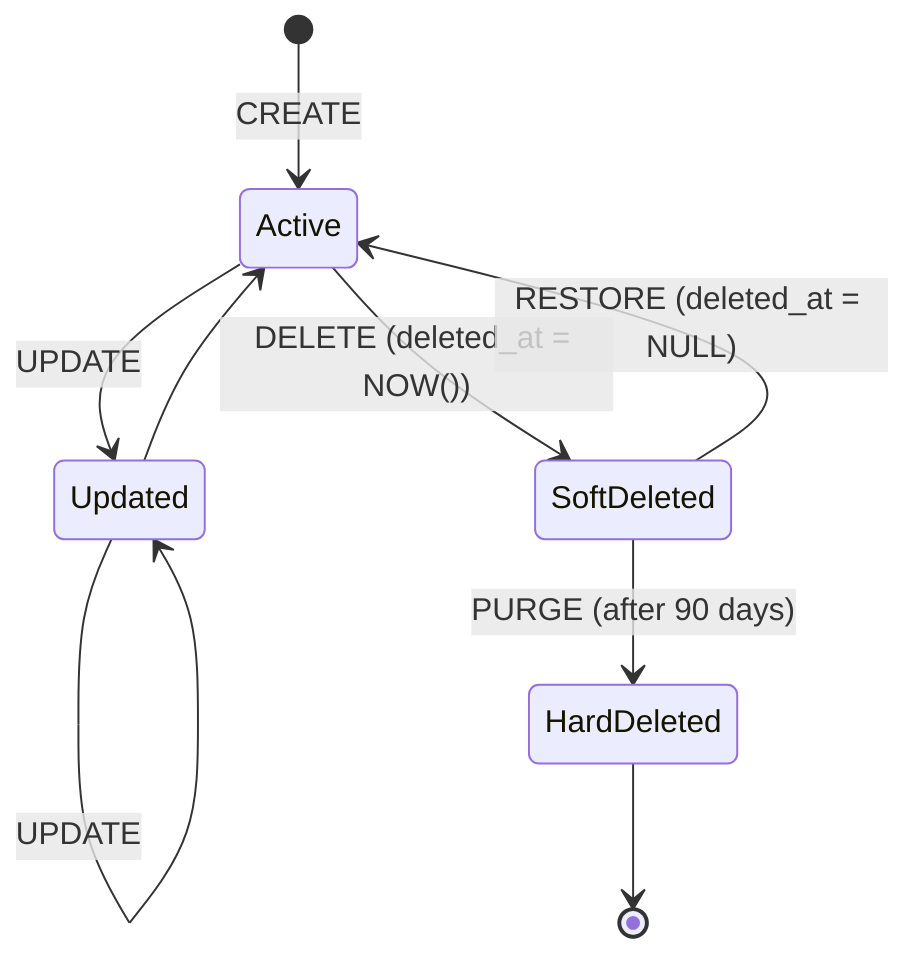
```mermaid
stateDiagram-v2
    [*] --> Active: CREATE
    Active --> Updated: UPDATE
    Updated --> Updated: UPDATE
    Updated --> Active
    Active --> SoftDeleted: DELETE (deleted_at = NOW())
    SoftDeleted --> Active: RESTORE (deleted_at = NULL)
    SoftDeleted --> HardDeleted: PURGE (after 90 days)
    HardDeleted --> [*]
```

### ClickHouse Data Lifecycle

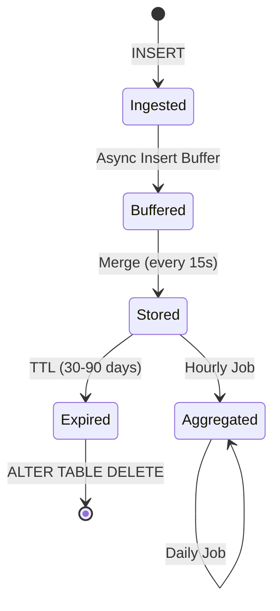
```mermaid
stateDiagram-v2
    [*] --> Ingested: INSERT
    Ingested --> Buffered: Async Insert Buffer
    Buffered --> Stored: Merge (every 15s)
    Stored --> Aggregated: Hourly Job
    Aggregated --> Aggregated: Daily Job
    Stored --> Expired: TTL (30-90 days)
    Expired --> [*]: ALTER TABLE DELETE
```

---

## Performance Characteristics

| Database | Operation | Latency | Throughput |
|----------|-----------|---------|------------|
| **PostgreSQL** | Single INSERT | 1-5ms | 10k/sec |
| **PostgreSQL** | Batch INSERT (100) | 10-20ms | 50k/sec |
| **PostgreSQL** | Simple SELECT | 1-10ms | 100k/sec |
| **PostgreSQL** | JOIN SELECT | 10-100ms | 10k/sec |
| **ClickHouse** | Single INSERT | 1ms | 1M/sec |
| **ClickHouse** | Batch INSERT (10k) | 50-100ms | 10M/sec |
| **ClickHouse** | Time-range SELECT | 10-50ms | 1GB/sec |
| **ClickHouse** | Aggregation Query | 50-500ms | 500MB/sec |

---

## Backup & Recovery

### PostgreSQL Backup

```mermaid
graph LR
    A[PostgreSQL] --> B[pg_dump daily]
    B --> C[Compressed backup]
    C --> D[S3/Object Storage]
    D --> E[Retention: 30 days]

    A --> F[WAL Archiving]
    F --> G[Point-in-time recovery]
    G --> D
```

### ClickHouse Backup

```mermaid
graph LR
    A[ClickHouse] --> B[clickhouse-backup]
    B --> C[Snapshot partitions]
    C --> D[S3/Object Storage]
    D --> E[Retention: 7 days]

    A --> F[Replication]
    F --> G[Replica cluster]
    G --> H[Automatic failover]
```

---

## Next Steps

- [System Architecture](../architecture/01-SYSTEM-ARCHITECTURE.md)
- [Data Flow](../architecture/02-DATA-FLOW.md)
- [Multi-Tenancy](../architecture/03-MULTI-TENANCY.md)
- [API Reference](./API-REFERENCE.md)

---

- **Last Updated:** December 12, 2025
- **Maintained By:** DevOpsCorner Indonesia
