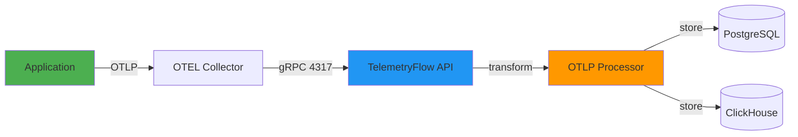

# OTLP Ingestion Guide

- **Version**: 1.0.0-CE
- **Protocol**: OTLP/gRPC (Port 4317)
- **Formats**: JSON, Protobuf
- **Status**: ✅ Production Ready

---

## Table of Contents

1. [Overview](#overview)
2. [OTLP Endpoints](#otlp-endpoints)
3. [Authentication](#authentication)
4. [Sending Metrics](#sending-metrics)
5. [Sending Logs](#sending-logs)
6. [Sending Traces](#sending-traces)
7. [Client Libraries](#client-libraries)
8. [Example Implementations](#example-implementations)

---

## Overview

**OpenTelemetry Protocol (OTLP)** is the standard protocol for sending telemetry data. TelemetryFlow supports:

- **OTLP/gRPC** - Binary protocol (recommended)
- **OTLP/HTTP** - JSON protocol (easier for debugging)



---

## OTLP Endpoints

### gRPC Endpoints (Recommended)

| Signal | Endpoint | Port |
|--------|----------|------|
| **Metrics** | `http://localhost:4317` | 4317 |
| **Logs** | `http://localhost:4317` | 4317 |
| **Traces** | `http://localhost:4317` | 4317 |

### HTTP Endpoints (Alternative)

| Signal | Endpoint | Port |
|--------|----------|------|
| **Metrics** | `http://localhost:4318/v2/metrics` | 4318 |
| **Logs** | `http://localhost:4318/v2/logs` | 4318 |
| **Traces** | `http://localhost:4318/v2/traces` | 4318 |

---

## Authentication

### API Key Authentication

**Required Headers:**
```http
X-API-Key: your_api_key_here
X-Tenant-ID: tenant_123
X-Workspace-ID: workspace_456
```

**Example:**
```bash
curl -X POST http://localhost:4318/v2/metrics \
  -H "Content-Type: application/json" \
  -H "X-API-Key: tf_live_abc123..." \
  -H "X-Tenant-ID: tenant_123" \
  -H "X-Workspace-ID: workspace_456" \
  -d @metrics.json
```

---

## Sending Metrics

### OTLP Metrics Format

```json
{
  "resourceMetrics": [{
    "resource": {
      "attributes": [{
        "key": "service.name",
        "value": { "stringValue": "my-service" }
      }, {
        "key": "service.version",
        "value": { "stringValue": "1.0.0" }
      }, {
        "key": "deployment.environment",
        "value": { "stringValue": "production" }
      }]
    },
    "scopeMetrics": [{
      "scope": {
        "name": "my-instrumentation",
        "version": "1.0.0"
      },
      "metrics": [{
        "name": "http_requests_total",
        "description": "Total number of HTTP requests",
        "unit": "1",
        "sum": {
          "dataPoints": [{
            "attributes": [{
              "key": "method",
              "value": { "stringValue": "GET" }
            }, {
              "key": "status_code",
              "value": { "intValue": 200 }
            }],
            "asDouble": 1523.0,
            "timeUnixNano": "1699564800000000000"
          }],
          "aggregationTemporality": 2,
          "isMonotonic": true
        }
      }, {
        "name": "cpu_usage",
        "description": "CPU usage percentage",
        "unit": "%",
        "gauge": {
          "dataPoints": [{
            "asDouble": 75.5,
            "timeUnixNano": "1699564800000000000"
          }]
        }
      }, {
        "name": "request_duration",
        "description": "HTTP request duration",
        "unit": "ms",
        "histogram": {
          "dataPoints": [{
            "attributes": [],
            "count": "1000",
            "sum": 45000.0,
            "bucketCounts": ["100", "200", "300", "400"],
            "explicitBounds": [10, 50, 100, 500],
            "timeUnixNano": "1699564800000000000"
          }],
          "aggregationTemporality": 2
        }
      }]
    }]
  }]
}
```

### Metric Types

**1. Counter (Sum with isMonotonic=true):**
```json
{
  "name": "http_requests_total",
  "sum": {
    "dataPoints": [{ "asDouble": 1523.0 }],
    "aggregationTemporality": 2,
    "isMonotonic": true
  }
}
```

**2. Gauge:**
```json
{
  "name": "cpu_usage",
  "gauge": {
    "dataPoints": [{ "asDouble": 75.5 }]
  }
}
```

**3. Histogram:**
```json
{
  "name": "request_duration",
  "histogram": {
    "dataPoints": [{
      "count": "1000",
      "sum": 45000.0,
      "bucketCounts": ["100", "200", "300", "400"],
      "explicitBounds": [10, 50, 100, 500]
    }]
  }
}
```

---

## Sending Logs

### OTLP Logs Format

```json
{
  "resourceLogs": [{
    "resource": {
      "attributes": [{
        "key": "service.name",
        "value": { "stringValue": "my-service" }
      }]
    },
    "scopeLogs": [{
      "scope": {
        "name": "my-logger"
      },
      "logRecords": [{
        "timeUnixNano": "1699564800000000000",
        "severityNumber": 9,
        "severityText": "INFO",
        "body": {
          "stringValue": "User logged in successfully"
        },
        "attributes": [{
          "key": "user.id",
          "value": { "stringValue": "user_123" }
        }, {
          "key": "user.email",
          "value": { "stringValue": "user@example.com" }
        }],
        "traceId": "0af7651916cd43dd8448eb211c80319c",
        "spanId": "b7ad6b7169203331"
      }, {
        "timeUnixNano": "1699564860000000000",
        "severityNumber": 17,
        "severityText": "ERROR",
        "body": {
          "stringValue": "Database connection failed"
        },
        "attributes": [{
          "key": "error.type",
          "value": { "stringValue": "ConnectionError" }
        }, {
          "key": "database.name",
          "value": { "stringValue": "telemetryflow" }
        }]
      }]
    }]
  }]
}
```

### Severity Levels

| Severity | Number | Description |
|----------|--------|-------------|
| TRACE | 1 | Finest-grained informational events |
| DEBUG | 5 | Fine-grained informational events |
| INFO | 9 | Informational messages |
| WARN | 13 | Warning messages |
| ERROR | 17 | Error events |
| FATAL | 21 | Critical errors |

---

## Sending Traces

### OTLP Traces Format

```json
{
  "resourceSpans": [{
    "resource": {
      "attributes": [{
        "key": "service.name",
        "value": { "stringValue": "api-gateway" }
      }]
    },
    "scopeSpans": [{
      "scope": {
        "name": "api-gateway-tracer"
      },
      "spans": [{
        "traceId": "0af7651916cd43dd8448eb211c80319c",
        "spanId": "b7ad6b7169203331",
        "parentSpanId": "00f067aa0ba902b7",
        "name": "POST /api/users",
        "kind": 2,
        "startTimeUnixNano": "1699564800000000000",
        "endTimeUnixNano": "1699564800150000000",
        "attributes": [{
          "key": "http.method",
          "value": { "stringValue": "POST" }
        }, {
          "key": "http.url",
          "value": { "stringValue": "/api/users" }
        }, {
          "key": "http.status_code",
          "value": { "intValue": 201 }
        }],
        "status": {
          "code": 1
        }
      }]
    }]
  }]
}
```

### Span Kinds

| Kind | Value | Description |
|------|-------|-------------|
| UNSPECIFIED | 0 | Default |
| INTERNAL | 1 | Internal operation |
| SERVER | 2 | Server-side of RPC |
| CLIENT | 3 | Client-side of RPC |
| PRODUCER | 4 | Message producer |
| CONSUMER | 5 | Message consumer |

### Span Status Codes

| Code | Name | Description |
|------|------|-------------|
| 0 | UNSET | Default status |
| 1 | OK | Success |
| 2 | ERROR | Error occurred |

---

## Client Libraries

### Node.js (OpenTelemetry SDK)

```typescript
import { OTLPMetricExporter } from '@opentelemetry/exporter-metrics-otlp-grpc';
import { OTLPTraceExporter } from '@opentelemetry/exporter-trace-otlp-grpc';
import { MeterProvider, PeriodicExportingMetricReader } from '@opentelemetry/sdk-metrics';
import { NodeTracerProvider, BatchSpanProcessor } from '@opentelemetry/sdk-trace-node';
import { Resource } from '@opentelemetry/resources';
import { ATTR_SERVICE_NAME } from '@opentelemetry/semantic-conventions';

// Configure resource
const resource = new Resource({
  [ATTR_SERVICE_NAME]: 'my-service',
});

// Configure metrics
const metricExporter = new OTLPMetricExporter({
  url: 'http://localhost:4317',
  headers: {
    'x-api-key': 'tf_live_abc123...',
    'x-tenant-id': 'tenant_123',
    'x-workspace-id': 'workspace_456',
  },
});

const meterProvider = new MeterProvider({
  resource,
  readers: [
    new PeriodicExportingMetricReader({
      exporter: metricExporter,
      exportIntervalMillis: 60000, // 1 minute
    }),
  ],
});

// Get meter
const meter = meterProvider.getMeter('my-instrumentation');

// Create counter
const requestCounter = meter.createCounter('http_requests_total', {
  description: 'Total HTTP requests',
  unit: '1',
});

// Record metric
requestCounter.add(1, { method: 'GET', status_code: 200 });

// Configure traces
const traceExporter = new OTLPTraceExporter({
  url: 'http://localhost:4317',
  headers: {
    'x-api-key': 'tf_live_abc123...',
    'x-tenant-id': 'tenant_123',
    'x-workspace-id': 'workspace_456',
  },
});

const tracerProvider = new NodeTracerProvider({ resource });
tracerProvider.addSpanProcessor(new BatchSpanProcessor(traceExporter));
tracerProvider.register();

// Get tracer
const tracer = tracerProvider.getTracer('my-instrumentation');

// Create span
const span = tracer.startSpan('process-request');
span.setAttributes({
  'http.method': 'POST',
  'http.url': '/api/users',
});
// ... do work
span.end();
```

---

### Python (OpenTelemetry SDK)

```python
from opentelemetry import metrics, trace
from opentelemetry.exporter.otlp.proto.grpc.metric_exporter import OTLPMetricExporter
from opentelemetry.exporter.otlp.proto.grpc.trace_exporter import OTLPSpanExporter
from opentelemetry.sdk.metrics import MeterProvider
from opentelemetry.sdk.metrics.export import PeriodicExportingMetricReader
from opentelemetry.sdk.trace import TracerProvider
from opentelemetry.sdk.trace.export import BatchSpanProcessor
from opentelemetry.sdk.resources import Resource

# Configure resource
resource = Resource.create({
    "service.name": "my-service",
    "service.version": "1.0.0",
})

# Configure metrics
metric_exporter = OTLPMetricExporter(
    endpoint="http://localhost:4317",
    headers={
        "x-api-key": "tf_live_abc123...",
        "x-tenant-id": "tenant_123",
        "x-workspace-id": "workspace_456",
    },
)

metric_reader = PeriodicExportingMetricReader(metric_exporter, export_interval_millis=60000)
meter_provider = MeterProvider(resource=resource, metric_readers=[metric_reader])
metrics.set_meter_provider(meter_provider)

# Get meter
meter = metrics.get_meter("my-instrumentation")

# Create counter
request_counter = meter.create_counter(
    "http_requests_total",
    description="Total HTTP requests",
    unit="1",
)

# Record metric
request_counter.add(1, {"method": "GET", "status_code": 200})

# Configure traces
trace_exporter = OTLPSpanExporter(
    endpoint="http://localhost:4317",
    headers={
        "x-api-key": "tf_live_abc123...",
        "x-tenant-id": "tenant_123",
        "x-workspace-id": "workspace_456",
    },
)

tracer_provider = TracerProvider(resource=resource)
tracer_provider.add_span_processor(BatchSpanProcessor(trace_exporter))
trace.set_tracer_provider(tracer_provider)

# Get tracer
tracer = trace.get_tracer("my-instrumentation")

# Create span
with tracer.start_as_current_span("process-request") as span:
    span.set_attributes({
        "http.method": "POST",
        "http.url": "/api/users",
    })
    # ... do work
```

---

### Go (OpenTelemetry SDK)

```go
package main

import (
    "context"
    "time"

    "go.opentelemetry.io/otel"
    "go.opentelemetry.io/otel/exporters/otlp/otlpmetric/otlpmetricgrpc"
    "go.opentelemetry.io/otel/exporters/otlp/otlptrace/otlptracegrpc"
    "go.opentelemetry.io/otel/sdk/metric"
    "go.opentelemetry.io/otel/sdk/resource"
    "go.opentelemetry.io/otel/sdk/trace"
    semconv "go.opentelemetry.io/otel/semconv/v1.17.0"
)

func main() {
    ctx := context.Background()

    // Configure resource
    res, _ := resource.New(ctx,
        resource.WithAttributes(
            semconv.ServiceName("my-service"),
            semconv.ServiceVersion("1.0.0"),
        ),
    )

    // Configure metrics
    metricExporter, _ := otlpmetricgrpc.New(ctx,
        otlpmetricgrpc.WithEndpoint("localhost:4317"),
        otlpmetricgrpc.WithInsecure(),
        otlpmetricgrpc.WithHeaders(map[string]string{
            "x-api-key":      "tf_live_abc123...",
            "x-tenant-id":    "tenant_123",
            "x-workspace-id": "workspace_456",
        }),
    )

    meterProvider := metric.NewMeterProvider(
        metric.WithResource(res),
        metric.WithReader(metric.NewPeriodicReader(metricExporter, metric.WithInterval(60*time.Second))),
    )
    otel.SetMeterProvider(meterProvider)

    // Get meter
    meter := otel.Meter("my-instrumentation")

    // Create counter
    counter, _ := meter.Int64Counter("http_requests_total")

    // Record metric
    counter.Add(ctx, 1,
        metric.WithAttributes(
            attribute.String("method", "GET"),
            attribute.Int("status_code", 200),
        ),
    )

    // Configure traces
    traceExporter, _ := otlptracegrpc.New(ctx,
        otlptracegrpc.WithEndpoint("localhost:4317"),
        otlptracegrpc.WithInsecure(),
        otlptracegrpc.WithHeaders(map[string]string{
            "x-api-key":      "tf_live_abc123...",
            "x-tenant-id":    "tenant_123",
            "x-workspace-id": "workspace_456",
        }),
    )

    tracerProvider := trace.NewTracerProvider(
        trace.WithBatcher(traceExporter),
        trace.WithResource(res),
    )
    otel.SetTracerProvider(tracerProvider)

    // Get tracer
    tracer := otel.Tracer("my-instrumentation")

    // Create span
    _, span := tracer.Start(ctx, "process-request")
    span.SetAttributes(
        attribute.String("http.method", "POST"),
        attribute.String("http.url", "/api/users"),
    )
    // ... do work
    span.End()
}
```

---

## Example Implementations

### cURL Example (HTTP/JSON)

```bash
# Send metrics
curl -X POST http://localhost:4318/v2/metrics \
  -H "Content-Type: application/json" \
  -H "X-API-Key: tf_live_abc123..." \
  -H "X-Tenant-ID: tenant_123" \
  -d '{
    "resourceMetrics": [{
      "resource": {
        "attributes": [{
          "key": "service.name",
          "value": { "stringValue": "my-service" }
        }]
      },
      "scopeMetrics": [{
        "metrics": [{
          "name": "cpu_usage",
          "gauge": {
            "dataPoints": [{
              "asDouble": 75.5,
              "timeUnixNano": "1699564800000000000"
            }]
          }
        }]
      }]
    }]
  }'
```

---

## Best Practices

1. **Use gRPC over HTTP** - Better performance, smaller payloads
2. **Batch exports** - Send data every 30-60 seconds
3. **Include resource attributes** - service.name, service.version, deployment.environment
4. **Use semantic conventions** - Follow OpenTelemetry standards
5. **Handle failures** - Implement retry logic with exponential backoff
6. **Compress payloads** - Use gzip compression for large batches

---

## Related Documentation

- **[400-telemetry.md](../backend/modules/400-telemetry.md)** - OTLP ingestion implementation
- **[DATABASE-SCHEMA.md](./DATABASE-SCHEMA.md)** - Telemetry table schemas
- **[01-TECH-STACK.md](../backend/01-TECH-STACK.md)** - Technology stack

---

- **Last Updated:** December 12, 2025
- **Maintained By:** DevOpsCorner Indonesia
