# TFO-OTEL Architecture

- **Version:** 1.1.1-CE
- **Last Updated:** December 13, 2025
- **Status:** ✅ Production Ready

---

## Table of Contents

1. [Overview](#overview)
2. [System Architecture](#system-architecture)
3. [Component Architecture](#component-architecture)
4. [Data Flow](#data-flow)
5. [Processing Pipeline](#processing-pipeline)
6. [Multi-Tenancy](#multi-tenancy)
7. [Deployment Patterns](#deployment-patterns)
8. [Scalability](#scalability)

---

## Overview

The TelemetryFlow OTEL Architecture provides a robust, scalable, and multi-tenant observability infrastructure based on OpenTelemetry standards.

### Design Principles

1. **Standard Compliance:** 100% OpenTelemetry Protocol (OTLP) compatibility
2. **Multi-Tenancy:** Built-in workspace and tenant isolation
3. **High Availability:** Stateless, horizontally scalable design
4. **Performance:** Optimized for high-throughput, low-latency operation
5. **Flexibility:** Pluggable receivers, processors, and exporters

---

## System Architecture

### Tier-Based Architecture

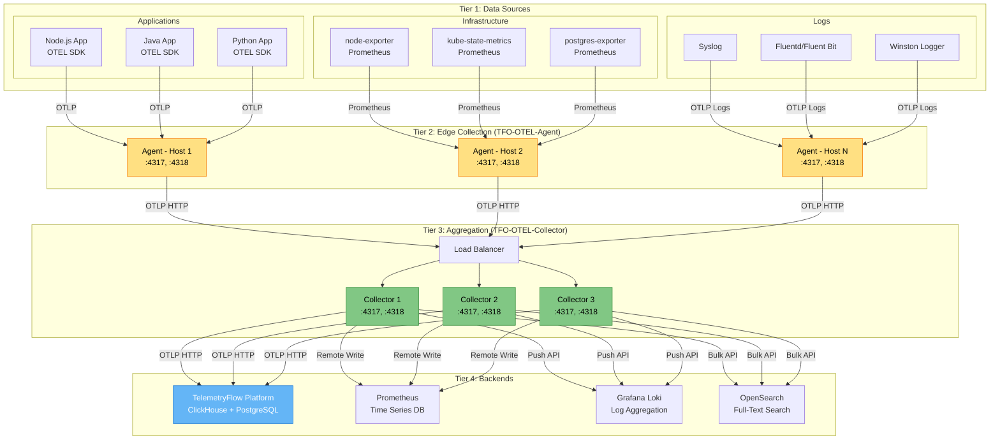

---

## Component Architecture

### TFO-OTEL-Agent Architecture

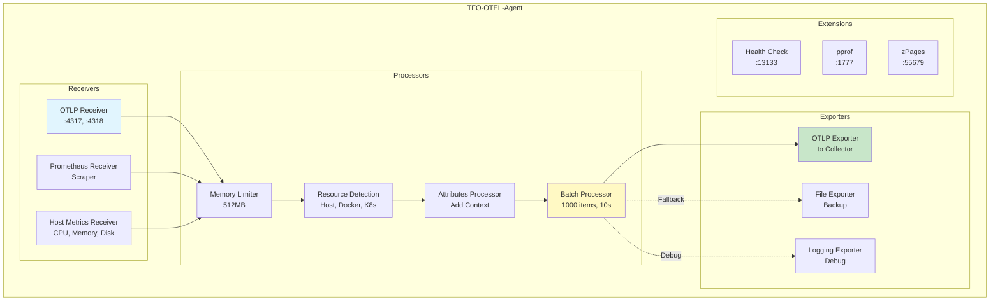

### TFO-OTEL-Collector Architecture

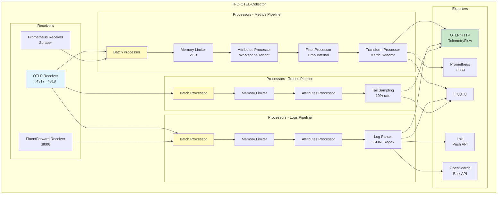

---

## Data Flow

### Metrics Data Flow

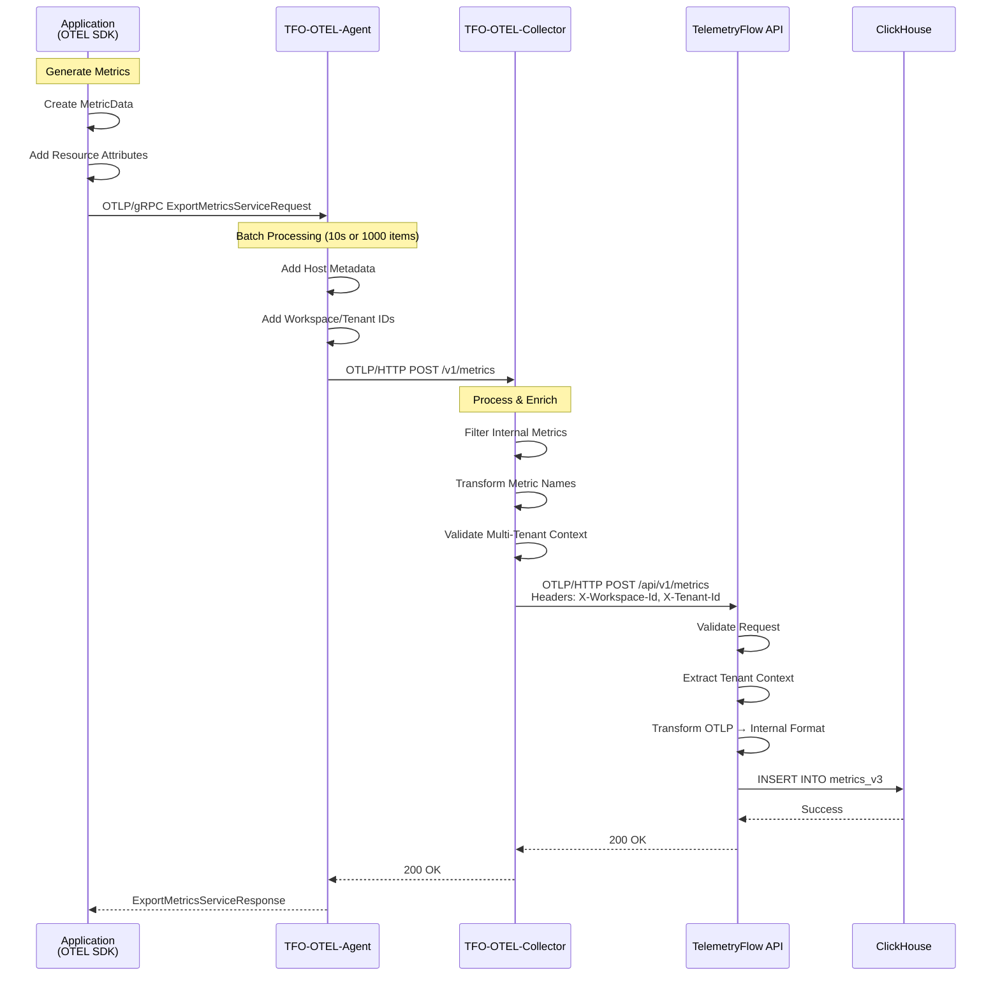

### Logs Data Flow

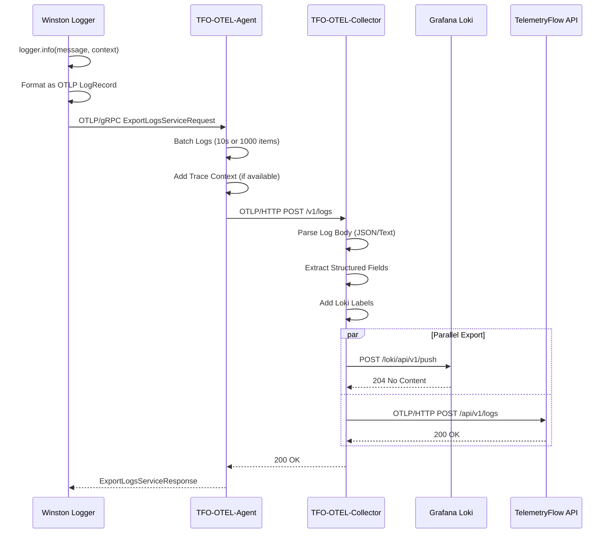

### Traces Data Flow

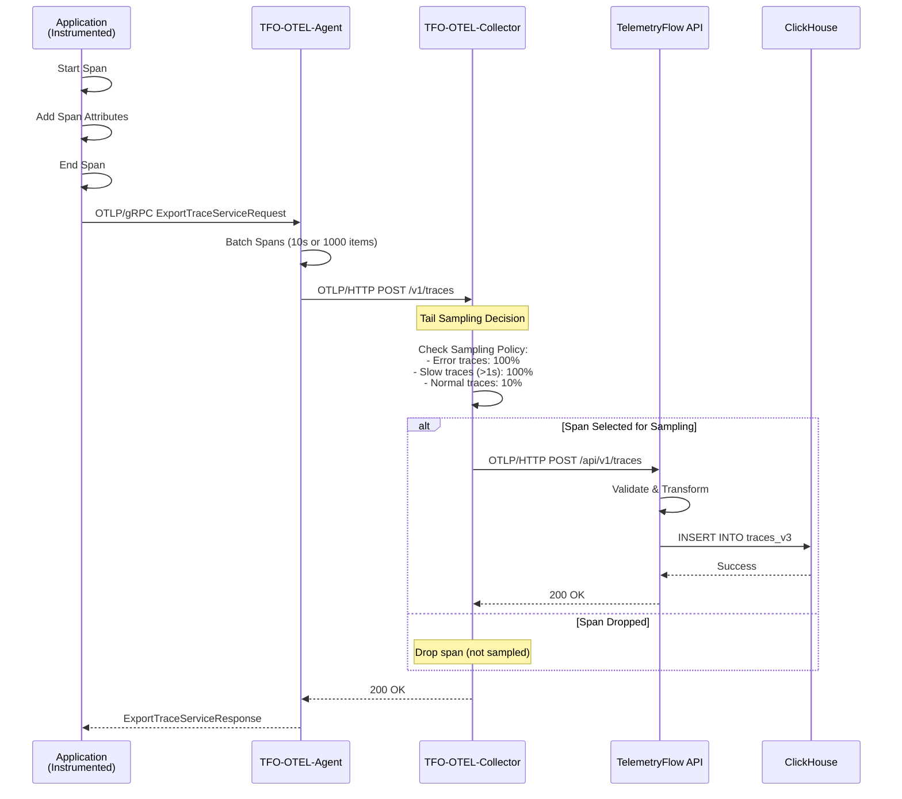

---

## Processing Pipeline

### Agent Pipeline Configuration

```yaml
service:
  pipelines:
    # Metrics Pipeline
    metrics:
      receivers: [otlp, prometheus, hostmetrics]
      processors:
        - memory_limiter
        - resourcedetection
        - attributes        # Add workspace/tenant IDs
        - batch
      exporters: [otlphttp/collector]

    # Logs Pipeline
    logs:
      receivers: [otlp]
      processors:
        - memory_limiter
        - resourcedetection
        - attributes
        - batch
      exporters: [otlphttp/collector]

    # Traces Pipeline
    traces:
      receivers: [otlp]
      processors:
        - memory_limiter
        - resourcedetection
        - attributes
        - batch
      exporters: [otlphttp/collector]
```

### Collector Pipeline Configuration

```yaml
service:
  pipelines:
    # Metrics Pipeline
    metrics:
      receivers: [otlp, prometheus]
      processors:
        - memory_limiter
        - resourcedetection
        - attributes
        - filter              # Drop internal metrics
        - transform           # Rename metrics
        - batch
      exporters: [otlphttp/telemetryflow, prometheus, logging]

    # Logs Pipeline
    logs:
      receivers: [otlp, fluentforward]
      processors:
        - memory_limiter
        - attributes
        - logstransform       # Parse JSON logs
        - batch
      exporters: [otlphttp/telemetryflow, loki, opensearch, logging]

    # Traces Pipeline
    traces:
      receivers: [otlp]
      processors:
        - memory_limiter
        - attributes
        - tail_sampling       # 10% sampling
        - batch
      exporters: [otlphttp/telemetryflow, logging]
```

---

## Multi-Tenancy

### Tenant Context Propagation

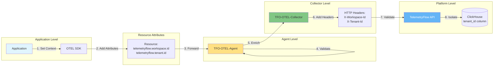

### Multi-Tenant Data Isolation

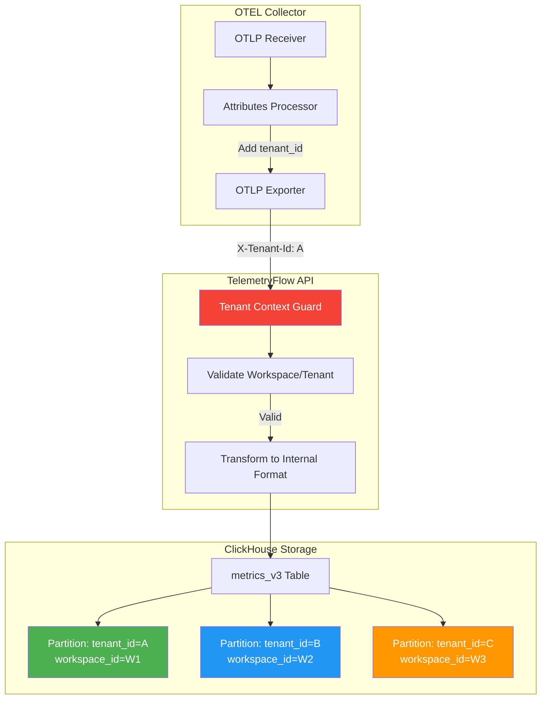

---

## Deployment Patterns

### Pattern 1: Hub-and-Spoke (Recommended)

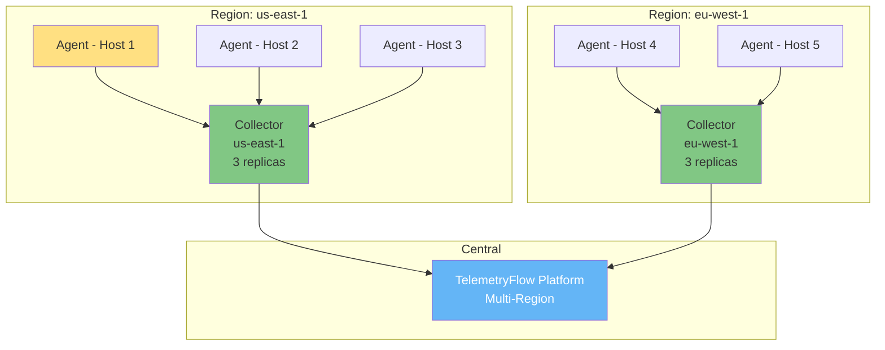

**Use When:**
- Multiple regions/datacenters
- Need centralized aggregation
- Want to optimize bandwidth

**Benefits:**
- Reduced backend connections
- Regional data aggregation
- Better resilience

### Pattern 2: Direct-to-Platform

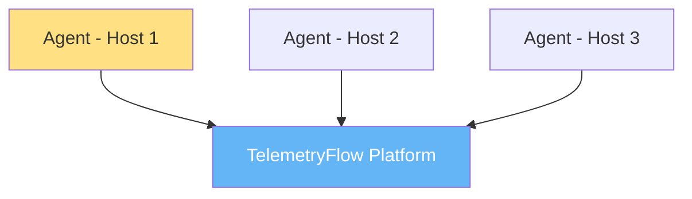

**Use When:**
- Small deployments (<50 hosts)
- Simple network topology
- Low data volume

**Benefits:**
- Simpler architecture
- Fewer components to manage
- Lower latency

### Pattern 3: Edge Buffering

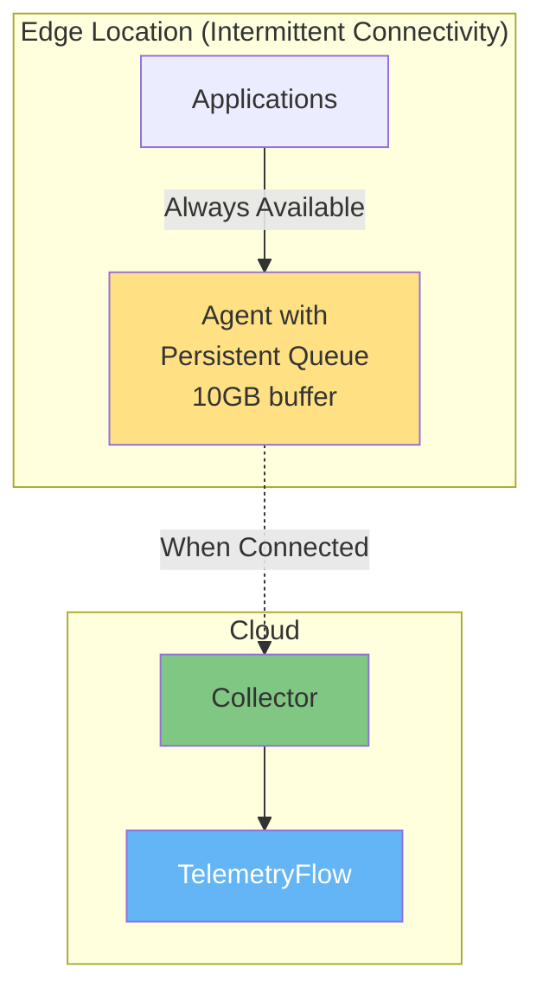

**Use When:**
- Edge/IoT deployments
- Unreliable network
- Need data persistence

**Benefits:**
- Resilient to outages
- No data loss
- Automatic retry

---

## Scalability

### Horizontal Scaling

#### Agent Scaling

```
Scaling Model: Linear per host
Formula: 1 agent per host/VM/container

Capacity per Agent:
- 10,000 data points/sec
- 50MB RAM baseline
- +1MB per 1000 data points/sec

Example:
- 100 hosts × 1 agent = 100 agents
- Total capacity: 1M data points/sec
```

#### Collector Scaling

```
Scaling Model: Horizontal with load balancer
Formula: N collectors behind LB

Capacity per Collector:
- 100,000 data points/sec
- 512MB RAM baseline
- +100MB per 10,000 data points/sec

Example:
- 5 collectors × 100K = 500K data points/sec
- Total RAM: 5 × 512MB = 2.56GB
```

### Vertical Scaling

#### Resource Sizing

| Workload | Agent RAM | Agent CPU | Collector RAM | Collector CPU |
|----------|-----------|-----------|---------------|---------------|
| **Small** (<1K dps) | 50MB | 0.1 core | 256MB | 0.5 core |
| **Medium** (1K-10K dps) | 128MB | 0.5 core | 512MB | 1 core |
| **Large** (10K-100K dps) | 256MB | 1 core | 1GB | 2 cores |
| **Very Large** (>100K dps) | 512MB | 2 cores | 2GB | 4 cores |

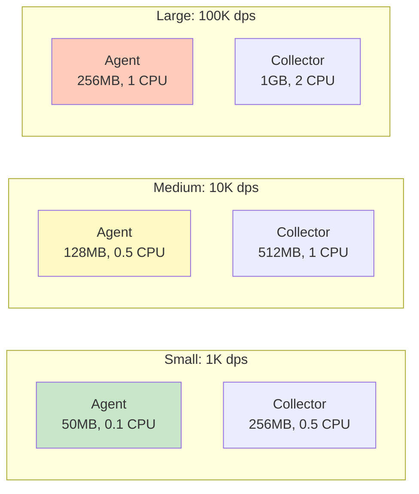

---

**Version:** 1.1.1-CE | **Maintained By:** DevOpsCorner Indonesia
