# TFO-OTEL Architecture

- **Version:** 1.4.0
- **Last Updated:** May 2026
- **Status:** Production Ready

---

## Table of Contents

1. [Overview](#overview)
2. [System Architecture](#system-architecture)
3. [Component Architecture](#component-architecture)
4. [Data Flow](#data-flow)
5. [Processing Pipeline](#processing-pipeline)
6. [Multi-Tenancy](#multi-tenancy)
7. [Deployment Patterns](#deployment-patterns)
8. [Scalability](#scalability)

---

## Overview

The TelemetryFlow OTEL Architecture provides a robust, scalable, and multi-tenant observability infrastructure based on OpenTelemetry standards.

### Design Principles

1. **Standard Compliance:** 100% OpenTelemetry Protocol (OTLP) compatibility
2. **Multi-Tenancy:** Built-in workspace and tenant isolation via tfoauth
3. **High Availability:** Stateless, horizontally scalable design
4. **Performance:** Optimized for high-throughput, low-latency operation
5. **Flexibility:** Pluggable receivers, processors, and exporters

---

## System Architecture

### Tier-Based Architecture

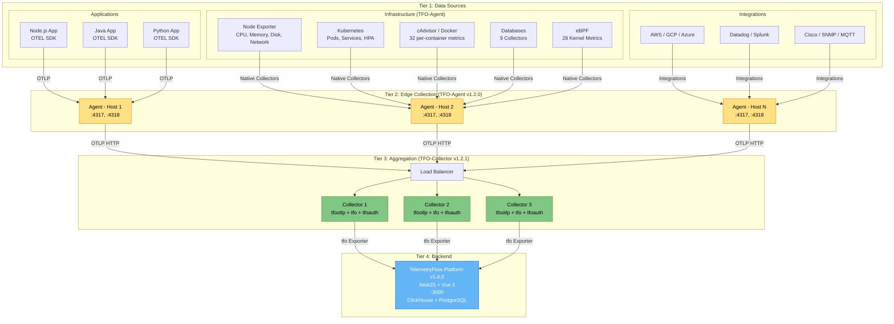
```mermaid
graph TB
    subgraph "Tier 1: Data Sources"
        subgraph "Applications"
            APP1[Node.js App<br/>OTEL SDK]
            APP2[Java App<br/>OTEL SDK]
            APP3[Python App<br/>OTEL SDK]
        end

        subgraph "Infrastructure (TFO-Agent)"
            NODE[Node Exporter<br/>CPU, Memory, Disk, Network]
            K8S[Kubernetes<br/>Pods, Services, HPA]
            CAD[cAdvisor / Docker<br/>32 per-container metrics]
            DB[Databases<br/>9 Collectors]
            EBPF[eBPF<br/>28 Kernel Metrics]
        end

        subgraph "Integrations"
            CLOUD[AWS / GCP / Azure]
            APM[Datadog / Splunk]
            NET[Cisco / SNMP / MQTT]
        end
    end

    subgraph "Tier 2: Edge Collection (TFO-Agent v1.2.0)"
        AGENT1[Agent - Host 1<br/>:4317, :4318]
        AGENT2[Agent - Host 2<br/>:4317, :4318]
        AGENT3[Agent - Host N<br/>:4317, :4318]
    end

    subgraph "Tier 3: Aggregation (TFO-Collector v1.2.1)"
        LB[Load Balancer]
        COLL1[Collector 1<br/>tfootlp + tfo + tfoauth]
        COLL2[Collector 2<br/>tfootlp + tfo + tfoauth]
        COLL3[Collector 3<br/>tfootlp + tfo + tfoauth]
    end

    subgraph "Tier 4: Backend"
        TFO[TelemetryFlow Platform v1.4.0<br/>NestJS + Vue 3<br/>:3000<br/>ClickHouse + PostgreSQL]
    end

    APP1 & APP2 & APP3 -->|OTLP| AGENT1
    NODE & K8S & CAD & DB & EBPF -->|Native Collectors| AGENT2
    CLOUD & APM & NET -->|Integrations| AGENT3

    AGENT1 & AGENT2 & AGENT3 -->|OTLP HTTP| LB
    LB --> COLL1
    LB --> COLL2
    LB --> COLL3

    COLL1 & COLL2 & COLL3 -->|tfo Exporter| TFO

    style AGENT1 fill:#FFE082,stroke:#F57C00,color:#000
    style AGENT2 fill:#FFE082,stroke:#F57C00,color:#000
    style AGENT3 fill:#FFE082,stroke:#F57C00,color:#000
    style COLL1 fill:#81C784,stroke:#388E3C,color:#000
    style COLL2 fill:#81C784,stroke:#388E3C,color:#000
    style COLL3 fill:#81C784,stroke:#388E3C,color:#000
    style TFO fill:#64B5F6,stroke:#1976D2,color:#fff
```

---

## Component Architecture

### TFO-Agent Architecture

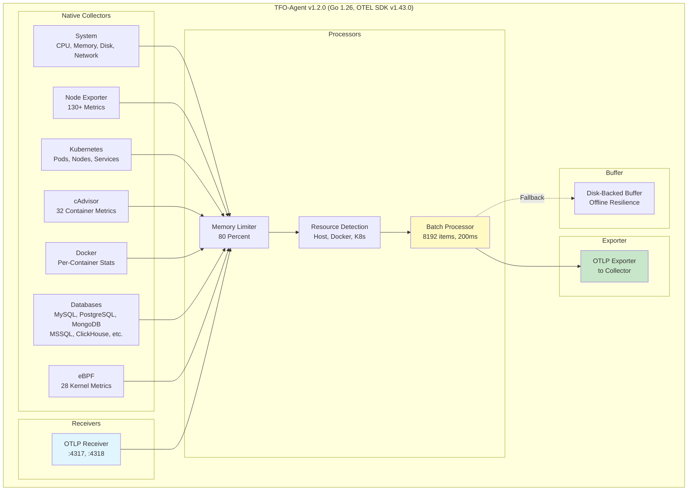
```mermaid
graph TB
    subgraph "TFO-Agent v1.2.0 (Go 1.26, OTEL SDK v1.43.0)"
        subgraph "Native Collectors"
            RC_SYS[System<br/>CPU, Memory, Disk, Network]
            RC_NODE[Node Exporter<br/>130+ Metrics]
            RC_K8S[Kubernetes<br/>Pods, Nodes, Services]
            RC_CAD[cAdvisor<br/>32 Container Metrics]
            RC_DOCKER[Docker<br/>Per-Container Stats]
            RC_DB[Databases<br/>MySQL, PostgreSQL, MongoDB<br/>MSSQL, ClickHouse, etc.]
            RC_EBPF[eBPF<br/>28 Kernel Metrics]
        end

        subgraph "Receivers"
            R_OTLP[OTLP Receiver<br/>:4317, :4318]
        end

        subgraph "Processors"
            P_BATCH[Batch Processor<br/>8192 items, 200ms]
            P_MEM[Memory Limiter<br/>80 Percent]
            P_RES[Resource Detection<br/>Host, Docker, K8s]
        end

        subgraph "Exporter"
            E_OTLP[OTLP Exporter<br/>to Collector]
        end

        subgraph "Buffer"
            BUF[Disk-Backed Buffer<br/>Offline Resilience]
        end
    end

    RC_SYS & RC_NODE & RC_K8S & RC_CAD & RC_DOCKER & RC_DB & RC_EBPF --> P_MEM
    R_OTLP --> P_MEM
    P_MEM --> P_RES --> P_BATCH
    P_BATCH --> E_OTLP
    P_BATCH -.->|Fallback| BUF

    style R_OTLP fill:#E1F5FE
    style P_BATCH fill:#FFF9C4
    style E_OTLP fill:#C8E6C9
```

### TFO-Collector Architecture (OCB Native)

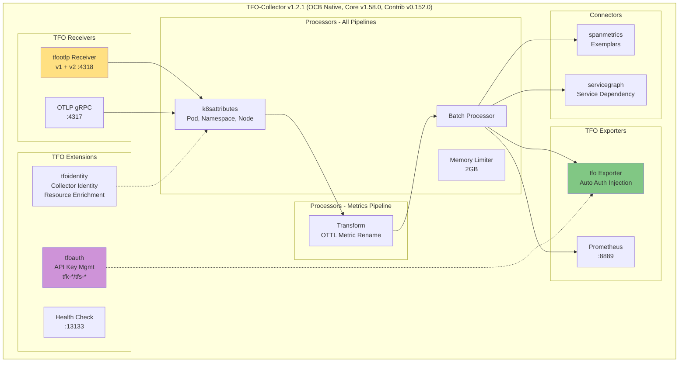
```mermaid
graph TB
    subgraph "TFO-Collector v1.2.1 (OCB Native, Core v1.58.0, Contrib v0.152.0)"
        subgraph "TFO Receivers"
            RC_TFOOTLP[tfootlp Receiver<br/>v1 + v2 :4318]
            RC_GRPC[OTLP gRPC<br/>:4317]
        end

        subgraph "Processors - All Pipelines"
            P_K8S[k8sattributes<br/>Pod, Namespace, Node]
            P_BATCH[Batch Processor]
            P_MEM[Memory Limiter<br/>2GB]
        end

        subgraph "Processors - Metrics Pipeline"
            PM_TRANSFORM[Transform<br/>OTTL Metric Rename]
        end

        subgraph "TFO Extensions"
            EXT_AUTH[tfoauth<br/>API Key Mgmt<br/>tfk-*/tfs-*]
            EXT_ID[tfoidentity<br/>Collector Identity<br/>Resource Enrichment]
            EXT_HEALTH[Health Check<br/>:13133]
        end

        subgraph "TFO Exporters"
            EM_TFO[tfo Exporter<br/>Auto Auth Injection]
            EM_PROM[Prometheus<br/>:8889]
        end

        subgraph "Connectors"
            CONN_SM[spanmetrics<br/>Exemplars]
            CONN_SG[servicegraph<br/>Service Dependency]
        end
    end

    RC_TFOOTLP --> P_K8S
    RC_GRPC --> P_K8S
    P_K8S --> PM_TRANSFORM
    PM_TRANSFORM --> P_BATCH
    P_BATCH --> EM_TFO
    P_BATCH --> EM_PROM
    P_BATCH --> CONN_SM
    P_BATCH --> CONN_SG

    EXT_AUTH -.-> EM_TFO
    EXT_ID -.-> P_K8S

    style RC_TFOOTLP fill:#FFE082
    style EXT_AUTH fill:#CE93D8
    style EM_TFO fill:#81C784
```

---

## Data Flow

### Metrics Data Flow

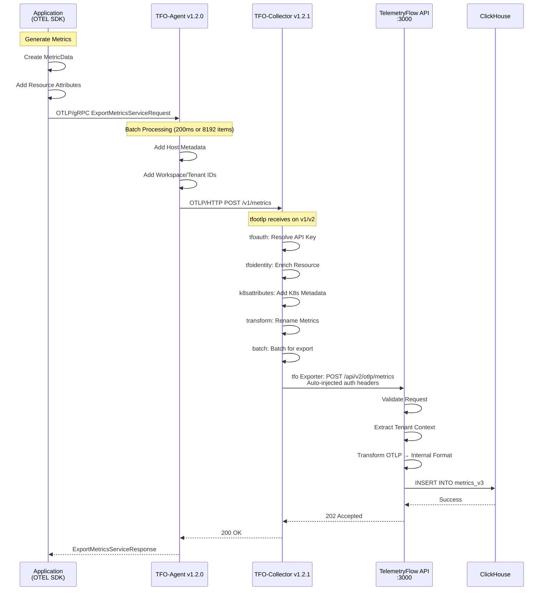
```mermaid
sequenceDiagram
    participant App as Application<br/>(OTEL SDK)
    participant Agent as TFO-Agent v1.2.0
    participant Collector as TFO-Collector v1.2.1
    participant TFO as TelemetryFlow API<br/>:3000
    participant CH as ClickHouse

    Note over App: Generate Metrics
    App->>App: Create MetricData
    App->>App: Add Resource Attributes

    App->>Agent: OTLP/gRPC ExportMetricsServiceRequest
    Note over Agent: Batch Processing (200ms or 8192 items)
    Agent->>Agent: Add Host Metadata
    Agent->>Agent: Add Workspace/Tenant IDs

    Agent->>Collector: OTLP/HTTP POST /v1/metrics
    Note over Collector: tfootlp receives on v1/v2
    Collector->>Collector: tfoauth: Resolve API Key
    Collector->>Collector: tfoidentity: Enrich Resource
    Collector->>Collector: k8sattributes: Add K8s Metadata
    Collector->>Collector: transform: Rename Metrics
    Collector->>Collector: batch: Batch for export

    Collector->>TFO: tfo Exporter: POST /api/v2/otlp/metrics<br/>Auto-injected auth headers
    TFO->>TFO: Validate Request
    TFO->>TFO: Extract Tenant Context
    TFO->>TFO: Transform OTLP → Internal Format
    TFO->>CH: INSERT INTO metrics_v3
    CH-->>TFO: Success
    TFO-->>Collector: 202 Accepted
    Collector-->>Agent: 200 OK
    Agent-->>App: ExportMetricsServiceResponse
```

### Logs Data Flow

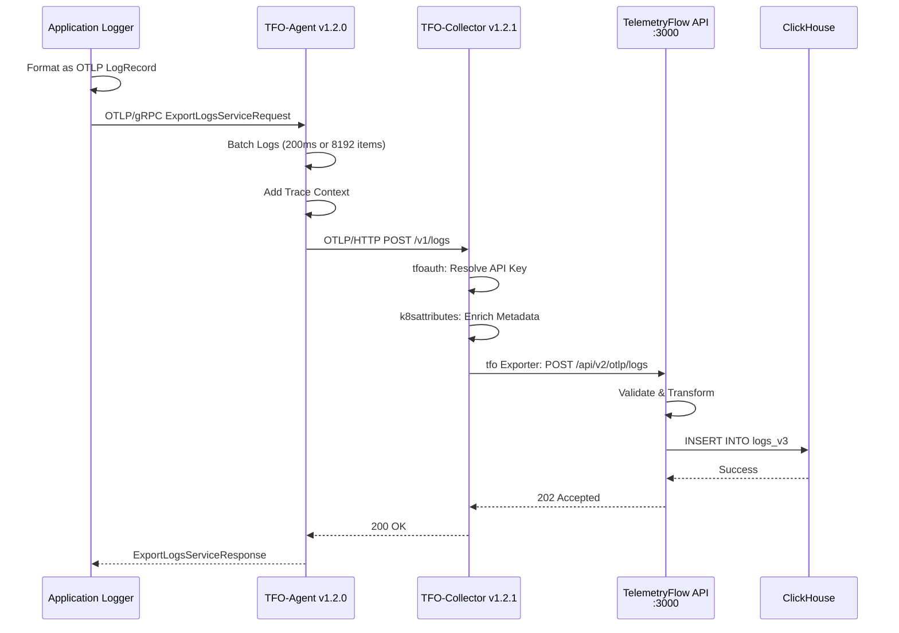
```mermaid
sequenceDiagram
    participant Logger as Application Logger
    participant Agent as TFO-Agent v1.2.0
    participant Collector as TFO-Collector v1.2.1
    participant TFO as TelemetryFlow API<br/>:3000
    participant CH as ClickHouse

    Logger->>Logger: Format as OTLP LogRecord
    Logger->>Agent: OTLP/gRPC ExportLogsServiceRequest
    Agent->>Agent: Batch Logs (200ms or 8192 items)
    Agent->>Agent: Add Trace Context

    Agent->>Collector: OTLP/HTTP POST /v1/logs
    Collector->>Collector: tfoauth: Resolve API Key
    Collector->>Collector: k8sattributes: Enrich Metadata

    Collector->>TFO: tfo Exporter: POST /api/v2/otlp/logs
    TFO->>TFO: Validate & Transform
    TFO->>CH: INSERT INTO logs_v3
    CH-->>TFO: Success
    TFO-->>Collector: 202 Accepted
    Collector-->>Agent: 200 OK
    Agent-->>Logger: ExportLogsServiceResponse
```

### Traces Data Flow

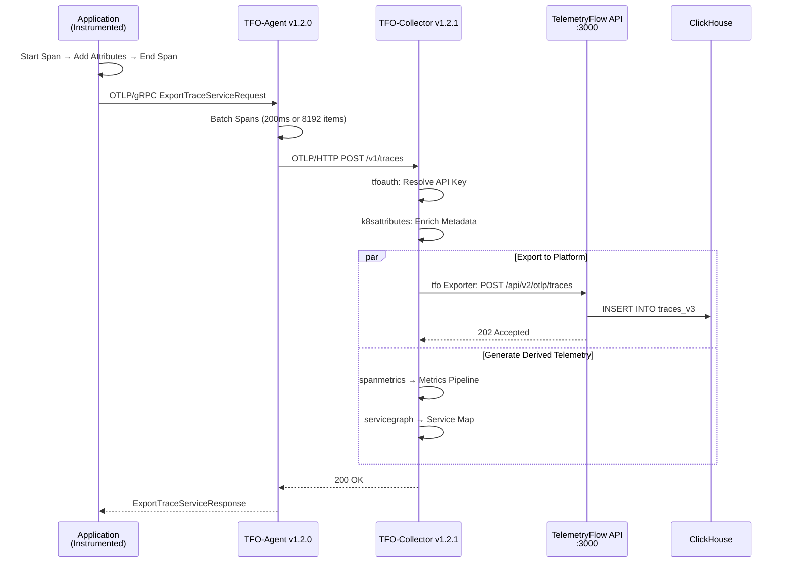
```mermaid
sequenceDiagram
    participant App as Application<br/>(Instrumented)
    participant Agent as TFO-Agent v1.2.0
    participant Collector as TFO-Collector v1.2.1
    participant TFO as TelemetryFlow API<br/>:3000
    participant CH as ClickHouse

    App->>App: Start Span → Add Attributes → End Span
    App->>Agent: OTLP/gRPC ExportTraceServiceRequest
    Agent->>Agent: Batch Spans (200ms or 8192 items)

    Agent->>Collector: OTLP/HTTP POST /v1/traces
    Collector->>Collector: tfoauth: Resolve API Key
    Collector->>Collector: k8sattributes: Enrich Metadata

    par Export to Platform
        Collector->>TFO: tfo Exporter: POST /api/v2/otlp/traces
        TFO->>CH: INSERT INTO traces_v3
        TFO-->>Collector: 202 Accepted
    and Generate Derived Telemetry
        Collector->>Collector: spanmetrics → Metrics Pipeline
        Collector->>Collector: servicegraph → Service Map
    end

    Collector-->>Agent: 200 OK
    Agent-->>App: ExportTraceServiceResponse
```

---

## Processing Pipeline

### Agent Pipeline Configuration

```yaml
service:
  pipelines:
    metrics:
      receivers: [otlp, system, nodeexporter, kubernetes, cadvisor, docker]
      processors:
        - memory_limiter
        - resourcedetection
        - batch
      exporters: [otlphttp/collector]

    logs:
      receivers: [otlp]
      processors:
        - memory_limiter
        - resourcedetection
        - batch
      exporters: [otlphttp/collector]

    traces:
      receivers: [otlp]
      processors:
        - memory_limiter
        - resourcedetection
        - batch
      exporters: [otlphttp/collector]
```

### Collector Pipeline Configuration (OCB Native)

```yaml
service:
  extensions: [tfoauth, tfoidentity, health_check]

  pipelines:
    traces:
      receivers: [tfootlp]
      processors:
        - k8sattributes
        - batch
      exporters: [tfo, spanmetrics, servicegraph]

    metrics:
      receivers: [tfootlp]
      processors:
        - k8sattributes
        - transform
        - batch
      exporters: [tfo, prometheus]

    logs:
      receivers: [tfootlp]
      processors:
        - k8sattributes
        - batch
      exporters: [tfo]
```

---

## Multi-Tenancy

### Tenant Context Propagation

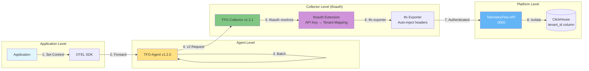
```mermaid
graph LR
    subgraph "Application Level"
        APP[Application] -->|1. Set Context| SDK[OTEL SDK]
    end

    subgraph "Agent Level"
        SDK -->|2. Forward| AGENT[TFO-Agent v1.2.0]
        AGENT -->|3. Batch| AGENT
    end

    subgraph "Collector Level (tfoauth)"
        AGENT -->|4. v2 Request| COLLECTOR[TFO-Collector v1.2.1]
        COLLECTOR -->|5. tfoauth resolves| AUTH[tfoauth Extension<br/>API Key → Tenant Mapping]
        AUTH -->|6. tfo exporter| EXPORT[tfo Exporter<br/>Auto-inject headers]
    end

    subgraph "Platform Level"
        EXPORT -->|7. Authenticated| TFO[TelemetryFlow API<br/>:3000]
        TFO -->|8. Isolate| DB[(ClickHouse<br/>tenant_id column)]
    end

    style APP fill:#E1F5FE
    style AGENT fill:#FFE082
    style COLLECTOR fill:#81C784
    style AUTH fill:#CE93D8
    style TFO fill:#64B5F6,color:#fff
```

### Multi-Tenant Data Isolation

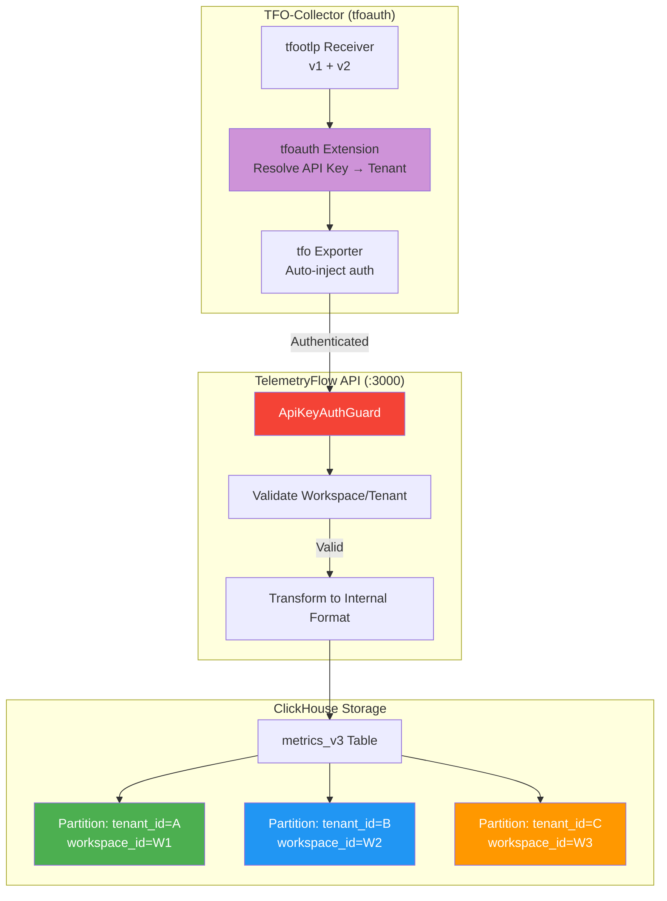
```mermaid
graph TB
    subgraph "TFO-Collector (tfoauth)"
        RECV[tfootlp Receiver<br/>v1 + v2]
        AUTH[tfoauth Extension<br/>Resolve API Key → Tenant]
        EXPORT[tfo Exporter<br/>Auto-inject auth]
    end

    subgraph "TelemetryFlow API (:3000)"
        GUARD[ApiKeyAuthGuard]
        VALIDATE[Validate Workspace/Tenant]
        TRANSFORM[Transform to Internal Format]
    end

    subgraph "ClickHouse Storage"
        TABLE[metrics_v3 Table]
        PART1[Partition: tenant_id=A<br/>workspace_id=W1]
        PART2[Partition: tenant_id=B<br/>workspace_id=W2]
        PART3[Partition: tenant_id=C<br/>workspace_id=W3]
    end

    RECV --> AUTH
    AUTH --> EXPORT
    EXPORT -->|Authenticated| GUARD
    GUARD --> VALIDATE
    VALIDATE -->|Valid| TRANSFORM
    TRANSFORM --> TABLE
    TABLE --> PART1
    TABLE --> PART2
    TABLE --> PART3

    style GUARD fill:#F44336,color:#fff
    style AUTH fill:#CE93D8
    style PART1 fill:#4CAF50,color:#fff
    style PART2 fill:#2196F3,color:#fff
    style PART3 fill:#FF9800,color:#fff
```

---

## Deployment Patterns

### Pattern 1: Hub-and-Spoke (Recommended)

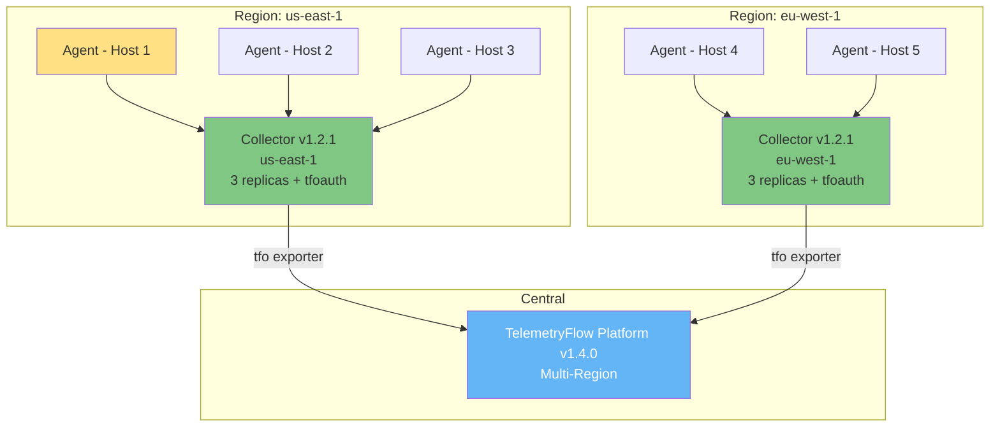
```mermaid
graph TB
    subgraph "Region: us-east-1"
        AGENT1[Agent - Host 1]
        AGENT2[Agent - Host 2]
        AGENT3[Agent - Host 3]
        COLL_EAST[Collector v1.2.1<br/>us-east-1<br/>3 replicas + tfoauth]
    end

    subgraph "Region: eu-west-1"
        AGENT4[Agent - Host 4]
        AGENT5[Agent - Host 5]
        COLL_EU[Collector v1.2.1<br/>eu-west-1<br/>3 replicas + tfoauth]
    end

    subgraph "Central"
        TFO[TelemetryFlow Platform v1.4.0<br/>Multi-Region]
    end

    AGENT1 & AGENT2 & AGENT3 --> COLL_EAST
    AGENT4 & AGENT5 --> COLL_EU
    COLL_EAST -->|tfo exporter| TFO
    COLL_EU -->|tfo exporter| TFO

    style AGENT1 fill:#FFE082
    style COLL_EAST fill:#81C784
    style COLL_EU fill:#81C784
    style TFO fill:#64B5F6,color:#fff
```

### Pattern 2: Direct-to-Platform

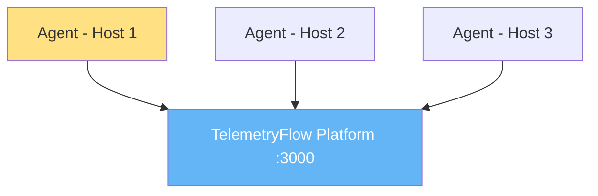
```mermaid
graph TB
    AGENT1[Agent - Host 1]
    AGENT2[Agent - Host 2]
    AGENT3[Agent - Host 3]
    TFO[TelemetryFlow Platform :3000]

    AGENT1 --> TFO
    AGENT2 --> TFO
    AGENT3 --> TFO

    style AGENT1 fill:#FFE082
    style TFO fill:#64B5F6,color:#fff
```

### Pattern 3: Edge Buffering

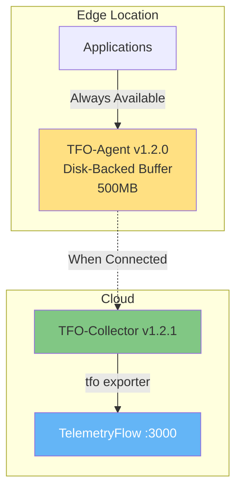
```mermaid
graph TB
    subgraph "Edge Location"
        APP[Applications]
        AGENT[TFO-Agent v1.2.0<br/>Disk-Backed Buffer<br/>500MB]
    end

    subgraph "Cloud"
        COLLECTOR[TFO-Collector v1.2.1]
        TFO[TelemetryFlow :3000]
    end

    APP -->|Always Available| AGENT
    AGENT -.->|When Connected| COLLECTOR
    COLLECTOR -->|tfo exporter| TFO

    style AGENT fill:#FFE082
    style COLLECTOR fill:#81C784
    style TFO fill:#64B5F6,color:#fff
```

---

## Scalability

### Horizontal Scaling

#### Agent Scaling

```
Scaling Model: Linear per host
Formula: 1 agent per host/VM/container

Capacity per Agent:
- 10,000 data points/sec
- 50MB RAM baseline
- +1MB per 1000 data points/sec

Example:
- 100 hosts × 1 agent = 100 agents
- Total capacity: 1M data points/sec
```

#### Collector Scaling

```
Scaling Model: Horizontal with load balancer
Formula: N collectors behind LB

Capacity per Collector:
- 100,000 data points/sec
- 512MB RAM baseline
- +100MB per 10,000 data points/sec

Example:
- 5 collectors × 100K = 500K data points/sec
- Total RAM: 5 × 512MB = 2.56GB
```

### Vertical Scaling

| Workload                   | Agent RAM | Agent CPU | Collector RAM | Collector CPU |
| -------------------------- | --------- | --------- | ------------- | ------------- |
| **Small** (<1K dps)        | 50MB      | 0.1 core  | 256MB         | 0.5 core      |
| **Medium** (1K-10K dps)    | 128MB     | 0.5 core  | 512MB         | 1 core        |
| **Large** (10K-100K dps)   | 256MB     | 1 core    | 1GB           | 2 cores       |
| **Very Large** (>100K dps) | 512MB     | 2 cores   | 2GB           | 4 cores       |

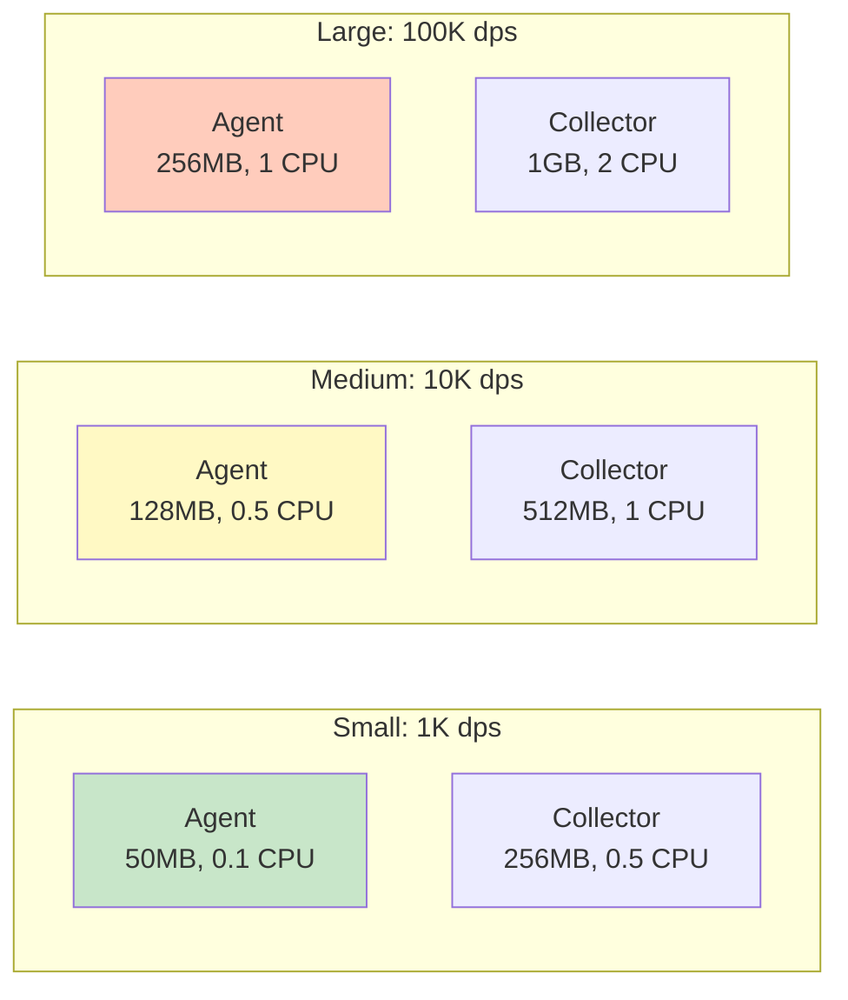
```mermaid
graph LR
    subgraph "Small: 1K dps"
        S_AGENT[Agent<br/>50MB, 0.1 CPU]
        S_COLL[Collector<br/>256MB, 0.5 CPU]
    end

    subgraph "Medium: 10K dps"
        M_AGENT[Agent<br/>128MB, 0.5 CPU]
        M_COLL[Collector<br/>512MB, 1 CPU]
    end

    subgraph "Large: 100K dps"
        L_AGENT[Agent<br/>256MB, 1 CPU]
        L_COLL[Collector<br/>1GB, 2 CPU]
    end

    style S_AGENT fill:#C8E6C9
    style M_AGENT fill:#FFF9C4
    style L_AGENT fill:#FFCCBC
```

---

**Version:** 1.4.0 | **Maintained By:** DevOpsCorner Indonesia
