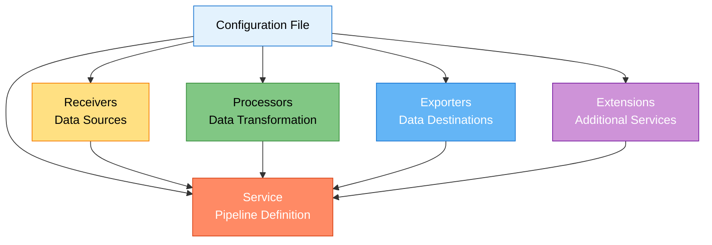

# TFO-OTEL Configuration Reference

- **Version:** 1.0.0-CE
- **Last Updated:** December 13, 2025
- **Component:** Configuration Guide
- **Base Version:** OpenTelemetry Collector 0.88.0

---

## Table of Contents

1. [Overview](#overview)
2. [Configuration Structure](#configuration-structure)
3. [Receivers](#receivers)
4. [Processors](#processors)
5. [Exporters](#exporters)
6. [Extensions](#extensions)
7. [Service Pipelines](#service-pipelines)
8. [Environment Variables](#environment-variables)
9. [Configuration Examples](#configuration-examples)
10. [Validation](#validation)
11. [Best Practices](#best-practices)

---

## Overview

TFO-OTEL (Agent and Collector) uses YAML configuration files following the OpenTelemetry Collector standard. The configuration consists of five main sections:



---

## Configuration Structure

### Basic Template

```yaml
# Receivers: Define how to receive telemetry data
receivers:
  <receiver-name>:
    <receiver-config>

# Processors: Define how to process telemetry data
processors:
  <processor-name>:
    <processor-config>

# Exporters: Define where to send telemetry data
exporters:
  <exporter-name>:
    <exporter-config>

# Extensions: Additional services (health checks, pprof, etc.)
extensions:
  <extension-name>:
    <extension-config>

# Service: Wire receivers, processors, and exporters into pipelines
service:
  extensions: [<extension-list>]

  pipelines:
    metrics:
      receivers: [<receiver-list>]
      processors: [<processor-list>]
      exporters: [<exporter-list>]

    logs:
      receivers: [<receiver-list>]
      processors: [<processor-list>]
      exporters: [<exporter-list>]

    traces:
      receivers: [<receiver-list>]
      processors: [<processor-list>]
      exporters: [<exporter-list>]
```

---

## Receivers

Receivers are how the collector ingests telemetry data.

### OTLP Receiver

**Purpose:** Receive telemetry via OpenTelemetry Protocol (gRPC and HTTP)

**Configuration:**

```yaml
receivers:
  otlp:
    protocols:
      grpc:
        endpoint: 0.0.0.0:4317
        max_recv_msg_size_mib: 4
        max_concurrent_streams: 100
        read_buffer_size: 524288
        write_buffer_size: 524288
        keepalive:
          server_parameters:
            max_connection_idle: 11s
            max_connection_age: 12s
            max_connection_age_grace: 13s
            time: 30s
            timeout: 5s
          enforcement_policy:
            min_time: 10s
            permit_without_stream: true

      http:
        endpoint: 0.0.0.0:4318
        cors:
          allowed_origins:
            - "http://localhost:*"
            - "https://app.telemetryflow.id"
          allowed_headers:
            - "X-Workspace-Id"
            - "X-Tenant-Id"
          max_age: 7200
```

**Parameters:**

| Parameter | Default | Description |
|-----------|---------|-------------|
| `endpoint` | `0.0.0.0:4317` (gRPC), `0.0.0.0:4318` (HTTP) | Listen address |
| `max_recv_msg_size_mib` | `4` | Max gRPC message size (MB) |
| `max_concurrent_streams` | `100` | Max concurrent gRPC streams |
| `cors.allowed_origins` | `[]` | CORS allowed origins (HTTP only) |

### Prometheus Receiver

**Purpose:** Scrape Prometheus metrics

**Configuration:**

```yaml
receivers:
  prometheus:
    config:
      scrape_configs:
        - job_name: 'node-exporter'
          scrape_interval: 30s
          scrape_timeout: 10s
          static_configs:
            - targets: ['localhost:9100']
              labels:
                environment: 'production'

        - job_name: 'application-metrics'
          scrape_interval: 15s
          static_configs:
            - targets: ['app1:8080', 'app2:8080']

        # Kubernetes service discovery
        - job_name: 'kubernetes-pods'
          kubernetes_sd_configs:
            - role: pod
              namespaces:
                names:
                  - default
                  - production
          relabel_configs:
            - source_labels: [__meta_kubernetes_pod_annotation_prometheus_io_scrape]
              action: keep
              regex: true
            - source_labels: [__meta_kubernetes_pod_annotation_prometheus_io_port]
              action: replace
              target_label: __address__
              regex: ([^:]+)(?::\d+)?;(\d+)
              replacement: $1:$2
```

**Parameters:**

| Parameter | Default | Description |
|-----------|---------|-------------|
| `scrape_interval` | `1m` | How often to scrape |
| `scrape_timeout` | `10s` | Scrape timeout |
| `static_configs` | `[]` | Static target list |
| `kubernetes_sd_configs` | `[]` | Kubernetes service discovery |

### FluentForward Receiver

**Purpose:** Receive logs via Fluent Forward protocol (FluentBit, Fluentd)

**Configuration:**

```yaml
receivers:
  fluentforward:
    endpoint: 0.0.0.0:24224
    tag_key: tag
```

**Parameters:**

| Parameter | Default | Description |
|-----------|---------|-------------|
| `endpoint` | `0.0.0.0:24224` | Listen address |
| `tag_key` | - | Attribute key for Fluent tag |

### Filelog Receiver

**Purpose:** Tail log files

**Configuration:**

```yaml
receivers:
  filelog:
    include:
      - /var/log/app/*.log
      - /var/log/nginx/access.log
    exclude:
      - /var/log/app/*debug.log

    start_at: end  # or 'beginning'

    include_file_path: true
    include_file_name: true
    include_file_name_resolved: true

    multiline:
      line_start_pattern: '^\d{4}-\d{2}-\d{2}'

    operators:
      # Parse JSON logs
      - type: json_parser
        timestamp:
          parse_from: attributes.time
          layout: '%Y-%m-%dT%H:%M:%S.%LZ'

      # Extract fields with regex
      - type: regex_parser
        regex: '^(?P<timestamp>\S+) (?P<level>\S+) (?P<message>.*)$'
        timestamp:
          parse_from: attributes.timestamp
          layout: '%Y-%m-%d %H:%M:%S'

      # Add severity
      - type: severity_parser
        parse_from: attributes.level
        mapping:
          debug: [debug, DEBUG]
          info: [info, INFO]
          warn: [warn, WARNING]
          error: [error, ERROR]
          fatal: [fatal, FATAL]
```

### Syslog Receiver

**Purpose:** Receive syslog messages

**Configuration:**

```yaml
receivers:
  syslog:
    tcp:
      listen_address: "0.0.0.0:54526"
    udp:
      listen_address: "0.0.0.0:54527"
    protocol: rfc5424  # or rfc3164
```

### Kafka Receiver

**Purpose:** Consume from Kafka topics

**Configuration:**

```yaml
receivers:
  kafka:
    protocol_version: 2.8.0
    brokers:
      - kafka-1.example.com:9092
      - kafka-2.example.com:9092
    topic: telemetry-metrics
    group_id: tfo-collector-group

    authentication:
      sasl:
        username: kafka-user
        password: ${env:KAFKA_PASSWORD}
        mechanism: SCRAM-SHA-512

      tls:
        insecure_skip_verify: false
        ca_file: /etc/ssl/ca.pem
        cert_file: /etc/ssl/cert.pem
        key_file: /etc/ssl/key.pem

    metadata:
      full: false
      retry:
        max: 3
        backoff: 250ms
```

---

## Processors

Processors transform, filter, and enrich telemetry data.

### Batch Processor

**Purpose:** Batch data before sending to reduce network overhead

**Configuration:**

```yaml
processors:
  batch:
    timeout: 10s
    send_batch_size: 1024
    send_batch_max_size: 2048
    metadata_keys:
      - tenant.id
      - workspace.id
```

**Parameters:**

| Parameter | Default | Description |
|-----------|---------|-------------|
| `timeout` | `200ms` | Max time to wait before sending batch |
| `send_batch_size` | `8192` | Target batch size |
| `send_batch_max_size` | `0` | Max batch size (0 = no limit) |

**Recommendations:**

- **Agent**: `timeout: 10s`, `send_batch_size: 512`
- **Collector**: `timeout: 5s`, `send_batch_size: 1024`
- **High-throughput**: `timeout: 5s`, `send_batch_size: 2048`

### Memory Limiter Processor

**Purpose:** Prevent out-of-memory errors by dropping data when limits are reached

**Configuration:**

```yaml
processors:
  memory_limiter:
    check_interval: 1s
    limit_mib: 2048
    spike_limit_mib: 512
```

**Parameters:**

| Parameter | Default | Description |
|-----------|---------|-------------|
| `check_interval` | `0s` | How often to check memory usage |
| `limit_mib` | `0` | Hard memory limit (0 = no limit) |
| `spike_limit_mib` | `0` | Spike limit above soft limit |

**Calculation:**

```
soft_limit = limit_mib - spike_limit_mib
```

**Best Practice:** Set `limit_mib` to 80% of container memory limit

### Resource Processor

**Purpose:** Add or modify resource attributes

**Configuration:**

```yaml
processors:
  resource:
    attributes:
      - key: host.name
        value: ${env:HOSTNAME}
        action: upsert
      - key: host.ip
        value: ${env:HOST_IP}
        action: upsert
      - key: deployment.environment
        value: production
        action: insert
      - key: service.version
        from_attribute: app.version
        action: upsert
```

**Actions:**

| Action | Description |
|--------|-------------|
| `insert` | Add if not exists |
| `update` | Update if exists |
| `upsert` | Insert or update |
| `delete` | Remove attribute |
| `hash` | Hash attribute value |
| `extract` | Extract with regex |

### Attributes Processor

**Purpose:** Add, update, or delete attributes

**Configuration:**

```yaml
processors:
  attributes:
    actions:
      # Add workspace/tenant context
      - key: telemetryflow.workspace.id
        value: ${env:TELEMETRYFLOW_WORKSPACE_ID}
        action: upsert

      - key: telemetryflow.tenant.id
        value: ${env:TELEMETRYFLOW_TENANT_ID}
        action: upsert

      # Copy attribute
      - key: user.id
        from_attribute: http.request.header.user_id
        action: insert

      # Extract with regex
      - key: http.method
        pattern: ^(?P<method>\w+)
        action: extract

      # Delete sensitive data
      - key: http.request.header.authorization
        action: delete

      # Hash PII
      - key: user.email
        action: hash
```

### Filter Processor

**Purpose:** Filter telemetry based on conditions

**Configuration:**

```yaml
processors:
  filter:
    metrics:
      include:
        match_type: regexp
        metric_names:
          - ^http\..*
          - ^system\.cpu\..*
      exclude:
        match_type: strict
        metric_names:
          - http.server.debug

    logs:
      include:
        match_type: strict
        severity_texts:
          - ERROR
          - FATAL
          - WARN
      exclude:
        match_type: regexp
        bodies:
          - ".*health.*check.*"

    traces:
      exclude:
        match_type: strict
        span_names:
          - /health
          - /metrics
```

**Match Types:**

- `strict`: Exact match
- `regexp`: Regular expression match

### Transform Processor

**Purpose:** Modify telemetry using OpenTelemetry Transformation Language (OTTL)

**Configuration:**

```yaml
processors:
  transform:
    metric_statements:
      - context: metric
        statements:
          # Rename metric
          - set(name, "new.metric.name") where name == "old.metric.name"

          # Convert units
          - set(unit, "By") where name == "process.runtime.jvm.memory.usage"

          # Scale values
          - set(value, value * 1000) where name == "duration.seconds"

    log_statements:
      - context: log
        statements:
          # Set severity
          - set(severity_text, "ERROR") where body contains "exception"

          # Add attributes
          - set(attributes["processed"], true)

          # Parse JSON body
          - merge_maps(attributes, ParseJSON(body), "insert")

    trace_statements:
      - context: span
        statements:
          # Rename span
          - set(name, "GET /api/users") where name == "HTTP GET"

          # Add attribute
          - set(attributes["sampled"], true) where status.code == STATUS_CODE_ERROR
```

### Tail Sampling Processor

**Purpose:** Sample traces based on criteria (only for traces pipeline)

**Configuration:**

```yaml
processors:
  tail_sampling:
    decision_wait: 10s
    num_traces: 100000
    expected_new_traces_per_sec: 1000

    policies:
      # Always sample errors
      - name: error-policy
        type: status_code
        status_code:
          status_codes:
            - ERROR

      # Sample 10% of successful requests
      - name: probabilistic-policy
        type: probabilistic
        probabilistic:
          sampling_percentage: 10

      # Always sample slow requests
      - name: latency-policy
        type: latency
        latency:
          threshold_ms: 1000

      # Sample specific services
      - name: service-policy
        type: string_attribute
        string_attribute:
          key: service.name
          values:
            - payment-service
            - auth-service
```

### Resource Detection Processor

**Purpose:** Auto-detect resource attributes from environment

**Configuration:**

```yaml
processors:
  resourcedetection:
    detectors:
      - env        # Environment variables
      - system     # System info (hostname, OS)
      - docker     # Docker container info
      - ec2        # AWS EC2 metadata
      - gcp        # GCP metadata
      - azure      # Azure metadata
      - eks        # AWS EKS
      - gke        # GCP GKE
      - aks        # Azure AKS

    timeout: 5s
    override: false
```

---

## Exporters

Exporters send telemetry data to backends.

### OTLP HTTP Exporter (TelemetryFlow)

**Purpose:** Send data to TelemetryFlow Platform via OTLP/HTTP

**Configuration:**

```yaml
exporters:
  otlphttp/telemetryflow:
    endpoint: http://telemetryflow-api:3100/api

    headers:
      X-Workspace-Id: "${env:TELEMETRYFLOW_WORKSPACE_ID}"
      X-Tenant-Id: "${env:TELEMETRYFLOW_TENANT_ID}"
      Authorization: "Bearer ${env:TELEMETRYFLOW_API_KEY}"

    compression: gzip

    timeout: 30s

    retry_on_failure:
      enabled: true
      initial_interval: 5s
      max_interval: 30s
      max_elapsed_time: 300s

    sending_queue:
      enabled: true
      num_consumers: 10
      queue_size: 5000
      storage: file_storage

    tls:
      insecure: false
      ca_file: /etc/ssl/ca.pem
      cert_file: /etc/ssl/cert.pem
      key_file: /etc/ssl/key.pem
      insecure_skip_verify: false
```

**Parameters:**

| Parameter | Default | Description |
|-----------|---------|-------------|
| `endpoint` | - | Backend URL (required) |
| `headers` | `{}` | HTTP headers |
| `compression` | `none` | Compression (gzip, zstd) |
| `timeout` | `30s` | Request timeout |
| `retry_on_failure.enabled` | `true` | Enable retry logic |
| `sending_queue.enabled` | `true` | Enable persistent queue |

### Prometheus Exporter

**Purpose:** Expose metrics in Prometheus format

**Configuration:**

```yaml
exporters:
  prometheus:
    endpoint: 0.0.0.0:8889
    namespace: telemetryflow
    const_labels:
      environment: production
    metric_expiration: 5m
    resource_to_telemetry_conversion:
      enabled: true
```

### Prometheus Remote Write Exporter

**Purpose:** Send metrics to Prometheus via Remote Write API

**Configuration:**

```yaml
exporters:
  prometheusremotewrite:
    endpoint: http://prometheus:9090/api/v1/write

    headers:
      X-Scope-OrgID: "${env:TENANT_ID}"

    compression: snappy

    remote_write_queue:
      enabled: true
      queue_size: 10000
      num_consumers: 5

    retry_on_failure:
      enabled: true
      initial_interval: 5s
      max_interval: 30s
```

### Loki Exporter

**Purpose:** Send logs to Grafana Loki

**Configuration:**

```yaml
exporters:
  loki:
    endpoint: http://loki:3100/loki/api/v1/push

    headers:
      X-Scope-OrgID: "${env:TENANT_ID}"

    tenant_id: "${env:TENANT_ID}"

    labels:
      resource:
        service.name: "service_name"
        deployment.environment: "env"
      attributes:
        level: "severity"
        host: "host.name"

    timeout: 10s

    retry_on_failure:
      enabled: true
      initial_interval: 5s
```

### OpenSearch Exporter

**Purpose:** Send logs to OpenSearch/Elasticsearch

**Configuration:**

```yaml
exporters:
  opensearch:
    endpoints:
      - http://opensearch-1:9200
      - http://opensearch-2:9200

    index: telemetry-logs-{yyyy.MM.dd}

    auth:
      authenticator: basicauth
      username: admin
      password: ${env:OPENSEARCH_PASSWORD}

    tls:
      insecure: false
      ca_file: /etc/ssl/ca.pem

    retry_on_failure:
      enabled: true
      initial_interval: 5s
      max_interval: 30s
```

### Kafka Exporter

**Purpose:** Export to Kafka topics

**Configuration:**

```yaml
exporters:
  kafka:
    protocol_version: 2.8.0
    brokers:
      - kafka-1:9092
      - kafka-2:9092

    topic: telemetry-metrics

    encoding: otlp_proto  # or otlp_json

    partition: 0

    producer:
      max_message_bytes: 1000000
      compression: gzip

    authentication:
      sasl:
        username: ${env:KAFKA_USERNAME}
        password: ${env:KAFKA_PASSWORD}
        mechanism: SCRAM-SHA-512
```

### Logging Exporter

**Purpose:** Output to stdout/stderr (debugging)

**Configuration:**

```yaml
exporters:
  logging:
    loglevel: info
    sampling_initial: 5
    sampling_thereafter: 200
```

**Levels:** `debug`, `info`, `warn`, `error`

---

## Extensions

Extensions provide additional capabilities.

### Health Check Extension

**Purpose:** HTTP health check endpoint

**Configuration:**

```yaml
extensions:
  health_check:
    endpoint: 0.0.0.0:13133
    path: /
    check_collector_pipeline:
      enabled: true
      interval: 5m
      exporter_failure_threshold: 5
```

**Health Check:**

```bash
curl http://localhost:13133/
# Returns 200 if healthy
```

### Pprof Extension

**Purpose:** Go profiling endpoint

**Configuration:**

```yaml
extensions:
  pprof:
    endpoint: 0.0.0.0:1777
    save_to_file: /var/log/otel/pprof.out
```

**Usage:**

```bash
# CPU profile
curl http://localhost:1777/debug/pprof/profile?seconds=30 > cpu.prof

# Heap profile
curl http://localhost:1777/debug/pprof/heap > heap.prof

# Goroutines
curl http://localhost:1777/debug/pprof/goroutine?debug=1
```

### zPages Extension

**Purpose:** Live debugging pages

**Configuration:**

```yaml
extensions:
  zpages:
    endpoint: 0.0.0.0:55679
```

**Pages:**

- `http://localhost:55679/debug/tracez` - Trace debugging
- `http://localhost:55679/debug/pipelinez` - Pipeline stats
- `http://localhost:55679/debug/servicez` - Service info

### File Storage Extension

**Purpose:** Persistent queue storage

**Configuration:**

```yaml
extensions:
  file_storage:
    directory: /var/lib/otelcol/queue
    timeout: 10s
    compaction:
      directory: /var/lib/otelcol/queue
      on_start: true
      on_rebound: true
      rebound_needed_threshold_mib: 100
      rebound_trigger_threshold_mib: 10
```

---

## Service Pipelines

### Pipeline Configuration

```yaml
service:
  extensions:
    - health_check
    - file_storage
    - pprof
    - zpages

  pipelines:
    # Metrics pipeline
    metrics:
      receivers:
        - otlp
        - prometheus
      processors:
        - memory_limiter
        - resourcedetection
        - resource
        - attributes
        - batch
      exporters:
        - otlphttp/telemetryflow
        - prometheusremotewrite

    # Logs pipeline
    logs:
      receivers:
        - otlp
        - filelog
        - fluentforward
      processors:
        - memory_limiter
        - resource
        - attributes
        - batch
      exporters:
        - otlphttp/telemetryflow
        - loki

    # Traces pipeline
    traces:
      receivers:
        - otlp
      processors:
        - memory_limiter
        - resource
        - attributes
        - tail_sampling
        - batch
      exporters:
        - otlphttp/telemetryflow
```

### Processing Order

Processors run in the order specified in the pipeline:

```
Receivers → Processor 1 → Processor 2 → ... → Processor N → Exporters
```

**Best Practice Order:**

1. `memory_limiter` - First line of defense
2. `resourcedetection` - Add system info
3. `resource` - Add custom resource attributes
4. `attributes` - Add/modify data point attributes
5. `filter` - Remove unwanted data
6. `transform` - Transform data
7. `tail_sampling` - Sample traces (traces only)
8. `batch` - Always last for efficiency

---

## Environment Variables

### TelemetryFlow Context

| Variable | Required | Description | Example |
|----------|----------|-------------|---------|
| `TELEMETRYFLOW_ENDPOINT` | Yes | TelemetryFlow API endpoint | `http://tfo-api:3100/api` |
| `TELEMETRYFLOW_WORKSPACE_ID` | Yes | Workspace UUID | `550e8400-e29b-41d4-a716-446655440000` |
| `TELEMETRYFLOW_TENANT_ID` | Yes | Tenant UUID | `660e8400-e29b-41d4-a716-446655440001` |
| `TELEMETRYFLOW_API_KEY` | No | API key for authentication | `tfk-xxx.tfs-xxx` |

### Host Information

| Variable | Required | Description | Example |
|----------|----------|-------------|---------|
| `HOSTNAME` | No | Host name | `prod-node-01` |
| `HOST_IP` | No | Host IP address | `10.0.1.15` |
| `K8S_NODE_NAME` | No | Kubernetes node name | `k8s-node-01` |

### Configuration

| Variable | Default | Description |
|----------|---------|-------------|
| `OTEL_RESOURCE_ATTRIBUTES` | - | Resource attributes (key=value,key=value) |
| `OTEL_EXPORTER_OTLP_ENDPOINT` | - | Default OTLP endpoint |
| `OTEL_EXPORTER_OTLP_HEADERS` | - | Default OTLP headers |
| `OTEL_LOG_LEVEL` | `info` | Log level (debug, info, warn, error) |

### Variable Substitution in Config

```yaml
exporters:
  otlphttp:
    endpoint: ${env:TELEMETRYFLOW_ENDPOINT}
    headers:
      X-Workspace-Id: "${env:TELEMETRYFLOW_WORKSPACE_ID}"
      X-Tenant-Id: "${env:TELEMETRYFLOW_TENANT_ID}"
```

**With Defaults:**

```yaml
exporters:
  otlphttp:
    endpoint: ${env:TELEMETRYFLOW_ENDPOINT:-http://localhost:3100}
```

---

## Configuration Examples

### Example 1: Minimal Agent

**File:** `/etc/otel-agent/config.yaml`

```yaml
receivers:
  otlp:
    protocols:
      grpc:
        endpoint: 0.0.0.0:4317
      http:
        endpoint: 0.0.0.0:4318

processors:
  batch:
    timeout: 10s

  memory_limiter:
    limit_mib: 256

  attributes:
    actions:
      - key: telemetryflow.workspace.id
        value: ${env:TELEMETRYFLOW_WORKSPACE_ID}
        action: upsert
      - key: telemetryflow.tenant.id
        value: ${env:TELEMETRYFLOW_TENANT_ID}
        action: upsert

exporters:
  otlphttp:
    endpoint: ${env:TELEMETRYFLOW_ENDPOINT}
    headers:
      X-Workspace-Id: "${env:TELEMETRYFLOW_WORKSPACE_ID}"
      X-Tenant-Id: "${env:TELEMETRYFLOW_TENANT_ID}"

extensions:
  health_check:
    endpoint: 0.0.0.0:13133

service:
  extensions: [health_check]

  pipelines:
    metrics:
      receivers: [otlp]
      processors: [memory_limiter, attributes, batch]
      exporters: [otlphttp]

    logs:
      receivers: [otlp]
      processors: [memory_limiter, attributes, batch]
      exporters: [otlphttp]

    traces:
      receivers: [otlp]
      processors: [memory_limiter, attributes, batch]
      exporters: [otlphttp]
```

### Example 2: Production Collector

**File:** `/etc/otel-collector/config.yaml`

```yaml
receivers:
  otlp:
    protocols:
      grpc:
        endpoint: 0.0.0.0:4317
      http:
        endpoint: 0.0.0.0:4318
        cors:
          allowed_origins:
            - "https://app.telemetryflow.id"

  prometheus:
    config:
      scrape_configs:
        - job_name: 'self-monitoring'
          scrape_interval: 30s
          static_configs:
            - targets: ['localhost:8888']

processors:
  batch:
    timeout: 10s
    send_batch_size: 1024

  memory_limiter:
    limit_mib: 2048
    spike_limit_mib: 512

  resourcedetection:
    detectors: [env, system, docker]

  resource:
    attributes:
      - key: collector.version
        value: "1.0.0-CE"
        action: upsert
      - key: deployment.environment
        value: ${env:ENVIRONMENT}
        action: upsert

  attributes:
    actions:
      - key: telemetryflow.workspace.id
        value: ${env:TELEMETRYFLOW_WORKSPACE_ID}
        action: upsert
      - key: telemetryflow.tenant.id
        value: ${env:TELEMETRYFLOW_TENANT_ID}
        action: upsert

  filter/drop-health:
    traces:
      exclude:
        match_type: strict
        span_names:
          - /health
          - /readiness

exporters:
  otlphttp/telemetryflow:
    endpoint: ${env:TELEMETRYFLOW_ENDPOINT}
    headers:
      X-Workspace-Id: "${env:TELEMETRYFLOW_WORKSPACE_ID}"
      X-Tenant-Id: "${env:TELEMETRYFLOW_TENANT_ID}"
    compression: gzip
    retry_on_failure:
      enabled: true
      initial_interval: 5s
      max_interval: 30s
    sending_queue:
      enabled: true
      num_consumers: 10
      queue_size: 5000
      storage: file_storage

  prometheus:
    endpoint: 0.0.0.0:8889

  loki:
    endpoint: http://loki:3100/loki/api/v1/push
    headers:
      X-Scope-OrgID: "${env:TELEMETRYFLOW_TENANT_ID}"

extensions:
  health_check:
    endpoint: 0.0.0.0:13133

  file_storage:
    directory: /var/lib/otelcol/queue

  pprof:
    endpoint: 0.0.0.0:1777

service:
  extensions: [health_check, file_storage, pprof]

  pipelines:
    metrics:
      receivers: [otlp, prometheus]
      processors: [memory_limiter, resourcedetection, resource, attributes, batch]
      exporters: [otlphttp/telemetryflow, prometheus]

    logs:
      receivers: [otlp]
      processors: [memory_limiter, resource, attributes, batch]
      exporters: [otlphttp/telemetryflow, loki]

    traces:
      receivers: [otlp]
      processors: [memory_limiter, resource, attributes, filter/drop-health, batch]
      exporters: [otlphttp/telemetryflow]
```

### Example 3: Multi-Backend Export

```yaml
exporters:
  # TelemetryFlow
  otlphttp/telemetryflow:
    endpoint: http://telemetryflow-api:3100/api
    headers:
      X-Workspace-Id: "${env:TELEMETRYFLOW_WORKSPACE_ID}"
      X-Tenant-Id: "${env:TELEMETRYFLOW_TENANT_ID}"

  # Prometheus
  prometheusremotewrite/thanos:
    endpoint: http://thanos:19291/api/v1/receive

  # Loki
  loki/grafana:
    endpoint: http://loki:3100/loki/api/v1/push

  # Jaeger (traces)
  jaeger:
    endpoint: jaeger:14250
    tls:
      insecure: true

service:
  pipelines:
    metrics:
      receivers: [otlp]
      processors: [batch]
      exporters:
        - otlphttp/telemetryflow
        - prometheusremotewrite/thanos

    logs:
      receivers: [otlp]
      processors: [batch]
      exporters:
        - otlphttp/telemetryflow
        - loki/grafana

    traces:
      receivers: [otlp]
      processors: [batch]
      exporters:
        - otlphttp/telemetryflow
        - jaeger
```

---

## Validation

### Validate Configuration

```bash
# Validate config file
otelcol-contrib validate --config=/etc/otel-collector/config.yaml

# Dry-run (check without starting)
otelcol-contrib --config=/etc/otel-collector/config.yaml --dry-run
```

### Common Validation Errors

#### 1. Invalid YAML Syntax

```
Error: yaml: line 12: mapping values are not allowed in this context
```

**Fix:** Check indentation and colons

#### 2. Unknown Component

```
Error: unknown receivers type "prometheus_receiver"
```

**Fix:** Use correct component name (`prometheus` not `prometheus_receiver`)

#### 3. Missing Required Field

```
Error: receiver "otlp" has invalid configuration: endpoint is required
```

**Fix:** Add required fields

#### 4. Pipeline Reference Not Found

```
Error: pipeline "metrics" references processor "unknown" which is not configured
```

**Fix:** Ensure all referenced components are defined

---

## Best Practices

### 1. Memory Management

**Always configure memory_limiter:**

```yaml
processors:
  memory_limiter:
    limit_mib: <80% of container memory>
    spike_limit_mib: <20% of limit_mib>
    check_interval: 1s
```

### 2. Batching

**Balance latency vs throughput:**

```yaml
# Low latency (< 1s)
processors:
  batch:
    timeout: 1s
    send_batch_size: 256

# Balanced (recommended)
processors:
  batch:
    timeout: 10s
    send_batch_size: 1024

# High throughput
processors:
  batch:
    timeout: 30s
    send_batch_size: 4096
```

### 3. Retry and Queue

**Enable for production:**

```yaml
exporters:
  otlphttp:
    retry_on_failure:
      enabled: true
      initial_interval: 5s
      max_interval: 30s
      max_elapsed_time: 300s

    sending_queue:
      enabled: true
      num_consumers: 10
      queue_size: 5000
      storage: file_storage
```

### 4. Compression

**Always enable compression:**

```yaml
exporters:
  otlphttp:
    compression: gzip  # Reduces bandwidth by 70-90%
```

### 5. Security

**Use environment variables for secrets:**

```yaml
# ✅ GOOD
exporters:
  otlphttp:
    headers:
      Authorization: "Bearer ${env:API_KEY}"

# ❌ BAD
exporters:
  otlphttp:
    headers:
      Authorization: "Bearer tfk-123.tfs-456"
```

### 6. Resource Attributes

**Add consistent resource attributes:**

```yaml
processors:
  resource:
    attributes:
      - key: deployment.environment
        value: ${env:ENVIRONMENT}
        action: upsert
      - key: service.version
        value: ${env:VERSION}
        action: upsert
```

### 7. Monitoring

**Enable health checks and metrics:**

```yaml
extensions:
  health_check:
    endpoint: 0.0.0.0:13133

service:
  telemetry:
    metrics:
      address: 0.0.0.0:8888
```

---

**Version:** 1.0.0-CE | **Component:** Configuration Reference | **Last Updated:** December 13, 2025
