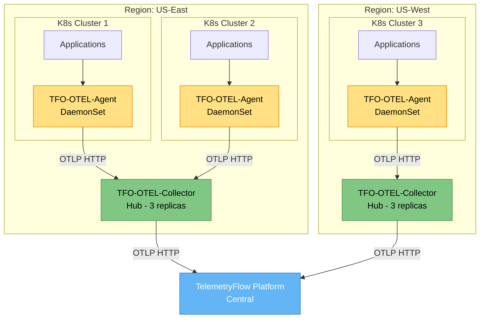
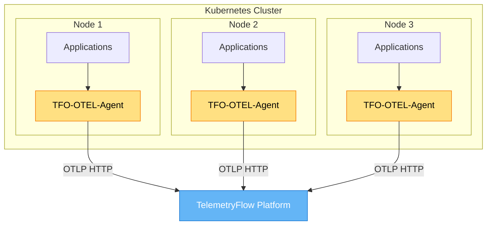
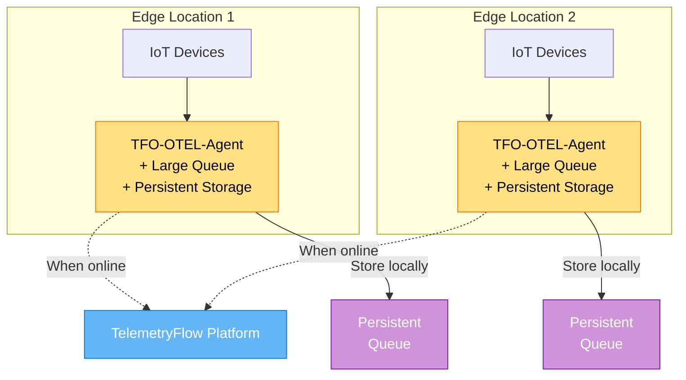
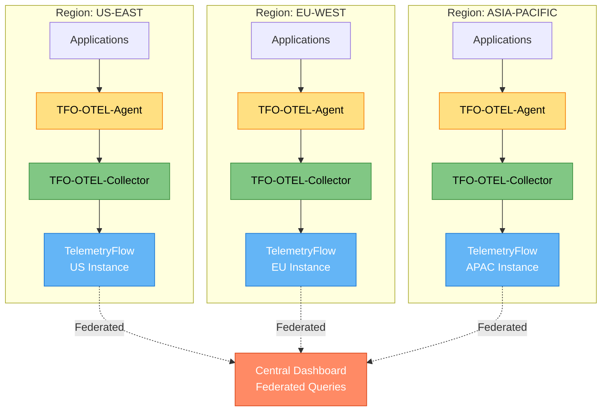
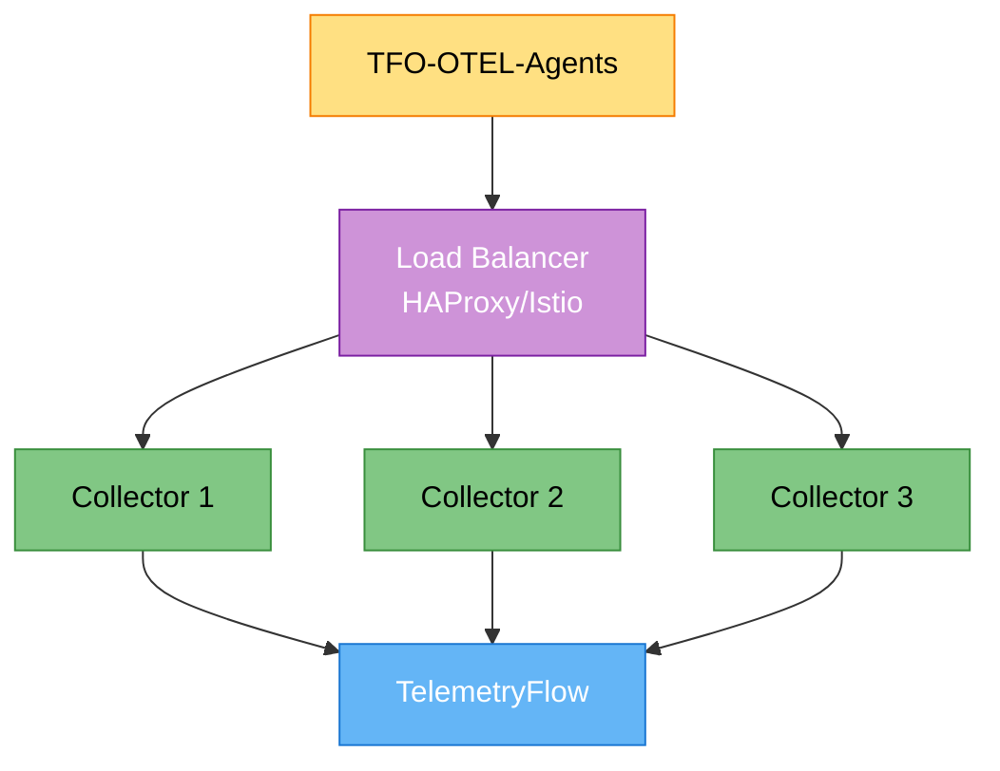

# TFO-OTEL Deployment Guide

- **Version:** 1.1.2-CE
- **Last Updated:** December 13, 2025
- **Component:** Deployment Patterns & Best Practices
- **Target:** Production-Grade Deployments

---

## Table of Contents

1. [Overview](#overview)
2. [Deployment Patterns](#deployment-patterns)
3. [Hub-and-Spoke Pattern](#hub-and-spoke-pattern)
4. [Direct-to-Platform Pattern](#direct-to-platform-pattern)
5. [Edge Buffering Pattern](#edge-buffering-pattern)
6. [Multi-Region Deployment](#multi-region-deployment)
7. [High Availability](#high-availability)
8. [Scaling Strategies](#scaling-strategies)
9. [Security](#security)
10. [Monitoring and Alerting](#monitoring-and-alerting)
11. [Production Checklist](#production-checklist)
12. [Troubleshooting](#troubleshooting)

---

## Overview

This guide provides production-grade deployment patterns for TFO-OTEL components (Agent and Collector). Choose the pattern that best fits your infrastructure, scale, and reliability requirements.

### Decision Matrix

| Pattern | Best For | Complexity | HA Support | Cost |
|---------|----------|------------|------------|------|
| **Hub-and-Spoke** | Large enterprises, multi-cluster | High | Excellent | High |
| **Direct-to-Platform** | Small/medium deployments | Low | Good | Low |
| **Edge Buffering** | IoT, intermittent connectivity | Medium | Excellent | Medium |
| **Multi-Region** | Global deployments, compliance | Very High | Excellent | Very High |

---

## Deployment Patterns

### Pattern Comparison

```mermaid
graph TB
    subgraph PATTERN1[Hub-and-Spoke]
        APPS1[Applications] --> AGENTS1[TFO-OTEL-Agents]
        AGENTS1 --> COLLECTORS1[TFO-OTEL-Collectors]
        COLLECTORS1 --> PLATFORM1[TelemetryFlow]
    end

    subgraph PATTERN2[Direct-to-Platform]
        APPS2[Applications] --> AGENTS2[TFO-OTEL-Agents]
        AGENTS2 --> PLATFORM2[TelemetryFlow]
    end

    subgraph PATTERN3[Edge Buffering]
        APPS3[Applications] --> AGENTS3[TFO-OTEL-Agents<br/>+ Persistent Queue]
        AGENTS3 -.->|When online| PLATFORM3[TelemetryFlow]
    end

    style COLLECTORS1 fill:#81C784,stroke:#388E3C,color:#000
    style AGENTS1 fill:#FFE082,stroke:#F57C00,color:#000
    style AGENTS2 fill:#FFE082,stroke:#F57C00,color:#000
    style AGENTS3 fill:#FFE082,stroke:#F57C00,color:#000
    style PLATFORM1 fill:#64B5F6,stroke:#1976D2,color:#fff
    style PLATFORM2 fill:#64B5F6,stroke:#1976D2,color:#fff
    style PLATFORM3 fill:#64B5F6,stroke:#1976D2,color:#fff
```



---

## Hub-and-Spoke Pattern

**Best For:** Large enterprises with multiple Kubernetes clusters, data centers, or cloud regions

### Architecture



### Benefits

- **Aggregation Point**: Collectors aggregate data from multiple agents
- **Traffic Reduction**: Batching and compression at aggregation layer
- **Central Processing**: Filtering, sampling, and enrichment in one place
- **Easier Upgrades**: Update collector config without touching edge agents
- **Network Efficiency**: Fewer connections to backend

### Deployment

#### 1. Deploy Agents (DaemonSet)

```yaml
apiVersion: apps/v1
kind: DaemonSet
metadata:
  name: tfo-otel-agent
  namespace: observability
spec:
  selector:
    matchLabels:
      app: tfo-otel-agent
  template:
    metadata:
      labels:
        app: tfo-otel-agent
    spec:
      containers:
      - name: otel-agent
        image: otel/opentelemetry-collector-contrib:0.142.0
        env:
        - name: TELEMETRYFLOW_ENDPOINT
          value: "http://tfo-otel-collector.observability.svc.cluster.local:4318"
        - name: TELEMETRYFLOW_WORKSPACE_ID
          valueFrom:
            secretKeyRef:
              name: telemetryflow-secrets
              key: workspace-id
        - name: TELEMETRYFLOW_TENANT_ID
          valueFrom:
            secretKeyRef:
              name: telemetryflow-secrets
              key: tenant-id
        resources:
          requests:
            memory: "128Mi"
            cpu: "100m"
          limits:
            memory: "256Mi"
            cpu: "500m"
```

#### 2. Deploy Collector (Deployment with HPA)

```yaml
apiVersion: apps/v1
kind: Deployment
metadata:
  name: tfo-otel-collector
  namespace: observability
spec:
  replicas: 3
  selector:
    matchLabels:
      app: tfo-otel-collector
  template:
    metadata:
      labels:
        app: tfo-otel-collector
    spec:
      containers:
      - name: otel-collector
        image: otel/opentelemetry-collector-contrib:0.142.0
        env:
        - name: TELEMETRYFLOW_ENDPOINT
          value: "https://api.telemetryflow.id/api"
        - name: TELEMETRYFLOW_WORKSPACE_ID
          valueFrom:
            secretKeyRef:
              name: telemetryflow-secrets
              key: workspace-id
        - name: TELEMETRYFLOW_TENANT_ID
          valueFrom:
            secretKeyRef:
              name: telemetryflow-secrets
              key: tenant-id
        resources:
          requests:
            memory: "512Mi"
            cpu: "500m"
          limits:
            memory: "2Gi"
            cpu: "2000m"

---
apiVersion: v1
kind: Service
metadata:
  name: tfo-otel-collector
  namespace: observability
spec:
  selector:
    app: tfo-otel-collector
  ports:
  - name: otlp-grpc
    port: 4317
    targetPort: 4317
  - name: otlp-http
    port: 4318
    targetPort: 4318
  type: ClusterIP

---
apiVersion: autoscaling/v2
kind: HorizontalPodAutoscaler
metadata:
  name: tfo-otel-collector-hpa
  namespace: observability
spec:
  scaleTargetRef:
    apiVersion: apps/v1
    kind: Deployment
    name: tfo-otel-collector
  minReplicas: 3
  maxReplicas: 10
  metrics:
  - type: Resource
    resource:
      name: cpu
      target:
        type: Utilization
        averageUtilization: 70
  - type: Resource
    resource:
      name: memory
      target:
        type: Utilization
        averageUtilization: 80
```

#### 3. Service Mesh Integration (Optional)

If using Istio or Linkerd:

```yaml
apiVersion: networking.istio.io/v1beta1
kind: VirtualService
metadata:
  name: tfo-otel-collector
  namespace: observability
spec:
  hosts:
  - tfo-otel-collector
  http:
  - match:
    - uri:
        prefix: /v1/
    retries:
      attempts: 3
      perTryTimeout: 10s
    timeout: 30s
    route:
    - destination:
        host: tfo-otel-collector
        port:
          number: 4318
      weight: 100
```

### Configuration Example

**Agent Config:**

```yaml
receivers:
  otlp:
    protocols:
      grpc:
        endpoint: 0.0.0.0:4317
      http:
        endpoint: 0.0.0.0:4318

processors:
  batch:
    timeout: 10s
    send_batch_size: 512

  memory_limiter:
    limit_mib: 256

exporters:
  otlphttp:
    endpoint: http://tfo-otel-collector:4318
    compression: gzip

service:
  pipelines:
    metrics:
      receivers: [otlp]
      processors: [memory_limiter, batch]
      exporters: [otlphttp]
```

**Collector Config:**

```yaml
receivers:
  otlp:
    protocols:
      grpc:
        endpoint: 0.0.0.0:4317
      http:
        endpoint: 0.0.0.0:4318

processors:
  batch:
    timeout: 10s
    send_batch_size: 2048

  memory_limiter:
    limit_mib: 2048

  attributes:
    actions:
      - key: telemetryflow.workspace.id
        value: ${env:TELEMETRYFLOW_WORKSPACE_ID}
        action: upsert
      - key: telemetryflow.tenant.id
        value: ${env:TELEMETRYFLOW_TENANT_ID}
        action: upsert

exporters:
  otlphttp/telemetryflow:
    endpoint: ${env:TELEMETRYFLOW_ENDPOINT}
    headers:
      X-Workspace-Id: "${env:TELEMETRYFLOW_WORKSPACE_ID}"
      X-Tenant-Id: "${env:TELEMETRYFLOW_TENANT_ID}"
    compression: gzip
    retry_on_failure:
      enabled: true
    sending_queue:
      enabled: true
      storage: file_storage

extensions:
  file_storage:
    directory: /var/lib/otelcol/queue

service:
  extensions: [file_storage]
  pipelines:
    metrics:
      receivers: [otlp]
      processors: [memory_limiter, attributes, batch]
      exporters: [otlphttp/telemetryflow]
```

---

## Direct-to-Platform Pattern

**Best For:** Small to medium deployments, simplified architecture

### Architecture



### Benefits

- **Simplicity**: No collector layer to manage
- **Lower Cost**: Fewer components to run
- **Lower Latency**: Direct path to backend
- **Easier Troubleshooting**: Simpler data flow

### Trade-offs

- **More Backend Connections**: One connection per agent
- **Less Flexible**: Harder to change routing or add processing
- **More Configuration**: Each agent needs full backend config

### Deployment

```yaml
apiVersion: apps/v1
kind: DaemonSet
metadata:
  name: tfo-otel-agent
  namespace: observability
spec:
  selector:
    matchLabels:
      app: tfo-otel-agent
  template:
    metadata:
      labels:
        app: tfo-otel-agent
    spec:
      containers:
      - name: otel-agent
        image: otel/opentelemetry-collector-contrib:0.142.0
        env:
        # Direct to TelemetryFlow Platform
        - name: TELEMETRYFLOW_ENDPOINT
          value: "https://api.telemetryflow.id/api"
        - name: TELEMETRYFLOW_WORKSPACE_ID
          valueFrom:
            secretKeyRef:
              name: telemetryflow-secrets
              key: workspace-id
        - name: TELEMETRYFLOW_TENANT_ID
          valueFrom:
            secretKeyRef:
              name: telemetryflow-secrets
              key: tenant-id
        - name: TELEMETRYFLOW_API_KEY
          valueFrom:
            secretKeyRef:
              name: telemetryflow-secrets
              key: api-key
        resources:
          requests:
            memory: "128Mi"
            cpu: "100m"
          limits:
            memory: "256Mi"
            cpu: "500m"
```

### Configuration

```yaml
receivers:
  otlp:
    protocols:
      grpc:
        endpoint: 0.0.0.0:4317
      http:
        endpoint: 0.0.0.0:4318

processors:
  batch:
    timeout: 10s
    send_batch_size: 512

  memory_limiter:
    limit_mib: 256

  attributes:
    actions:
      - key: telemetryflow.workspace.id
        value: ${env:TELEMETRYFLOW_WORKSPACE_ID}
        action: upsert
      - key: telemetryflow.tenant.id
        value: ${env:TELEMETRYFLOW_TENANT_ID}
        action: upsert

exporters:
  otlphttp/telemetryflow:
    endpoint: ${env:TELEMETRYFLOW_ENDPOINT}
    headers:
      X-Workspace-Id: "${env:TELEMETRYFLOW_WORKSPACE_ID}"
      X-Tenant-Id: "${env:TELEMETRYFLOW_TENANT_ID}"
      Authorization: "Bearer ${env:TELEMETRYFLOW_API_KEY}"
    compression: gzip
    retry_on_failure:
      enabled: true
      initial_interval: 5s
      max_interval: 30s
    sending_queue:
      enabled: true
      queue_size: 5000
      storage: file_storage

extensions:
  health_check:
    endpoint: 0.0.0.0:13133

  file_storage:
    directory: /var/lib/otelcol/queue

service:
  extensions: [health_check, file_storage]

  pipelines:
    metrics:
      receivers: [otlp]
      processors: [memory_limiter, attributes, batch]
      exporters: [otlphttp/telemetryflow]

    logs:
      receivers: [otlp]
      processors: [memory_limiter, attributes, batch]
      exporters: [otlphttp/telemetryflow]

    traces:
      receivers: [otlp]
      processors: [memory_limiter, attributes, batch]
      exporters: [otlphttp/telemetryflow]
```

---

## Edge Buffering Pattern

**Best For:** IoT devices, remote locations, intermittent connectivity

### Architecture



### Benefits

- **Resilient**: Data survives network outages
- **Bandwidth Optimization**: Batching and compression
- **Local Aggregation**: Pre-process data at edge
- **Guaranteed Delivery**: Retry until successful

### Deployment

```yaml
apiVersion: apps/v1
kind: Deployment
metadata:
  name: tfo-otel-agent-edge
  namespace: edge
spec:
  replicas: 1
  selector:
    matchLabels:
      app: tfo-otel-agent-edge
  template:
    metadata:
      labels:
        app: tfo-otel-agent-edge
    spec:
      containers:
      - name: otel-agent
        image: otel/opentelemetry-collector-contrib:0.142.0
        env:
        - name: TELEMETRYFLOW_ENDPOINT
          value: "https://api.telemetryflow.id/api"
        - name: TELEMETRYFLOW_WORKSPACE_ID
          valueFrom:
            secretKeyRef:
              name: telemetryflow-secrets
              key: workspace-id
        - name: TELEMETRYFLOW_TENANT_ID
          valueFrom:
            secretKeyRef:
              name: telemetryflow-secrets
              key: tenant-id
        volumeMounts:
        - name: queue-storage
          mountPath: /var/lib/otelcol/queue
        resources:
          requests:
            memory: "256Mi"
            cpu: "200m"
          limits:
            memory: "512Mi"
            cpu: "1000m"

      volumes:
      - name: queue-storage
        persistentVolumeClaim:
          claimName: otel-agent-queue-pvc

---
apiVersion: v1
kind: PersistentVolumeClaim
metadata:
  name: otel-agent-queue-pvc
  namespace: edge
spec:
  accessModes:
    - ReadWriteOnce
  resources:
    requests:
      storage: 10Gi
  storageClassName: fast-ssd
```

### Configuration

```yaml
receivers:
  otlp:
    protocols:
      grpc:
        endpoint: 0.0.0.0:4317
      http:
        endpoint: 0.0.0.0:4318

processors:
  batch:
    timeout: 30s            # Longer batching for bandwidth efficiency
    send_batch_size: 4096   # Larger batches

  memory_limiter:
    limit_mib: 512          # More memory for buffering

  attributes:
    actions:
      - key: telemetryflow.workspace.id
        value: ${env:TELEMETRYFLOW_WORKSPACE_ID}
        action: upsert
      - key: telemetryflow.tenant.id
        value: ${env:TELEMETRYFLOW_TENANT_ID}
        action: upsert
      - key: edge.location
        value: ${env:EDGE_LOCATION}
        action: upsert

exporters:
  otlphttp/telemetryflow:
    endpoint: ${env:TELEMETRYFLOW_ENDPOINT}
    headers:
      X-Workspace-Id: "${env:TELEMETRYFLOW_WORKSPACE_ID}"
      X-Tenant-Id: "${env:TELEMETRYFLOW_TENANT_ID}"
    compression: gzip
    timeout: 60s
    retry_on_failure:
      enabled: true
      initial_interval: 10s
      max_interval: 300s
      max_elapsed_time: 3600s  # Retry for 1 hour
    sending_queue:
      enabled: true
      num_consumers: 5
      queue_size: 20000          # Very large queue
      storage: file_storage

extensions:
  health_check:
    endpoint: 0.0.0.0:13133

  file_storage:
    directory: /var/lib/otelcol/queue
    timeout: 30s
    compaction:
      on_start: true
      on_rebound: true
      rebound_needed_threshold_mib: 200
      rebound_trigger_threshold_mib: 20

service:
  extensions: [health_check, file_storage]

  pipelines:
    metrics:
      receivers: [otlp]
      processors: [memory_limiter, attributes, batch]
      exporters: [otlphttp/telemetryflow]

    logs:
      receivers: [otlp]
      processors: [memory_limiter, attributes, batch]
      exporters: [otlphttp/telemetryflow]

    traces:
      receivers: [otlp]
      processors: [memory_limiter, attributes, batch]
      exporters: [otlphttp/telemetryflow]
```

---

## Multi-Region Deployment

**Best For:** Global deployments, data sovereignty, low-latency requirements

### Architecture



### Benefits

- **Low Latency**: Data stays in region
- **Data Sovereignty**: Comply with GDPR, data residency laws
- **High Availability**: Regional failures don't affect other regions
- **Scalability**: Distribute load globally

### Deployment Strategy

#### 1. Regional Collectors

```yaml
# US-EAST Collector
apiVersion: apps/v1
kind: Deployment
metadata:
  name: tfo-otel-collector-us-east
  namespace: observability
  labels:
    region: us-east
spec:
  replicas: 3
  selector:
    matchLabels:
      app: tfo-otel-collector
      region: us-east
  template:
    metadata:
      labels:
        app: tfo-otel-collector
        region: us-east
    spec:
      affinity:
        nodeAffinity:
          requiredDuringSchedulingIgnoredDuringExecution:
            nodeSelectorTerms:
            - matchExpressions:
              - key: topology.kubernetes.io/region
                operator: In
                values:
                - us-east-1
      containers:
      - name: otel-collector
        image: otel/opentelemetry-collector-contrib:0.142.0
        env:
        - name: TELEMETRYFLOW_ENDPOINT
          value: "https://us-east.telemetryflow.id/api"
        - name: REGION
          value: "us-east-1"
```

#### 2. Regional Routing

```yaml
processors:
  attributes:
    actions:
      - key: deployment.region
        value: ${env:REGION}
        action: upsert
      - key: telemetryflow.workspace.id
        value: ${env:TELEMETRYFLOW_WORKSPACE_ID}
        action: upsert
      - key: telemetryflow.tenant.id
        value: ${env:TELEMETRYFLOW_TENANT_ID}
        action: upsert

exporters:
  # Primary: Regional endpoint
  otlphttp/regional:
    endpoint: ${env:TELEMETRYFLOW_ENDPOINT}
    headers:
      X-Workspace-Id: "${env:TELEMETRYFLOW_WORKSPACE_ID}"
      X-Tenant-Id: "${env:TELEMETRYFLOW_TENANT_ID}"
      X-Region: "${env:REGION}"

  # Backup: Central endpoint (if regional fails)
  otlphttp/central:
    endpoint: "https://global.telemetryflow.id/api"
    headers:
      X-Workspace-Id: "${env:TELEMETRYFLOW_WORKSPACE_ID}"
      X-Tenant-Id: "${env:TELEMETRYFLOW_TENANT_ID}"
      X-Region: "${env:REGION}"

service:
  pipelines:
    metrics:
      receivers: [otlp]
      processors: [attributes, batch]
      exporters: [otlphttp/regional, otlphttp/central]
```

---

## High Availability

### Collector HA



### Components

#### 1. Load Balancer (HAProxy)

```haproxy
global
    maxconn 50000
    log /dev/log local0

defaults
    mode tcp
    timeout connect 5000ms
    timeout client 50000ms
    timeout server 50000ms
    option tcplog

# OTLP gRPC
frontend otlp_grpc
    bind *:4317
    default_backend otlp_grpc_backend

backend otlp_grpc_backend
    balance roundrobin
    option httpchk GET /health
    http-check expect status 200
    server collector1 collector1:4317 check inter 5s
    server collector2 collector2:4317 check inter 5s
    server collector3 collector3:4317 check inter 5s

# OTLP HTTP
frontend otlp_http
    bind *:4318
    mode http
    default_backend otlp_http_backend

backend otlp_http_backend
    mode http
    balance roundrobin
    option httpchk GET /health
    http-check expect status 200
    server collector1 collector1:4318 check inter 5s
    server collector2 collector2:4318 check inter 5s
    server collector3 collector3:4318 check inter 5s
```

#### 2. Pod Disruption Budget

```yaml
apiVersion: policy/v1
kind: PodDisruptionBudget
metadata:
  name: tfo-otel-collector-pdb
  namespace: observability
spec:
  minAvailable: 2
  selector:
    matchLabels:
      app: tfo-otel-collector
```

#### 3. Anti-Affinity

```yaml
apiVersion: apps/v1
kind: Deployment
metadata:
  name: tfo-otel-collector
spec:
  template:
    spec:
      affinity:
        podAntiAffinity:
          requiredDuringSchedulingIgnoredDuringExecution:
          - labelSelector:
              matchExpressions:
              - key: app
                operator: In
                values:
                - tfo-otel-collector
            topologyKey: kubernetes.io/hostname
```

---

## Scaling Strategies

### Horizontal Pod Autoscaler (HPA)

```yaml
apiVersion: autoscaling/v2
kind: HorizontalPodAutoscaler
metadata:
  name: tfo-otel-collector-hpa
  namespace: observability
spec:
  scaleTargetRef:
    apiVersion: apps/v1
    kind: Deployment
    name: tfo-otel-collector
  minReplicas: 3
  maxReplicas: 20
  metrics:
  # CPU-based scaling
  - type: Resource
    resource:
      name: cpu
      target:
        type: Utilization
        averageUtilization: 70

  # Memory-based scaling
  - type: Resource
    resource:
      name: memory
      target:
        type: Utilization
        averageUtilization: 80

  # Custom metric: queue size
  - type: Pods
    pods:
      metric:
        name: otelcol_exporter_queue_size
      target:
        type: AverageValue
        averageValue: "1000"

  behavior:
    scaleDown:
      stabilizationWindowSeconds: 300
      policies:
      - type: Percent
        value: 50
        periodSeconds: 60
    scaleUp:
      stabilizationWindowSeconds: 0
      policies:
      - type: Percent
        value: 100
        periodSeconds: 30
      - type: Pods
        value: 4
        periodSeconds: 30
      selectPolicy: Max
```

### Vertical Pod Autoscaler (VPA)

```yaml
apiVersion: autoscaling.k8s.io/v1
kind: VerticalPodAutoscaler
metadata:
  name: tfo-otel-collector-vpa
  namespace: observability
spec:
  targetRef:
    apiVersion: apps/v1
    kind: Deployment
    name: tfo-otel-collector
  updatePolicy:
    updateMode: "Auto"
  resourcePolicy:
    containerPolicies:
    - containerName: otel-collector
      minAllowed:
        cpu: 500m
        memory: 512Mi
      maxAllowed:
        cpu: 4000m
        memory: 8Gi
```

### Scaling Guidelines

| Metric | Scale Up Threshold | Scale Down Threshold |
|--------|-------------------|---------------------|
| **CPU** | >70% | <30% |
| **Memory** | >80% | <40% |
| **Queue Size** | >5000 | <1000 |
| **Request Rate** | >50K/sec | <10K/sec |
| **Error Rate** | >5% | N/A (investigate) |

---

## Security

### 1. Network Policies

```yaml
apiVersion: networking.k8s.io/v1
kind: NetworkPolicy
metadata:
  name: tfo-otel-agent-policy
  namespace: observability
spec:
  podSelector:
    matchLabels:
      app: tfo-otel-agent
  policyTypes:
  - Ingress
  - Egress
  ingress:
  # Allow from all pods in namespace
  - from:
    - podSelector: {}
    ports:
    - protocol: TCP
      port: 4317
    - protocol: TCP
      port: 4318
  egress:
  # Allow to collector
  - to:
    - podSelector:
        matchLabels:
          app: tfo-otel-collector
    ports:
    - protocol: TCP
      port: 4318
  # Allow to DNS
  - to:
    - namespaceSelector:
        matchLabels:
          name: kube-system
    ports:
    - protocol: UDP
      port: 53

---
apiVersion: networking.k8s.io/v1
kind: NetworkPolicy
metadata:
  name: tfo-otel-collector-policy
  namespace: observability
spec:
  podSelector:
    matchLabels:
      app: tfo-otel-collector
  policyTypes:
  - Ingress
  - Egress
  ingress:
  # Allow from agents
  - from:
    - podSelector:
        matchLabels:
          app: tfo-otel-agent
    ports:
    - protocol: TCP
      port: 4317
    - protocol: TCP
      port: 4318
  egress:
  # Allow to TelemetryFlow Platform
  - to:
    - podSelector: {}
    ports:
    - protocol: TCP
      port: 443
```

### 2. TLS/mTLS

```yaml
receivers:
  otlp:
    protocols:
      grpc:
        endpoint: 0.0.0.0:4317
        tls:
          cert_file: /etc/otel/certs/server.crt
          key_file: /etc/otel/certs/server.key
          client_ca_file: /etc/otel/certs/ca.crt
          client_auth_type: RequireAndVerifyClientCert

exporters:
  otlphttp/telemetryflow:
    endpoint: https://api.telemetryflow.id/api
    tls:
      insecure: false
      ca_file: /etc/ssl/certs/ca-certificates.crt
      cert_file: /etc/otel/certs/client.crt
      key_file: /etc/otel/certs/client.key
```

### 3. Secrets Management

```bash
# Create secret for credentials
kubectl create secret generic telemetryflow-secrets \
  --from-literal=workspace-id=550e8400-e29b-41d4-a716-446655440000 \
  --from-literal=tenant-id=660e8400-e29b-41d4-a716-446655440001 \
  --from-literal=api-key=tfk-xxx.tfs-xxx \
  -n observability

# Seal secret (using Sealed Secrets)
kubeseal --format=yaml < secret.yaml > sealed-secret.yaml
```

---

## Monitoring and Alerting

### Prometheus Alerts

```yaml
groups:
- name: tfo-otel-alerts
  interval: 30s
  rules:
  # Agent offline
  - alert: TFOAgentDown
    expr: up{job="tfo-otel-agent"} == 0
    for: 5m
    labels:
      severity: critical
    annotations:
      summary: "TFO-OTEL-Agent is down"
      description: "Agent {{ $labels.instance }} has been down for more than 5 minutes"

  # High error rate
  - alert: TFOHighErrorRate
    expr: |
      rate(otelcol_exporter_send_failed_metric_points[5m])
      / rate(otelcol_exporter_sent_metric_points[5m]) > 0.01
    for: 10m
    labels:
      severity: warning
    annotations:
      summary: "High error rate in TFO-OTEL"
      description: "Error rate is {{ $value | humanizePercentage }} on {{ $labels.instance }}"

  # Queue filling up
  - alert: TFOQueueFilling
    expr: |
      otelcol_exporter_queue_size / otelcol_exporter_queue_capacity > 0.8
    for: 15m
    labels:
      severity: warning
    annotations:
      summary: "TFO-OTEL queue filling up"
      description: "Queue is {{ $value | humanizePercentage }} full on {{ $labels.instance }}"

  # High memory usage
  - alert: TFOHighMemory
    expr: |
      container_memory_usage_bytes{pod=~"tfo-otel-.*"}
      / container_spec_memory_limit_bytes{pod=~"tfo-otel-.*"} > 0.9
    for: 5m
    labels:
      severity: warning
    annotations:
      summary: "TFO-OTEL high memory usage"
      description: "Memory usage is {{ $value | humanizePercentage }} on {{ $labels.pod }}"
```

### Grafana Dashboard

Key panels to include:

1. **Throughput**: Data points per second
2. **Error Rate**: Failed exports percentage
3. **Queue Size**: Current vs capacity
4. **Latency**: Export duration histogram
5. **Resource Usage**: CPU and memory
6. **Uptime**: Agent/collector availability

---

## Production Checklist

### Pre-Deployment

- [ ] **Configuration validated** with `otelcol validate`
- [ ] **Resource limits** set for all containers
- [ ] **Persistent storage** configured for queues
- [ ] **Secrets** stored in secret manager (not in config)
- [ ] **TLS certificates** provisioned and valid
- [ ] **Network policies** defined
- [ ] **Monitoring** configured (Prometheus, Grafana)
- [ ] **Alerting** rules created
- [ ] **Backup strategy** documented

### Deployment

- [ ] **Agents deployed** as DaemonSet/StatefulSet
- [ ] **Collectors deployed** with HA (3+ replicas)
- [ ] **Load balancer** configured (if applicable)
- [ ] **HPA/VPA** configured for auto-scaling
- [ ] **PodDisruptionBudget** set
- [ ] **Anti-affinity** rules applied
- [ ] **Health checks** passing

### Post-Deployment

- [ ] **Data flow verified** end-to-end
- [ ] **Metrics visible** in TelemetryFlow UI
- [ ] **Alerts firing** (test by stopping component)
- [ ] **Dashboards populated** with data
- [ ] **Documentation updated** with deployment details
- [ ] **Runbook created** for common issues
- [ ] **Performance baseline** established

### Ongoing

- [ ] **Monitor dashboards** daily
- [ ] **Review alerts** and tune thresholds
- [ ] **Update components** quarterly
- [ ] **Test disaster recovery** quarterly
- [ ] **Audit security** quarterly
- [ ] **Review costs** monthly

---

## Troubleshooting

### Issue 1: Agents Not Sending Data

**Symptoms:**
- Agents show as online but no data in backend
- Queue size increasing

**Diagnosis:**

```bash
# Check agent logs
kubectl logs -n observability -l app=tfo-otel-agent --tail=100

# Check metrics
kubectl port-forward -n observability svc/tfo-otel-agent-metrics 8888:8888
curl http://localhost:8888/metrics | grep exporter_sent
```

**Common Causes:**

1. **Incorrect endpoint**: Verify `TELEMETRYFLOW_ENDPOINT`
2. **Missing headers**: Check workspace/tenant IDs
3. **Network policy blocking**: Review NetworkPolicy rules
4. **Certificate issues**: Verify TLS configuration

**Fix:**

```bash
# Test connectivity
kubectl exec -n observability tfo-otel-agent-xxx -- \
  curl -v https://api.telemetryflow.id/api/health

# Verify environment variables
kubectl exec -n observability tfo-otel-agent-xxx -- env | grep TELEMETRYFLOW
```

### Issue 2: Collector Pods OOMKilled

**Symptoms:**
- Collector pods restarting with OOMKilled
- High memory usage before restart

**Diagnosis:**

```bash
# Check memory usage
kubectl top pods -n observability -l app=tfo-otel-collector

# Review pod events
kubectl describe pod -n observability tfo-otel-collector-xxx
```

**Fix:**

1. **Increase memory limit**:
```yaml
resources:
  limits:
    memory: "4Gi"  # Increase from 2Gi
```

2. **Lower memory_limiter**:
```yaml
processors:
  memory_limiter:
    limit_mib: 3200  # 80% of 4Gi
```

3. **Reduce batch size**:
```yaml
processors:
  batch:
    send_batch_size: 512  # Reduce from 1024
```

### Issue 3: High Latency

**Symptoms:**
- Slow data arrival in backend
- High export duration

**Diagnosis:**

```bash
# Check metrics
curl http://localhost:8888/metrics | grep duration
```

**Fix:**

1. **Reduce batch timeout**:
```yaml
processors:
  batch:
    timeout: 5s  # Reduce from 10s
```

2. **Add more exporters**:
```yaml
exporters:
  otlphttp:
    sending_queue:
      num_consumers: 20  # Increase from 10
```

3. **Scale up collectors**:
```bash
kubectl scale deployment -n observability tfo-otel-collector --replicas=5
```

---

**Version:** 1.1.2-CE | **Component:** Deployment Guide | **Last Updated:** December 13, 2025
