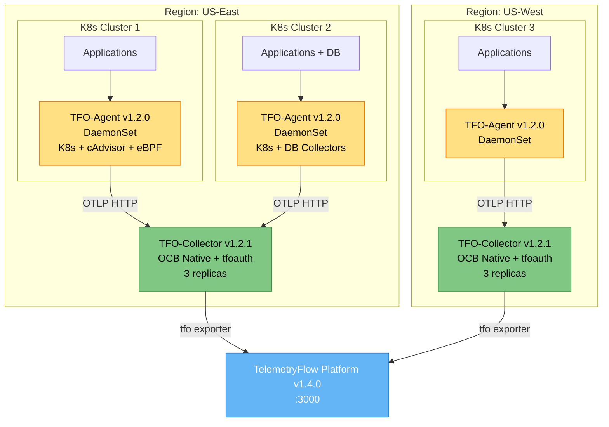
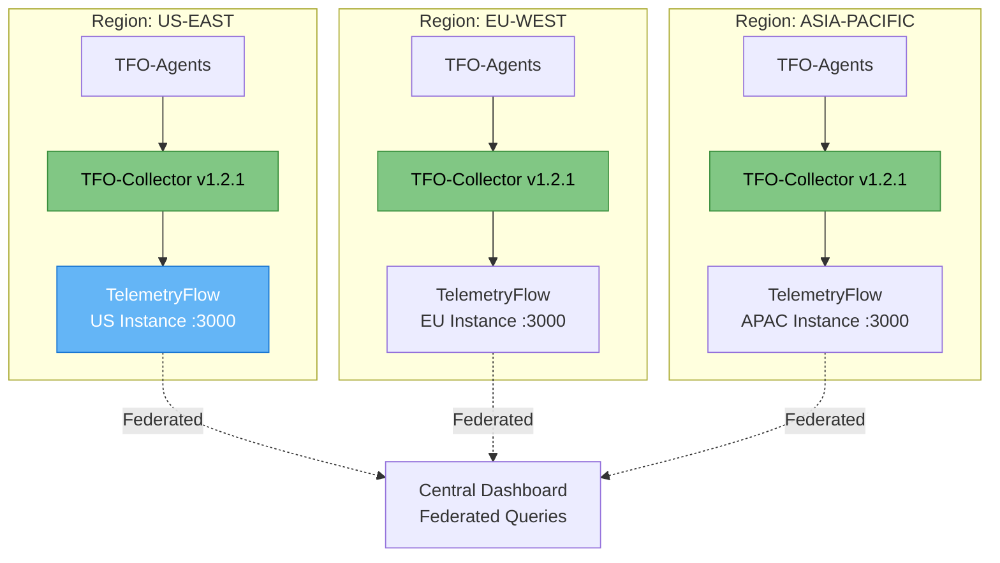
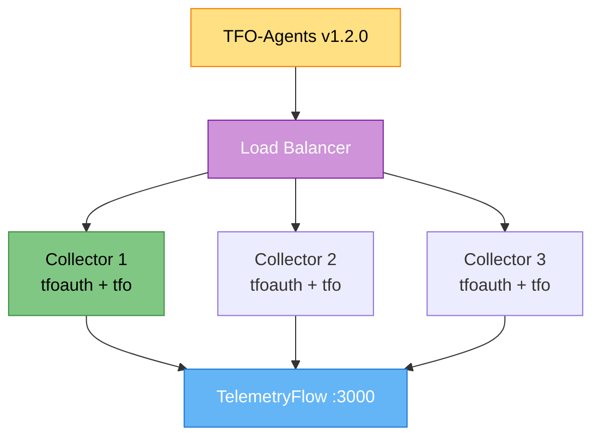

# TFO-OTEL Deployment Guide

- **Version:** 1.4.0
- **Last Updated:** May 2026
- **Component:** Deployment Patterns & Best Practices
- **Target:** Production-Grade Deployments

---

## Table of Contents

1. [Overview](#overview)
2. [Deployment Patterns](#deployment-patterns)
3. [Hub-and-Spoke Pattern](#hub-and-spoke-pattern)
4. [Direct-to-Platform Pattern](#direct-to-platform-pattern)
5. [Edge Buffering Pattern](#edge-buffering-pattern)
6. [Multi-Region Deployment](#multi-region-deployment)
7. [High Availability](#high-availability)
8. [Scaling Strategies](#scaling-strategies)
9. [Security](#security)
10. [Monitoring and Alerting](#monitoring-and-alerting)
11. [Production Checklist](#production-checklist)
12. [Troubleshooting](#troubleshooting)

---

## Overview

This guide provides production-grade deployment patterns for TFO-OTEL components (Agent v1.2.0 and Collector v1.2.1). Choose the pattern that best fits your infrastructure, scale, and reliability requirements.

### Decision Matrix

| Pattern                | Best For                         | Complexity | HA Support | Cost      |
| ---------------------- | -------------------------------- | ---------- | ---------- | --------- |
| **Hub-and-Spoke**      | Large enterprises, multi-cluster | High       | Excellent  | High      |
| **Direct-to-Platform** | Small/medium deployments         | Low        | Good       | Low       |
| **Edge Buffering**     | IoT, intermittent connectivity   | Medium     | Excellent  | Medium    |
| **Multi-Region**       | Global deployments, compliance   | Very High  | Excellent  | Very High |

---

## Deployment Patterns

### Pattern Comparison


```mermaid
graph TB
    subgraph PATTERN1[Hub-and-Spoke]
        APPS1[Applications + DB + K8s] --> AGENTS1[TFO-Agents v1.2.0]
        AGENTS1 --> COLLECTORS1[TFO-Collector v1.2.1<br/>tfoauth + tfo]
        COLLECTORS1 --> PLATFORM1[TelemetryFlow]
    end

    subgraph PATTERN2[Direct-to-Platform]
        APPS2[Applications + DB + K8s] --> AGENTS2[TFO-Agents v1.2.0]
        AGENTS2 --> PLATFORM2[TelemetryFlow]
    end

    subgraph PATTERN3[Edge Buffering]
        APPS3[Applications] --> AGENTS3[TFO-Agents v1.2.0<br/>+ Disk Buffer]
        AGENTS3 -.->|When online| PLATFORM3[TelemetryFlow]
    end

    style COLLECTORS1 fill:#81C784,stroke:#388E3C,color:#000
    style AGENTS1 fill:#FFE082,stroke:#F57C00,color:#000
    style PLATFORM1 fill:#64B5F6,stroke:#1976D2,color:#fff
```

---

## Hub-and-Spoke Pattern

**Best For:** Large enterprises with multiple Kubernetes clusters, data centers, or cloud regions

### Architecture


```mermaid
graph TB
    subgraph REGION1[Region: US-East]
        subgraph CLUSTER1[K8s Cluster 1]
            APPS1[Applications] --> AGENT1[TFO-Agent v1.2.0<br/>DaemonSet<br/>K8s + cAdvisor + eBPF]
        end

        subgraph CLUSTER2[K8s Cluster 2]
            APPS2[Applications + DB] --> AGENT2[TFO-Agent v1.2.0<br/>DaemonSet<br/>K8s + DB Collectors]
        end

        COLLECTOR1[TFO-Collector v1.2.1<br/>OCB Native + tfoauth<br/>3 replicas]
    end

    subgraph REGION2[Region: US-West]
        subgraph CLUSTER3[K8s Cluster 3]
            APPS3[Applications] --> AGENT3[TFO-Agent v1.2.0<br/>DaemonSet]
        end

        COLLECTOR2[TFO-Collector v1.2.1<br/>OCB Native + tfoauth<br/>3 replicas]
    end

    PLATFORM[TelemetryFlow Platform v1.4.0<br/>:3000]

    AGENT1 -->|OTLP HTTP| COLLECTOR1
    AGENT2 -->|OTLP HTTP| COLLECTOR1
    AGENT3 -->|OTLP HTTP| COLLECTOR2

    COLLECTOR1 -->|tfo exporter| PLATFORM
    COLLECTOR2 -->|tfo exporter| PLATFORM

    style AGENT1 fill:#FFE082,stroke:#F57C00,color:#000
    style AGENT2 fill:#FFE082,stroke:#F57C00,color:#000
    style AGENT3 fill:#FFE082,stroke:#F57C00,color:#000
    style COLLECTOR1 fill:#81C784,stroke:#388E3C,color:#000
    style COLLECTOR2 fill:#81C784,stroke:#388E3C,color:#000
    style PLATFORM fill:#64B5F6,stroke:#1976D2,color:#fff
```

### Deployment

#### 1. Deploy Agents (DaemonSet)

```yaml
apiVersion: apps/v1
kind: DaemonSet
metadata:
  name: tfo-agent
  namespace: observability
spec:
  selector:
    matchLabels:
      app: tfo-agent
  template:
    metadata:
      labels:
        app: tfo-agent
        version: "1.2.0"
    spec:
      serviceAccountName: tfo-agent
      hostNetwork: true
      dnsPolicy: ClusterFirstWithHostNet
      containers:
        - name: tfo-agent
          image: telemetryflow/telemetryflow-agent:1.2.0
          imagePullPolicy: IfNotPresent
          args:
            - start
            - --config=/etc/tfo-agent/tfo-agent.yaml
          env:
            - name: HOSTNAME
              valueFrom:
                fieldRef:
                  fieldPath: spec.nodeName
            - name: K8S_NODE_NAME
              valueFrom:
                fieldRef:
                  fieldPath: spec.nodeName
            - name: TELEMETRYFLOW_API_ENDPOINT
              value: "https://api.telemetryflow.id"
            - name: TELEMETRYFLOW_API_KEY_ID
              valueFrom:
                secretKeyRef:
                  name: telemetryflow-secrets
                  key: api-key-id
            - name: TELEMETRYFLOW_API_KEY_SECRET
              valueFrom:
                secretKeyRef:
                  name: telemetryflow-secrets
                  key: api-key-secret
          ports:
            - { containerPort: 4317, hostPort: 4317, name: otlp-grpc }
            - { containerPort: 4318, hostPort: 4318, name: otlp-http }
            - { containerPort: 13133, name: health }
          resources:
            requests: { memory: "128Mi", cpu: "100m" }
            limits: { memory: "256Mi", cpu: "500m" }
          volumeMounts:
            - { name: config, mountPath: /etc/tfo-agent }
            - { name: buffer-storage, mountPath: /var/lib/tfo-agent }
      volumes:
        - name: config
          configMap:
            name: tfo-agent-config
        - name: buffer-storage
          hostPath:
            path: /var/lib/tfo-agent
            type: DirectoryOrCreate
```

#### 2. Deploy Collector (Deployment with HPA)

```yaml
apiVersion: apps/v1
kind: Deployment
metadata:
  name: tfo-collector
  namespace: observability
spec:
  replicas: 3
  selector:
    matchLabels:
      app: tfo-collector
  template:
    metadata:
      labels:
        app: tfo-collector
        version: "1.2.1"
    spec:
      serviceAccountName: tfo-collector
      containers:
        - name: tfo-collector
          image: telemetryflow/telemetryflow-collector:1.2.1
          imagePullPolicy: IfNotPresent
          args:
            - --config=/etc/tfo-collector/otel-collector.yaml
          env:
            - name: TELEMETRYFLOW_API_KEY_ID
              valueFrom:
                secretKeyRef:
                  name: telemetryflow-secrets
                  key: api-key-id
            - name: TELEMETRYFLOW_API_KEY_SECRET
              valueFrom:
                secretKeyRef:
                  name: telemetryflow-secrets
                  key: api-key-secret
          ports:
            - { containerPort: 4317, name: otlp-grpc }
            - { containerPort: 4318, name: otlp-http }
            - { containerPort: 8888, name: metrics }
            - { containerPort: 8889, name: prometheus }
            - { containerPort: 13133, name: health }
          resources:
            requests: { memory: "512Mi", cpu: "500m" }
            limits: { memory: "2Gi", cpu: "2000m" }
          volumeMounts:
            - { name: config, mountPath: /etc/tfo-collector }
      volumes:
        - name: config
          configMap:
            name: tfo-collector-config

---
apiVersion: v1
kind: Service
metadata:
  name: tfo-collector
  namespace: observability
spec:
  selector:
    app: tfo-collector
  ports:
    - { port: 4317, targetPort: 4317, name: otlp-grpc }
    - { port: 4318, targetPort: 4318, name: otlp-http }
    - { port: 8888, targetPort: 8888, name: metrics }
    - { port: 8889, targetPort: 8889, name: prometheus }
    - { port: 13133, targetPort: 13133, name: health }
  type: ClusterIP

---
apiVersion: autoscaling/v2
kind: HorizontalPodAutoscaler
metadata:
  name: tfo-collector-hpa
  namespace: observability
spec:
  scaleTargetRef:
    apiVersion: apps/v1
    kind: Deployment
    name: tfo-collector
  minReplicas: 3
  maxReplicas: 10
  metrics:
    - type: Resource
      resource:
        name: cpu
        target:
          type: Utilization
          averageUtilization: 70
    - type: Resource
      resource:
        name: memory
        target:
          type: Utilization
          averageUtilization: 80
```

### Collector Configuration

```yaml
# tfo-collector-config ConfigMap
receivers:
  tfootlp:
    protocols:
      http:
        endpoint: "0.0.0.0:4318"
      grpc:
        endpoint: "0.0.0.0:4317"

processors:
  k8sattributes:
    auth_type: "serviceAccount"
    passthrough: false
    extract:
      metadata:
        - k8s.pod.name
        - k8s.namespace.name
        - k8s.node.name

  transform:
    error_mode: ignore
    metric_statements:
      - context: metric
        statements:
          - set(description, "") where name == ""

  batch:
    send_batch_size: 8192
    timeout: 200ms

exporters:
  tfo:
    endpoint: "https://api.telemetryflow.id/api"
    auth:
      authenticator: tfoauth
    compression: gzip
    retry_on_failure:
      enabled: true
      initial_interval: 5s
      max_interval: 30s
    sending_queue:
      enabled: true
      num_consumers: 10
      queue_size: 5000

  prometheus:
    endpoint: "0.0.0.0:8889"

connectors:
  spanmetrics:
    histogram:
      explicit:
        buckets: [2ms, 6ms, 10ms, 50ms, 100ms, 250ms, 500ms, 1s, 5s, 10s]
    dimensions:
      - name: http.method
      - name: http.status_code
    aggregation_temporality: "AGGREGATION_TEMPORALITY_CUMULATIVE"
    metrics_flush_interval: 15s

  servicegraph:
    latency_histogram_buckets: [100ms, 250ms, 500ms, 1s, 5s, 10s]

extensions:
  tfoauth:
    api_key_id: "${env:TELEMETRYFLOW_API_KEY_ID}"
    api_key_secret: "${env:TELEMETRYFLOW_API_KEY_SECRET}"

  tfoidentity:
    collector_id: "tfo-collector-hub"
    labels:
      environment: "production"

  health_check:
    endpoint: "0.0.0.0:13133"

service:
  extensions: [tfoauth, tfoidentity, health_check]
  pipelines:
    traces:
      receivers: [tfootlp]
      processors: [k8sattributes, batch]
      exporters: [tfo, spanmetrics, servicegraph]
    metrics:
      receivers: [tfootlp]
      processors: [k8sattributes, transform, batch]
      exporters: [tfo, prometheus]
    logs:
      receivers: [tfootlp]
      processors: [k8sattributes, batch]
      exporters: [tfo]
```

---

## Direct-to-Platform Pattern

**Best For:** Small to medium deployments, simplified architecture

```yaml
# Agent sends directly to TelemetryFlow Platform
apiVersion: apps/v1
kind: DaemonSet
metadata:
  name: tfo-agent
  namespace: observability
spec:
  selector:
    matchLabels:
      app: tfo-agent
  template:
    spec:
      containers:
        - name: tfo-agent
          image: telemetryflow/telemetryflow-agent:1.2.0
          env:
            - name: TELEMETRYFLOW_API_ENDPOINT
              value: "https://api.telemetryflow.id/api"
            - name: TELEMETRYFLOW_API_KEY_ID
              valueFrom:
                secretKeyRef:
                  name: telemetryflow-secrets
                  key: api-key-id
            - name: TELEMETRYFLOW_API_KEY_SECRET
              valueFrom:
                secretKeyRef:
                  name: telemetryflow-secrets
                  key: api-key-secret
```

---

## Edge Buffering Pattern

**Best For:** IoT devices, remote locations, intermittent connectivity

```yaml
apiVersion: apps/v1
kind: Deployment
metadata:
  name: tfo-agent-edge
  namespace: edge
spec:
  replicas: 1
  selector:
    matchLabels:
      app: tfo-agent-edge
  template:
    spec:
      containers:
        - name: tfo-agent
          image: telemetryflow/telemetryflow-agent:1.2.0
          env:
            - name: TELEMETRYFLOW_API_ENDPOINT
              value: "https://api.telemetryflow.id/api"
          volumeMounts:
            - name: queue-storage
              mountPath: /var/lib/tfo-agent/buffer
      volumes:
        - name: queue-storage
          persistentVolumeClaim:
            claimName: tfo-agent-queue-pvc

---
apiVersion: v1
kind: PersistentVolumeClaim
metadata:
  name: tfo-agent-queue-pvc
  namespace: edge
spec:
  accessModes: [ReadWriteOnce]
  resources:
    requests:
      storage: 10Gi
  storageClassName: fast-ssd
```

Edge agent configuration with large buffer:

```yaml
buffer:
  enabled: true
  path: "/var/lib/tfo-agent/buffer"
  max_size_mb: 500

exporter:
  otlp:
    enabled: true
    endpoint: "https://api.telemetryflow.id/api"
    retry:
      enabled: true
      initial_interval: 10s
      max_interval: 300s
      max_elapsed_time: 3600s
```

---

## Multi-Region Deployment


```mermaid
graph TB
    subgraph REGION1[Region: US-EAST]
        AGENT1[TFO-Agents] --> COLLECTOR1[TFO-Collector v1.2.1]
        COLLECTOR1 --> PLATFORM1[TelemetryFlow<br/>US Instance :3000]
    end

    subgraph REGION2[Region: EU-WEST]
        AGENT2[TFO-Agents] --> COLLECTOR2[TFO-Collector v1.2.1]
        COLLECTOR2 --> PLATFORM2[TelemetryFlow<br/>EU Instance :3000]
    end

    subgraph REGION3[Region: ASIA-PACIFIC]
        AGENT3[TFO-Agents] --> COLLECTOR3[TFO-Collector v1.2.1]
        COLLECTOR3 --> PLATFORM3[TelemetryFlow<br/>APAC Instance :3000]
    end

    CENTRAL[Central Dashboard<br/>Federated Queries]
    PLATFORM1 -.->|Federated| CENTRAL
    PLATFORM2 -.->|Federated| CENTRAL
    PLATFORM3 -.->|Federated| CENTRAL

    style COLLECTOR1 fill:#81C784,stroke:#388E3C,color:#000
    style COLLECTOR2 fill:#81C784,stroke:#388E3C,color:#000
    style COLLECTOR3 fill:#81C784,stroke:#388E3C,color:#000
    style PLATFORM1 fill:#64B5F6,stroke:#1976D2,color:#fff
```

---

## High Availability

### Collector HA


```mermaid
graph TB
    AGENTS[TFO-Agents v1.2.0] --> LB[Load Balancer]

    LB --> COLLECTOR1[Collector 1<br/>tfoauth + tfo]
    LB --> COLLECTOR2[Collector 2<br/>tfoauth + tfo]
    LB --> COLLECTOR3[Collector 3<br/>tfoauth + tfo]

    COLLECTOR1 --> PLATFORM[TelemetryFlow :3000]
    COLLECTOR2 --> PLATFORM
    COLLECTOR3 --> PLATFORM

    style AGENTS fill:#FFE082,stroke:#F57C00,color:#000
    style LB fill:#CE93D8,stroke:#7B1FA2,color:#fff
    style COLLECTOR1 fill:#81C784,stroke:#388E3C,color:#000
    style PLATFORM fill:#64B5F6,stroke:#1976D2,color:#fff
```

### Pod Disruption Budget

```yaml
apiVersion: policy/v1
kind: PodDisruptionBudget
metadata:
  name: tfo-collector-pdb
  namespace: observability
spec:
  minAvailable: 2
  selector:
    matchLabels:
      app: tfo-collector
```

---

## Scaling Strategies

### HPA

```yaml
apiVersion: autoscaling/v2
kind: HorizontalPodAutoscaler
metadata:
  name: tfo-collector-hpa
  namespace: observability
spec:
  scaleTargetRef:
    apiVersion: apps/v1
    kind: Deployment
    name: tfo-collector
  minReplicas: 3
  maxReplicas: 20
  metrics:
    - type: Resource
      resource:
        name: cpu
        target:
          type: Utilization
          averageUtilization: 70
    - type: Pods
      pods:
        metric:
          name: otelcol_exporter_queue_size
        target:
          type: AverageValue
          averageValue: "1000"
  behavior:
    scaleDown:
      stabilizationWindowSeconds: 300
    scaleUp:
      stabilizationWindowSeconds: 0
      policies:
        - type: Percent
          value: 100
          periodSeconds: 30
      selectPolicy: Max
```

### Scaling Guidelines

| Metric         | Scale Up | Scale Down  |
| -------------- | -------- | ----------- |
| **CPU**        | >70%     | <30%        |
| **Memory**     | >80%     | <40%        |
| **Queue Size** | >5000    | <1000       |
| **Error Rate** | >5%      | Investigate |

---

## Security

### Network Policies

```yaml
apiVersion: networking.k8s.io/v1
kind: NetworkPolicy
metadata:
  name: tfo-collector-policy
  namespace: observability
spec:
  podSelector:
    matchLabels:
      app: tfo-collector
  policyTypes: [Ingress, Egress]
  ingress:
    - from:
        - podSelector:
            matchLabels:
              app: tfo-agent
      ports:
        - { port: 4317, protocol: TCP }
        - { port: 4318, protocol: TCP }
  egress:
    - to: []
      ports:
        - { port: 443, protocol: TCP }
```

### Secrets Management

```bash
kubectl create secret generic telemetryflow-secrets \
  --from-literal=api-key-id=tfk-live-abc123 \
  --from-literal=api-key-secret=tfs-secret-xyz789 \
  -n observability
```

### TLS/mTLS

```yaml
receivers:
  tfootlp:
    protocols:
      grpc:
        endpoint: 0.0.0.0:4317
        tls:
          cert_file: /etc/otel/certs/server.crt
          key_file: /etc/otel/certs/server.key
```

---

## Monitoring and Alerting

### Prometheus Alerts

```yaml
groups:
  - name: tfo-otel-alerts
    interval: 30s
    rules:
      - alert: TFOAgentDown
        expr: up{job="tfo-agent"} == 0
        for: 5m
        labels:
          severity: critical
        annotations:
          summary: "TFO-Agent is down"

      - alert: TFOHighErrorRate
        expr: |
          rate(otelcol_exporter_send_failed_metric_points[5m])
          / rate(otelcol_exporter_sent_metric_points[5m]) > 0.01
        for: 10m
        labels:
          severity: warning
        annotations:
          summary: "High error rate in TFO-OTEL"

      - alert: TFOQueueFilling
        expr: |
          otelcol_exporter_queue_size / otelcol_exporter_queue_capacity > 0.8
        for: 15m
        labels:
          severity: warning
        annotations:
          summary: "TFO-OTEL queue filling up"
```

---

## Production Checklist

### Pre-Deployment

- [ ] Configuration validated with `tfo-collector validate`
- [ ] Resource limits set for all containers
- [ ] tfoauth configured with API keys (tfk-_/tfs-_)
- [ ] tfoidentity configured with collector labels
- [ ] Secrets stored in secret manager (not in config)
- [ ] TLS certificates provisioned and valid
- [ ] Network policies defined
- [ ] Monitoring configured (Prometheus, Grafana)
- [ ] Alerting rules created

### Deployment

- [ ] Agents deployed as DaemonSet with relevant collectors
- [ ] Collectors deployed with HA (3+ replicas)
- [ ] Load balancer configured (if applicable)
- [ ] HPA configured for auto-scaling
- [ ] PodDisruptionBudget set
- [ ] Anti-affinity rules applied
- [ ] Health checks passing

### Post-Deployment

- [ ] Data flow verified end-to-end
- [ ] Dual v1/v2 endpoints tested
- [ ] Metrics visible in TelemetryFlow UI
- [ ] spanmetrics + servicegraph connectors working
- [ ] Performance baseline established

---

## Troubleshooting

### Agents Not Sending Data

```bash
kubectl logs -n observability -l app=tfo-agent --tail=100
kubectl exec -n observability tfo-agent-xxx -- env | grep TELEMETRYFLOW
```

### Collector OOMKilled

```bash
kubectl top pods -n observability -l app=tfo-collector
```

Fix: Increase memory limit and configure `memory_limiter`.

### tfoauth Authentication Errors

```bash
echo $TELEMETRYFLOW_API_KEY_ID
echo $TELEMETRYFLOW_API_KEY_SECRET
# Verify: tfk-* for key ID, tfs-* for secret
```

### High Latency

```bash
curl http://localhost:8888/metrics | grep duration
```

Fix: Reduce batch timeout, increase workers, or scale up collectors.

---

**Version:** 1.4.0 | **Component:** Deployment Guide | **Last Updated:** May 2026
