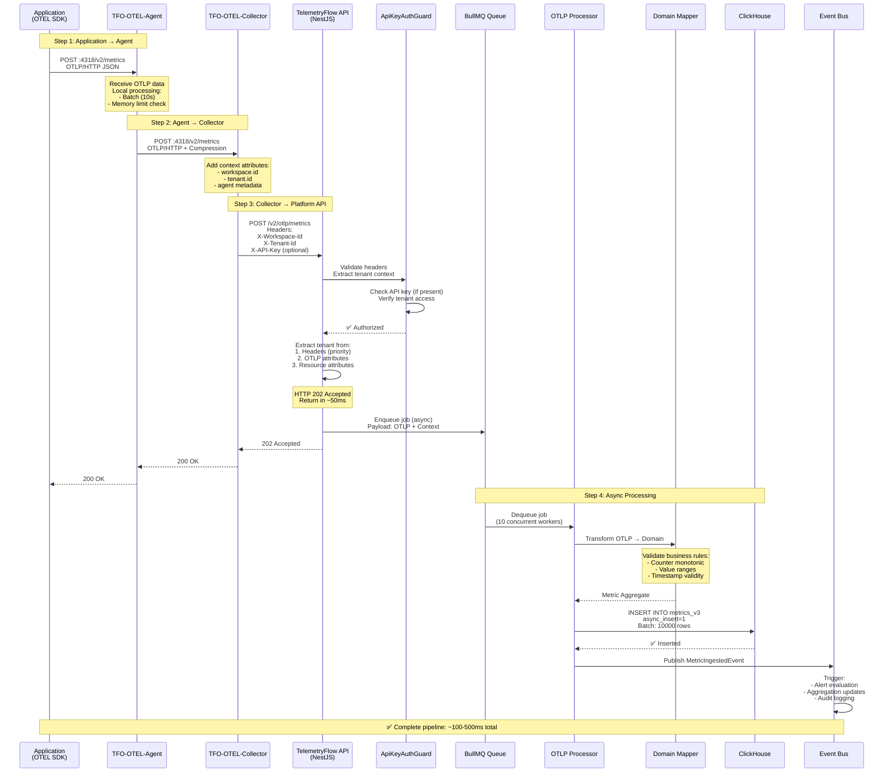
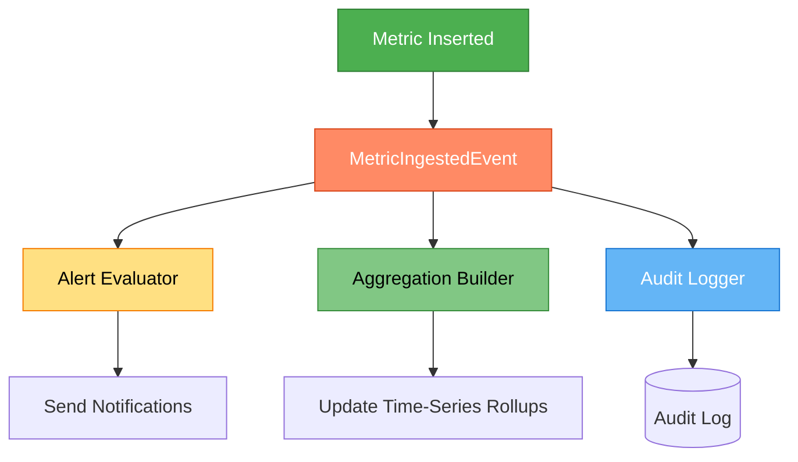
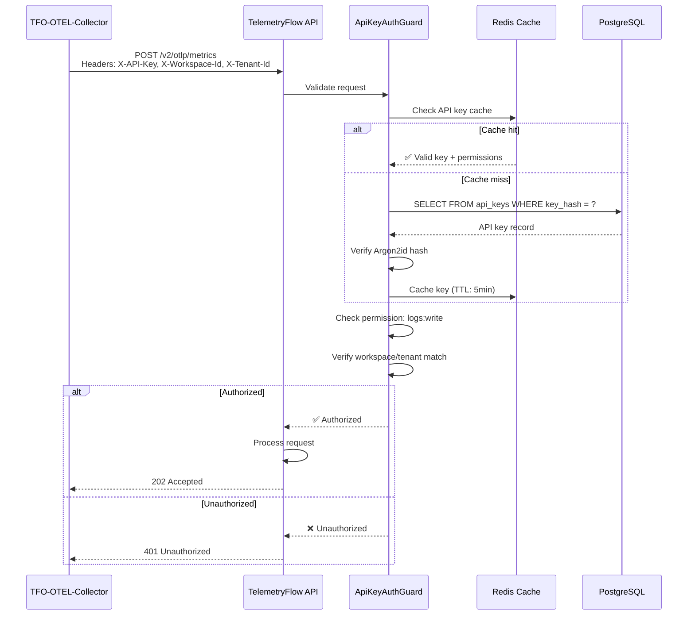

# TFO-OTEL to TelemetryFlow Platform - Ingestion Flow

- **Version:** 1.0.0-CE
- **Last Updated:** December 13, 2025
- **Component:** Complete Ingestion Pipeline
- **Protocol:** OTLP/gRPC (4317), OTLP/HTTP (4318)

---

## Table of Contents

1. [Overview](#overview)
2. [Complete Data Flow](#complete-data-flow)
3. [Agent to Collector Flow](#agent-to-collector-flow)
4. [Collector to Platform Flow](#collector-to-platform-flow)
5. [Platform Backend Processing](#platform-backend-processing)
6. [Headers and Authentication](#headers-and-authentication)
7. [Endpoint Reference](#endpoint-reference)
8. [Configuration Examples](#configuration-examples)
9. [Troubleshooting Ingestion](#troubleshooting-ingestion)

---

## Overview

This document explains the complete ingestion pipeline from **TFO-OTEL-Agent** → **TFO-OTEL-Collector** → **TelemetryFlow Platform Backend**.

### Pipeline Summary

```mermaid
graph LR
    APP[Application<br/>OTEL SDK] -->|1. OTLP| AGENT[TFO-OTEL-Agent<br/>:4317/:4318]
    AGENT -->|2. OTLP HTTP<br/>+ Tenant Context| COLLECTOR[TFO-OTEL-Collector<br/>:4317/:4318]
    COLLECTOR -->|3. OTLP HTTP<br/>+ Headers| API[TelemetryFlow API<br/>:4318]
    API -->|4. Process| QUEUE[BullMQ Queue]
    QUEUE -->|5. Workers| CH[(ClickHouse)]

    style APP fill:#4CAF50,stroke:#2E7D32,color:#fff
    style AGENT fill:#FFE082,stroke:#F57C00,color:#000
    style COLLECTOR fill:#81C784,stroke:#388E3C,color:#000
    style API fill:#64B5F6,stroke:#1976D2,color:#fff
    style QUEUE fill:#FF8A65,stroke:#D84315,color:#fff
    style CH fill:#CE93D8,stroke:#7B1FA2,color:#fff
```



**Key Points:**
- **Step 1-2**: Agent receives OTLP data and forwards to Collector
- **Step 3**: Collector adds workspace/tenant context and sends to Platform
- **Step 4-5**: Platform processes asynchronously and stores in ClickHouse

---

## Complete Data Flow

### End-to-End Sequence



### Latency Breakdown

| Stage | Latency | Notes |
|-------|---------|-------|
| App → Agent | 1-5ms | Local network |
| Agent batching | 0-10s | Configurable timeout |
| Agent → Collector | 5-20ms | Same cluster/region |
| Collector processing | 10-50ms | Attribute injection, batching |
| Collector → API | 20-100ms | Network + API response |
| **API Response** | **~50ms** | **202 Accepted returned here** |
| Queue processing | 100-500ms | Async, background |
| ClickHouse insert | 50-200ms | Batch insert |
| **Total (end-to-end)** | **200-1000ms** | **From app to database** |

---

## Agent to Collector Flow

### Agent Configuration

The Agent forwards all received OTLP data to the Collector:

```yaml
# Agent: /etc/otel-agent/config.yaml

receivers:
  otlp:
    protocols:
      grpc:
        endpoint: 0.0.0.0:4317
      http:
        endpoint: 0.0.0.0:4318

processors:
  batch:
    timeout: 10s
    send_batch_size: 512

  memory_limiter:
    limit_mib: 256

exporters:
  # Forward to Collector
  otlphttp:
    endpoint: http://tfo-otel-collector:4318
    compression: gzip
    timeout: 30s

service:
  pipelines:
    metrics:
      receivers: [otlp]
      processors: [memory_limiter, batch]
      exporters: [otlphttp]
```

### Agent → Collector Communication

**Protocol:** OTLP/HTTP (recommended over gRPC for load balancing)

**Endpoint:** `http://tfo-otel-collector:4318/v2/metrics`

**Request:**

```http
POST /v2/metrics HTTP/1.1
Host: tfo-otel-collector:4318
Content-Type: application/x-protobuf
Content-Encoding: gzip
Content-Length: 1234

[Binary Protobuf payload - OTLP ExportMetricsServiceRequest]
```

**Response:**

```http
HTTP/1.1 200 OK
Content-Type: application/x-protobuf

[Binary Protobuf response - ExportMetricsServiceResponse]
```

### What the Agent Does

1. **Receives OTLP data** from applications (gRPC/HTTP)
2. **Batches data** for efficiency (configurable timeout/size)
3. **Checks memory limits** to prevent OOM
4. **Compresses payload** (gzip) to reduce bandwidth
5. **Forwards to Collector** via OTLP/HTTP
6. **Retries on failure** with exponential backoff
7. **Persists to disk** if collector is unavailable (optional)

---

## Collector to Platform Flow

### Collector Configuration

The Collector adds workspace/tenant context and forwards to TelemetryFlow Platform:

```yaml
# Collector: /etc/otel-collector/config.yaml

receivers:
  otlp:
    protocols:
      grpc:
        endpoint: 0.0.0.0:4317
      http:
        endpoint: 0.0.0.0:4318

processors:
  batch:
    timeout: 10s
    send_batch_size: 1024

  memory_limiter:
    limit_mib: 2048

  # CRITICAL: Add tenant context
  attributes:
    actions:
      - key: telemetryflow.workspace.id
        value: ${env:TELEMETRYFLOW_WORKSPACE_ID}
        action: upsert
      - key: telemetryflow.tenant.id
        value: ${env:TELEMETRYFLOW_TENANT_ID}
        action: upsert
      - key: collector.version
        value: "1.0.0-CE"
        action: upsert

exporters:
  # Forward to TelemetryFlow Platform
  otlphttp/telemetryflow:
    endpoint: https://api.telemetryflow.id/api

    # CRITICAL: Required headers for multi-tenancy
    headers:
      X-Workspace-Id: "${env:TELEMETRYFLOW_WORKSPACE_ID}"
      X-Tenant-Id: "${env:TELEMETRYFLOW_TENANT_ID}"
      # Optional: API key authentication
      X-API-Key: "${env:TELEMETRYFLOW_API_KEY}"

    compression: gzip
    timeout: 30s

    retry_on_failure:
      enabled: true
      initial_interval: 5s
      max_interval: 30s
      max_elapsed_time: 300s

    sending_queue:
      enabled: true
      num_consumers: 10
      queue_size: 5000
      storage: file_storage

extensions:
  file_storage:
    directory: /var/lib/otelcol/queue

service:
  extensions: [file_storage]

  pipelines:
    metrics:
      receivers: [otlp]
      processors: [memory_limiter, attributes, batch]
      exporters: [otlphttp/telemetryflow]

    logs:
      receivers: [otlp]
      processors: [memory_limiter, attributes, batch]
      exporters: [otlphttp/telemetryflow]

    traces:
      receivers: [otlp]
      processors: [memory_limiter, attributes, batch]
      exporters: [otlphttp/telemetryflow]
```

### Collector → Platform Communication

**Protocol:** OTLP/HTTP

**Endpoint:** `https://api.telemetryflow.id/api/v2/otlp/metrics`

**Request:**

```http
POST /v2/otlp/metrics HTTP/1.1
Host: api.telemetryflow.id
Content-Type: application/x-protobuf
Content-Encoding: gzip
X-Workspace-Id: 550e8400-e29b-41d4-a716-446655440000
X-Tenant-Id: 660e8400-e29b-41d4-a716-446655440001
X-API-Key: tfk-live-abc123.tfs-secret-xyz789

[Binary Protobuf payload - OTLP ExportMetricsServiceRequest]
```

**OTLP Payload Structure (Protobuf):**

The payload contains metrics with injected attributes:

```json
{
  "resourceMetrics": [{
    "resource": {
      "attributes": [
        {
          "key": "service.name",
          "value": { "stringValue": "my-application" }
        },
        {
          "key": "service.version",
          "value": { "stringValue": "1.0.0" }
        },
        {
          "key": "telemetryflow.workspace.id",
          "value": { "stringValue": "550e8400-e29b-41d4-a716-446655440000" }
        },
        {
          "key": "telemetryflow.tenant.id",
          "value": { "stringValue": "660e8400-e29b-41d4-a716-446655440001" }
        },
        {
          "key": "collector.version",
          "value": { "stringValue": "1.0.0-CE" }
        }
      ]
    },
    "scopeMetrics": [{
      "metrics": [{
        "name": "http.server.request.duration",
        "unit": "ms",
        "histogram": {
          "dataPoints": [{
            "attributes": [
              { "key": "http.method", "value": { "stringValue": "GET" } },
              { "key": "http.status_code", "value": { "intValue": 200 } }
            ],
            "count": "1000",
            "sum": 45000.0,
            "bucketCounts": ["100", "200", "300", "400"],
            "explicitBounds": [10, 50, 100, 500],
            "timeUnixNano": "1702473600000000000"
          }],
          "aggregationTemporality": 2
        }
      }]
    }]
  }]
}
```

**Response:**

```http
HTTP/1.1 202 Accepted
Content-Type: application/json

{
  "status": "accepted",
  "message": "Metrics queued for processing",
  "job_id": "job_abc123"
}
```

### What the Collector Does

1. **Receives OTLP data** from multiple agents
2. **Aggregates data** from multiple sources
3. **Injects tenant context** via attributes processor
4. **Batches for efficiency** (larger batches than agent)
5. **Adds HTTP headers** for multi-tenancy
6. **Compresses payload** (gzip)
7. **Sends to Platform API** via OTLP/HTTP
8. **Retries on failure** with persistent queue
9. **Handles backpressure** with memory limiter

---

## Platform Backend Processing

### API Endpoint Handler

**Location:** `backend/src/modules/400-telemetry/presentation/OtlpController.ts`

```typescript
@Controller('v2/otlp')
export class OtlpController {

  @Post('metrics')
  @UseGuards(ApiKeyAuthGuard)  // Optional: API key validation
  async ingestMetrics(
    @Body() payload: ExportMetricsServiceRequest,
    @Headers('x-workspace-id') workspaceId?: string,
    @Headers('x-tenant-id') tenantId?: string,
    @Headers('x-api-key') apiKey?: string,
  ): Promise<ExportMetricsServiceResponse> {

    // 1. Extract tenant context (priority: headers > attributes > resource)
    const context = this.extractTenantContext(payload, workspaceId, tenantId);

    // 2. Validate tenant access
    await this.validateTenantAccess(context, apiKey);

    // 3. Enqueue for async processing
    const job = await this.metricsQueue.add('ingest-metrics', {
      payload,
      context,
      timestamp: Date.now(),
    });

    // 4. Return 202 Accepted immediately (~50ms)
    return {
      status: 'accepted',
      message: 'Metrics queued for processing',
      job_id: job.id,
    };
  }

  private extractTenantContext(
    payload: ExportMetricsServiceRequest,
    headerWorkspaceId?: string,
    headerTenantId?: string,
  ): TenantContext {
    // Priority 1: HTTP headers
    if (headerWorkspaceId && headerTenantId) {
      return new TenantContext(headerWorkspaceId, headerTenantId);
    }

    // Priority 2: OTLP resource attributes
    const resourceAttrs = payload.resourceMetrics[0]?.resource?.attributes || [];
    const workspaceIdAttr = resourceAttrs.find(a => a.key === 'telemetryflow.workspace.id');
    const tenantIdAttr = resourceAttrs.find(a => a.key === 'telemetryflow.tenant.id');

    if (workspaceIdAttr && tenantIdAttr) {
      return new TenantContext(
        workspaceIdAttr.value.stringValue,
        tenantIdAttr.value.stringValue,
      );
    }

    throw new UnauthorizedException('Tenant context not found in headers or attributes');
  }
}
```

### Async Queue Processing

**Queue:** BullMQ (Redis-backed)

**Workers:** 10 concurrent workers per instance

**Location:** `backend/src/modules/400-telemetry/infrastructure/processors/OtlpMetricsProcessor.ts`

```typescript
@Processor('ingest-metrics')
export class OtlpMetricsProcessor {

  @Process()
  async processMetrics(job: Job<MetricsJobData>): Promise<void> {
    const { payload, context } = job.data;

    // 1. Transform OTLP → Domain Model
    const metrics = this.mapper.toDomain(payload, context);

    // 2. Validate business rules
    for (const metric of metrics) {
      this.validateMetric(metric);
    }

    // 3. Batch insert to ClickHouse
    await this.metricsRepository.batchInsert(metrics, {
      async_insert: 1,           // ClickHouse async insert
      wait_for_async_insert: 0,  // Don't wait for completion
    });

    // 4. Publish domain events
    await this.eventBus.publishAll(metrics.flatMap(m => m.getUncommittedEvents()));

    // 5. Update job progress
    await job.updateProgress(100);
  }

  private validateMetric(metric: Metric): void {
    // Business Rule: Counter metrics must be monotonic
    if (metric.isCounter() && !metric.isMonotonic()) {
      throw new DomainError('Counter metrics must be monotonic');
    }

    // Business Rule: Counter values cannot be negative
    if (metric.isCounter() && metric.value < 0) {
      throw new DomainError('Counter values cannot be negative');
    }

    // Business Rule: Timestamps must be within valid range
    const now = Date.now();
    const age = now - metric.timestamp;
    if (age < 0 || age > 86400000) { // 24 hours
      throw new DomainError('Metric timestamp out of valid range');
    }
  }
}
```

### ClickHouse Storage

**Table:** `metrics_v3`

**Insert Query:**

```sql
INSERT INTO metrics_v3 (
  timestamp,
  workspace_id,
  tenant_id,
  metric_name,
  metric_type,
  value,
  attributes,
  resource_attributes,
  scope_name,
  scope_version
)
VALUES (
  '2025-12-13 10:00:00',
  '550e8400-e29b-41d4-a716-446655440000',
  '660e8400-e29b-41d4-a716-446655440001',
  'http.server.request.duration',
  'histogram',
  0.045,  -- 45ms
  '{"http.method":"GET","http.status_code":"200"}',
  '{"service.name":"my-application","service.version":"1.0.0"}',
  'my-instrumentation',
  '1.0.0'
)
```

**ClickHouse Config:**

```xml
<async_insert>1</async_insert>
<wait_for_async_insert>0</wait_for_async_insert>
<async_insert_max_data_size>10485760</async_insert_max_data_size>
<async_insert_busy_timeout_ms>1000</async_insert_busy_timeout_ms>
```

### Event-Driven Processing

After metrics are stored, domain events trigger additional processing:



---

## Headers and Authentication

### Required Headers

All requests from Collector to Platform **must** include:

| Header | Required | Format | Example |
|--------|----------|--------|---------|
| `X-Workspace-Id` | **YES** | UUID | `550e8400-e29b-41d4-a716-446655440000` |
| `X-Tenant-Id` | **YES** | UUID | `660e8400-e29b-41d4-a716-446655440001` |
| `X-API-Key` | No* | `tfk-*.tfs-*` | `tfk-live-abc.tfs-secret-xyz` |
| `Content-Type` | **YES** | MIME type | `application/x-protobuf` |
| `Content-Encoding` | No | Compression | `gzip` |

*API Key is optional if network is trusted (internal VPC), but recommended for production.

### Header Extraction Priority

The backend extracts tenant context in this order:

1. **HTTP Headers** (highest priority)
   ```http
   X-Workspace-Id: 550e8400-e29b-41d4-a716-446655440000
   X-Tenant-Id: 660e8400-e29b-41d4-a716-446655440001
   ```

2. **OTLP Resource Attributes**
   ```json
   {
     "resource": {
       "attributes": [
         { "key": "telemetryflow.workspace.id", "value": { "stringValue": "..." } },
         { "key": "telemetryflow.tenant.id", "value": { "stringValue": "..." } }
       ]
     }
   }
   ```

3. **OTLP Scope Attributes** (fallback)

### Authentication Flow



---

## Endpoint Reference

### TelemetryFlow Platform Endpoints

#### Production Endpoints

| Signal | Endpoint | Method | Port | Protocol |
|--------|----------|--------|------|----------|
| **Metrics** | `/v2/otlp/metrics` | POST | 4318 | OTLP/HTTP |
| **Logs** | `/v2/otlp/logs` | POST | 4318 | OTLP/HTTP |
| **Traces** | `/v2/otlp/traces` | POST | 4318 | OTLP/HTTP |

**Base URL:** `https://api.telemetryflow.id/api`

**Full URLs:**
- Metrics: `https://api.telemetryflow.id/api/v2/otlp/metrics`
- Logs: `https://api.telemetryflow.id/api/v2/otlp/logs`
- Traces: `https://api.telemetryflow.id/api/v2/otlp/traces`

#### Development/Self-Hosted Endpoints

| Signal | Endpoint | Method | Port | Protocol |
|--------|----------|--------|------|----------|
| **Metrics** | `/v2/otlp/metrics` | POST | 4318 | OTLP/HTTP |
| **Logs** | `/v2/otlp/logs` | POST | 4318 | OTLP/HTTP |
| **Traces** | `/v2/otlp/traces` | POST | 4318 | OTLP/HTTP |

**Base URL:** `http://localhost:3100/api` (or your backend URL)

**Full URLs:**
- Metrics: `http://localhost:3100/api/v2/otlp/metrics`
- Logs: `http://localhost:3100/api/v2/otlp/logs`
- Traces: `http://localhost:3100/api/v2/otlp/traces`

### Rate Limits

| Endpoint | Rate Limit | Burst |
|----------|------------|-------|
| `/v2/otlp/metrics` | 1000 req/min | 100 |
| `/v2/otlp/logs` | 1000 req/min | 100 |
| `/v2/otlp/traces` | 1000 req/min | 100 |

**Rate Limit Headers:**

```http
X-RateLimit-Limit: 1000
X-RateLimit-Remaining: 999
X-RateLimit-Reset: 1702473660
```

---

## Configuration Examples

### Complete Example: Agent → Collector → Platform

#### 1. Agent Configuration

```yaml
# /etc/otel-agent/config.yaml

receivers:
  otlp:
    protocols:
      grpc:
        endpoint: 0.0.0.0:4317
      http:
        endpoint: 0.0.0.0:4318

processors:
  batch:
    timeout: 10s
    send_batch_size: 512

  memory_limiter:
    limit_mib: 256
    check_interval: 1s

exporters:
  otlphttp:
    endpoint: http://tfo-otel-collector:4318
    compression: gzip
    timeout: 30s
    retry_on_failure:
      enabled: true
      initial_interval: 5s
      max_interval: 30s

extensions:
  health_check:
    endpoint: 0.0.0.0:13133

service:
  extensions: [health_check]

  pipelines:
    metrics:
      receivers: [otlp]
      processors: [memory_limiter, batch]
      exporters: [otlphttp]

    logs:
      receivers: [otlp]
      processors: [memory_limiter, batch]
      exporters: [otlphttp]

    traces:
      receivers: [otlp]
      processors: [memory_limiter, batch]
      exporters: [otlphttp]
```

#### 2. Collector Configuration

```yaml
# /etc/otel-collector/config.yaml

receivers:
  otlp:
    protocols:
      grpc:
        endpoint: 0.0.0.0:4317
      http:
        endpoint: 0.0.0.0:4318

processors:
  batch:
    timeout: 10s
    send_batch_size: 1024

  memory_limiter:
    limit_mib: 2048
    spike_limit_mib: 512
    check_interval: 1s

  attributes:
    actions:
      # CRITICAL: Add tenant context
      - key: telemetryflow.workspace.id
        value: ${env:TELEMETRYFLOW_WORKSPACE_ID}
        action: upsert
      - key: telemetryflow.tenant.id
        value: ${env:TELEMETRYFLOW_TENANT_ID}
        action: upsert

exporters:
  otlphttp/telemetryflow:
    # Production endpoint
    endpoint: https://api.telemetryflow.id/api

    # CRITICAL: Required headers
    headers:
      X-Workspace-Id: "${env:TELEMETRYFLOW_WORKSPACE_ID}"
      X-Tenant-Id: "${env:TELEMETRYFLOW_TENANT_ID}"
      X-API-Key: "${env:TELEMETRYFLOW_API_KEY}"

    compression: gzip
    timeout: 30s

    retry_on_failure:
      enabled: true
      initial_interval: 5s
      max_interval: 30s
      max_elapsed_time: 300s

    sending_queue:
      enabled: true
      num_consumers: 10
      queue_size: 5000
      storage: file_storage

extensions:
  health_check:
    endpoint: 0.0.0.0:13133

  file_storage:
    directory: /var/lib/otelcol/queue

service:
  extensions: [health_check, file_storage]

  pipelines:
    metrics:
      receivers: [otlp]
      processors: [memory_limiter, attributes, batch]
      exporters: [otlphttp/telemetryflow]

    logs:
      receivers: [otlp]
      processors: [memory_limiter, attributes, batch]
      exporters: [otlphttp/telemetryflow]

    traces:
      receivers: [otlp]
      processors: [memory_limiter, attributes, batch]
      exporters: [otlphttp/telemetryflow]
```

#### 3. Environment Variables

```bash
# Collector environment variables
export TELEMETRYFLOW_WORKSPACE_ID="550e8400-e29b-41d4-a716-446655440000"
export TELEMETRYFLOW_TENANT_ID="660e8400-e29b-41d4-a716-446655440001"
export TELEMETRYFLOW_API_KEY="tfk-live-abc123.tfs-secret-xyz789"
```

---

## Troubleshooting Ingestion

### Issue 1: Data Not Reaching Platform

**Symptoms:**
- Agent and Collector show data sent
- Nothing appears in TelemetryFlow UI

**Diagnosis:**

```bash
# 1. Check Collector logs
kubectl logs -n observability -l app=tfo-otel-collector --tail=100

# 2. Check Collector metrics
kubectl port-forward -n observability svc/tfo-otel-collector-metrics 8888:8888
curl http://localhost:8888/metrics | grep exporter_send_failed

# 3. Test Platform endpoint directly
curl -X POST https://api.telemetryflow.id/api/v2/otlp/metrics \
  -H "Content-Type: application/json" \
  -H "X-Workspace-Id: 550e8400-e29b-41d4-a716-446655440000" \
  -H "X-Tenant-Id: 660e8400-e29b-41d4-a716-446655440001" \
  -H "X-API-Key: tfk-live-abc.tfs-secret-xyz" \
  -d '{"resourceMetrics":[]}'
```

**Common Causes:**

1. **Missing or invalid headers**
   ```yaml
   # ❌ BAD: Missing headers
   exporters:
     otlphttp:
       endpoint: https://api.telemetryflow.id/api

   # ✅ GOOD: Headers included
   exporters:
     otlphttp:
       endpoint: https://api.telemetryflow.id/api
       headers:
         X-Workspace-Id: "${env:TELEMETRYFLOW_WORKSPACE_ID}"
         X-Tenant-Id: "${env:TELEMETRYFLOW_TENANT_ID}"
   ```

2. **Wrong endpoint URL**
   ```yaml
   # ❌ BAD: Missing /api prefix
   endpoint: https://api.telemetryflow.id

   # ✅ GOOD: Correct endpoint
   endpoint: https://api.telemetryflow.id/api
   ```

3. **Missing tenant context attributes**
   ```yaml
   # ✅ GOOD: Attributes processor configured
   processors:
     attributes:
       actions:
         - key: telemetryflow.workspace.id
           value: ${env:TELEMETRYFLOW_WORKSPACE_ID}
           action: upsert
   ```

### Issue 2: Authentication Errors (401/403)

**Symptoms:**
- Collector logs show 401 or 403 errors
- Metrics: `otelcol_exporter_send_failed_metric_points`

**Diagnosis:**

```bash
# Check API key validity
curl -H "X-API-Key: tfk-live-abc.tfs-secret-xyz" \
     https://api.telemetryflow.id/api/v2/auth/validate
```

**Solutions:**

1. **Verify API key format**
   - Must be in format: `tfk-<prefix>.<secret>`
   - Example: `tfk-live-abc123.tfs-secret-xyz789`

2. **Check API key permissions**
   - Requires: `logs:write`, `metrics:write`, `traces:write`

3. **Verify workspace/tenant IDs**
   - Must be valid UUIDs
   - Must match the API key's assigned tenant

### Issue 3: High Latency

**Symptoms:**
- Slow data arrival in UI
- `otelcol_exporter_send_failed_metric_points` increasing

**Diagnosis:**

```bash
# Check export duration
curl http://localhost:8888/metrics | grep duration_milliseconds
```

**Solutions:**

1. **Reduce batch timeout**
   ```yaml
   processors:
     batch:
       timeout: 5s  # Reduce from 10s
   ```

2. **Increase workers**
   ```yaml
   exporters:
     otlphttp:
       sending_queue:
         num_consumers: 20  # Increase from 10
   ```

3. **Enable compression** (if not already)
   ```yaml
   exporters:
     otlphttp:
       compression: gzip
   ```

### Issue 4: Queue Filling Up

**Symptoms:**
- `otelcol_exporter_queue_size` approaching capacity
- Warning logs about queue full

**Solutions:**

1. **Increase queue size**
   ```yaml
   exporters:
     otlphttp:
       sending_queue:
         queue_size: 10000  # Increase from 5000
   ```

2. **Add persistent storage**
   ```yaml
   exporters:
     otlphttp:
       sending_queue:
         storage: file_storage

   extensions:
     file_storage:
       directory: /var/lib/otelcol/queue
   ```

3. **Scale up collectors**
   ```bash
   kubectl scale deployment tfo-otel-collector --replicas=5
   ```

---

## Summary

### Key Takeaways

1. **Agent → Collector**: Simple OTLP forwarding with batching
2. **Collector → Platform**: OTLP + tenant context headers
3. **Platform Processing**: Async queue with 202 Accepted response
4. **Multi-Tenancy**: Headers take priority over attributes
5. **Performance**: ~50ms API response, ~100-500ms total latency

### Critical Configuration

**Collector must include:**
- ✅ `X-Workspace-Id` header
- ✅ `X-Tenant-Id` header
- ✅ `attributes` processor with tenant context
- ✅ Compression enabled (`gzip`)
- ✅ Retry logic with persistent queue

**Platform expects:**
- ✅ OTLP/HTTP on `/v2/otlp/*` endpoints
- ✅ Tenant context in headers or attributes
- ✅ Valid API key (optional but recommended)
- ✅ Protobuf or JSON encoding

---

**Version:** 1.0.0-CE | **Component:** Ingestion Flow | **Last Updated:** December 13, 2025
