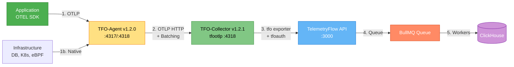
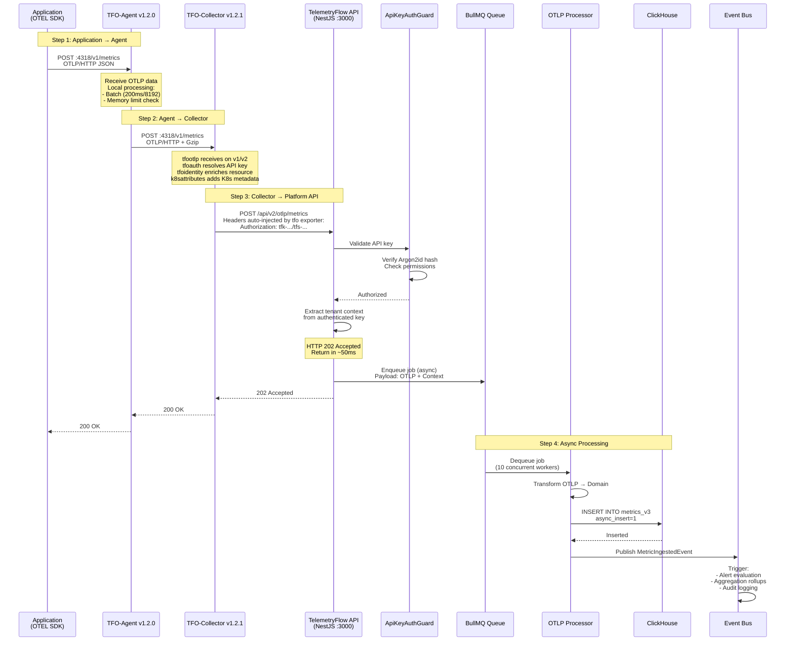
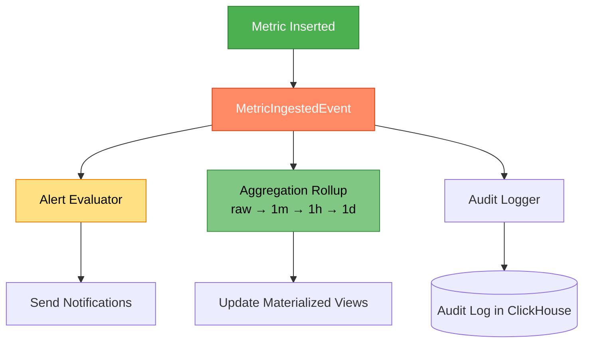
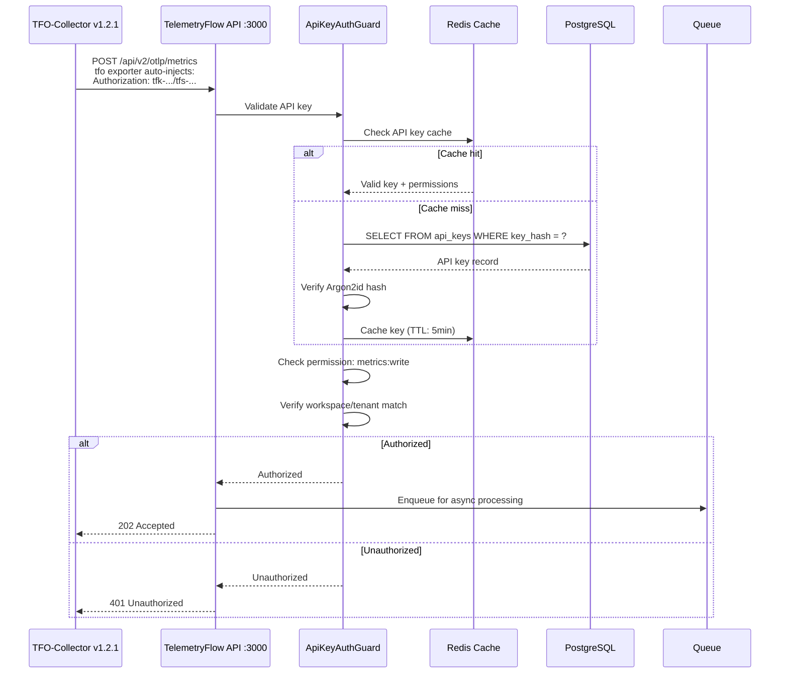

# TFO-OTEL to TelemetryFlow Platform - Ingestion Flow

- **Version:** 1.4.0
- **Last Updated:** May 2026
- **Component:** Complete Ingestion Pipeline
- **Protocol:** OTLP/gRPC (4317), OTLP/HTTP (4318)

---

## Table of Contents

1. [Overview](#overview)
2. [Complete Data Flow](#complete-data-flow)
3. [Agent to Collector Flow](#agent-to-collector-flow)
4. [Collector to Platform Flow](#collector-to-platform-flow)
5. [Platform Backend Processing](#platform-backend-processing)
6. [Headers and Authentication](#headers-and-authentication)
7. [Endpoint Reference](#endpoint-reference)
8. [Configuration Examples](#configuration-examples)
9. [Troubleshooting Ingestion](#troubleshooting-ingestion)

---

## Overview

This document explains the complete ingestion pipeline from **TFO-Agent v1.2.0** → **TFO-Collector v1.2.1** → **TelemetryFlow Platform v1.4.0**.

### Pipeline Summary


```mermaid
graph LR
    APP[Application<br/>OTEL SDK] -->|1. OTLP| AGENT[TFO-Agent v1.2.0<br/>:4317/:4318]
    INFRA[Infrastructure<br/>DB, K8s, eBPF] -->|1b. Native| AGENT
    AGENT -->|2. OTLP HTTP<br/>+ Batching| COLLECTOR[TFO-Collector v1.2.1<br/>tfootlp :4318]
    COLLECTOR -->|3. tfo exporter<br/>+ tfoauth| API[TelemetryFlow API<br/>:3000]
    API -->|4. Queue| QUEUE[BullMQ Queue]
    QUEUE -->|5. Workers| CH[(ClickHouse)]

    style APP fill:#4CAF50,stroke:#2E7D32,color:#fff
    style AGENT fill:#FFE082,stroke:#F57C00,color:#000
    style COLLECTOR fill:#81C784,stroke:#388E3C,color:#000
    style API fill:#64B5F6,stroke:#1976D2,color:#fff
    style QUEUE fill:#FF8A65,stroke:#D84315,color:#fff
    style CH fill:#CE93D8,stroke:#7B1FA2,color:#fff
```

**Key Points:**

- **Step 1-2**: Agent receives OTLP data + native collectors, forwards to Collector
- **Step 3**: Collector authenticates via tfoauth, enriches via tfoidentity + k8sattributes, exports via tfo
- **Step 4-5**: Platform processes asynchronously via BullMQ and stores in ClickHouse

---

## Complete Data Flow

### End-to-End Sequence


```mermaid
sequenceDiagram
    participant App as Application<br/>(OTEL SDK)
    participant Agent as TFO-Agent v1.2.0
    participant Collector as TFO-Collector v1.2.1
    participant API as TelemetryFlow API<br/>(NestJS :3000)
    participant Guard as ApiKeyAuthGuard
    participant Queue as BullMQ Queue
    participant Worker as OTLP Processor
    participant CH as ClickHouse
    participant EventBus as Event Bus

    Note over App,Agent: Step 1: Application → Agent

    App->>Agent: POST :4318/v1/metrics<br/>OTLP/HTTP JSON
    Note over Agent: Receive OTLP data<br/>Local processing:<br/>- Batch (200ms/8192)<br/>- Memory limit check

    Note over Agent,Collector: Step 2: Agent → Collector

    Agent->>Collector: POST :4318/v1/metrics<br/>OTLP/HTTP + Gzip
    Note over Collector: tfootlp receives on v1/v2<br/>tfoauth resolves API key<br/>tfoidentity enriches resource<br/>k8sattributes adds K8s metadata

    Note over Collector,API: Step 3: Collector → Platform API

    Collector->>API: POST /api/v2/otlp/metrics<br/>Headers auto-injected by tfo exporter:<br/>Authorization: tfk-.../tfs-...

    API->>Guard: Validate API key
    Guard->>Guard: Verify Argon2id hash<br/>Check permissions
    Guard-->>API: Authorized

    API->>API: Extract tenant context<br/>from authenticated key

    Note over API: HTTP 202 Accepted<br/>Return in ~50ms

    API->>Queue: Enqueue job (async)<br/>Payload: OTLP + Context
    API-->>Collector: 202 Accepted
    Collector-->>Agent: 200 OK
    Agent-->>App: 200 OK

    Note over Queue,CH: Step 4: Async Processing

    Queue->>Worker: Dequeue job<br/>(10 concurrent workers)
    Worker->>Worker: Transform OTLP → Domain
    Worker->>CH: INSERT INTO metrics_v3<br/>async_insert=1
    CH-->>Worker: Inserted

    Worker->>EventBus: Publish MetricIngestedEvent
    EventBus->>EventBus: Trigger:<br/>- Alert evaluation<br/>- Aggregation rollups<br/>- Audit logging
```

### Latency Breakdown

| Stage                  | Latency        | Notes                           |
| ---------------------- | -------------- | ------------------------------- |
| App → Agent            | 1-5ms          | Local network                   |
| Agent batching         | 0-200ms        | Configurable timeout            |
| Agent → Collector      | 5-20ms         | Same cluster/region             |
| Collector processing   | 10-50ms        | tfoauth + k8sattributes + batch |
| Collector → API        | 20-100ms       | Network + API response          |
| **API Response**       | **~50ms**      | **202 Accepted returned here**  |
| Queue processing       | 100-500ms      | Async, background               |
| ClickHouse insert      | 50-200ms       | Batch insert                    |
| **Total (end-to-end)** | **200-1000ms** | **From app to database**        |

---

## Agent to Collector Flow

### Agent Configuration

```yaml
# /etc/tfo-agent/tfo-agent.yaml
agent:
  description: "Production Agent"
  tags:
    environment: "production"

collectors:
  system:
    enabled: true
    interval: 30s
  kubernetes:
    enabled: true
  cadvisor:
    enabled: true
  # Enable DB collectors as needed
  postgresql:
    enabled: true
    dsn: "postgresql://user:pass@db:5432/postgres"

receivers:
  otlp:
    enabled: true
    protocols:
      grpc: { enabled: true, endpoint: "0.0.0.0:4317" }
      http: { enabled: true, endpoint: "0.0.0.0:4318" }

processors:
  batch:
    enabled: true
    send_batch_size: 8192
    timeout: 200ms
  memory_limiter:
    enabled: true
    limit_percentage: 80

exporter:
  otlp:
    enabled: true
    endpoint: "http://tfo-collector:4317"
    compression: "gzip"

buffer:
  enabled: true
  path: "/var/lib/tfo-agent/buffer"
  max_size_mb: 100

extensions:
  health_check:
    enabled: true
    endpoint: "0.0.0.0:13133"

heartbeat:
  enabled: true
  interval: 60s
```

### What the Agent Does

1. **Receives OTLP data** from applications (gRPC/HTTP)
2. **Collects native metrics** from system, Kubernetes, databases, eBPF, Docker
3. **Batches data** for efficiency (8192 items or 200ms)
4. **Checks memory limits** to prevent OOM
5. **Compresses payload** (gzip) to reduce bandwidth
6. **Forwards to Collector** via OTLP/HTTP
7. **Retries on failure** with disk-backed buffer
8. **Sends heartbeats** every 60 seconds to backend

---

## Collector to Platform Flow

### Collector Configuration (OCB Native)

```yaml
# /etc/tfo-collector/otel-collector.yaml
receivers:
  tfootlp:
    protocols:
      http:
        endpoint: "0.0.0.0:4318"
      grpc:
        endpoint: "0.0.0.0:4317"

processors:
  k8sattributes:
    auth_type: "serviceAccount"
    extract:
      metadata:
        - k8s.pod.name
        - k8s.namespace.name
        - k8s.node.name

  transform:
    error_mode: ignore
    metric_statements:
      - context: metric
        statements:
          - set(description, "") where name == ""

  batch:
    send_batch_size: 8192
    timeout: 200ms

exporters:
  tfo:
    endpoint: "https://api.telemetryflow.id/api"
    auth:
      authenticator: tfoauth
    compression: gzip
    retry_on_failure:
      enabled: true
      initial_interval: 5s
      max_interval: 30s
    sending_queue:
      enabled: true
      num_consumers: 10
      queue_size: 5000

connectors:
  spanmetrics:
    histogram:
      explicit:
        buckets: [2ms, 6ms, 10ms, 50ms, 100ms, 250ms, 500ms, 1s, 5s, 10s]
    dimensions:
      - name: http.method
      - name: http.status_code
    aggregation_temporality: "AGGREGATION_TEMPORALITY_CUMULATIVE"

  service_graph:
    latency_histogram_buckets: [100ms, 250ms, 500ms, 1s, 5s, 10s]

extensions:
  tfoauth:
    api_key_id: "${env:TELEMETRYFLOW_API_KEY_ID}"
    api_key_secret: "${env:TELEMETRYFLOW_API_KEY_SECRET}"

  tfoidentity:
    collector_id: "tfo-collector-prod"
    labels:
      environment: "production"

  health_check:
    endpoint: "0.0.0.0:13133"

service:
  extensions: [tfoauth, tfoidentity, health_check]
  pipelines:
    traces:
      receivers: [tfootlp]
      processors: [k8sattributes, batch]
      exporters: [tfo, spanmetrics, servicegraph]
    metrics:
      receivers: [tfootlp]
      processors: [k8sattributes, transform, batch]
      exporters: [tfo]
    logs:
      receivers: [tfootlp]
      processors: [k8sattributes, batch]
      exporters: [tfo]
```

### What the Collector Does

1. **Receives OTLP data** from multiple agents via tfootlp (v1/v2 dual endpoints)
2. **Authenticates** via tfoauth extension (API key → tenant mapping)
3. **Enriches** via tfoidentity (collector identity) and k8sattributes (K8s metadata)
4. **Transforms** metrics using OTTL
5. **Batches** for efficiency (8192 items or 200ms)
6. **Exports** via tfo exporter with auto-injected authentication headers
7. **Generates** derived telemetry via spanmetrics (exemplars) + servicegraph connectors
8. **Retries** on failure with persistent queue

### Collector → Platform Communication

**Endpoint:** `https://api.telemetryflow.id/api/v2/otlp/metrics`

**Request (auto-injected by tfo exporter):**

```http
POST /api/v2/otlp/metrics HTTP/1.1
Host: api.telemetryflow.id
Content-Type: application/x-protobuf
Content-Encoding: gzip
Authorization: tfk-live-abc123.tfs-secret-xyz789

[Binary Protobuf payload - OTLP ExportMetricsServiceRequest]
```

**Response:**

```http
HTTP/1.1 202 Accepted
Content-Type: application/json

{
  "status": "accepted",
  "message": "Metrics queued for processing",
  "job_id": "job_abc123"
}
```

---

## Platform Backend Processing

### API Endpoint Handler

**Location:** `backend/src/modules/telemetry/presentation/OtlpController.ts`

```typescript
@Controller("v2/otlp")
export class OtlpController {
  @Post("metrics")
  @UseGuards(ApiKeyAuthGuard)
  async ingestMetrics(
    @Body() payload: ExportMetricsServiceRequest,
    @Headers("x-workspace-id") workspaceId?: string,
    @Headers("x-tenant-id") tenantId?: string,
  ): Promise<ExportMetricsServiceResponse> {
    // 1. Extract tenant context from authenticated API key
    const context = this.extractTenantContext(payload, workspaceId, tenantId);

    // 2. Enqueue for async processing
    const job = await this.metricsQueue.add("ingest-metrics", {
      payload,
      context,
      timestamp: Date.now(),
    });

    // 3. Return 202 Accepted immediately (~50ms)
    return {
      status: "accepted",
      message: "Metrics queued for processing",
      job_id: job.id,
    };
  }
}
```

### Async Queue Processing

**Queue:** BullMQ (Redis-backed) — `otlp-ingestion` (concurrency: 10)

```typescript
@Processor("otlp-ingestion")
export class OtlpMetricsProcessor {
  @Process()
  async processMetrics(job: Job<MetricsJobData>): Promise<void> {
    const { payload, context } = job.data;

    // 1. Transform OTLP → Domain Model
    const metrics = this.mapper.toDomain(payload, context);

    // 2. Batch insert to ClickHouse
    await this.metricsRepository.batchInsert(metrics, {
      async_insert: 1,
      wait_for_async_insert: 0,
    });

    // 3. Publish domain events
    await this.eventBus.publishAll(
      metrics.flatMap((m) => m.getUncommittedEvents()),
    );
  }
}
```

### ClickHouse Storage

```sql
INSERT INTO metrics_v3 (
  timestamp, workspace_id, tenant_id,
  metric_name, metric_type, value,
  attributes, resource_attributes
) VALUES (...)
```

### Event-Driven Processing


```mermaid
graph TB
    METRIC[Metric Inserted] --> EVENT[MetricIngestedEvent]

    EVENT --> ALERT[Alert Evaluator]
    EVENT --> AGG[Aggregation Rollup<br/>raw → 1m → 1h → 1d]
    EVENT --> AUDIT[Audit Logger]

    ALERT --> NOTIFY[Send Notifications]
    AGG --> MV[Update Materialized Views]
    AUDIT --> LOG[(Audit Log in ClickHouse)]

    style METRIC fill:#4CAF50,stroke:#2E7D32,color:#fff
    style EVENT fill:#FF8A65,stroke:#D84315,color:#fff
    style ALERT fill:#FFE082,stroke:#F57C00,color:#000
    style AGG fill:#81C784,stroke:#388E3C,color:#000
```

---

## Headers and Authentication

### Authentication Flow (tfoauth)


```mermaid
sequenceDiagram
    participant Collector as TFO-Collector v1.2.1
    participant API as TelemetryFlow API :3000
    participant Guard as ApiKeyAuthGuard
    participant Cache as Redis Cache
    participant DB as PostgreSQL

    Collector->>API: POST /api/v2/otlp/metrics<br/>tfo exporter auto-injects:<br/>Authorization: tfk-.../tfs-...

    API->>Guard: Validate API key

    Guard->>Cache: Check API key cache
    alt Cache hit
        Cache-->>Guard: Valid key + permissions
    else Cache miss
        Guard->>DB: SELECT FROM api_keys WHERE key_hash = ?
        DB-->>Guard: API key record
        Guard->>Guard: Verify Argon2id hash
        Guard->>Cache: Cache key (TTL: 5min)
    end

    Guard->>Guard: Check permission: metrics:write
    Guard->>Guard: Verify workspace/tenant match

    alt Authorized
        Guard-->>API: Authorized
        API->>Queue: Enqueue for async processing
        API-->>Collector: 202 Accepted
    else Unauthorized
        Guard-->>API: Unauthorized
        API-->>Collector: 401 Unauthorized
    end
```

### API Key Format

AWS-style dual keys with Argon2id hashing:

| Key Type           | Prefix | Description                                 |
| ------------------ | ------ | ------------------------------------------- |
| **API Key ID**     | `tfk-` | Public identifier (e.g., `tfk-live-abc123`) |
| **API Key Secret** | `tfs-` | Secret key (e.g., `tfs-secret-xyz789`)      |

---

## Endpoint Reference

### TelemetryFlow Platform Endpoints

#### Production

| Signal      | Endpoint               | Port | Protocol  |
| ----------- | ---------------------- | ---- | --------- |
| **Metrics** | `/api/v2/otlp/metrics` | 3000 | OTLP/HTTP |
| **Logs**    | `/api/v2/otlp/logs`    | 3000 | OTLP/HTTP |
| **Traces**  | `/api/v2/otlp/traces`  | 3000 | OTLP/HTTP |
| **Health**  | `/health`              | 3000 | HTTP      |

**Base URL:** `https://api.telemetryflow.id`

#### Collector Endpoints (Dual v1/v2)

| Signal      | v1 (Community)     | v2 (Platform)      | Auth                |
| ----------- | ------------------ | ------------------ | ------------------- |
| **Metrics** | `POST /v1/metrics` | `POST /v2/metrics` | v2 requires tfoauth |
| **Logs**    | `POST /v1/logs`    | `POST /v2/logs`    | v2 requires tfoauth |
| **Traces**  | `POST /v1/traces`  | `POST /v2/traces`  | v2 requires tfoauth |

**Port:** 4318 (HTTP), 4317 (gRPC)

### Rate Limits

| Endpoint               | Rate Limit   | Burst |
| ---------------------- | ------------ | ----- |
| `/api/v2/otlp/metrics` | 1000 req/min | 100   |
| `/api/v2/otlp/logs`    | 1000 req/min | 100   |
| `/api/v2/otlp/traces`  | 1000 req/min | 100   |

---

## Configuration Examples

### Complete: Agent → Collector → Platform

#### 1. Agent Configuration

```yaml
# /etc/tfo-agent/tfo-agent.yaml
agent:
  description: "Production Agent"

collectors:
  system: { enabled: true, interval: 30s }
  kubernetes: { enabled: true }
  cadvisor: { enabled: true }
  postgresql: { enabled: true, dsn: "postgresql://user:pass@db:5432/postgres" }

receivers:
  otlp:
    enabled: true
    protocols:
      grpc: { enabled: true, endpoint: "0.0.0.0:4317" }
      http: { enabled: true, endpoint: "0.0.0.0:4318" }

processors:
  batch: { enabled: true, send_batch_size: 8192, timeout: 200ms }
  memory_limiter: { enabled: true, limit_percentage: 80 }

exporter:
  otlp:
    enabled: true
    endpoint: "http://tfo-collector:4317"
    compression: "gzip"

buffer:
  enabled: true
  path: "/var/lib/tfo-agent/buffer"
  max_size_mb: 100
```

#### 2. Collector Configuration

```yaml
# /etc/tfo-collector/otel-collector.yaml
receivers:
  tfootlp:
    protocols:
      http: { endpoint: "0.0.0.0:4318" }
      grpc: { endpoint: "0.0.0.0:4317" }

processors:
  k8sattributes:
    auth_type: "serviceAccount"
    extract:
      metadata: [k8s.pod.name, k8s.namespace.name, k8s.node.name]
  batch:
    send_batch_size: 8192
    timeout: 200ms

exporters:
  tfo:
    endpoint: "https://api.telemetryflow.id/api"
    auth:
      authenticator: tfoauth
    compression: gzip
    retry_on_failure:
      enabled: true
    sending_queue:
      enabled: true
      queue_size: 5000

connectors:
  spanmetrics:
    histogram:
      explicit:
        buckets: [2ms, 10ms, 50ms, 100ms, 250ms, 500ms, 1s, 5s, 10s]
    dimensions:
      - name: http.method
      - name: http.status_code
  service_graph:
    latency_histogram_buckets: [100ms, 500ms, 1s, 5s, 10s]

extensions:
  tfoauth:
    api_key_id: "${env:TELEMETRYFLOW_API_KEY_ID}"
    api_key_secret: "${env:TELEMETRYFLOW_API_KEY_SECRET}"
  tfoidentity:
    collector_id: "tfo-collector-prod"
  health_check:
    endpoint: "0.0.0.0:13133"

service:
  extensions: [tfoauth, tfoidentity, health_check]
  pipelines:
    traces:
      receivers: [tfootlp]
      processors: [k8sattributes, batch]
      exporters: [tfo, spanmetrics, servicegraph]
    metrics:
      receivers: [tfootlp]
      processors: [k8sattributes, batch]
      exporters: [tfo]
    logs:
      receivers: [tfootlp]
      processors: [k8sattributes, batch]
      exporters: [tfo]
```

#### 3. Environment Variables

```bash
export TELEMETRYFLOW_API_KEY_ID="tfk-live-abc123"
export TELEMETRYFLOW_API_KEY_SECRET="tfs-secret-xyz789"
export TELEMETRYFLOW_WORKSPACE_ID="550e8400-e29b-41d4-a716-446655440000"
export TELEMETRYFLOW_TENANT_ID="660e8400-e29b-41d4-a716-446655440001"
```

---

## Troubleshooting Ingestion

### Issue 1: Data Not Reaching Platform

```bash
# Check Collector logs
kubectl logs -n observability -l app=tfo-collector --tail=100

# Check Collector metrics
kubectl port-forward -n observability svc/tfo-collector 8888:8888
curl http://localhost:8888/metrics | grep exporter_send_failed

# Test Platform endpoint directly
curl -X POST https://api.telemetryflow.id/api/v2/otlp/metrics \
  -H "Content-Type: application/json" \
  -H "X-API-Key: tfk-live-abc.tfs-secret-xyz" \
  -d '{"resourceMetrics":[]}'
```

**Common Causes:**

1. **tfoauth not configured** — Ensure `tfoauth` extension is in config and `tfo` exporter references it
2. **Invalid API key format** — Must be `tfk-*` for ID, `tfs-*` for secret
3. **Missing environment variables** — Check `TELEMETRYFLOW_API_KEY_ID` and `TELEMETRYFLOW_API_KEY_SECRET`

### Issue 2: Authentication Errors (401/403)

```bash
# Verify API key format
echo $TELEMETRYFLOW_API_KEY_ID    # Should start with tfk-
echo $TELEMETRYFLOW_API_KEY_SECRET # Should start with tfs-
```

### Issue 3: High Latency

```bash
curl http://localhost:8888/metrics | grep duration
```

Fix: Reduce batch timeout, increase workers, or scale collectors.

### Issue 4: Queue Filling Up

```bash
kubectl scale deployment tfo-collector --replicas=5 -n observability
```

---

## Summary

### Key Takeaways

1. **Agent → Collector**: OTLP forwarding with batching + disk buffer
2. **Collector → Platform**: tfo exporter with auto-injected tfoauth headers
3. **Platform Processing**: Async BullMQ queue with 202 Accepted response
4. **Authentication**: AWS-style dual keys (tfk-_/tfs-_) verified with Argon2id
5. **Performance**: ~50ms API response, ~200-1000ms total latency

### Critical Configuration

**Collector must include:**

- tfoauth extension with API key credentials
- tfo exporter referencing tfoauth authenticator
- tfoidentity extension for collector identity
- k8sattributes processor for Kubernetes metadata
- spanmetrics + servicegraph connectors for derived telemetry

**Platform expects:**

- OTLP/HTTP on `/api/v2/otlp/*` endpoints
- Valid API key (tfk-_/tfs-_) via tfoauth
- Protobuf or JSON encoding

---

**Version:** 1.4.0 | **Component:** Ingestion Flow | **Last Updated:** May 2026
