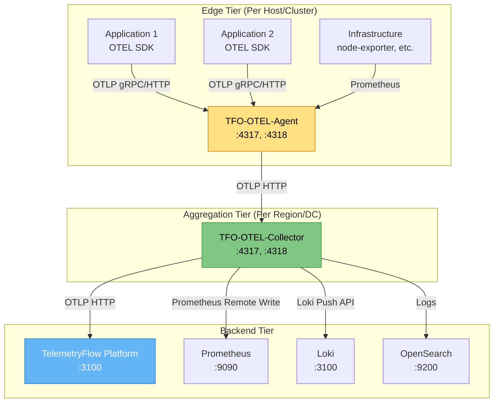

# TelemetryFlow OTEL Agent & Collector

- **Version:** 1.0.0-CE
- **Last Updated:** December 13, 2025
- **Status:** ✅ Production Ready

---

## Table of Contents

1. [Overview](#overview)
2. [Quick Start](#quick-start)
3. [Components](#components)
4. [Architecture](#architecture)
5. [Key Features](#key-features)
6. [Documentation Structure](#documentation-structure)
7. [Use Cases](#use-cases)
8. [Getting Help](#getting-help)

---

## Overview

The **TelemetryFlow OTEL Agent & Collector** ecosystem provides enterprise-grade telemetry data collection, processing, and routing capabilities. Built on the OpenTelemetry standard, it enables unified observability across your entire infrastructure.

### What is TFO-OTEL?

**TFO-OTEL** is TelemetryFlow's implementation of OpenTelemetry components that work seamlessly with the TelemetryFlow Platform:

- **TFO-OTEL-Collector**: Centralized telemetry data hub
- **TFO-OTEL-Agent**: Lightweight edge collector for distributed deployments

Both components are 100% compatible with the OpenTelemetry standard while providing TelemetryFlow-specific enhancements.

---

## Quick Start

### 1. Deploy TFO-OTEL-Collector

```bash
# Using Docker
docker run -d \\
  --name tfo-otel-collector \\
  -p 4317:4317 \\
  -p 4318:4318 \\
  -p 8888:8888 \\
  -p 8889:8889 \\
  -v ./config/otel-collector-config.yaml:/etc/otel-collector-config.yaml \\
  otel/opentelemetry-collector-contrib:0.88.0 \\
  --config=/etc/otel-collector-config.yaml
```

### 2. Deploy TFO-OTEL-Agent (Edge Nodes)

```bash
# Using Docker
docker run -d \\
  --name tfo-otel-agent \\
  -p 4317:4317 \\
  -p 4318:4318 \\
  -e TELEMETRYFLOW_ENDPOINT=http://tfo-collector:4318 \\
  -e TELEMETRYFLOW_WORKSPACE_ID=your-workspace-id \\
  -e TELEMETRYFLOW_TENANT_ID=your-tenant-id \\
  -v ./config/otel-agent-config.yaml:/etc/otel-agent-config.yaml \\
  otel/opentelemetry-collector-contrib:0.88.0 \\
  --config=/etc/otel-agent-config.yaml
```

### 3. Send Telemetry Data

```bash
# Send test metrics
curl -X POST http://localhost:4318/v1/metrics \\
  -H "Content-Type: application/json" \\
  -H "X-Workspace-Id: your-workspace-id" \\
  -H "X-Tenant-Id: your-tenant-id" \\
  -d @test-metrics.json
```

---

## Components

### TFO-OTEL-Collector

**Purpose:** Centralized telemetry data processing hub

**Key Capabilities:**
- Receive telemetry from multiple sources (agents, applications, infrastructure)
- Process and enrich data with workspace/tenant context
- Route data to multiple backends (TelemetryFlow, Prometheus, Loki, etc.)
- Scale horizontally for high-throughput environments

**Deployment Pattern:** Hub-and-spoke architecture

### TFO-OTEL-Agent

**Purpose:** Lightweight edge collector for distributed environments

**Key Capabilities:**
- Collect telemetry from local applications and infrastructure
- Buffer data during network outages
- Forward data to TFO-OTEL-Collector or directly to TelemetryFlow
- Minimal resource footprint (~50MB RAM, <1% CPU)

**Deployment Pattern:** Per-host or per-cluster deployment

---

## Architecture

### High-Level Architecture



### Data Flow


---

## Key Features

### Multi-Tenancy Support

Both Agent and Collector are multi-tenant aware:

```yaml
processors:
  attributes:
    actions:
      - key: telemetryflow.workspace.id
        value: \${env:TELEMETRYFLOW_WORKSPACE_ID}
        action: upsert
      - key: telemetryflow.tenant.id
        value: \${env:TELEMETRYFLOW_TENANT_ID}
        action: upsert
```

### Auto-Registration

Agents automatically register with TelemetryFlow Platform:

- Send heartbeats every 60 seconds
- Report version, hostname, IP address
- Receive configuration updates remotely
- Mark offline after 15 minutes of inactivity

### High Availability

**Collector:**
- Run multiple replicas behind load balancer
- Stateless design enables horizontal scaling
- Persistent queue for data buffering

**Agent:**
- Built-in retry logic with exponential backoff
- Local disk buffering during outages
- Automatic failover between collector instances

### Performance

**Throughput:**
- Agent: 10K+ data points/sec per instance
- Collector: 100K+ data points/sec per instance

**Latency:**
- Agent → Collector: <10ms
- Collector → Backend: <50ms

**Resource Usage:**
- Agent: 50MB RAM, <1% CPU (idle), ~5% CPU (peak)
- Collector: 512MB RAM, <5% CPU (idle), ~20% CPU (peak)

---

## Documentation Structure

| Document | Description |
|----------|-------------|
| [README.md](README.md) | This file - Overview and quick start |
| [ARCHITECTURE.md](ARCHITECTURE.md) | Detailed architecture and data flow |
| [INGESTION-FLOW.md](INGESTION-FLOW.md) | **Complete ingestion pipeline: Agent → Collector → Platform** |
| [TFO-OTEL-AGENT.md](TFO-OTEL-AGENT.md) | Agent deployment and configuration |
| [TFO-OTEL-COLLECTOR.md](TFO-OTEL-COLLECTOR.md) | Collector deployment and configuration |
| [CONFIGURATION.md](CONFIGURATION.md) | Complete configuration reference |
| [DEPLOYMENT.md](DEPLOYMENT.md) | Deployment patterns and best practices |

---

## Use Cases

### Use Case 1: Microservices Monitoring

**Scenario:** Monitor 100+ microservices across multiple Kubernetes clusters

**Solution:**
- Deploy TFO-OTEL-Agent as DaemonSet on each K8s node
- Deploy TFO-OTEL-Collector as Deployment (3 replicas) per cluster
- Configure service mesh (Istio/Linkerd) to emit OTLP telemetry
- Route all data to central TelemetryFlow Platform

**Benefits:**
- Automatic service discovery
- Distributed tracing across services
- Centralized metrics and logs
- Per-service resource attribution

### Use Case 2: Multi-Cloud Observability

**Scenario:** Unified observability across AWS, GCP, and Azure

**Solution:**
- Deploy TFO-OTEL-Collector in each cloud region
- Configure collectors to export to central TelemetryFlow
- Use workspace/tenant context for cloud provider isolation
- Aggregate metrics from CloudWatch, Stackdriver, Azure Monitor

**Benefits:**
- Single pane of glass for multi-cloud
- Consistent data model across clouds
- Cost optimization through data routing
- Compliance and data sovereignty

### Use Case 3: Edge Computing

**Scenario:** Monitor IoT devices and edge gateways with intermittent connectivity

**Solution:**
- Deploy TFO-OTEL-Agent on edge gateways
- Configure local buffering (persistent queue)
- Batch and compress data before upload
- Auto-retry during connectivity issues

**Benefits:**
- Resilient to network outages
- Bandwidth optimization
- Local data aggregation
- Real-time edge insights

### Use Case 4: Legacy Application Integration

**Scenario:** Integrate monitoring for legacy applications without code changes

**Solution:**
- Deploy TFO-OTEL-Collector with Prometheus receiver
- Scrape existing Prometheus exporters
- Convert Prometheus metrics to OTLP format
- Enrich with multi-tenant context

**Benefits:**
- Zero application changes required
- Unified observability platform
- Gradual migration path
- Preserve existing dashboards

---

## Getting Help

### Documentation

- **Platform Docs:** [README.md](../README.md)
- **API Reference:** [OTLP-INGESTION.md](../shared/OTLP-INGESTION.md)
- **Troubleshooting:** [DEPLOYMENT.md](./DEPLOYMENT.md#troubleshooting)

### Community

- **GitHub Issues:** [https://github.com/telemetryflow/telemetryflow-platform/issues](https://github.com/telemetryflow/telemetryflow-platform/issues)
- **Discussions:** [https://github.com/telemetryflow/telemetryflow-platform/discussions](https://github.com/telemetryflow/telemetryflow-platform/discussions)

### Resources

- **OpenTelemetry Docs:** [https://opentelemetry.io/docs/](https://opentelemetry.io/docs/)
- **OTEL Collector:** [https://opentelemetry.io/docs/collector/](https://opentelemetry.io/docs/collector/)
- **OTLP Protocol:** [https://github.com/open-telemetry/opentelemetry-proto](https://github.com/open-telemetry/opentelemetry-proto)

---

## Quick Reference

### Ports

| Component | Port | Protocol | Purpose |
|-----------|------|----------|---------|
| Agent | 4317 | gRPC | OTLP receiver |
| Agent | 4318 | HTTP | OTLP receiver |
| Collector | 4317 | gRPC | OTLP receiver |
| Collector | 4318 | HTTP | OTLP receiver |
| Collector | 8888 | HTTP | Internal metrics |
| Collector | 8889 | HTTP | Prometheus exporter |
| Collector | 13133 | HTTP | Health check |

### Environment Variables

| Variable | Default | Description |
|----------|---------|-------------|
| `TELEMETRYFLOW_ENDPOINT` | http://localhost:3100 | TelemetryFlow API endpoint |
| `TELEMETRYFLOW_WORKSPACE_ID` | - | Workspace UUID (required) |
| `TELEMETRYFLOW_TENANT_ID` | - | Tenant UUID (required) |
| `OTEL_RESOURCE_ATTRIBUTES` | - | Additional resource attributes |
| `OTEL_EXPORTER_OTLP_ENDPOINT` | - | Collector endpoint for agents |

### Health Checks

```bash
# Agent health
curl http://localhost:13133/

# Collector health
curl http://localhost:13133/

# Collector metrics
curl http://localhost:8888/metrics

# TelemetryFlow API health
curl http://localhost:3100/health
```

---

**Version:** 1.0.0-CE | **Maintained By:** DevOpsCorner Indonesia
