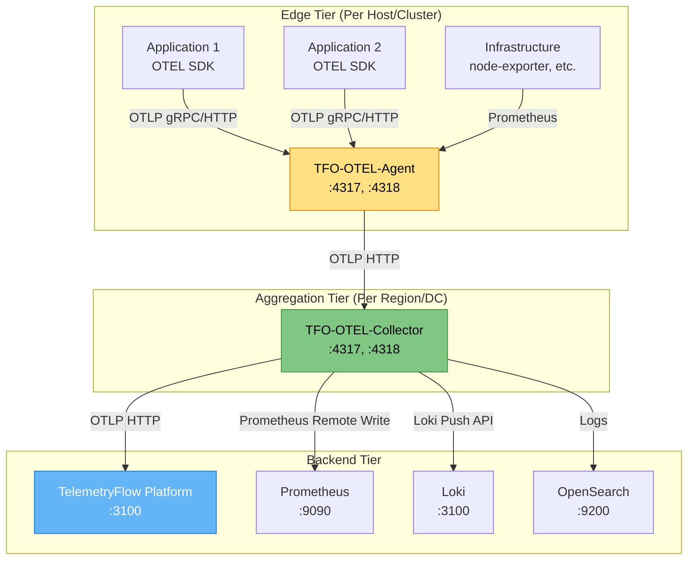
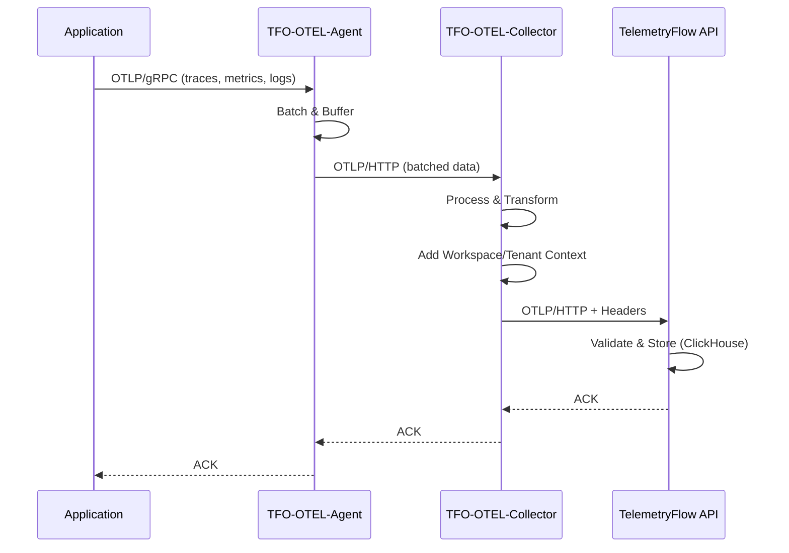

# TelemetryFlow OTEL Agent & Collector

- **Version:** 1.1.1-CE
- **Last Updated:** December 2025
- **Status:** Production Ready

---

## Table of Contents

1. [Overview](#overview)
2. [Quick Start](#quick-start)
3. [Components](#components)
4. [Architecture](#architecture)
5. [Key Features](#key-features)
6. [Documentation Structure](#documentation-structure)
7. [Use Cases](#use-cases)
8. [Getting Help](#getting-help)

---

## Overview

The **TelemetryFlow OTEL Agent & Collector** ecosystem provides enterprise-grade telemetry data collection, processing, and routing capabilities. Built on the OpenTelemetry standard with custom Go implementations, it enables unified observability across your entire infrastructure.

### What is TFO-OTEL?

**TFO-OTEL** is TelemetryFlow's implementation of OpenTelemetry components that work seamlessly with the TelemetryFlow Platform:

| Component | Description | Go Version | OTEL Version |
|-----------|-------------|------------|--------------|
| **TFO-OTEL-Agent** | Lightweight edge collector for distributed deployments | 1.24+ | Community |
| **TFO-OTEL-Collector** | Centralized telemetry data hub with dual build system | 1.24+ | 0.114.0 |

Both components are **custom Go implementations** providing:

- Custom Cobra CLI with `start`, `version`, `config` commands
- Custom configuration format with `enabled` flags
- LEGO Building Blocks architecture (`pkg/` reusable packages)
- TelemetryFlow-specific branding and features
- 100% compatibility with OpenTelemetry standard

---

## Quick Start

### 1. Deploy TFO-OTEL-Collector

**From Source (Standalone):**

```bash
git clone https://github.com/telemetryflow/telemetryflow-collector.git
cd telemetryflow-collector

# Build standalone collector
make

# Run
./build/tfo-collector start --config configs/tfo-collector.yaml
```

**Using Docker:**

```bash
# Standalone build
docker-compose up -d --build

# OR OCB build (standard OTEL)
docker-compose -f docker-compose.ocb.yml up -d --build
```

### 2. Deploy TFO-OTEL-Agent (Edge Nodes)

**From Source:**

```bash
git clone https://github.com/telemetryflow/telemetryflow-agent.git
cd telemetryflow-agent

# Build
make build

# Run
./build/tfo-agent start --config configs/tfo-agent.yaml
```

**Using Docker:**

```bash
docker-compose up -d --build
```

### 3. Send Telemetry Data

```bash
# Send test metrics via OTLP HTTP
curl -X POST http://localhost:4318/v1/metrics \
  -H "Content-Type: application/json" \
  -H "X-Workspace-Id: your-workspace-id" \
  -H "X-Tenant-Id: your-tenant-id" \
  -d @test-metrics.json
```

---

## Components

### TFO-OTEL-Agent

**Purpose:** Lightweight edge collector for distributed environments

**Key Features:**

- Agent registration & lifecycle management with TelemetryFlow backend
- Heartbeat monitoring & health status sync
- System metrics collection (CPU, memory, disk, network)
- Disk-backed buffer for offline resilience
- Cross-platform support (Linux, macOS, Windows)
- Custom Cobra CLI (`tfo-agent start`, `version`, `config`)

**Project Structure:**

```text
telemetryflow-agent/
├── cmd/tfo-agent/           # CLI entry point
├── internal/
│   ├── agent/               # Core agent lifecycle
│   ├── buffer/              # Disk-backed retry buffer
│   ├── collector/           # Metric collectors
│   ├── config/              # Configuration management
│   └── exporter/            # OTLP data exporters
├── pkg/                     # LEGO Building Blocks
│   ├── api/                 # HTTP API client
│   ├── banner/              # Startup banner
│   ├── config/              # Config loader utilities
│   └── plugin/              # Plugin registry
├── configs/                 # Configuration templates
├── Dockerfile
└── docker-compose.yml
```

**Resource Usage:**

- Memory: ~50MB RAM
- CPU: <1% idle, ~5% peak

### TFO-OTEL-Collector

**Purpose:** Centralized telemetry data processing hub

**Key Features:**

- Dual build system (Standalone CLI + OCB)
- Multi-protocol ingestion (OTLP, Prometheus, Kafka, FluentForward)
- Multi-backend export (TelemetryFlow, Prometheus, Loki, OpenSearch)
- Custom configuration format with `enabled` flags
- Rich component ecosystem from OTEL Contrib
- High throughput: 100K+ data points/second

**Build Types:**

| Build | Binary | Config Format | CLI |
|-------|--------|---------------|-----|
| Standalone | `tfo-collector` | Custom with `enabled` flags | Cobra (`start`, `version`) |
| OCB | `tfo-collector-ocb` | Standard OTEL YAML | Standard OTEL |

**Project Structure:**

```text
telemetryflow-collector/
├── cmd/tfo-collector/        # Standalone CLI entry point
├── internal/
│   ├── collector/            # Core collector implementation
│   ├── config/               # Configuration management
│   └── version/              # Version and banner info
├── pkg/                      # LEGO Building Blocks
├── configs/
│   ├── tfo-collector.yaml    # Standalone config
│   └── otel-collector.yaml    # OCB config
├── manifest.yaml             # OCB build manifest
├── Dockerfile                # Standalone build
├── Dockerfile.ocb            # OCB build
├── docker-compose.yml        # Standalone
└── docker-compose.ocb.yml    # OCB
```

**Resource Usage:**

- Memory: 512MB RAM (configurable)
- CPU: <5% idle, ~20% peak

---

## Architecture

### High-Level Architecture



### Data Flow



---

## Key Features

### Custom Go Implementation

Both Agent and Collector are **custom Go implementations** with:

```bash
# Agent CLI
tfo-agent start --config /path/to/config.yaml
tfo-agent version
tfo-agent config validate

# Collector CLI (Standalone)
tfo-collector start --config /path/to/config.yaml
tfo-collector version
tfo-collector config
```

### Custom Configuration Format

Both use a custom YAML format with `enabled` flags:

```yaml
# Custom format (not standard OTEL)
receivers:
  otlp:
    enabled: true      # <-- Toggle features easily
    protocols:
      grpc:
        enabled: true
        endpoint: "0.0.0.0:4317"

processors:
  batch:
    enabled: true
    send_batch_size: 8192
```

### Multi-Tenancy Support

```yaml
processors:
  attributes:
    enabled: true
    actions:
      - key: telemetryflow.workspace.id
        value: ${env:TELEMETRYFLOW_WORKSPACE_ID}
        action: upsert
      - key: telemetryflow.tenant.id
        value: ${env:TELEMETRYFLOW_TENANT_ID}
        action: upsert
```

### Agent Auto-Registration

Agents automatically register with TelemetryFlow Platform:

- Send heartbeats every 60 seconds
- Report version, hostname, IP address
- Receive configuration updates remotely
- Mark offline after inactivity

### High Availability

**Collector:**

- Run multiple replicas behind load balancer
- Stateless design enables horizontal scaling
- Persistent queue for data buffering

**Agent:**

- Built-in retry logic with exponential backoff
- Local disk buffering during outages
- Automatic failover between collector instances

### Performance

| Component | Throughput | Memory | CPU (idle) | CPU (peak) |
|-----------|------------|--------|------------|------------|
| Agent | 10K+ pts/sec | ~50MB | <1% | ~5% |
| Collector | 100K+ pts/sec | 512MB | <5% | ~20% |

---

## Documentation Structure

| Document | Description |
|----------|-------------|
| [README.md](README.md) | This file - Overview and quick start |
| [ARCHITECTURE.md](ARCHITECTURE.md) | Detailed architecture and data flow |
| [INGESTION-FLOW.md](INGESTION-FLOW.md) | Complete ingestion pipeline: Agent → Collector → Platform |
| [TFO-OTEL-AGENT.md](TFO-OTEL-AGENT.md) | Agent deployment, configuration, and CLI reference |
| [TFO-OTEL-COLLECTOR.md](TFO-OTEL-COLLECTOR.md) | Collector deployment, dual build system, and configuration |
| [CONFIGURATION.md](CONFIGURATION.md) | Complete configuration reference |
| [DEPLOYMENT.md](DEPLOYMENT.md) | Deployment patterns and best practices |

---

## Use Cases

### Use Case 1: Microservices Monitoring

**Scenario:** Monitor 100+ microservices across multiple Kubernetes clusters

**Solution:**

- Deploy TFO-OTEL-Agent as DaemonSet on each K8s node
- Deploy TFO-OTEL-Collector as Deployment (3 replicas) per cluster
- Configure service mesh (Istio/Linkerd) to emit OTLP telemetry
- Route all data to central TelemetryFlow Platform

### Use Case 2: Multi-Cloud Observability

**Scenario:** Unified observability across AWS, GCP, and Azure

**Solution:**

- Deploy TFO-OTEL-Collector in each cloud region
- Configure collectors to export to central TelemetryFlow
- Use workspace/tenant context for cloud provider isolation

### Use Case 3: Edge Computing

**Scenario:** Monitor IoT devices and edge gateways with intermittent connectivity

**Solution:**

- Deploy TFO-OTEL-Agent on edge gateways
- Configure local disk buffering
- Batch and compress data before upload
- Auto-retry during connectivity issues

### Use Case 4: Legacy Application Integration

**Scenario:** Integrate monitoring for legacy applications without code changes

**Solution:**

- Deploy TFO-OTEL-Collector with Prometheus receiver
- Scrape existing Prometheus exporters
- Convert Prometheus metrics to OTLP format
- Enrich with multi-tenant context

---

## Getting Help

### Documentation

- **Platform Docs:** [README.md](../README.md)
- **API Reference:** [OTLP-INGESTION.md](../shared/OTLP-INGESTION.md)
- **Troubleshooting:** [DEPLOYMENT.md](./DEPLOYMENT.md#troubleshooting)

### Community

- **GitHub Issues:** [https://github.com/telemetryflow/telemetryflow-platform/issues](https://github.com/telemetryflow/telemetryflow-platform/issues)
- **Discussions:** [https://github.com/telemetryflow/telemetryflow-platform/discussions](https://github.com/telemetryflow/telemetryflow-platform/discussions)

### Resources

- **OpenTelemetry Docs:** [https://opentelemetry.io/docs/](https://opentelemetry.io/docs/)
- **OTEL Collector:** [https://opentelemetry.io/docs/collector/](https://opentelemetry.io/docs/collector/)
- **OTLP Protocol:** [https://github.com/open-telemetry/opentelemetry-proto](https://github.com/open-telemetry/opentelemetry-proto)

---

## Quick Reference

### Ports

| Component | Port | Protocol | Purpose |
|-----------|------|----------|---------|
| Agent | 4317 | gRPC | OTLP receiver |
| Agent | 4318 | HTTP | OTLP receiver |
| Agent | 13133 | HTTP | Health check |
| Collector | 4317 | gRPC | OTLP receiver |
| Collector | 4318 | HTTP | OTLP receiver |
| Collector | 8888 | HTTP | Internal metrics |
| Collector | 8889 | HTTP | Prometheus exporter |
| Collector | 13133 | HTTP | Health check |

### CLI Commands

```bash
# Agent
tfo-agent start --config /etc/tfo-agent/tfo-agent.yaml
tfo-agent version
tfo-agent config validate --config /path/to/config.yaml

# Collector (Standalone)
tfo-collector start --config /etc/tfo-collector/tfo-collector.yaml
tfo-collector version
tfo-collector config --config /path/to/config.yaml

# Collector (OCB)
tfo-collector-ocb --config /path/to/config.yaml
tfo-collector-ocb validate --config /path/to/config.yaml
```

### Environment Variables

| Variable | Default | Description |
|----------|---------|-------------|
| `TELEMETRYFLOW_API_ENDPOINT` | - | TelemetryFlow API endpoint |
| `TELEMETRYFLOW_API_KEY_ID` | - | API key ID |
| `TELEMETRYFLOW_API_KEY_SECRET` | - | API key secret |
| `TELEMETRYFLOW_WORKSPACE_ID` | - | Workspace UUID |
| `TELEMETRYFLOW_TENANT_ID` | - | Tenant UUID |
| `TELEMETRYFLOW_LOG_LEVEL` | info | Log level (debug, info, warn, error) |

### Health Checks

```bash
# Agent health
curl http://localhost:13133/

# Collector health
curl http://localhost:13133/

# Collector metrics
curl http://localhost:8888/metrics

# TelemetryFlow API health
curl http://localhost:3100/health
```

---

## Repositories

| Repository | Description |
|------------|-------------|
| [telemetryflow-agent](https://github.com/telemetryflow/telemetryflow-agent) | TFO-OTEL-Agent source code |
| [telemetryflow-collector](https://github.com/telemetryflow/telemetryflow-collector) | TFO-OTEL-Collector source code |
| [telemetryflow-platform](https://github.com/telemetryflow/telemetryflow-platform) | TelemetryFlow Platform |

---

**Version:** 1.0.0 | **Maintained By:** DevOpsCorner Indonesia
