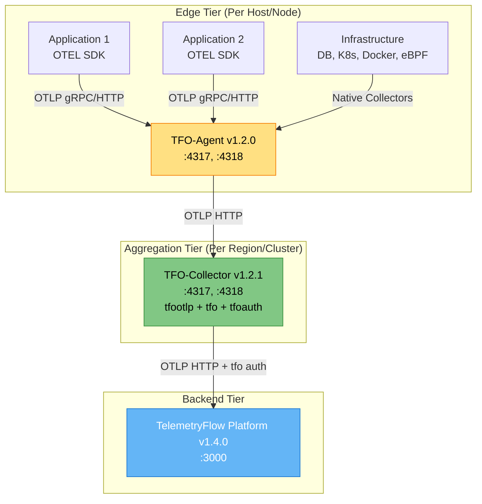
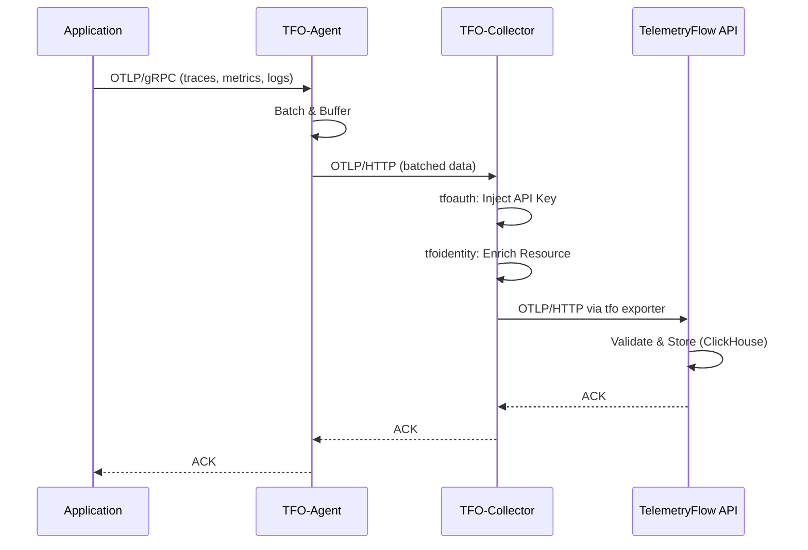
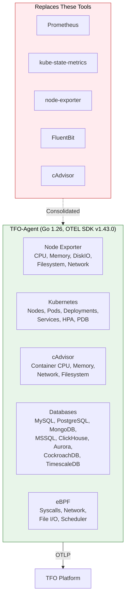

# TelemetryFlow OTEL Agent & Collector

- **Version:** 1.4.0
- **Last Updated:** May 2026
- **Status:** Production Ready

---

## Table of Contents

1. [Overview](#overview)
2. [Quick Start](#quick-start)
3. [Components](#components)
4. [Architecture](#architecture)
5. [Key Features](#key-features)
6. [Documentation Structure](#documentation-structure)
7. [Use Cases](#use-cases)
8. [Getting Help](#getting-help)

---

## Overview

The **TelemetryFlow OTEL Agent & Collector** ecosystem provides enterprise-grade telemetry data collection, processing, and routing capabilities. Built on the OpenTelemetry standard with custom Go implementations, it enables unified observability across your entire infrastructure.

### What is TFO-OTEL?

**TFO-OTEL** is TelemetryFlow's implementation of OpenTelemetry components that work seamlessly with the TelemetryFlow Platform:

| Component         | Version | Go Version | OTEL Version                   | Description                                                               |
| ----------------- | ------- | ---------- | ------------------------------ | ------------------------------------------------------------------------- |
| **TFO-Agent**     | v1.2.0  | 1.26+      | SDK v1.43.0                    | Infrastructure agent — replaces Prometheus, KSM, node-exporter, FluentBit |
| **TFO-Collector** | v1.2.1  | 1.26+      | Core v1.58.0, Contrib v0.152.0 | OCB-native OTLP collector with TFO custom components                      |

Both components provide:

- **TFO-Agent**: Custom Cobra CLI with `start`, `version`, `config` commands, 15+ built-in collectors, 39+ integrations
- **TFO-Collector**: 100% OCB-native build with 85+ community components + 4 custom TFO components
- **Dual Endpoint**: Community v1 (`/v1/*`) + Platform v2 (`/v2/*`) on same port 4318
- 100% compatibility with OpenTelemetry standard

---

## Quick Start

### 1. Deploy TFO-Collector (OCB Native)

**From Source:**

```bash
git clone https://github.com/telemetryflow/telemetryflow-collector.git
cd telemetryflow-collector

# Build OCB-native collector
make build

# Run
./build/tfo-collector --config configs/otel-collector.yaml
```

**Using Docker:**

```bash
docker-compose up -d --build
```

### 2. Deploy TFO-Agent (Edge Nodes)

**From Source:**

```bash
git clone https://github.com/telemetryflow/telemetryflow-agent.git
cd telemetryflow-agent

# Build
make build

# Run
./build/tfo-agent start --config configs/tfo-agent.yaml
```

**Using Docker:**

```bash
docker-compose up -d --build
```

### 3. Send Telemetry Data

```bash
# Community v1 endpoint (open)
curl -X POST http://localhost:4318/v1/metrics \
  -H "Content-Type: application/json" \
  -d @test-metrics.json

# Platform v2 endpoint (authenticated)
curl -X POST http://localhost:4318/v2/metrics \
  -H "Content-Type: application/json" \
  -H "X-API-Key: tfk-live-abc123.tfs-secret-xyz789" \
  -d @test-metrics.json
```

---

## Components

### TFO-Agent v1.2.0

**Purpose:** Infrastructure agent replacing Prometheus, KSM, node-exporter, FluentBit, cAdvisor

**Key Capabilities:**

- **9 Database Collectors**: MySQL, PostgreSQL, MongoDB, MSSQL, ClickHouse, CockroachDB, Aurora, TimescaleDB, SQLite3
- **28 eBPF Metrics**: Kernel-level syscalls, network, file I/O, scheduler across 7 categories
- **32 Docker Metrics**: Per-container CPU, memory, network, filesystem via cAdvisor
- **Kubernetes Monitoring**: Nodes, pods, deployments, services, HPA, PDB, network resources
- **39+ Integrations**: AWS, GCP, Azure, Proxmox, VMware, Cisco, MQTT, Prometheus, Datadog, Splunk
- Agent registration & lifecycle management with TelemetryFlow backend
- Disk-backed buffer for offline resilience
- Cross-platform: Linux, macOS, Windows

**Project Structure:**

```text
telemetryflow-agent/
├── cmd/tfo-agent/           # CLI entry point
├── internal/
│   ├── agent/               # Core agent lifecycle
│   ├── buffer/              # Disk-backed retry buffer
│   ├── collector/           # Metric collectors
│   │   ├── aurora/          # Amazon Aurora
│   │   ├── cadvisor/        # Docker containers (cAdvisor)
│   │   ├── clickhouse/      # ClickHouse DB
│   │   ├── cockroachdb/     # CockroachDB
│   │   ├── docker/          # Docker metrics
│   │   ├── ebpf/            # eBPF kernel metrics
│   │   ├── kubernetes/      # Kubernetes metrics
│   │   ├── mongodb/         # MongoDB
│   │   ├── mssql/           # Microsoft SQL Server
│   │   ├── mysql/           # MySQL / MariaDB
│   │   ├── nodeexporter/    # Node exporter metrics
│   │   ├── postgresql/      # PostgreSQL
│   │   ├── sqlite3/         # SQLite3
│   │   ├── system/          # System metrics
│   │   └── timescaledb/     # TimescaleDB
│   ├── config/              # Configuration management
│   └── exporter/            # OTLP data exporters (SDK v1.43.0)
├── pkg/                     # LEGO Building Blocks
├── configs/                 # Configuration templates
├── deploy/                  # Helm charts & K8s manifests
├── Dockerfile
└── docker-compose.yml
```

**Resource Usage:**

- Memory: ~50MB RAM
- CPU: <1% idle, ~5% peak

### TFO-Collector v1.2.1

**Purpose:** Centralized telemetry data processing hub (OCB Native)

**Key Capabilities:**

- **100% OCB Native**: Single binary built with OpenTelemetry Collector Builder
- **85+ Community Components**: Full OTEL ecosystem compatibility
- **4 Custom TFO Components**: `tfootlp` receiver, `tfo` exporter, `tfoauth` + `tfoidentity` extensions
- **Dual v1/v2 Endpoints**: Community (open) + Platform (authenticated) on same port
- **Connectors**: spanmetrics (exemplars), servicegraph (service dependency maps)
- High throughput: 100K+ data points/second

**TFO Custom Components:**

| Component     | Type      | Description                                            |
| ------------- | --------- | ------------------------------------------------------ |
| `tfootlp`     | Receiver  | OTLP receiver with v1/v2 dual endpoint support         |
| `tfo`         | Exporter  | Platform exporter with automatic auth header injection |
| `tfoauth`     | Extension | API key management for TFO authentication              |
| `tfoidentity` | Extension | Collector identity and resource enrichment             |

**Pipeline Architecture:**

- **Traces**: tfootlp → k8sattributes → batch → tfo + spanmetrics + servicegraph
- **Metrics**: tfootlp → k8sattributes → transform → batch → tfo + prometheus
- **Logs**: tfootlp → k8sattributes → batch → tfo

**Project Structure:**

```text
telemetryflow-collector/
├── cmd/                     # Entry points
├── internal/
│   ├── collector/           # Core collector implementation
│   ├── config/              # Configuration management
│   └── version/             # Version and banner info
├── pkg/                     # LEGO Building Blocks
├── configs/
│   └── otel-collector.yaml  # OCB config (standard OTel format)
├── manifest.yaml            # OCB build manifest
├── Dockerfile
├── docker-compose.yml
└── README.md
```

**Resource Usage:**

- Memory: 512MB RAM (configurable)
- CPU: <5% idle, ~20% peak

---

## Architecture

### High-Level Architecture


```mermaid
graph TB
    subgraph "Edge Tier (Per Host/Node)"
        APP1[Application 1<br/>OTEL SDK]
        APP2[Application 2<br/>OTEL SDK]
        INFRA[Infrastructure<br/>DB, K8s, Docker, eBPF]

        AGENT[TFO-Agent v1.2.0<br/>:4317, :4318]
    end

    subgraph "Aggregation Tier (Per Region/Cluster)"
        COLLECTOR[TFO-Collector v1.2.1<br/>:4317, :4318<br/>tfootlp + tfo + tfoauth]
    end

    subgraph "Backend Tier"
        TFO[TelemetryFlow Platform v1.4.0<br/>:3000]
    end

    APP1 -->|OTLP gRPC/HTTP| AGENT
    APP2 -->|OTLP gRPC/HTTP| AGENT
    INFRA -->|Native Collectors| AGENT

    AGENT -->|OTLP HTTP| COLLECTOR
    COLLECTOR -->|OTLP HTTP + tfo auth| TFO

    style AGENT fill:#FFE082,stroke:#F57C00,color:#000
    style COLLECTOR fill:#81C784,stroke:#388E3C,color:#000
    style TFO fill:#64B5F6,stroke:#1976D2,color:#fff
```

### Data Flow


```mermaid
sequenceDiagram
    participant App as Application
    participant Agent as TFO-Agent
    participant Collector as TFO-Collector
    participant TFO as TelemetryFlow API

    App->>Agent: OTLP/gRPC (traces, metrics, logs)
    Agent->>Agent: Batch & Buffer
    Agent->>Collector: OTLP/HTTP (batched data)
    Collector->>Collector: tfoauth: Inject API Key
    Collector->>Collector: tfoidentity: Enrich Resource
    Collector->>TFO: OTLP/HTTP via tfo exporter
    TFO->>TFO: Validate & Store (ClickHouse)
    TFO-->>Collector: ACK
    Collector-->>Agent: ACK
    Agent-->>App: ACK
```

---

## Key Features

### TFO-Agent: Native Collectors


```mermaid
graph TB
    subgraph Replaced["Replaces These Tools"]
        PROM["Prometheus"]
        KSM["kube-state-metrics"]
        NE["node-exporter"]
        FB["FluentBit"]
        CAD["cAdvisor"]
    end

    subgraph Agent["TFO-Agent (Go 1.26, OTEL SDK v1.43.0)"]
        NE_MOD["Node Exporter<br/>CPU, Memory, DiskIO,<br/>Filesystem, Network"]
        K8S_MOD["Kubernetes<br/>Nodes, Pods, Deployments,<br/>Services, HPA, PDB"]
        CAD_MOD["cAdvisor<br/>Container CPU, Memory,<br/>Network, Filesystem"]
        DB_MOD["Databases<br/>MySQL, PostgreSQL, MongoDB,<br/>MSSQL, ClickHouse, Aurora,<br/>CockroachDB, TimescaleDB"]
        EBPF_MOD["eBPF<br/>Syscalls, Network,<br/>File I/O, Scheduler"]
    end

    Replaced -.->|"Consolidated"| Agent
    Agent -->|"OTLP"| PLATFORM["TFO Platform"]

    style Replaced fill:#ffebee,stroke:#c62828,color:#000
    style Agent fill:#e8f5e9,stroke:#2e7d32,color:#000
```

### TFO-Collector: Custom Components

- **tfootlp Receiver**: Dual v1/v2 endpoints on same port 4318
- **tfo Exporter**: Auto-injects TFO authentication headers
- **tfoauth Extension**: Centralized API key management (tfk-_/tfs-_)
- **tfoidentity Extension**: Collector identity and resource enrichment

### Performance

| Component | Throughput    | Memory | CPU (idle) | CPU (peak) |
| --------- | ------------- | ------ | ---------- | ---------- |
| Agent     | 10K+ pts/sec  | ~50MB  | <1%        | ~5%        |
| Collector | 100K+ pts/sec | 512MB  | <5%        | ~20%       |

---

## Documentation Structure

| Document                                       | Description                                               |
| ---------------------------------------------- | --------------------------------------------------------- |
| [README.md](README.md)                         | This file - Overview and quick start                      |
| [ARCHITECTURE.md](ARCHITECTURE.md)             | Detailed architecture and data flow                       |
| [INGESTION-FLOW.md](INGESTION-FLOW.md)         | Complete ingestion pipeline: Agent → Collector → Platform |
| [TFO-OTEL-AGENT.md](TFO-OTEL-AGENT.md)         | Agent deployment, configuration, and CLI reference        |
| [TFO-OTEL-COLLECTOR.md](TFO-OTEL-COLLECTOR.md) | Collector OCB build system, and configuration             |
| [CONFIGURATION.md](CONFIGURATION.md)           | Complete configuration reference                          |
| [DEPLOYMENT.md](DEPLOYMENT.md)                 | Deployment patterns and best practices                    |

---

## Use Cases

### Use Case 1: Kubernetes Monitoring

**Scenario:** Monitor 100+ microservices across multiple Kubernetes clusters

**Solution:**

- Deploy TFO-Agent as DaemonSet on each K8s node (Kubernetes + cAdvisor + eBPF)
- Deploy TFO-Collector as Deployment (3 replicas) per cluster with tfoauth
- Configure dual v1/v2 endpoints for community + platform traffic
- Route all data to central TelemetryFlow Platform

### Use Case 2: Database Observability

**Scenario:** Monitor 9 different database engines with Query Analytics (QAN)

**Solution:**

- Deploy TFO-Agent with database collectors enabled
- Configure native collectors for MySQL, PostgreSQL, MongoDB, MSSQL, ClickHouse, etc.
- Enable QAN for query performance analysis
- Export OTLP metrics to TFO-Collector → TelemetryFlow Platform

### Use Case 3: Multi-Cloud Observability

**Scenario:** Unified observability across AWS, GCP, and Azure

**Solution:**

- Deploy TFO-Collector with tfoauth in each cloud region
- Configure 39+ integrations (AWS CloudWatch, GCP, Azure Monitor)
- Use tfo exporter with auto-injected authentication
- Route all data to central TelemetryFlow with dual v1/v2 endpoints

### Use Case 4: Edge Computing

**Scenario:** Monitor IoT devices and edge gateways with intermittent connectivity

**Solution:**

- Deploy TFO-Agent on edge gateways with disk-backed buffer
- Configure local disk buffering for offline resilience
- Batch and compress data before upload
- Auto-retry during connectivity issues

---

## Getting Help

### Documentation

- **Agent Docs:** [telemetryflow-agent/docs/](https://github.com/telemetryflow/telemetryflow-agent/tree/main/docs)
- **Collector Docs:** [telemetryflow-collector/docs/](https://github.com/telemetryflow/telemetryflow-collector/tree/main/docs)
- **Platform Docs:** [README.md](../README.md)
- **Troubleshooting:** [DEPLOYMENT.md](./DEPLOYMENT.md#troubleshooting)

### Community

- **GitHub Issues:** [https://github.com/telemetryflow/telemetryflow-platform/issues](https://github.com/telemetryflow/telemetryflow-platform/issues)
- **Discussions:** [https://github.com/telemetryflow/telemetryflow-platform/discussions](https://github.com/telemetryflow/telemetryflow-platform/discussions)

### Resources

- **OpenTelemetry Docs:** [https://opentelemetry.io/docs/](https://opentelemetry.io/docs/)
- **OTEL Collector:** [https://opentelemetry.io/docs/collector/](https://opentelemetry.io/docs/collector/)
- **OTLP Protocol:** [https://github.com/open-telemetry/opentelemetry-proto](https://github.com/open-telemetry/opentelemetry-proto)

---

## Quick Reference

### Ports

| Component | Port  | Protocol | Purpose                    |
| --------- | ----- | -------- | -------------------------- |
| Agent     | 4317  | gRPC     | OTLP receiver              |
| Agent     | 4318  | HTTP     | OTLP receiver (v1 + v2)    |
| Agent     | 13133 | HTTP     | Health check               |
| Collector | 4317  | gRPC     | OTLP receiver              |
| Collector | 4318  | HTTP     | tfootlp receiver (v1 + v2) |
| Collector | 8888  | HTTP     | Internal metrics           |
| Collector | 8889  | HTTP     | Prometheus exporter        |
| Collector | 13133 | HTTP     | Health check               |

### CLI Commands

```bash
# Agent
tfo-agent start --config /etc/tfo-agent/tfo-agent.yaml
tfo-agent version
tfo-agent config validate --config /path/to/config.yaml

# Collector (OCB Native)
tfo-collector --config /etc/tfo-collector/otel-collector.yaml
tfo-collector validate --config /path/to/config.yaml
```

### Environment Variables

| Variable                       | Default | Description                          |
| ------------------------------ | ------- | ------------------------------------ |
| `TELEMETRYFLOW_API_ENDPOINT`   | -       | TelemetryFlow API endpoint           |
| `TELEMETRYFLOW_API_KEY_ID`     | -       | API key ID (tfk-\*)                  |
| `TELEMETRYFLOW_API_KEY_SECRET` | -       | API key secret (tfs-\*)              |
| `TELEMETRYFLOW_WORKSPACE_ID`   | -       | Workspace UUID                       |
| `TELEMETRYFLOW_TENANT_ID`      | -       | Tenant UUID                          |
| `TELEMETRYFLOW_LOG_LEVEL`      | info    | Log level (debug, info, warn, error) |

### Health Checks

```bash
# Agent health
curl http://localhost:13133/

# Collector health
curl http://localhost:13133/

# Collector metrics
curl http://localhost:8888/metrics

# TelemetryFlow API health
curl http://localhost:3000/health
```

---

## Repositories

| Repository                                                                          | Description                                          |
| ----------------------------------------------------------------------------------- | ---------------------------------------------------- |
| [telemetryflow-agent](https://github.com/telemetryflow/telemetryflow-agent)         | TFO-Agent source code (Go 1.26, OTEL SDK v1.43.0)    |
| [telemetryflow-collector](https://github.com/telemetryflow/telemetryflow-collector) | TFO-Collector source code (OCB Native, Core v1.58.0) |
| [telemetryflow-platform](https://github.com/telemetryflow/telemetryflow-platform)   | TelemetryFlow Platform (NestJS + Vue 3)              |

---

**Version:** 1.4.0 | **Maintained By:** Telemetri Data Indonesia
