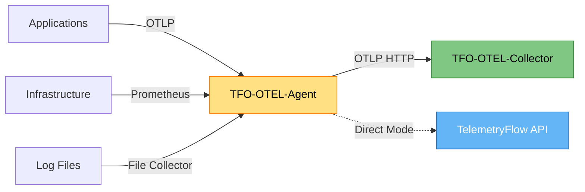
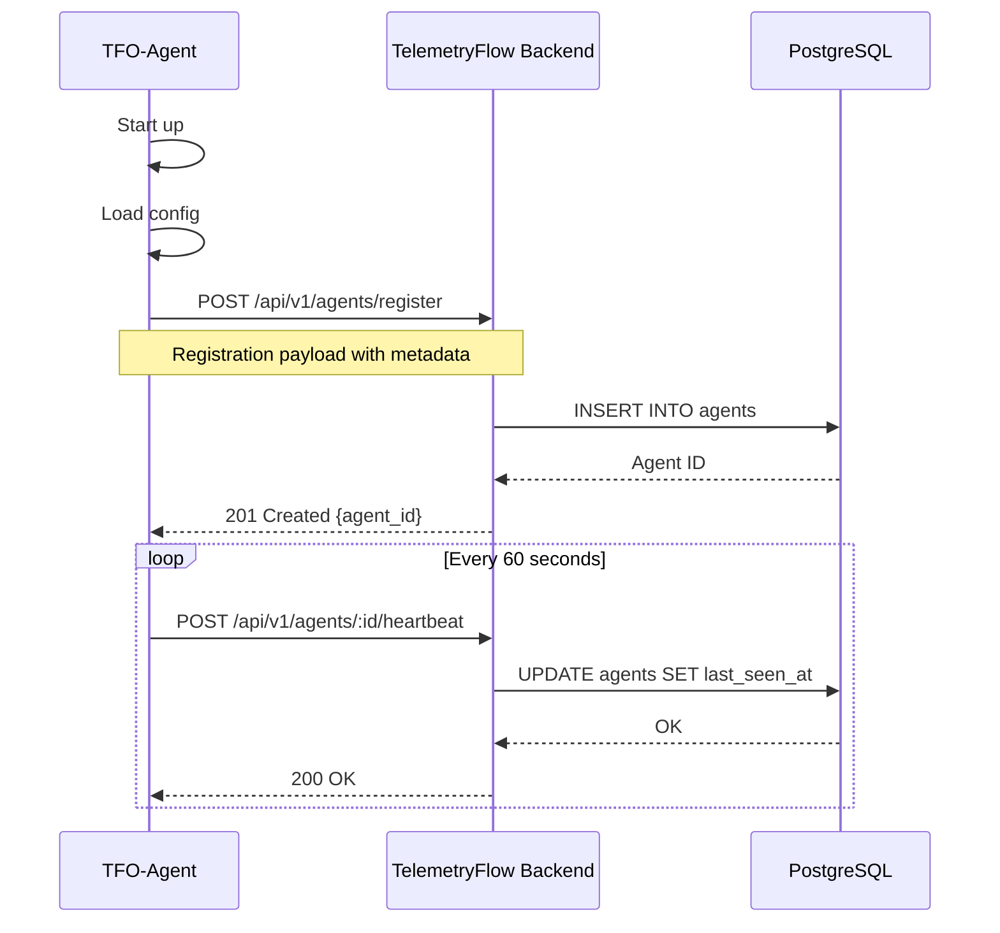
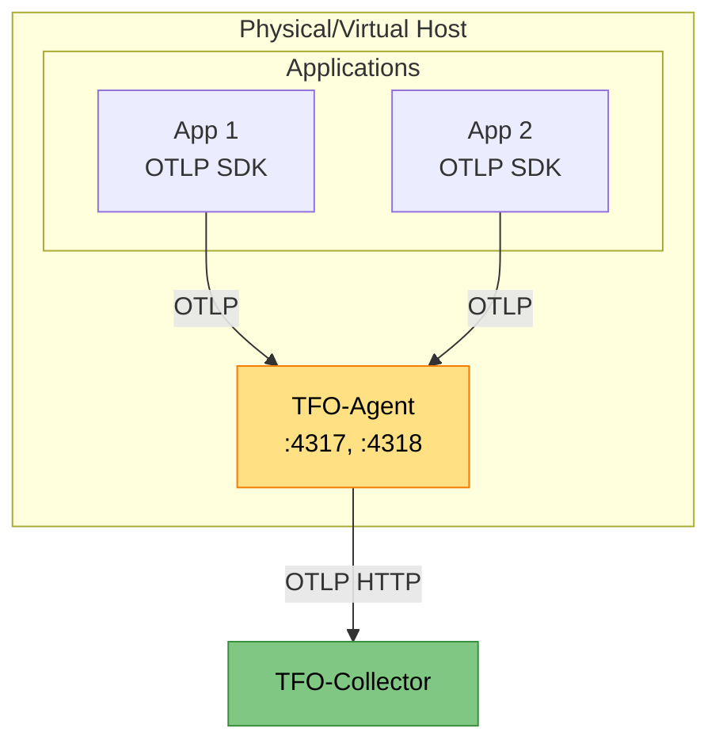

# TFO-OTEL-Agent Documentation

- **Version:** 1.1.1-CE
- **Last Updated:** December 2025
- **Component:** TelemetryFlow Agent (Edge Telemetry Collector)
- **Go Version:** 1.24+
- **OpenTelemetry SDK:** v1.39.0
- **Status:** Production Ready

---

## Table of Contents

1. [Overview](#overview)
2. [Features](#features)
3. [Installation](#installation)
4. [Configuration](#configuration)
5. [CLI Commands](#cli-commands)
6. [Auto-Registration](#auto-registration)
7. [Deployment Patterns](#deployment-patterns)
8. [Monitoring](#monitoring)
9. [High Availability](#high-availability)
10. [Troubleshooting](#troubleshooting)
11. [Best Practices](#best-practices)

---

## Overview

**TFO-OTEL-Agent** is an enterprise-grade telemetry collection agent built on **OpenTelemetry Go SDK v1.39.0**. It is a custom Go implementation providing comprehensive system monitoring with metrics collection, heartbeat monitoring, and OTLP telemetry export for the **TelemetryFlow Platform**.

The agent is aligned with the TelemetryFlow ecosystem using the same OTEL SDK version as TFO-Go-SDK v1.1.1.

This agent works as the **client-side counterpart** to the TelemetryFlow Backend Agent Module, providing:

- Agent registration & lifecycle management
- Heartbeat & health monitoring
- System metrics collection
- OTLP telemetry export

### Key Characteristics

- **Custom Go Implementation**: Built with Go 1.24+, custom Cobra CLI
- **Lightweight**: ~50MB RAM, <1% CPU (idle), ~5% CPU (peak)
- **Edge Optimized**: Designed for resource-constrained environments
- **Auto-Registration**: Automatically registers with TelemetryFlow Platform
- **Disk-Backed Buffer**: Persistent queue for network outage resilience
- **Multi-Protocol**: OTLP gRPC/HTTP, Prometheus scraping, Log collection
- **Cross-Platform**: Linux, macOS, and Windows support

### Architecture Role



### Project Structure

```
telemetryflow-agent/
├── cmd/tfo-agent/           # CLI entry point
│   └── main.go              # Cobra CLI with banner
├── internal/                # Core implementation (DDD)
│   ├── agent/               # Core agent lifecycle
│   ├── buffer/              # Disk-backed retry buffer
│   ├── collector/           # Metric collectors
│   │   └── system/          # System metrics collector
│   ├── config/              # Configuration management
│   ├── exporter/            # OTLP data exporters (SDK v1.39.0)
│   └── version/             # Version and banner info
├── pkg/                     # LEGO Building Blocks
│   ├── api/                 # HTTP API client
│   ├── banner/              # Startup banner
│   ├── config/              # Config loader utilities
│   └── plugin/              # Plugin registry system
├── tests/                   # Comprehensive testing (DDD)
│   ├── unit/                # Unit tests
│   │   ├── domain/          # Domain layer tests
│   │   │   ├── agent/       # Agent tests
│   │   │   ├── plugin/      # Plugin tests
│   │   │   └── telemetry/   # Telemetry tests
│   │   ├── application/     # Application layer tests
│   │   ├── infrastructure/  # Infrastructure layer tests
│   │   │   ├── api/         # API client tests
│   │   │   ├── buffer/      # Buffer tests
│   │   │   ├── config/      # Config tests
│   │   │   └── exporter/    # Exporter tests
│   │   └── presentation/    # CLI/Banner tests
│   ├── integration/         # Integration tests
│   ├── e2e/                 # End-to-end tests
│   ├── mocks/               # Mock implementations
│   └── fixtures/            # Test fixtures
├── docs/                    # Documentation
├── configs/                 # Configuration templates
├── scripts/                 # Build/install scripts
├── build/                   # Build output
├── Makefile
├── Dockerfile
├── docker-compose.yml
├── .env.example
└── README.md
```

---

## Features

### OpenTelemetry SDK v1.39.0

- **OpenTelemetry Native**: Built on OTEL Go SDK v1.39.0 (aligned with TFO-Go-SDK)
- **OTLP Export**: OpenTelemetry Protocol for metrics, logs, and traces
- **Multi-Signal Support**: Metrics, logs, and traces collection
- **SDK Alignment**: Uses same OTEL SDK version as TFO-Go-SDK for compatibility

### Agent Lifecycle (Backend Integration)

- **Agent Registration**: Auto-register with TelemetryFlow backend
- **Heartbeat Monitoring**: Regular health checks to backend
- **Health Status Sync**: Report agent health and system info
- **Activation/Deactivation**: Remote agent control from backend

### System Monitoring

- **System Metrics Collection**: CPU, memory, disk, and network metrics
- **Process Monitoring**: Track running processes
- **Resource Detection**: Auto-detect host, OS, and container info

### Reliability

- **Disk-Backed Buffer**: Resilient retry buffer for offline scenarios
- **Auto-Reconnection**: Automatic retry with exponential backoff
- **Graceful Shutdown**: Signal handling (SIGINT, SIGTERM, SIGHUP)

### LEGO Building Blocks

The `pkg/` directory contains reusable building blocks:

| Block | Description |
|-------|-------------|
| `pkg/banner` | ASCII art startup banner |
| `pkg/config` | Flexible configuration loader |
| `pkg/plugin` | Plugin registry for extensibility |
| `pkg/api` | HTTP client for backend communication |

---

## Installation

### Method 1: From Source

```bash
# Clone the repository
git clone https://github.com/telemetryflow/telemetryflow-agent.git
cd telemetryflow-agent

# Build
make build

# Run
./build/tfo-agent --help
```

### Method 2: Docker Compose (Recommended)

```bash
# Copy environment template
cp .env.example .env

# Edit .env with your configuration
vim .env

# Build and start
docker-compose up -d --build

# View logs
docker-compose logs -f tfo-agent

# Stop
docker-compose down
```

### Method 3: Docker Directly

```bash
# Build image
docker build \
  --build-arg VERSION=1.1.0 \
  --build-arg GIT_COMMIT=$(git rev-parse --short HEAD) \
  --build-arg GIT_BRANCH=$(git rev-parse --abbrev-ref HEAD) \
  --build-arg BUILD_TIME=$(date -u '+%Y-%m-%dT%H:%M:%SZ') \
  -t telemetryflow/telemetryflow-agent:1.1.1 .

# Run container
docker run -d --name tfo-agent \
  -p 4317:4317 \
  -p 4318:4318 \
  -p 8888:8888 \
  -p 13133:13133 \
  -v /path/to/config.yaml:/etc/tfo-agent/tfo-agent.yaml:ro \
  -v /var/lib/tfo-agent:/var/lib/tfo-agent \
  telemetryflow/telemetryflow-agent:1.1.1
```

### Method 4: Kubernetes (DaemonSet)

```yaml
apiVersion: v1
kind: Namespace
metadata:
  name: observability

---
apiVersion: v1
kind: ConfigMap
metadata:
  name: tfo-agent-config
  namespace: observability
data:
  tfo-agent.yaml: |
    agent:
      description: "TelemetryFlow Agent - K8s"
      tags:
        environment: "production"
        cluster: "main"

    collectors:
      metrics:
        enabled: true
        interval: 30s
        cpu:
          enabled: true
        memory:
          enabled: true
        disk:
          enabled: true
        network:
          enabled: true

    receivers:
      otlp:
        enabled: true
        protocols:
          grpc:
            enabled: true
            endpoint: "0.0.0.0:4317"
          http:
            enabled: true
            endpoint: "0.0.0.0:4318"

    processors:
      batch:
        enabled: true
        send_batch_size: 8192
        timeout: 200ms
      memory_limiter:
        enabled: true
        limit_percentage: 80

    exporter:
      otlp:
        enabled: true
        endpoint: "http://tfo-collector.observability.svc.cluster.local:4317"
        compression: "gzip"

    buffer:
      enabled: true
      path: "/var/lib/tfo-agent/buffer"
      max_size_mb: 100

    heartbeat:
      enabled: true
      interval: 60s

    extensions:
      health_check:
        enabled: true
        endpoint: "0.0.0.0:13133"

---
apiVersion: apps/v1
kind: DaemonSet
metadata:
  name: tfo-agent
  namespace: observability
  labels:
    app: tfo-agent
    version: "1.1.1-CE"
spec:
  selector:
    matchLabels:
      app: tfo-agent
  template:
    metadata:
      labels:
        app: tfo-agent
        version: "1.1.1-CE"
    spec:
      serviceAccountName: tfo-agent
      hostNetwork: true
      dnsPolicy: ClusterFirstWithHostNet

      containers:
      - name: tfo-agent
        image: telemetryflow/telemetryflow-agent:1.1.1
        imagePullPolicy: IfNotPresent

        args:
          - start
          - --config=/etc/tfo-agent/tfo-agent.yaml

        env:
        - name: HOSTNAME
          valueFrom:
            fieldRef:
              fieldPath: spec.nodeName
        - name: HOST_IP
          valueFrom:
            fieldRef:
              fieldPath: status.hostIP
        - name: K8S_NODE_NAME
          valueFrom:
            fieldRef:
              fieldPath: spec.nodeName
        - name: TELEMETRYFLOW_API_ENDPOINT
          value: "https://api.telemetryflow.id"
        - name: TELEMETRYFLOW_API_KEY_ID
          valueFrom:
            secretKeyRef:
              name: telemetryflow-secrets
              key: api-key-id
        - name: TELEMETRYFLOW_API_KEY_SECRET
          valueFrom:
            secretKeyRef:
              name: telemetryflow-secrets
              key: api-key-secret

        ports:
        - name: otlp-grpc
          containerPort: 4317
          hostPort: 4317
          protocol: TCP
        - name: otlp-http
          containerPort: 4318
          hostPort: 4318
          protocol: TCP
        - name: health
          containerPort: 13133
          protocol: TCP

        livenessProbe:
          httpGet:
            path: /
            port: 13133
          initialDelaySeconds: 30
          periodSeconds: 30

        readinessProbe:
          httpGet:
            path: /
            port: 13133
          initialDelaySeconds: 10
          periodSeconds: 10

        resources:
          requests:
            memory: "128Mi"
            cpu: "100m"
          limits:
            memory: "256Mi"
            cpu: "500m"

        volumeMounts:
        - name: config
          mountPath: /etc/tfo-agent
        - name: buffer-storage
          mountPath: /var/lib/tfo-agent

      volumes:
      - name: config
        configMap:
          name: tfo-agent-config
      - name: buffer-storage
        hostPath:
          path: /var/lib/tfo-agent
          type: DirectoryOrCreate

---
apiVersion: v1
kind: ServiceAccount
metadata:
  name: tfo-agent
  namespace: observability

---
apiVersion: rbac.authorization.k8s.io/v1
kind: ClusterRole
metadata:
  name: tfo-agent
rules:
- apiGroups: [""]
  resources:
    - nodes
    - nodes/proxy
    - services
    - endpoints
    - pods
  verbs: ["get", "list", "watch"]

---
apiVersion: rbac.authorization.k8s.io/v1
kind: ClusterRoleBinding
metadata:
  name: tfo-agent
roleRef:
  apiGroup: rbac.authorization.k8s.io
  kind: ClusterRole
  name: tfo-agent
subjects:
- kind: ServiceAccount
  name: tfo-agent
  namespace: observability
```

### Method 5: Systemd Service

```bash
# Install binary
sudo make install

# Or manually
sudo cp ./build/tfo-agent /usr/local/bin/tfo-agent
sudo chmod +x /usr/local/bin/tfo-agent

# Create directories
sudo mkdir -p /etc/tfo-agent
sudo mkdir -p /var/lib/tfo-agent/buffer
sudo mkdir -p /var/log/tfo-agent

# Copy config
sudo cp configs/tfo-agent.yaml /etc/tfo-agent/

# Create service user
sudo useradd -r -s /bin/false telemetryflow

# Set permissions
sudo chown -R telemetryflow:telemetryflow /etc/tfo-agent
sudo chown -R telemetryflow:telemetryflow /var/lib/tfo-agent
sudo chown -R telemetryflow:telemetryflow /var/log/tfo-agent
```

Create systemd service:

```bash
sudo tee /etc/systemd/system/tfo-agent.service > /dev/null <<EOF
[Unit]
Description=TelemetryFlow Agent
After=network.target

[Service]
Type=simple
User=telemetryflow
Group=telemetryflow
ExecStart=/usr/local/bin/tfo-agent start --config /etc/tfo-agent/tfo-agent.yaml
Restart=always
RestartSec=5

# Security
NoNewPrivileges=true
PrivateTmp=true
ProtectSystem=strict
ProtectHome=true
ReadWritePaths=/var/lib/tfo-agent

[Install]
WantedBy=multi-user.target
EOF
```

Enable and start:

```bash
sudo systemctl daemon-reload
sudo systemctl enable tfo-agent
sudo systemctl start tfo-agent
sudo systemctl status tfo-agent
```

---

## Configuration

TelemetryFlow Agent uses a **custom YAML configuration format** with `enabled` flags for easy feature toggling. This differs from the standard OpenTelemetry Collector configuration format.

### Configuration File Locations

The agent searches for configuration in the following order:

1. Path specified via `--config` flag
2. `./configs/tfo-agent.yaml` (current directory)
3. `~/.tfo-agent/tfo-agent.yaml` (user home)
4. `/etc/tfo-agent/tfo-agent.yaml` (system)

### Minimal Configuration

```yaml
agent:
  description: "TelemetryFlow Agent"

collectors:
  metrics:
    enabled: true
    interval: 60s

exporter:
  otlp:
    enabled: true
    endpoint: "http://tfo-collector:4317"
```

### Production Configuration

```yaml
# =============================================================================
# TelemetryFlow Agent Configuration - Production
# =============================================================================

agent:
  id: ""                           # Auto-generated if empty
  hostname: ""                     # Auto-detected if empty
  description: "Production Agent"
  tags:
    environment: "production"
    datacenter: "dc1"

# -----------------------------------------------------------------------------
# Collectors
# -----------------------------------------------------------------------------
collectors:
  metrics:
    enabled: true
    interval: 30s
    cpu:
      enabled: true
      per_cpu: true
    memory:
      enabled: true
    disk:
      enabled: true
      mount_points: ["/", "/data"]
    network:
      enabled: true
      interfaces: ["eth0", "ens*"]

  logs:
    enabled: true
    paths:
      - /var/log/app/*.log
    exclude_paths:
      - /var/log/*.gz

  traces:
    enabled: true

# -----------------------------------------------------------------------------
# Receivers
# -----------------------------------------------------------------------------
receivers:
  otlp:
    enabled: true
    protocols:
      grpc:
        enabled: true
        endpoint: "0.0.0.0:4317"
      http:
        enabled: true
        endpoint: "0.0.0.0:4318"

# -----------------------------------------------------------------------------
# Processors
# -----------------------------------------------------------------------------
processors:
  batch:
    enabled: true
    send_batch_size: 8192
    timeout: 200ms

  memory_limiter:
    enabled: true
    limit_percentage: 80
    spike_limit_percentage: 25

  resource_detection:
    enabled: true
    detectors: [env, system, docker]

# -----------------------------------------------------------------------------
# Exporter
# -----------------------------------------------------------------------------
exporter:
  otlp:
    enabled: true
    endpoint: "http://tfo-collector:4317"
    compression: "gzip"
    retry:
      enabled: true
      initial_interval: 5s
      max_interval: 30s
    queue:
      enabled: true
      queue_size: 5000

# -----------------------------------------------------------------------------
# Buffer
# -----------------------------------------------------------------------------
buffer:
  enabled: true
  path: "/var/lib/tfo-agent/buffer"
  max_size_mb: 500
  flush_interval: 5s

# -----------------------------------------------------------------------------
# Heartbeat
# -----------------------------------------------------------------------------
heartbeat:
  enabled: true
  interval: 60s
  timeout: 10s

# -----------------------------------------------------------------------------
# Extensions
# -----------------------------------------------------------------------------
extensions:
  health_check:
    enabled: true
    endpoint: "0.0.0.0:13133"

# -----------------------------------------------------------------------------
# Logging
# -----------------------------------------------------------------------------
logging:
  level: "info"
  format: "json"
```

### Environment Variable Substitution

Configuration values can reference environment variables:

```yaml
exporter:
  otlp:
    endpoint: "${COLLECTOR_ENDPOINT:-http://localhost:4317}"
    headers:
      X-API-Key: "${TFO_API_KEY}"
```

---

## CLI Commands

TelemetryFlow Agent provides a custom Cobra CLI with the following commands:

### Start Agent

```bash
# Start with default config
tfo-agent start

# Start with custom config
tfo-agent start --config /path/to/config.yaml

# Start with debug logging
TELEMETRYFLOW_LOG_LEVEL=debug tfo-agent start
```

### Validate Configuration

```bash
# Validate and show parsed config
tfo-agent config validate --config /path/to/config.yaml
```

### Show Version

```bash
tfo-agent version

# Output:
# TelemetryFlow Agent
# Version:    1.1.1-CE
# Git Commit: abc1234
# Git Branch: main
# Build Time: 2025-12-26T00:00:00Z
# Go Version: go1.24
```

### Help

```bash
tfo-agent --help
tfo-agent start --help
```

---

## Auto-Registration

TFO-OTEL-Agent automatically registers with TelemetryFlow Platform and sends periodic heartbeats.

### Registration Flow



### Agent Registration Payload

```json
{
  "agent_id": "auto-generated-uuid",
  "version": "1.1.1",
  "hostname": "prod-node-01",
  "ip_address": "10.0.1.15",
  "capabilities": ["otlp_grpc", "otlp_http", "system_metrics"],
  "resource_attributes": {
    "os.type": "linux",
    "os.description": "Ubuntu 22.04",
    "host.arch": "amd64"
  },
  "tags": {
    "environment": "production",
    "datacenter": "dc1"
  }
}
```

### Heartbeat Configuration

```yaml
heartbeat:
  enabled: true
  interval: 60s      # Heartbeat interval
  timeout: 10s       # Request timeout
  max_retries: 3     # Max retries before marking failed
```

---

## Deployment Patterns

### Pattern 1: Per-Host Agent

**Use Case:** Monitor individual servers (VMs, bare metal)



### Pattern 2: Kubernetes DaemonSet

**Use Case:** Monitor all nodes in Kubernetes cluster

See [Kubernetes Installation](#method-4-kubernetes-daemonset) for full manifest.

### Pattern 3: Sidecar Container

**Use Case:** Application-specific telemetry collection

```yaml
apiVersion: apps/v1
kind: Deployment
metadata:
  name: my-application
spec:
  template:
    spec:
      containers:
      # Main application
      - name: app
        image: my-app:latest
        env:
        - name: OTEL_EXPORTER_OTLP_ENDPOINT
          value: "http://localhost:4318"

      # Sidecar agent
      - name: tfo-agent
        image: telemetryflow/telemetryflow-agent:1.1.1
        args: ["start", "--config=/etc/tfo-agent/config.yaml"]
        ports:
        - containerPort: 4317
        - containerPort: 4318
        resources:
          requests:
            memory: "64Mi"
            cpu: "50m"
          limits:
            memory: "128Mi"
            cpu: "200m"
```

### Pattern 4: Edge Gateway

**Use Case:** IoT, edge computing with intermittent connectivity

```yaml
# Edge-optimized configuration
buffer:
  enabled: true
  path: "/var/lib/tfo-agent/buffer"
  max_size_mb: 500              # Large buffer for offline storage

exporter:
  otlp:
    enabled: true
    endpoint: "https://cloud-collector:4317"
    retry:
      enabled: true
      initial_interval: 10s
      max_interval: 300s
      max_elapsed_time: 3600s   # Retry for 1 hour
```

---

## Monitoring

### Collected Metrics

| Metric | Type | Description |
|--------|------|-------------|
| `system.cpu.usage` | gauge | CPU usage percentage |
| `system.cpu.cores` | gauge | Number of CPU cores |
| `system.memory.total` | gauge | Total memory (bytes) |
| `system.memory.used` | gauge | Used memory (bytes) |
| `system.memory.usage` | gauge | Memory usage percentage |
| `system.disk.total` | gauge | Total disk space (bytes) |
| `system.disk.used` | gauge | Used disk space (bytes) |
| `system.disk.usage` | gauge | Disk usage percentage |
| `system.network.bytes_sent` | counter | Total bytes sent |
| `system.network.bytes_recv` | counter | Total bytes received |

### Health Check

```bash
# Agent health
curl http://localhost:13133/

# Expected response: HTTP 200
```

### Internal Metrics

When Prometheus exporter is enabled:

```bash
curl http://localhost:8888/metrics
```

---

## High Availability

### Persistent Buffer

```yaml
buffer:
  enabled: true
  path: "/var/lib/tfo-agent/buffer"
  max_size_mb: 500
```

### Retry Configuration

```yaml
exporter:
  otlp:
    retry:
      enabled: true
      initial_interval: 5s
      max_interval: 30s
      max_elapsed_time: 300s
```

### Graceful Shutdown

The agent handles signals for graceful shutdown:

- **SIGINT/SIGTERM**: Flush buffers and exit
- **SIGHUP**: Reload configuration (hot reload)

---

## Troubleshooting

### Issue 1: Agent Not Starting

```bash
# Check logs
docker logs tfo-agent

# Or for systemd
sudo journalctl -u tfo-agent -f

# Validate config
tfo-agent config validate --config /etc/tfo-agent/tfo-agent.yaml
```

### Issue 2: Agent Not Registering

```bash
# Check API connectivity
curl -v https://api.telemetryflow.id/health

# Verify credentials
echo $TELEMETRYFLOW_API_KEY_ID
echo $TELEMETRYFLOW_API_KEY_SECRET
```

### Issue 3: High Memory Usage

```yaml
# Reduce memory usage
processors:
  memory_limiter:
    enabled: true
    limit_percentage: 60      # Lower limit

  batch:
    send_batch_size: 256      # Smaller batches
```

### Issue 4: Buffer Filling Up

```bash
# Check buffer disk usage
du -sh /var/lib/tfo-agent/buffer

# Clear buffer (data will be lost)
rm -rf /var/lib/tfo-agent/buffer/*
```

---

## Best Practices

### 1. Enable Memory Limiter

```yaml
processors:
  memory_limiter:
    enabled: true
    limit_percentage: 80
```

### 2. Configure Disk Buffer

```yaml
buffer:
  enabled: true
  max_size_mb: 500
```

### 3. Use Compression

```yaml
exporter:
  otlp:
    compression: "gzip"    # Reduces bandwidth ~70%
```

### 4. Enable Heartbeat Monitoring

```yaml
heartbeat:
  enabled: true
  interval: 60s
```

### 5. Use Environment Variables for Secrets

```yaml
exporter:
  otlp:
    headers:
      X-API-Key: "${TFO_API_KEY}"   # Not hardcoded
```

---

## Development

### Build Commands

```bash
# Show all commands
make help

# Build
make build              # Build agent for current platform
make build-all          # Build for all platforms

# Run
make run                # Build and run agent
make dev                # Run with go run (faster for development)

# Test
make test               # Run tests
make test-coverage      # Run tests with coverage

# Quality
make lint               # Run linter
make fmt                # Format code
make vet                # Run go vet

# Install
make install            # Install to /usr/local/bin
make uninstall          # Uninstall

# Docker
make docker-build       # Build Docker image
make docker-push        # Push Docker image
```

---

## Documentation

| Document | Description |
|----------|-------------|
| [README](docs/README.md) | Documentation overview |
| [ARCHITECTURE](docs/ARCHITECTURE.md) | System architecture with diagrams |
| [INSTALLATION](docs/INSTALLATION.md) | Installation guide |
| [CONFIGURATION](docs/CONFIGURATION.md) | Configuration reference |
| [COMMANDS](docs/COMMANDS.md) | CLI commands reference |
| [DEVELOPMENT](docs/DEVELOPMENT.md) | Development guide and standards |
| [TROUBLESHOOTING](docs/TROUBLESHOOTING.md) | Common issues and solutions |
| [GITHUB-WORKFLOWS](docs/GITHUB-WORKFLOWS.md) | CI/CD workflows |
| [CHANGELOG](CHANGELOG.md) | Version history |

---

## Links

- **Website**: [https://telemetryflow.id](https://telemetryflow.id)
- **Documentation**: [https://docs.telemetryflow.id](https://docs.telemetryflow.id)
- **OpenTelemetry**: [https://opentelemetry.io](https://opentelemetry.io)
- **Repository**: [https://github.com/telemetryflow/telemetryflow-agent](https://github.com/telemetryflow/telemetryflow-agent)
- **Developer**: [DevOpsCorner Indonesia](https://devopscorner.id)

---

**Version:** 1.1.1-CE | **Component:** TFO-OTEL-Agent | **OTEL SDK:** v1.39.0 | **Last Updated:** December 2025
