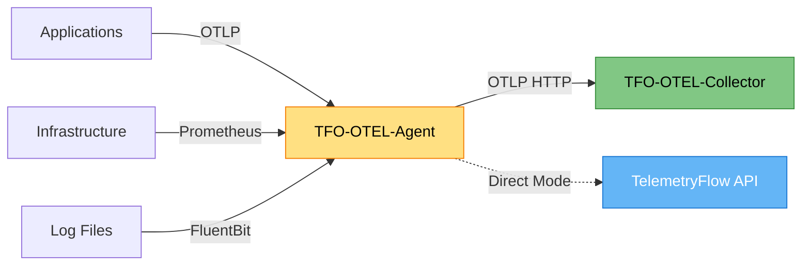
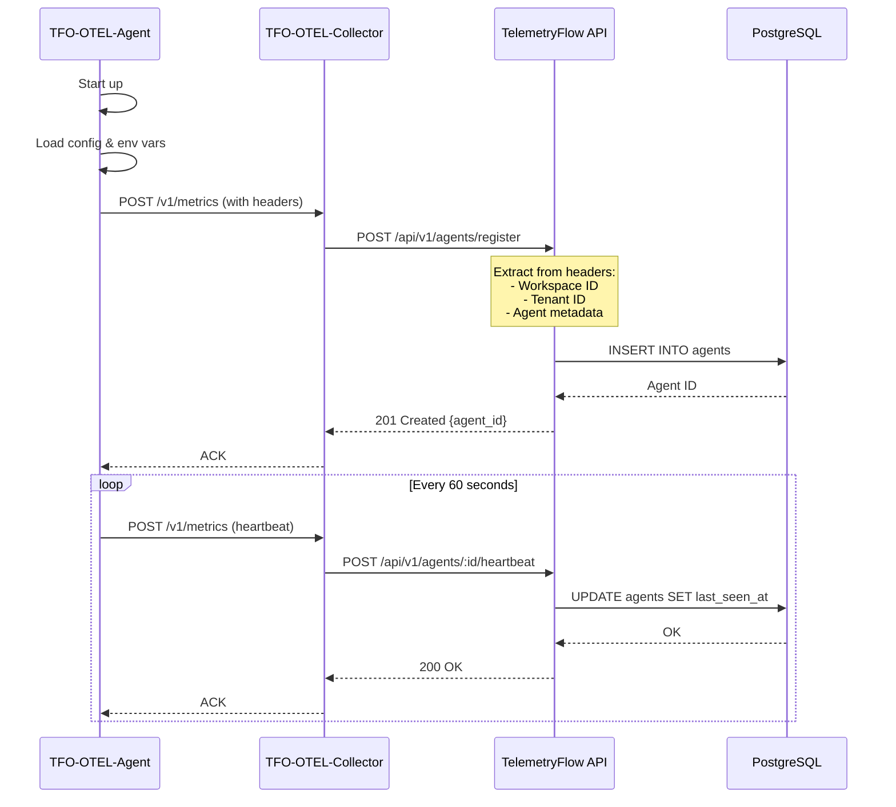
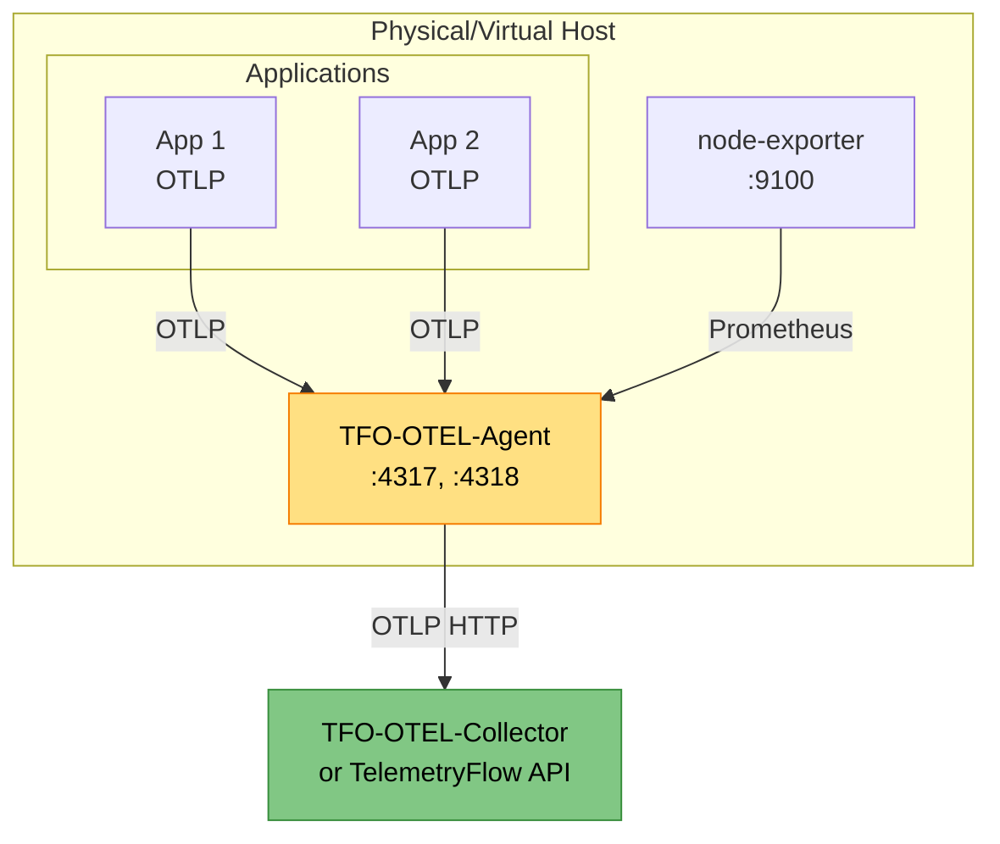
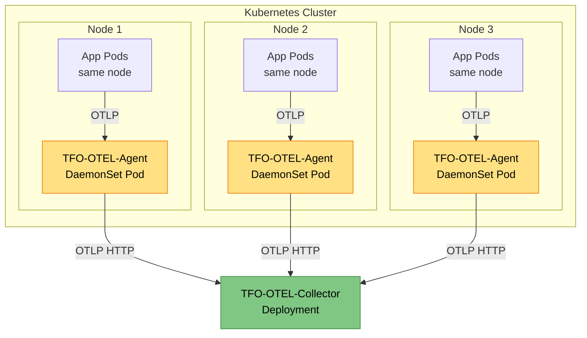

# TFO-OTEL-Agent Documentation

- **Version:** 1.0.0-CE
- **Last Updated:** December 13, 2025
- **Component:** Edge Telemetry Collector
- **Base Image:** otel/opentelemetry-collector-contrib:0.88.0

---

## Table of Contents

1. [Overview](#overview)
2. [Installation](#installation)
3. [Configuration](#configuration)
4. [Auto-Registration](#auto-registration)
5. [Deployment Patterns](#deployment-patterns)
6. [Monitoring](#monitoring)
7. [High Availability](#high-availability)
8. [Troubleshooting](#troubleshooting)
9. [Best Practices](#best-practices)

---

## Overview

**TFO-OTEL-Agent** is a lightweight edge telemetry collector designed for distributed deployments. It runs on edge nodes, application servers, or Kubernetes clusters to collect telemetry data locally and forward it to TFO-OTEL-Collector or directly to TelemetryFlow Platform.

### Key Characteristics

- **Lightweight**: ~50MB RAM, <1% CPU (idle), ~5% CPU (peak)
- **Edge Optimized**: Designed for resource-constrained environments
- **Auto-Registration**: Automatically registers with TelemetryFlow Platform
- **Local Buffering**: Persistent queue for network outage resilience
- **Multi-Protocol**: OTLP gRPC/HTTP, Prometheus scraping, FluentBit logs

### Architecture Role



### Use Cases

1. **Per-Host Deployment**: One agent per physical/virtual server
2. **Per-Cluster Deployment**: DaemonSet on Kubernetes nodes
3. **Edge Computing**: IoT gateways with intermittent connectivity
4. **Application Sidecar**: Co-located with microservices

---

## Installation

### Method 1: Docker

#### Basic Deployment

```bash
docker run -d \
  --name tfo-otel-agent \
  --hostname $(hostname) \
  -p 4317:4317 \
  -p 4318:4318 \
  -e TELEMETRYFLOW_ENDPOINT=http://tfo-collector:4318 \
  -e TELEMETRYFLOW_WORKSPACE_ID=your-workspace-id \
  -e TELEMETRYFLOW_TENANT_ID=your-tenant-id \
  -e AGENT_HOSTNAME=$(hostname) \
  -e AGENT_IP=$(hostname -I | awk '{print $1}') \
  -v $(pwd)/config/otel-agent-config.yaml:/etc/otel-agent-config.yaml \
  -v /var/lib/otel-agent:/var/lib/otelcol \
  otel/opentelemetry-collector-contrib:0.88.0 \
  --config=/etc/otel-agent-config.yaml
```

#### With Persistent Queue

```bash
docker run -d \
  --name tfo-otel-agent \
  -p 4317:4317 \
  -p 4318:4318 \
  -e TELEMETRYFLOW_ENDPOINT=http://tfo-collector:4318 \
  -e TELEMETRYFLOW_WORKSPACE_ID=your-workspace-id \
  -e TELEMETRYFLOW_TENANT_ID=your-tenant-id \
  -v $(pwd)/config/otel-agent-config.yaml:/etc/otel-agent-config.yaml \
  -v /var/lib/otel-agent/queue:/var/lib/otelcol/queue \
  --restart unless-stopped \
  otel/opentelemetry-collector-contrib:0.88.0 \
  --config=/etc/otel-agent-config.yaml
```

### Method 2: Kubernetes (DaemonSet)

#### DaemonSet Deployment

```yaml
apiVersion: v1
kind: Namespace
metadata:
  name: observability

---
apiVersion: v1
kind: ConfigMap
metadata:
  name: otel-agent-config
  namespace: observability
data:
  config.yaml: |
    receivers:
      otlp:
        protocols:
          grpc:
            endpoint: 0.0.0.0:4317
          http:
            endpoint: 0.0.0.0:4318

      prometheus:
        config:
          scrape_configs:
            # Scrape node-exporter on same node
            - job_name: 'node-exporter'
              static_configs:
                - targets: ['localhost:9100']

            # Scrape kubelet metrics
            - job_name: 'kubelet'
              kubernetes_sd_configs:
                - role: node
              scheme: https
              tls_config:
                ca_file: /var/run/secrets/kubernetes.io/serviceaccount/ca.crt
              bearer_token_file: /var/run/secrets/kubernetes.io/serviceaccount/token

      # Log collection
      filelog:
        include:
          - /var/log/pods/**/*.log
        include_file_path: true
        include_file_name: false
        operators:
          - type: json_parser
            timestamp:
              parse_from: attributes.time
              layout: '%Y-%m-%dT%H:%M:%S.%LZ'

    processors:
      batch:
        timeout: 10s
        send_batch_size: 512
        send_batch_max_size: 1024

      memory_limiter:
        limit_mib: 256
        spike_limit_mib: 64
        check_interval: 1s

      resource:
        attributes:
          - key: host.name
            value: ${env:HOSTNAME}
            action: upsert
          - key: host.ip
            value: ${env:HOST_IP}
            action: upsert
          - key: k8s.node.name
            value: ${env:K8S_NODE_NAME}
            action: upsert

      attributes:
        actions:
          - key: telemetryflow.workspace.id
            value: ${env:TELEMETRYFLOW_WORKSPACE_ID}
            action: upsert
          - key: telemetryflow.tenant.id
            value: ${env:TELEMETRYFLOW_TENANT_ID}
            action: upsert
          - key: agent.version
            value: "1.0.0-CE"
            action: upsert
          - key: agent.type
            value: "tfo-otel-agent"
            action: upsert

    exporters:
      otlphttp:
        endpoint: ${env:TELEMETRYFLOW_ENDPOINT}
        headers:
          X-Workspace-Id: "${env:TELEMETRYFLOW_WORKSPACE_ID}"
          X-Tenant-Id: "${env:TELEMETRYFLOW_TENANT_ID}"
        compression: gzip
        retry_on_failure:
          enabled: true
          initial_interval: 5s
          max_interval: 30s
          max_elapsed_time: 300s
        sending_queue:
          enabled: true
          num_consumers: 10
          queue_size: 5000
          storage: file_storage

      logging:
        loglevel: info

    extensions:
      health_check:
        endpoint: 0.0.0.0:13133

      file_storage:
        directory: /var/lib/otelcol/queue
        timeout: 10s

    service:
      extensions: [health_check, file_storage]

      pipelines:
        metrics:
          receivers: [otlp, prometheus]
          processors: [memory_limiter, resource, attributes, batch]
          exporters: [otlphttp, logging]

        logs:
          receivers: [otlp, filelog]
          processors: [memory_limiter, resource, attributes, batch]
          exporters: [otlphttp, logging]

        traces:
          receivers: [otlp]
          processors: [memory_limiter, resource, attributes, batch]
          exporters: [otlphttp, logging]

---
apiVersion: apps/v1
kind: DaemonSet
metadata:
  name: tfo-otel-agent
  namespace: observability
  labels:
    app: tfo-otel-agent
    version: "1.0.0-CE"
spec:
  selector:
    matchLabels:
      app: tfo-otel-agent
  template:
    metadata:
      labels:
        app: tfo-otel-agent
        version: "1.0.0-CE"
    spec:
      serviceAccountName: tfo-otel-agent
      hostNetwork: true
      dnsPolicy: ClusterFirstWithHostNet

      containers:
      - name: otel-agent
        image: otel/opentelemetry-collector-contrib:0.88.0
        imagePullPolicy: IfNotPresent

        args:
          - "--config=/etc/otel-agent/config.yaml"

        env:
        - name: HOSTNAME
          valueFrom:
            fieldRef:
              fieldPath: spec.nodeName
        - name: HOST_IP
          valueFrom:
            fieldRef:
              fieldPath: status.hostIP
        - name: K8S_NODE_NAME
          valueFrom:
            fieldRef:
              fieldPath: spec.nodeName
        - name: TELEMETRYFLOW_ENDPOINT
          value: "http://tfo-otel-collector.observability.svc.cluster.local:4318"
        - name: TELEMETRYFLOW_WORKSPACE_ID
          valueFrom:
            secretKeyRef:
              name: telemetryflow-secrets
              key: workspace-id
        - name: TELEMETRYFLOW_TENANT_ID
          valueFrom:
            secretKeyRef:
              name: telemetryflow-secrets
              key: tenant-id

        ports:
        - name: otlp-grpc
          containerPort: 4317
          hostPort: 4317
          protocol: TCP
        - name: otlp-http
          containerPort: 4318
          hostPort: 4318
          protocol: TCP
        - name: health
          containerPort: 13133
          protocol: TCP

        livenessProbe:
          httpGet:
            path: /
            port: 13133
          initialDelaySeconds: 30
          periodSeconds: 30

        readinessProbe:
          httpGet:
            path: /
            port: 13133
          initialDelaySeconds: 10
          periodSeconds: 10

        resources:
          requests:
            memory: "128Mi"
            cpu: "100m"
          limits:
            memory: "256Mi"
            cpu: "500m"

        volumeMounts:
        - name: config
          mountPath: /etc/otel-agent
        - name: varlog
          mountPath: /var/log
          readOnly: true
        - name: varlibdockercontainers
          mountPath: /var/lib/docker/containers
          readOnly: true
        - name: queue-storage
          mountPath: /var/lib/otelcol/queue

      volumes:
      - name: config
        configMap:
          name: otel-agent-config
      - name: varlog
        hostPath:
          path: /var/log
      - name: varlibdockercontainers
        hostPath:
          path: /var/lib/docker/containers
      - name: queue-storage
        hostPath:
          path: /var/lib/otel-agent/queue
          type: DirectoryOrCreate

---
apiVersion: v1
kind: ServiceAccount
metadata:
  name: tfo-otel-agent
  namespace: observability

---
apiVersion: rbac.authorization.k8s.io/v1
kind: ClusterRole
metadata:
  name: tfo-otel-agent
rules:
- apiGroups: [""]
  resources:
    - nodes
    - nodes/proxy
    - services
    - endpoints
    - pods
  verbs: ["get", "list", "watch"]
- apiGroups:
    - extensions
  resources:
    - ingresses
  verbs: ["get", "list", "watch"]

---
apiVersion: rbac.authorization.k8s.io/v1
kind: ClusterRoleBinding
metadata:
  name: tfo-otel-agent
roleRef:
  apiGroup: rbac.authorization.k8s.io
  kind: ClusterRole
  name: tfo-otel-agent
subjects:
- kind: ServiceAccount
  name: tfo-otel-agent
  namespace: observability
```

### Method 3: Systemd Service (Binary)

#### Install Binary

```bash
# Download collector binary
wget https://github.com/open-telemetry/opentelemetry-collector-releases/releases/download/v0.88.0/otelcol-contrib_0.88.0_linux_amd64.tar.gz

# Extract
tar -xzf otelcol-contrib_0.88.0_linux_amd64.tar.gz

# Move to system path
sudo mv otelcol-contrib /usr/local/bin/tfo-otel-agent
sudo chmod +x /usr/local/bin/tfo-otel-agent

# Create directories
sudo mkdir -p /etc/otel-agent
sudo mkdir -p /var/lib/otel-agent/queue
sudo mkdir -p /var/log/otel-agent
```

#### Create Systemd Service

```bash
sudo tee /etc/systemd/system/tfo-otel-agent.service > /dev/null <<EOF
[Unit]
Description=TelemetryFlow OTEL Agent
After=network.target

[Service]
Type=simple
User=otel
Group=otel
ExecStart=/usr/local/bin/tfo-otel-agent --config=/etc/otel-agent/config.yaml
Restart=always
RestartSec=10
StandardOutput=journal
StandardError=journal
SyslogIdentifier=tfo-otel-agent

# Environment variables
Environment="TELEMETRYFLOW_ENDPOINT=http://tfo-collector:4318"
Environment="TELEMETRYFLOW_WORKSPACE_ID=your-workspace-id"
Environment="TELEMETRYFLOW_TENANT_ID=your-tenant-id"
Environment="HOSTNAME=%H"

# Security
NoNewPrivileges=true
PrivateTmp=true
ProtectSystem=strict
ProtectHome=true
ReadWritePaths=/var/lib/otel-agent

[Install]
WantedBy=multi-user.target
EOF
```

#### Create User and Start Service

```bash
# Create service user
sudo useradd -r -s /bin/false otel

# Set permissions
sudo chown -R otel:otel /etc/otel-agent
sudo chown -R otel:otel /var/lib/otel-agent
sudo chown -R otel:otel /var/log/otel-agent

# Enable and start service
sudo systemctl daemon-reload
sudo systemctl enable tfo-otel-agent
sudo systemctl start tfo-otel-agent

# Check status
sudo systemctl status tfo-otel-agent
```

---

## Configuration

### Minimal Configuration

```yaml
receivers:
  otlp:
    protocols:
      grpc:
        endpoint: 0.0.0.0:4317
      http:
        endpoint: 0.0.0.0:4318

processors:
  batch:
    timeout: 10s
    send_batch_size: 512

  memory_limiter:
    limit_mib: 256
    check_interval: 1s

  attributes:
    actions:
      - key: telemetryflow.workspace.id
        value: ${env:TELEMETRYFLOW_WORKSPACE_ID}
        action: upsert
      - key: telemetryflow.tenant.id
        value: ${env:TELEMETRYFLOW_TENANT_ID}
        action: upsert

exporters:
  otlphttp:
    endpoint: ${env:TELEMETRYFLOW_ENDPOINT}
    headers:
      X-Workspace-Id: "${env:TELEMETRYFLOW_WORKSPACE_ID}"
      X-Tenant-Id: "${env:TELEMETRYFLOW_TENANT_ID}"
    compression: gzip

extensions:
  health_check:
    endpoint: 0.0.0.0:13133

service:
  extensions: [health_check]
  pipelines:
    metrics:
      receivers: [otlp]
      processors: [memory_limiter, attributes, batch]
      exporters: [otlphttp]
    logs:
      receivers: [otlp]
      processors: [memory_limiter, attributes, batch]
      exporters: [otlphttp]
    traces:
      receivers: [otlp]
      processors: [memory_limiter, attributes, batch]
      exporters: [otlphttp]
```

### Production Configuration with Resilience

```yaml
receivers:
  otlp:
    protocols:
      grpc:
        endpoint: 0.0.0.0:4317
        max_recv_msg_size_mib: 4
      http:
        endpoint: 0.0.0.0:4318

processors:
  batch:
    timeout: 10s
    send_batch_size: 512
    send_batch_max_size: 1024

  memory_limiter:
    limit_mib: 256
    spike_limit_mib: 64
    check_interval: 1s

  resource:
    attributes:
      - key: host.name
        value: ${env:HOSTNAME}
        action: upsert
      - key: host.ip
        value: ${env:HOST_IP}
        action: upsert

  attributes:
    actions:
      - key: telemetryflow.workspace.id
        value: ${env:TELEMETRYFLOW_WORKSPACE_ID}
        action: upsert
      - key: telemetryflow.tenant.id
        value: ${env:TELEMETRYFLOW_TENANT_ID}
        action: upsert
      - key: agent.version
        value: "1.0.0-CE"
        action: upsert

exporters:
  otlphttp:
    endpoint: ${env:TELEMETRYFLOW_ENDPOINT}
    headers:
      X-Workspace-Id: "${env:TELEMETRYFLOW_WORKSPACE_ID}"
      X-Tenant-Id: "${env:TELEMETRYFLOW_TENANT_ID}"
    compression: gzip
    timeout: 30s
    retry_on_failure:
      enabled: true
      initial_interval: 5s
      max_interval: 30s
      max_elapsed_time: 300s
    sending_queue:
      enabled: true
      num_consumers: 10
      queue_size: 5000
      storage: file_storage

extensions:
  health_check:
    endpoint: 0.0.0.0:13133

  file_storage:
    directory: /var/lib/otel-agent/queue
    timeout: 10s
    compaction:
      directory: /var/lib/otel-agent/queue
      on_start: true
      on_rebound: true

service:
  extensions: [health_check, file_storage]

  pipelines:
    metrics:
      receivers: [otlp]
      processors: [memory_limiter, resource, attributes, batch]
      exporters: [otlphttp]

    logs:
      receivers: [otlp]
      processors: [memory_limiter, resource, attributes, batch]
      exporters: [otlphttp]

    traces:
      receivers: [otlp]
      processors: [memory_limiter, resource, attributes, batch]
      exporters: [otlphttp]
```

---

## Auto-Registration

TFO-OTEL-Agent automatically registers with TelemetryFlow Platform and sends periodic heartbeats.

### Registration Flow



### Agent Metadata

Agents report the following metadata during registration:

```json
{
  "agent_id": "tfo-agent-prod-node-01",
  "version": "1.0.0-CE",
  "hostname": "prod-node-01",
  "ip_address": "10.0.1.15",
  "workspace_id": "550e8400-e29b-41d4-a716-446655440000",
  "tenant_id": "660e8400-e29b-41d4-a716-446655440001",
  "capabilities": ["otlp_grpc", "otlp_http", "prometheus_scrape"],
  "resource_attributes": {
    "os.type": "linux",
    "os.description": "Ubuntu 22.04",
    "host.arch": "amd64",
    "service.name": "tfo-otel-agent",
    "service.version": "1.0.0-CE"
  },
  "registered_at": "2025-12-13T10:00:00Z",
  "last_seen_at": "2025-12-13T10:00:00Z"
}
```

### Heartbeat Monitoring

- **Heartbeat Interval**: 60 seconds
- **Timeout**: Agent marked offline after 15 minutes of inactivity
- **Auto-Recovery**: Agent automatically re-registers when coming back online

---

## Deployment Patterns

### Pattern 1: Per-Host Agent

**Use Case:** Monitor individual servers (VMs, bare metal)



**Deployment:**

```bash
# Docker
docker run -d \
  --name tfo-otel-agent \
  --network host \
  -e TELEMETRYFLOW_ENDPOINT=http://tfo-collector:4318 \
  -e TELEMETRYFLOW_WORKSPACE_ID=your-workspace-id \
  -e TELEMETRYFLOW_TENANT_ID=your-tenant-id \
  -v /var/lib/otel-agent:/var/lib/otelcol \
  -v ./config.yaml:/etc/otel-agent-config.yaml \
  otel/opentelemetry-collector-contrib:0.88.0 \
  --config=/etc/otel-agent-config.yaml
```

### Pattern 2: Kubernetes DaemonSet

**Use Case:** Monitor all nodes in Kubernetes cluster



**Benefits:**
- One agent per node
- Automatic scaling with cluster
- Scrape kubelet and node metrics
- Collect pod logs from node

### Pattern 3: Sidecar Container

**Use Case:** Application-specific telemetry collection

```yaml
apiVersion: apps/v1
kind: Deployment
metadata:
  name: my-application
spec:
  template:
    spec:
      containers:
      # Main application
      - name: app
        image: my-app:latest
        env:
        - name: OTEL_EXPORTER_OTLP_ENDPOINT
          value: "http://localhost:4318"
        ports:
        - containerPort: 8080

      # Sidecar agent
      - name: otel-agent
        image: otel/opentelemetry-collector-contrib:0.88.0
        args:
          - "--config=/etc/otel-agent/config.yaml"
        env:
        - name: TELEMETRYFLOW_ENDPOINT
          value: "http://tfo-collector:4318"
        - name: TELEMETRYFLOW_WORKSPACE_ID
          valueFrom:
            secretKeyRef:
              name: telemetryflow-secrets
              key: workspace-id
        - name: TELEMETRYFLOW_TENANT_ID
          valueFrom:
            secretKeyRef:
              name: telemetryflow-secrets
              key: tenant-id
        ports:
        - containerPort: 4317
        - containerPort: 4318
        volumeMounts:
        - name: config
          mountPath: /etc/otel-agent
        resources:
          requests:
            memory: "64Mi"
            cpu: "50m"
          limits:
            memory: "128Mi"
            cpu: "200m"

      volumes:
      - name: config
        configMap:
          name: otel-agent-config
```

### Pattern 4: Edge Gateway

**Use Case:** IoT, edge computing with intermittent connectivity

```yaml
receivers:
  otlp:
    protocols:
      grpc:
        endpoint: 0.0.0.0:4317
      http:
        endpoint: 0.0.0.0:4318

processors:
  batch:
    timeout: 30s          # Longer batching
    send_batch_size: 2048 # Larger batches

  memory_limiter:
    limit_mib: 512        # More memory for buffering

exporters:
  otlphttp:
    endpoint: ${env:TELEMETRYFLOW_ENDPOINT}
    compression: gzip
    timeout: 60s
    retry_on_failure:
      enabled: true
      initial_interval: 10s
      max_interval: 300s
      max_elapsed_time: 3600s  # Retry for 1 hour
    sending_queue:
      enabled: true
      num_consumers: 5
      queue_size: 10000          # Large queue
      storage: file_storage      # Persistent storage

extensions:
  file_storage:
    directory: /var/lib/otel-agent/queue
    timeout: 30s
    compaction:
      on_start: true
      on_rebound: true
      rebound_needed_threshold_mib: 100
      rebound_trigger_threshold_mib: 10

service:
  extensions: [health_check, file_storage]
  pipelines:
    metrics:
      receivers: [otlp]
      processors: [memory_limiter, batch]
      exporters: [otlphttp]
```

---

## Monitoring

### Internal Metrics

TFO-OTEL-Agent exposes Prometheus metrics at `:8888/metrics`:

```bash
curl http://localhost:8888/metrics
```

#### Key Metrics

| Metric | Description | Type |
|--------|-------------|------|
| `otelcol_receiver_accepted_spans` | Spans accepted by receiver | Counter |
| `otelcol_receiver_refused_spans` | Spans refused by receiver | Counter |
| `otelcol_receiver_accepted_metric_points` | Metric points accepted | Counter |
| `otelcol_receiver_refused_metric_points` | Metric points refused | Counter |
| `otelcol_exporter_sent_spans` | Spans sent successfully | Counter |
| `otelcol_exporter_send_failed_spans` | Spans failed to send | Counter |
| `otelcol_exporter_sent_metric_points` | Metric points sent | Counter |
| `otelcol_exporter_send_failed_metric_points` | Metric points failed | Counter |
| `otelcol_exporter_queue_size` | Current queue size | Gauge |
| `otelcol_exporter_queue_capacity` | Queue capacity | Gauge |
| `otelcol_processor_batch_batch_send_size` | Batch sizes sent | Histogram |
| `otelcol_process_runtime_heap_alloc_bytes` | Heap memory allocated | Gauge |
| `otelcol_process_runtime_total_alloc_bytes` | Total memory allocated | Counter |

### Health Checks

```bash
# Agent health
curl http://localhost:13133/

# Expected response: HTTP 200
```

### Logging

Enable debug logging for troubleshooting:

```yaml
service:
  telemetry:
    logs:
      level: debug
      development: true
      encoding: json
      output_paths:
        - stdout
        - /var/log/otel-agent/agent.log
```

---

## High Availability

### Agent-Level HA

Agents are inherently stateless, but data loss prevention is achieved through:

#### 1. Persistent Queue

```yaml
exporters:
  otlphttp:
    sending_queue:
      enabled: true
      storage: file_storage
      queue_size: 5000

extensions:
  file_storage:
    directory: /var/lib/otel-agent/queue
```

#### 2. Multiple Collector Endpoints

```yaml
exporters:
  loadbalancing:
    protocol:
      otlp:
        endpoint: dummy  # Required but not used
    resolver:
      static:
        hostnames:
          - tfo-collector-1.example.com:4318
          - tfo-collector-2.example.com:4318
          - tfo-collector-3.example.com:4318
```

#### 3. Retry Logic

```yaml
exporters:
  otlphttp:
    retry_on_failure:
      enabled: true
      initial_interval: 5s
      max_interval: 30s
      max_elapsed_time: 300s
```

### DaemonSet HA (Kubernetes)

```yaml
apiVersion: apps/v1
kind: DaemonSet
metadata:
  name: tfo-otel-agent
spec:
  updateStrategy:
    type: RollingUpdate
    rollingUpdate:
      maxUnavailable: 1  # Update one node at a time
  template:
    spec:
      tolerations:
      # Ensure agent runs on all nodes, including masters
      - effect: NoSchedule
        key: node-role.kubernetes.io/master
        operator: Exists
      - effect: NoSchedule
        key: node-role.kubernetes.io/control-plane
        operator: Exists

      priorityClassName: system-node-critical  # High priority
```

---

## Troubleshooting

### Issue 1: Agent Not Registering

**Symptoms:**
- Agent starts but doesn't appear in TelemetryFlow UI
- No heartbeat messages in logs

**Diagnosis:**

```bash
# Check agent logs
docker logs tfo-otel-agent

# Or for systemd
sudo journalctl -u tfo-otel-agent -f

# Test connectivity to collector
curl -v http://tfo-collector:4318/v1/metrics
```

**Solutions:**

1. Verify environment variables:
```bash
docker exec tfo-otel-agent env | grep TELEMETRYFLOW
```

2. Check network connectivity:
```bash
docker exec tfo-otel-agent ping tfo-collector
```

3. Verify workspace/tenant IDs are valid UUIDs

### Issue 2: High Memory Usage

**Symptoms:**
- Agent memory usage exceeds limits
- OOMKilled events in Kubernetes

**Diagnosis:**

```bash
# Check current memory usage
curl http://localhost:8888/metrics | grep heap_alloc

# Check queue size
curl http://localhost:8888/metrics | grep queue_size
```

**Solutions:**

1. Reduce batch size:
```yaml
processors:
  batch:
    send_batch_size: 256  # Reduce from 512
```

2. Lower memory limiter:
```yaml
processors:
  memory_limiter:
    limit_mib: 128  # Reduce from 256
```

3. Increase send frequency:
```yaml
processors:
  batch:
    timeout: 5s  # Reduce from 10s
```

### Issue 3: Data Not Reaching Backend

**Symptoms:**
- Agent logs show data sent
- Data doesn't appear in TelemetryFlow

**Diagnosis:**

```bash
# Check exporter metrics
curl http://localhost:8888/metrics | grep exporter_sent
curl http://localhost:8888/metrics | grep exporter_send_failed

# Enable debug logging
# Add to config.yaml:
service:
  telemetry:
    logs:
      level: debug
```

**Solutions:**

1. Verify headers are set correctly:
```yaml
exporters:
  otlphttp:
    headers:
      X-Workspace-Id: "${env:TELEMETRYFLOW_WORKSPACE_ID}"
      X-Tenant-Id: "${env:TELEMETRYFLOW_TENANT_ID}"
```

2. Check collector logs for errors

3. Test with curl:
```bash
curl -X POST http://tfo-collector:4318/v1/metrics \
  -H "Content-Type: application/json" \
  -H "X-Workspace-Id: your-workspace-id" \
  -H "X-Tenant-Id: your-tenant-id" \
  -d @test-metrics.json
```

### Issue 4: Queue Filling Up

**Symptoms:**
- `otelcol_exporter_queue_size` approaching `queue_capacity`
- Warning logs about queue full

**Diagnosis:**

```bash
# Check queue metrics
curl http://localhost:8888/metrics | grep queue

# Check persistent queue disk usage
du -sh /var/lib/otel-agent/queue
```

**Solutions:**

1. Increase queue size:
```yaml
exporters:
  otlphttp:
    sending_queue:
      queue_size: 10000  # Increase from 5000
```

2. Add more consumers:
```yaml
exporters:
  otlphttp:
    sending_queue:
      num_consumers: 20  # Increase from 10
```

3. Enable compression:
```yaml
exporters:
  otlphttp:
    compression: gzip
```

---

## Best Practices

### 1. Resource Management

**Memory:**
- Set `memory_limiter` to 80% of container limit
- Monitor heap allocation metrics
- Use persistent queue to prevent data loss

**CPU:**
- Agent typically uses <5% CPU
- Batch processing reduces CPU overhead
- Monitor during peak traffic

### 2. Configuration

**Batching:**
```yaml
processors:
  batch:
    timeout: 10s           # Balance latency vs throughput
    send_batch_size: 512   # Optimize for network efficiency
```

**Compression:**
```yaml
exporters:
  otlphttp:
    compression: gzip      # Reduce bandwidth by 70-90%
```

**Retry:**
```yaml
exporters:
  otlphttp:
    retry_on_failure:
      enabled: true
      initial_interval: 5s
      max_interval: 30s
      max_elapsed_time: 300s
```

### 3. Security

**API Keys:**
- Never hardcode credentials in config
- Use environment variables or secrets

**Network:**
- Use TLS for OTLP connections in production
- Restrict agent ports to trusted networks

**Kubernetes:**
```yaml
apiVersion: networking.k8s.io/v1
kind: NetworkPolicy
metadata:
  name: tfo-otel-agent-policy
spec:
  podSelector:
    matchLabels:
      app: tfo-otel-agent
  policyTypes:
  - Ingress
  - Egress
  ingress:
  - from:
    - podSelector: {}  # Allow from all pods in namespace
    ports:
    - protocol: TCP
      port: 4317
    - protocol: TCP
      port: 4318
  egress:
  - to:
    - podSelector:
        matchLabels:
          app: tfo-otel-collector
    ports:
    - protocol: TCP
      port: 4318
```

### 4. Monitoring

**Alert on:**
- Agent offline (no heartbeat for >15 minutes)
- High queue size (>80% capacity)
- High error rate (>1% of exports failing)
- High memory usage (>90% of limit)

**Grafana Dashboard Queries:**

```promql
# Agent status
up{job="tfo-otel-agent"}

# Data throughput
rate(otelcol_receiver_accepted_metric_points[5m])

# Error rate
rate(otelcol_exporter_send_failed_metric_points[5m])

# Queue size
otelcol_exporter_queue_size / otelcol_exporter_queue_capacity * 100
```

### 5. Deployment

**Rolling Updates:**
```yaml
# DaemonSet update strategy
updateStrategy:
  type: RollingUpdate
  rollingUpdate:
    maxUnavailable: 1
```

**Resource Requests/Limits:**
```yaml
resources:
  requests:
    memory: "128Mi"
    cpu: "100m"
  limits:
    memory: "256Mi"
    cpu: "500m"
```

**Node Affinity:**
```yaml
affinity:
  nodeAffinity:
    requiredDuringSchedulingIgnoredDuringExecution:
      nodeSelectorTerms:
      - matchExpressions:
        - key: node-role.kubernetes.io/agent
          operator: In
          values:
          - "true"
```

---

## Performance Tuning

### Low-Resource Environments

**Minimal Configuration:**

```yaml
processors:
  batch:
    timeout: 15s
    send_batch_size: 256

  memory_limiter:
    limit_mib: 64
    spike_limit_mib: 16

exporters:
  otlphttp:
    compression: gzip
    sending_queue:
      queue_size: 1000

resources:
  requests:
    memory: "64Mi"
    cpu: "50m"
  limits:
    memory: "128Mi"
    cpu: "200m"
```

### High-Throughput Environments

**Optimized Configuration:**

```yaml
processors:
  batch:
    timeout: 5s
    send_batch_size: 2048
    send_batch_max_size: 4096

  memory_limiter:
    limit_mib: 512
    spike_limit_mib: 128

exporters:
  otlphttp:
    compression: gzip
    sending_queue:
      enabled: true
      num_consumers: 20
      queue_size: 10000

resources:
  requests:
    memory: "256Mi"
    cpu: "200m"
  limits:
    memory: "512Mi"
    cpu: "1000m"
```

---

**Version:** 1.0.0-CE | **Component:** TFO-OTEL-Agent | **Last Updated:** December 13, 2025
