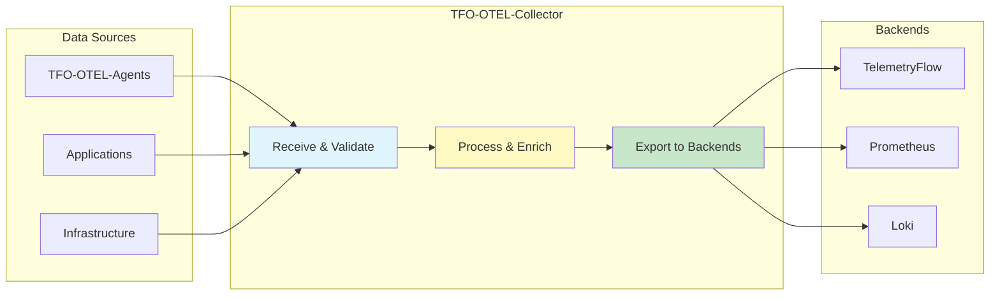

# TFO-OTEL-Collector

- **Version:** 1.0.0-CE
- **Last Updated:** December 13, 2025
- **Status:** ✅ Production Ready

---

## Table of Contents

1. [Overview](#overview)
2. [Installation](#installation)
3. [Configuration](#configuration)
4. [Receivers](#receivers)
5. [Processors](#processors)
6. [Exporters](#exporters)
7. [Extensions](#extensions)
8. [Monitoring](#monitoring)
9. [High Availability](#high-availability)
10. [Troubleshooting](#troubleshooting)
11. [Best Practices](#best-practices)

---

## Overview

**TFO-OTEL-Collector** is the centralized telemetry aggregation hub for TelemetryFlow Platform. It receives data from multiple agents and applications, processes and enriches the data, and exports to multiple backends.

### Key Capabilities

- **Multi-Protocol Ingestion:** OTLP (gRPC/HTTP), Prometheus, FluentForward
- **Data Processing:** Filtering, transformation, sampling, batching
- **Multi-Backend Export:** TelemetryFlow, Prometheus, Loki, OpenSearch
- **High Throughput:** 100K+ data points/second per instance
- **Multi-Tenancy:** Built-in workspace and tenant context management

### Architecture Role



---

## Installation

### Docker Deployment

**1. Pull Official Image:**
```bash
docker pull otel/opentelemetry-collector-contrib:0.88.0
```

**2. Create Configuration:**
```bash
mkdir -p /etc/otel-collector
cat > /etc/otel-collector/config.yaml <<'EOF'
# See CONFIGURATION.md for full configuration options
receivers:
  otlp:
    protocols:
      grpc:
        endpoint: 0.0.0.0:4317
      http:
        endpoint: 0.0.0.0:4318

processors:
  batch:
    timeout: 10s
    send_batch_size: 1024

exporters:
  otlphttp/telemetryflow:
    endpoint: http://telemetryflow-api:3100/api
    headers:
      X-Workspace-Id: "${env:TELEMETRYFLOW_WORKSPACE_ID}"
      X-Tenant-Id: "${env:TELEMETRYFLOW_TENANT_ID}"

service:
  pipelines:
    metrics:
      receivers: [otlp]
      processors: [batch]
      exporters: [otlphttp/telemetryflow]
EOF
```

**3. Run Container:**
```bash
docker run -d \
  --name tfo-otel-collector \
  --restart unless-stopped \
  -p 4317:4317 \
  -p 4318:4318 \
  -p 8888:8888 \
  -p 8889:8889 \
  -p 13133:13133 \
  -e TELEMETRYFLOW_WORKSPACE_ID=your-workspace-id \
  -e TELEMETRYFLOW_TENANT_ID=your-tenant-id \
  -v /etc/otel-collector/config.yaml:/etc/otel-collector-config.yaml:ro \
  otel/opentelemetry-collector-contrib:0.88.0 \
  --config=/etc/otel-collector-config.yaml
```

**4. Verify Health:**
```bash
curl http://localhost:13133/
# Expected: {"status":"Server available","upSince":"..."}
```

### Kubernetes Deployment

**1. Create ConfigMap:**
```yaml
apiVersion: v1
kind: ConfigMap
metadata:
  name: otel-collector-config
  namespace: observability
data:
  config.yaml: |
    receivers:
      otlp:
        protocols:
          grpc:
            endpoint: 0.0.0.0:4317
          http:
            endpoint: 0.0.0.0:4318

    processors:
      batch:
        timeout: 10s
        send_batch_size: 1024

      memory_limiter:
        check_interval: 1s
        limit_mib: 2048
        spike_limit_mib: 512

      attributes:
        actions:
          - key: telemetryflow.workspace.id
            value: ${env:TELEMETRYFLOW_WORKSPACE_ID}
            action: upsert
          - key: telemetryflow.tenant.id
            value: ${env:TELEMETRYFLOW_TENANT_ID}
            action: upsert

    exporters:
      otlphttp/telemetryflow:
        endpoint: http://telemetryflow-api:3100/api
        headers:
          X-Workspace-Id: "${env:TELEMETRYFLOW_WORKSPACE_ID}"
          X-Tenant-Id: "${env:TELEMETRYFLOW_TENANT_ID}"

    service:
      pipelines:
        metrics:
          receivers: [otlp]
          processors: [memory_limiter, attributes, batch]
          exporters: [otlphttp/telemetryflow]
        logs:
          receivers: [otlp]
          processors: [memory_limiter, attributes, batch]
          exporters: [otlphttp/telemetryflow]
        traces:
          receivers: [otlp]
          processors: [memory_limiter, attributes, batch]
          exporters: [otlphttp/telemetryflow]
```

**2. Create Deployment:**
```yaml
apiVersion: apps/v1
kind: Deployment
metadata:
  name: otel-collector
  namespace: observability
spec:
  replicas: 3
  selector:
    matchLabels:
      app: otel-collector
  template:
    metadata:
      labels:
        app: otel-collector
    spec:
      containers:
      - name: otel-collector
        image: otel/opentelemetry-collector-contrib:0.88.0
        args:
          - --config=/etc/otel-collector-config.yaml
        ports:
        - containerPort: 4317
          name: otlp-grpc
          protocol: TCP
        - containerPort: 4318
          name: otlp-http
          protocol: TCP
        - containerPort: 8888
          name: metrics
          protocol: TCP
        - containerPort: 8889
          name: prometheus
          protocol: TCP
        - containerPort: 13133
          name: health
          protocol: TCP
        env:
        - name: TELEMETRYFLOW_WORKSPACE_ID
          valueFrom:
            secretKeyRef:
              name: telemetryflow-secrets
              key: workspace-id
        - name: TELEMETRYFLOW_TENANT_ID
          valueFrom:
            secretKeyRef:
              name: telemetryflow-secrets
              key: tenant-id
        resources:
          requests:
            memory: "512Mi"
            cpu: "500m"
          limits:
            memory: "2Gi"
            cpu: "2000m"
        volumeMounts:
        - name: config
          mountPath: /etc/otel-collector-config.yaml
          subPath: config.yaml
          readOnly: true
        livenessProbe:
          httpGet:
            path: /
            port: 13133
          initialDelaySeconds: 30
          periodSeconds: 10
        readinessProbe:
          httpGet:
            path: /
            port: 13133
          initialDelaySeconds: 10
          periodSeconds: 5
      volumes:
      - name: config
        configMap:
          name: otel-collector-config
```

**3. Create Service:**
```yaml
apiVersion: v1
kind: Service
metadata:
  name: otel-collector
  namespace: observability
spec:
  type: ClusterIP
  ports:
  - port: 4317
    targetPort: 4317
    protocol: TCP
    name: otlp-grpc
  - port: 4318
    targetPort: 4318
    protocol: TCP
    name: otlp-http
  - port: 8888
    targetPort: 8888
    protocol: TCP
    name: metrics
  - port: 8889
    targetPort: 8889
    protocol: TCP
    name: prometheus
  - port: 13133
    targetPort: 13133
    protocol: TCP
    name: health
  selector:
    app: otel-collector
```

**4. Deploy:**
```bash
kubectl apply -f configmap.yaml
kubectl apply -f deployment.yaml
kubectl apply -f service.yaml

# Verify
kubectl get pods -n observability -l app=otel-collector
kubectl logs -n observability -l app=otel-collector --tail=50
```

### Docker Compose Integration

Add to your `docker-compose.yml`:

```yaml
services:
  otel-collector:
    image: otel/opentelemetry-collector-contrib:0.88.0
    container_name: tfo_otel_collector
    command: ["--config=/etc/otel-collector-config.yaml"]
    ports:
      - "4317:4317"   # OTLP gRPC
      - "4318:4318"   # OTLP HTTP
      - "8888:8888"   # Prometheus metrics
      - "8889:8889"   # Prometheus exporter
      - "13133:13133" # Health check
    environment:
      - TELEMETRYFLOW_WORKSPACE_ID=${TELEMETRYFLOW_WORKSPACE_ID}
      - TELEMETRYFLOW_TENANT_ID=${TELEMETRYFLOW_TENANT_ID}
    volumes:
      - ./config/otel/otel-collector-config-telemetryflow.yaml:/etc/otel-collector-config.yaml:ro
    networks:
      - telemetryflow-network
    restart: unless-stopped
    depends_on:
      - backend
```

---

## Configuration

### Complete Configuration Example

```yaml
# /etc/otel-collector/config.yaml
receivers:
  # OTLP Receiver - Primary ingestion protocol
  otlp:
    protocols:
      grpc:
        endpoint: 0.0.0.0:4317
        max_recv_msg_size_mib: 4
        max_concurrent_streams: 100
      http:
        endpoint: 0.0.0.0:4318
        cors:
          allowed_origins:
            - "*"

  # Prometheus Receiver - Scrape Prometheus exporters
  prometheus:
    config:
      scrape_configs:
        - job_name: 'telemetryflow-api'
          scrape_interval: 15s
          static_configs:
            - targets: ['telemetryflow-api:3100']
              labels:
                env: 'production'
                source: 'telemetryflow-api'

        - job_name: 'node-exporter'
          scrape_interval: 15s
          static_configs:
            - targets: ['node-exporter:9100']
              labels:
                env: 'production'
                source: 'node-exporter'

  # FluentForward Receiver - Ingest from FluentBit/Fluentd
  fluentforward:
    endpoint: 0.0.0.0:8006

processors:
  # Batch Processor - Reduce backend load
  batch:
    timeout: 10s
    send_batch_size: 1024
    send_batch_max_size: 2048

  # Memory Limiter - Prevent OOM
  memory_limiter:
    check_interval: 1s
    limit_mib: 2048
    spike_limit_mib: 512

  # Resource Detection - Auto-detect environment
  resourcedetection:
    detectors: [env, system, docker, kubernetes]
    timeout: 5s
    override: false

  # Attributes Processor - Add/modify attributes
  attributes:
    actions:
      # Add environment
      - key: deployment.environment
        value: production
        action: upsert

      # Add multi-tenant context
      - key: telemetryflow.workspace.id
        value: ${env:TELEMETRYFLOW_WORKSPACE_ID}
        action: upsert
      - key: telemetryflow.tenant.id
        value: ${env:TELEMETRYFLOW_TENANT_ID}
        action: upsert

  # Filter Processor - Drop unwanted data
  filter:
    metrics:
      exclude:
        match_type: regexp
        metric_names:
          - ^otelcol_.*  # Drop collector internal metrics

  # Transform Processor - Rename metrics
  transform:
    metric_statements:
      - context: metric
        statements:
          # Rename HTTP metrics
          - replace_pattern(name, "^http_", "http.") where name =~ "^http_"

  # Tail Sampling - Intelligent trace sampling
  tail_sampling:
    policies:
      # Always sample errors
      - name: error-traces
        type: status_code
        status_code:
          status_codes: [ERROR]

      # Always sample slow traces
      - name: slow-traces
        type: latency
        latency:
          threshold_ms: 1000

      # Sample 10% of normal traces
      - name: normal-traces
        type: probabilistic
        probabilistic:
          sampling_percentage: 10

exporters:
  # OTLP HTTP Exporter - TelemetryFlow Platform
  otlphttp/telemetryflow:
    endpoint: http://telemetryflow-api:3100/api
    timeout: 30s
    retry_on_failure:
      enabled: true
      initial_interval: 5s
      max_interval: 30s
      max_elapsed_time: 300s
    sending_queue:
      enabled: true
      num_consumers: 10
      queue_size: 1000
    compression: gzip
    headers:
      X-Workspace-Id: "${env:TELEMETRYFLOW_WORKSPACE_ID}"
      X-Tenant-Id: "${env:TELEMETRYFLOW_TENANT_ID}"

  # Prometheus Exporter - Expose metrics for scraping
  prometheus:
    endpoint: "0.0.0.0:8889"
    namespace: telemetryflow
    enable_open_metrics: true

  # Loki Exporter - Log aggregation
  loki:
    endpoint: http://loki:3100/loki/api/v1/push
    labels:
      attributes:
        service.name: "service"
        service.namespace: "namespace"
        deployment.environment: "env"
        severity_text: "level"

  # OpenSearch Exporter - Full-text search
  opensearch:
    endpoints: ["http://opensearch:9200"]
    index: "telemetryflow-logs"
    pipeline: "telemetryflow-pipeline"

  # Logging Exporter - Debug output
  logging:
    loglevel: info
    sampling_initial: 5
    sampling_thereafter: 200

extensions:
  # Health Check Extension
  health_check:
    endpoint: 0.0.0.0:13133

  # pprof Extension - CPU/Memory profiling
  pprof:
    endpoint: 0.0.0.0:1777

  # zPages Extension - Diagnostic pages
  zpages:
    endpoint: 0.0.0.0:55679

service:
  extensions: [health_check, pprof, zpages]

  pipelines:
    # Metrics Pipeline
    metrics:
      receivers: [otlp, prometheus]
      processors:
        - memory_limiter
        - resourcedetection
        - attributes
        - filter
        - transform
        - batch
      exporters: [otlphttp/telemetryflow, prometheus, logging]

    # Logs Pipeline
    logs:
      receivers: [otlp, fluentforward]
      processors:
        - memory_limiter
        - attributes
        - batch
      exporters: [otlphttp/telemetryflow, loki, opensearch, logging]

    # Traces Pipeline
    traces:
      receivers: [otlp]
      processors:
        - memory_limiter
        - attributes
        - tail_sampling
        - batch
      exporters: [otlphttp/telemetryflow, logging]

  telemetry:
    logs:
      level: info
      development: false
      encoding: json
      output_paths:
        - stdout
    metrics:
      level: detailed
      address: 0.0.0.0:8888
```

---

## Receivers

### OTLP Receiver

**Purpose:** Primary ingestion protocol for OpenTelemetry data

**Supported Protocols:**
- gRPC (port 4317) - Higher performance, better for streaming
- HTTP (port 4318) - Better firewall compatibility, easier debugging

**Configuration:**
```yaml
receivers:
  otlp:
    protocols:
      grpc:
        endpoint: 0.0.0.0:4317
        max_recv_msg_size_mib: 4
        max_concurrent_streams: 100
        keepalive:
          server_parameters:
            max_connection_idle: 11s
            max_connection_age: 12s
            time: 30s
            timeout: 5s
      http:
        endpoint: 0.0.0.0:4318
        cors:
          allowed_origins:
            - "http://localhost:3000"
            - "https://app.telemetryflow.id"
        compression: gzip
```

### Prometheus Receiver

**Purpose:** Scrape Prometheus exporters and convert to OTLP

**Use Cases:**
- Legacy Prometheus exporters
- Infrastructure monitoring (node-exporter, kube-state-metrics)
- Application metrics (Spring Boot Actuator, custom exporters)

**Configuration:**
```yaml
receivers:
  prometheus:
    config:
      global:
        scrape_interval: 15s
        evaluation_interval: 15s

      scrape_configs:
        - job_name: 'kubernetes-pods'
          kubernetes_sd_configs:
            - role: pod
          relabel_configs:
            - source_labels: [__meta_kubernetes_pod_annotation_prometheus_io_scrape]
              action: keep
              regex: true
```

### FluentForward Receiver

**Purpose:** Receive logs from Fluentd/FluentBit

**Configuration:**
```yaml
receivers:
  fluentforward:
    endpoint: 0.0.0.0:8006
```

---

## Processors

### Batch Processor

**Purpose:** Batch data to reduce backend load and network overhead

**Configuration:**
```yaml
processors:
  batch:
    timeout: 10s              # Max wait time
    send_batch_size: 1024     # Trigger at N items
    send_batch_max_size: 2048 # Never exceed N items
```

**Tuning Guidelines:**
- **High throughput:** Increase `send_batch_size` to 5000+
- **Low latency:** Decrease `timeout` to 1-5s
- **Memory constrained:** Decrease `send_batch_max_size`

### Memory Limiter

**Purpose:** Prevent out-of-memory crashes

**Configuration:**
```yaml
processors:
  memory_limiter:
    check_interval: 1s
    limit_mib: 2048        # Total memory limit
    spike_limit_mib: 512   # Spike buffer
```

**How It Works:**
1. Check memory usage every `check_interval`
2. If usage > `limit_mib - spike_limit_mib`, start refusing data
3. If usage > `limit_mib`, force GC

### Attributes Processor

**Purpose:** Add, update, or delete attributes

**Configuration:**
```yaml
processors:
  attributes:
    actions:
      # Add attribute
      - key: environment
        value: production
        action: upsert

      # Delete attribute
      - key: sensitive_data
        action: delete

      # Extract from another attribute
      - key: http.status_code
        from_attribute: status
        action: insert
```

### Filter Processor

**Purpose:** Drop unwanted telemetry data

**Configuration:**
```yaml
processors:
  filter:
    metrics:
      exclude:
        match_type: regexp
        metric_names:
          - ^test_.*
          - ^debug_.*

    logs:
      exclude:
        match_type: strict
        bodies:
          - "health check"
```

---

## Exporters

### OTLP HTTP Exporter (TelemetryFlow)

**Configuration:**
```yaml
exporters:
  otlphttp/telemetryflow:
    endpoint: http://telemetryflow-api:3100/api
    timeout: 30s
    retry_on_failure:
      enabled: true
      initial_interval: 5s
      max_interval: 30s
      max_elapsed_time: 300s
    sending_queue:
      enabled: true
      num_consumers: 10
      queue_size: 1000
    compression: gzip
    headers:
      X-Workspace-Id: "${env:TELEMETRYFLOW_WORKSPACE_ID}"
      X-Tenant-Id: "${env:TELEMETRYFLOW_TENANT_ID}"
```

### Prometheus Exporter

**Configuration:**
```yaml
exporters:
  prometheus:
    endpoint: "0.0.0.0:8889"
    namespace: telemetryflow
    enable_open_metrics: true
```

**Scrape Configuration:**
```yaml
# In Prometheus config
scrape_configs:
  - job_name: 'otel-collector'
    static_configs:
      - targets: ['otel-collector:8889']
```

### Loki Exporter

**Configuration:**
```yaml
exporters:
  loki:
    endpoint: http://loki:3100/loki/api/v1/push
    labels:
      attributes:
        service.name: "service"
        severity_text: "level"
      resource:
        telemetryflow.tenant.id: "tenant_id"
```

---

## Extensions

### Health Check

**Endpoint:** http://localhost:13133/

**Response:**
```json
{
  "status": "Server available",
  "upSince": "2025-12-13T10:00:00Z"
}
```

### pprof (Profiling)

**Endpoints:**
- http://localhost:1777/debug/pprof/
- http://localhost:1777/debug/pprof/heap
- http://localhost:1777/debug/pprof/goroutine

### zPages (Diagnostics)

**Endpoints:**
- http://localhost:55679/debug/servicez
- http://localhost:55679/debug/pipelinez
- http://localhost:55679/debug/extensionz

---

## Monitoring

### Collector Metrics

**Endpoint:** http://localhost:8888/metrics

**Key Metrics:**
```
# Data received
otelcol_receiver_accepted_metric_points
otelcol_receiver_accepted_log_records
otelcol_receiver_accepted_spans

# Data exported
otelcol_exporter_sent_metric_points
otelcol_exporter_sent_log_records
otelcol_exporter_sent_spans

# Failures
otelcol_exporter_send_failed_metric_points
otelcol_exporter_send_failed_log_records
otelcol_exporter_send_failed_spans

# Queue size
otelcol_exporter_queue_size

# Memory
otelcol_process_runtime_heap_alloc_bytes
otelcol_process_runtime_total_alloc_bytes
```

### Grafana Dashboard

Import dashboard ID: 15983 (OpenTelemetry Collector)

Or create custom dashboard:
```promql
# Throughput
rate(otelcol_receiver_accepted_metric_points[5m])

# Error rate
rate(otelcol_exporter_send_failed_metric_points[5m])

# Queue depth
otelcol_exporter_queue_size

# Memory usage
otelcol_process_runtime_heap_alloc_bytes / 1024 / 1024
```

---

## High Availability

### Load Balancer Setup

```yaml
# HAProxy configuration
frontend otlp_grpc
    bind *:4317
    mode tcp
    default_backend otel_collectors_grpc

backend otel_collectors_grpc
    mode tcp
    balance roundrobin
    option tcp-check
    server collector1 collector1:4317 check
    server collector2 collector2:4317 check
    server collector3 collector3:4317 check

frontend otlp_http
    bind *:4318
    mode http
    default_backend otel_collectors_http

backend otel_collectors_http
    mode http
    balance roundrobin
    option httpchk GET /
    http-check expect status 404
    server collector1 collector1:4318 check
    server collector2 collector2:4318 check
    server collector3 collector3:4318 check
```

### Persistent Queue

```yaml
exporters:
  otlphttp/telemetryflow:
    endpoint: http://telemetryflow-api:3100/api
    sending_queue:
      enabled: true
      num_consumers: 10
      queue_size: 5000
      storage: file_storage

extensions:
  file_storage:
    directory: /var/lib/otel-collector/queue
    timeout: 10s
```

---

## Troubleshooting

### Issue: High Memory Usage

**Symptoms:**
- Collector OOM killed
- High memory metrics

**Solution:**
```yaml
processors:
  memory_limiter:
    check_interval: 1s
    limit_mib: 1024  # Reduce limit
    spike_limit_mib: 256

  batch:
    send_batch_size: 512  # Reduce batch size
```

### Issue: Data Not Reaching Backend

**Check:**
```bash
# 1. Check collector logs
docker logs tfo-otel-collector --tail=100

# 2. Check exporter metrics
curl http://localhost:8888/metrics | grep exporter_sent

# 3. Test endpoint
curl -X POST http://localhost:4318/v1/metrics \
  -H "Content-Type: application/json" \
  -d '{}'
```

### Issue: High CPU Usage

**Check:**
```bash
# Profile CPU
curl http://localhost:1777/debug/pprof/profile?seconds=30 > cpu.prof

# Analyze with pprof
go tool pprof cpu.prof
```

**Optimize:**
```yaml
processors:
  batch:
    timeout: 30s  # Increase batch timeout
    send_batch_size: 5000  # Increase batch size
```

---

## Best Practices

### 1. Always Use Memory Limiter

```yaml
processors:
  memory_limiter:
    check_interval: 1s
    limit_mib: 2048
```

### 2. Enable Persistent Queue

```yaml
exporters:
  otlphttp/telemetryflow:
    sending_queue:
      enabled: true
      storage: file_storage
```

### 3. Use Compression

```yaml
exporters:
  otlphttp/telemetryflow:
    compression: gzip
```

### 4. Configure Retries

```yaml
exporters:
  otlphttp/telemetryflow:
    retry_on_failure:
      enabled: true
      initial_interval: 5s
      max_interval: 30s
```

### 5. Monitor Collector Health

```bash
# Health check endpoint
curl http://localhost:13133/

# Metrics endpoint
curl http://localhost:8888/metrics
```

---

**Version:** 1.0.0-CE | **Maintained By:** DevOpsCorner Indonesia
