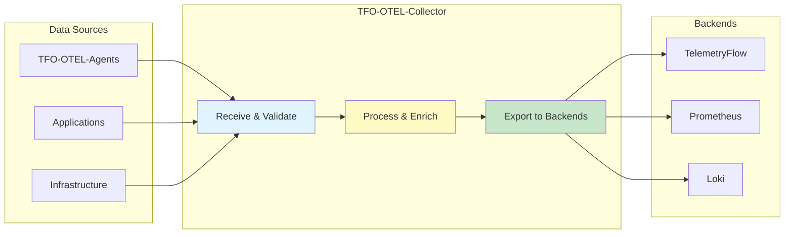
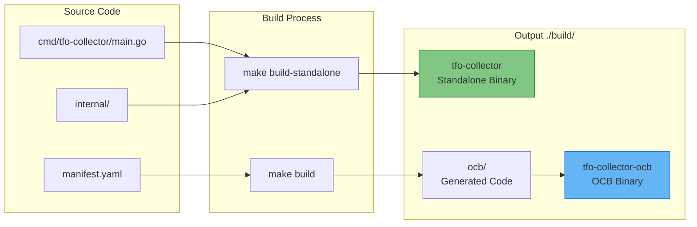

# TFO-OTEL-Collector Documentation

- **Version:** 1.1.1-CE
- **Last Updated:** December 2025
- **Component:** TelemetryFlow Collector (Centralized Telemetry Hub)
- **Go Version:** 1.24+
- **OpenTelemetry Collector:** v0.142.0
- **Status:** Production Ready

---

## Table of Contents

1. [Overview](#overview)
2. [Build System](#build-system)
3. [Installation](#installation)
4. [Configuration](#configuration)
5. [CLI Commands](#cli-commands)
6. [Components](#components)
7. [Monitoring](#monitoring)
8. [High Availability](#high-availability)
9. [Troubleshooting](#troubleshooting)
10. [Best Practices](#best-practices)

---

## Overview

**TFO-OTEL-Collector** is an enterprise-grade OpenTelemetry Collector distribution for the **TelemetryFlow Platform**. Built on the OpenTelemetry Collector Community (v0.142.0), it provides comprehensive telemetry collection, processing, and export capabilities.

### Key Capabilities

- **Multi-Protocol Ingestion:** OTLP (gRPC/HTTP), Prometheus, FluentForward, Kafka
- **Data Processing:** Filtering, transformation, sampling, batching
- **Multi-Backend Export:** TelemetryFlow, Prometheus, Loki, OpenSearch, Kafka
- **High Throughput:** 100K+ data points/second per instance
- **Multi-Tenancy:** Built-in workspace and tenant context management
- **Dual Build System:** Standalone CLI and OCB (OpenTelemetry Collector Builder)

### Architecture Role



### Project Structure

```text
telemetryflow-collector/
├── cmd/tfo-collector/        # Standalone CLI entry point
│   └── main.go               # Cobra CLI with banner
├── internal/
│   ├── collector/            # Core collector implementation
│   ├── config/               # Configuration management
│   └── version/              # Version and banner info
├── pkg/                      # LEGO Building Blocks
│   ├── banner/               # Startup banner
│   ├── config/               # Config loader utilities
│   └── plugin/               # Component registry
├── configs/
│   ├── tfo-collector.yaml        # Standalone config (custom format)
│   ├── otel-collector.yaml        # OCB config (standard OTel format)
│   └── ocb-collector-minimal.yaml
├── tests/
│   ├── unit/                 # Unit tests
│   ├── integration/          # Integration tests
│   ├── e2e/                  # End-to-end tests
│   ├── mocks/                # Mock implementations
│   └── fixtures/             # Test fixtures
├── build/                    # Build output directory
│   ├── tfo-collector         # Standalone binary
│   ├── tfo-collector-ocb     # OCB binary
│   └── ocb/                  # OCB generated code
├── manifest.yaml             # OCB manifest
├── Makefile
├── Dockerfile                # Standalone build
├── Dockerfile.ocb            # OCB build
├── docker-compose.yml        # Docker Compose (standalone)
├── docker-compose.ocb.yml    # Docker Compose (OCB)
├── .env.example              # Environment template
└── README.md
```

---

## Build System

TelemetryFlow Collector uses a **dual build system** that produces two different binaries from the same codebase:

### Build Types Comparison

| Aspect | Standalone (`tfo-collector`) | OCB (`tfo-collector-ocb`) |
|--------|------------------------------|---------------------------|
| **Source** | `cmd/tfo-collector/main.go` | `manifest.yaml` → generated |
| **CLI** | Cobra (`start`, `version`, `config`) | Standard OTEL (`--config`) |
| **Config Format** | Custom with `enabled` flags | Standard OTEL YAML |
| **Banner** | Custom ASCII art | None |
| **Build Command** | `make build-standalone` | `make build` |
| **Default Target** | Yes (`make` or `make all`) | No |
| **Binary Location** | `./build/tfo-collector` | `./build/tfo-collector-ocb` |

### Build Process Diagram



### When to Use Which Build

**Use Standalone (`tfo-collector`) When:**

- You want TelemetryFlow-specific branding and CLI
- You prefer the custom config format with `enabled` flags
- You're deploying in a TelemetryFlow ecosystem
- You need the `start`, `version`, `config` commands
- You want the ASCII art banner on startup

**Use OCB (`tfo-collector-ocb`) When:**

- You need full OTEL Collector compatibility
- You're integrating with existing OTEL tooling
- You need components not in the standalone build
- You want to use standard OTEL documentation
- You're validating against OTEL config schemas

---

## Installation

### Method 1: From Source (Standalone - Recommended)

```bash
# Clone the repository
git clone https://github.com/telemetryflow/telemetryflow-collector.git
cd telemetryflow-collector

# Build standalone collector (default)
make

# Run with standalone config
./build/tfo-collector start --config configs/tfo-collector.yaml

# Or use make target
make run-standalone
```

### Method 2: From Source (OCB Build)

```bash
# Install OCB
make install-ocb

# Build with OCB
make build

# Run with OTel-compatible config
./build/tfo-collector-ocb --config configs/otel-collector.yaml

# Or use make target
make run
```

### Method 3: Docker Compose (Recommended)

```bash
# Copy environment template
cp .env.example .env

# Edit .env with your configuration
vim .env

# Standalone build
docker-compose up -d --build

# OR OCB build
docker-compose -f docker-compose.ocb.yml up -d --build

# View logs
docker-compose logs -f tfo-collector

# Stop
docker-compose down
```

### Method 4: Docker Directly

**Build Standalone Image:**

```bash
docker build \
  --build-arg VERSION=1.1.1 \
  --build-arg GIT_COMMIT=$(git rev-parse --short HEAD) \
  --build-arg GIT_BRANCH=$(git rev-parse --abbrev-ref HEAD) \
  --build-arg BUILD_TIME=$(date -u '+%Y-%m-%dT%H:%M:%SZ') \
  -t telemetryflow/telemetryflow-collector:1.1.1 .

docker run -d --name tfo-collector \
  -p 4317:4317 \
  -p 4318:4318 \
  -p 8888:8888 \
  -p 13133:13133 \
  -v /path/to/config.yaml:/etc/tfo-collector/tfo-collector.yaml:ro \
  telemetryflow/telemetryflow-collector:1.1.1
```

**Build OCB Image:**

```bash
docker build \
  -f Dockerfile.ocb \
  --build-arg VERSION=1.1.1 \
  --build-arg OTEL_VERSION=0.142.0 \
  -t telemetryflow/telemetryflow-collector-ocb:1.1.1 .

docker run -d --name tfo-collector-ocb \
  -p 4317:4317 \
  -p 4318:4318 \
  -p 8888:8888 \
  -p 13133:13133 \
  -v /path/to/config.yaml:/etc/tfo-collector/collector.yaml:ro \
  telemetryflow/telemetryflow-collector-ocb:1.1.1
```

### Method 5: Kubernetes Deployment

```yaml
apiVersion: v1
kind: Namespace
metadata:
  name: observability

---
apiVersion: v1
kind: ConfigMap
metadata:
  name: tfo-collector-config
  namespace: observability
data:
  tfo-collector.yaml: |
    collector:
      id: "tfo-collector-k8s"
      description: "TelemetryFlow Collector - Kubernetes"

    receivers:
      otlp:
        enabled: true
        protocols:
          grpc:
            enabled: true
            endpoint: "0.0.0.0:4317"
          http:
            enabled: true
            endpoint: "0.0.0.0:4318"

    processors:
      batch:
        enabled: true
        send_batch_size: 8192
        timeout: 200ms
      memory_limiter:
        enabled: true
        limit_mib: 2048
        spike_limit_mib: 512

    exporters:
      otlphttp:
        enabled: true
        endpoint: "http://telemetryflow-api:3100/api"
        compression: "gzip"
        headers:
          X-Workspace-Id: "${TELEMETRYFLOW_WORKSPACE_ID}"
          X-Tenant-Id: "${TELEMETRYFLOW_TENANT_ID}"

    extensions:
      health_check:
        enabled: true
        endpoint: "0.0.0.0:13133"

---
apiVersion: apps/v1
kind: Deployment
metadata:
  name: tfo-collector
  namespace: observability
  labels:
    app: tfo-collector
    version: "1.0.0"
spec:
  replicas: 3
  selector:
    matchLabels:
      app: tfo-collector
  template:
    metadata:
      labels:
        app: tfo-collector
        version: "1.0.0"
    spec:
      containers:
      - name: tfo-collector
        image: telemetryflow/telemetryflow-collector:1.1.1
        imagePullPolicy: IfNotPresent

        args:
          - start
          - --config=/etc/tfo-collector/tfo-collector.yaml

        ports:
        - name: otlp-grpc
          containerPort: 4317
          protocol: TCP
        - name: otlp-http
          containerPort: 4318
          protocol: TCP
        - name: metrics
          containerPort: 8888
          protocol: TCP
        - name: prometheus
          containerPort: 8889
          protocol: TCP
        - name: health
          containerPort: 13133
          protocol: TCP

        env:
        - name: TELEMETRYFLOW_WORKSPACE_ID
          valueFrom:
            secretKeyRef:
              name: telemetryflow-secrets
              key: workspace-id
        - name: TELEMETRYFLOW_TENANT_ID
          valueFrom:
            secretKeyRef:
              name: telemetryflow-secrets
              key: tenant-id

        resources:
          requests:
            memory: "512Mi"
            cpu: "500m"
          limits:
            memory: "2Gi"
            cpu: "2000m"

        volumeMounts:
        - name: config
          mountPath: /etc/tfo-collector

        livenessProbe:
          httpGet:
            path: /
            port: 13133
          initialDelaySeconds: 30
          periodSeconds: 10

        readinessProbe:
          httpGet:
            path: /
            port: 13133
          initialDelaySeconds: 10
          periodSeconds: 5

      volumes:
      - name: config
        configMap:
          name: tfo-collector-config

---
apiVersion: v1
kind: Service
metadata:
  name: tfo-collector
  namespace: observability
spec:
  type: ClusterIP
  ports:
  - port: 4317
    targetPort: 4317
    protocol: TCP
    name: otlp-grpc
  - port: 4318
    targetPort: 4318
    protocol: TCP
    name: otlp-http
  - port: 8888
    targetPort: 8888
    protocol: TCP
    name: metrics
  - port: 8889
    targetPort: 8889
    protocol: TCP
    name: prometheus
  - port: 13133
    targetPort: 13133
    protocol: TCP
    name: health
  selector:
    app: tfo-collector
```

### Method 6: Systemd Service

```bash
# Install binary
sudo make install

# Create directories
sudo mkdir -p /etc/tfo-collector
sudo mkdir -p /var/lib/tfo-collector
sudo mkdir -p /var/log/tfo-collector

# Copy config
sudo cp configs/tfo-collector.yaml /etc/tfo-collector/

# Create service user
sudo useradd -r -s /bin/false telemetryflow

# Set permissions
sudo chown -R telemetryflow:telemetryflow /etc/tfo-collector
sudo chown -R telemetryflow:telemetryflow /var/lib/tfo-collector
sudo chown -R telemetryflow:telemetryflow /var/log/tfo-collector
```

Create systemd service:

```ini
# /etc/systemd/system/tfo-collector.service
[Unit]
Description=TelemetryFlow Collector
After=network.target

[Service]
Type=simple
User=telemetryflow
Group=telemetryflow
ExecStart=/usr/local/bin/tfo-collector start --config /etc/tfo-collector/tfo-collector.yaml
Restart=always
RestartSec=5
LimitNOFILE=65536

# Security
NoNewPrivileges=true
PrivateTmp=true
ProtectSystem=strict
ProtectHome=true
ReadWritePaths=/var/lib/tfo-collector

[Install]
WantedBy=multi-user.target
```

Enable and start:

```bash
sudo systemctl daemon-reload
sudo systemctl enable tfo-collector
sudo systemctl start tfo-collector
sudo systemctl status tfo-collector
```

---

## Configuration

TelemetryFlow Collector supports two configuration formats depending on the build type.

### Configuration Files

| File | Purpose | Build Type |
|------|---------|------------|
| `configs/tfo-collector.yaml` | Custom format with `enabled` flags | Standalone |
| `configs/otel-collector.yaml` | Standard OTel format | OCB |
| `configs/ocb-collector-minimal.yaml` | Minimal OTel config for testing | OCB |

### Standalone Configuration (Custom Format)

```yaml
# configs/tfo-collector.yaml
collector:
  id: "my-collector"
  description: "TelemetryFlow Collector"

receivers:
  otlp:
    enabled: true
    protocols:
      grpc:
        enabled: true
        endpoint: "0.0.0.0:4317"
        max_recv_msg_size_mib: 4
      http:
        enabled: true
        endpoint: "0.0.0.0:4318"

  prometheus:
    enabled: true
    config:
      scrape_configs:
        - job_name: 'telemetryflow-api'
          scrape_interval: 15s
          static_configs:
            - targets: ['telemetryflow-api:3100']

processors:
  batch:
    enabled: true
    send_batch_size: 8192
    timeout: 200ms

  memory_limiter:
    enabled: true
    check_interval: 1s
    limit_mib: 2048
    spike_limit_mib: 512

  attributes:
    enabled: true
    actions:
      - key: deployment.environment
        value: production
        action: upsert
      - key: telemetryflow.workspace.id
        value: ${env:TELEMETRYFLOW_WORKSPACE_ID}
        action: upsert

exporters:
  otlphttp:
    enabled: true
    endpoint: "http://telemetryflow-api:3100/api"
    timeout: 30s
    compression: gzip
    headers:
      X-Workspace-Id: "${env:TELEMETRYFLOW_WORKSPACE_ID}"
      X-Tenant-Id: "${env:TELEMETRYFLOW_TENANT_ID}"
    retry:
      enabled: true
      initial_interval: 5s
      max_interval: 30s
    queue:
      enabled: true
      num_consumers: 10
      queue_size: 1000

  prometheus:
    enabled: true
    endpoint: "0.0.0.0:8889"
    namespace: telemetryflow

  logging:
    enabled: true
    loglevel: "info"

extensions:
  health_check:
    enabled: true
    endpoint: "0.0.0.0:13133"

  pprof:
    enabled: false
    endpoint: "0.0.0.0:1777"

  zpages:
    enabled: false
    endpoint: "0.0.0.0:55679"
```

### OCB Configuration (Standard OTel Format)

```yaml
# configs/otel-collector.yaml (standard OTel format)
receivers:
  otlp:
    protocols:
      grpc:
        endpoint: "0.0.0.0:4317"
      http:
        endpoint: "0.0.0.0:4318"

processors:
  batch:
    send_batch_size: 8192
    timeout: 200ms

  memory_limiter:
    check_interval: 1s
    limit_mib: 2048
    spike_limit_mib: 512

exporters:
  debug:
    verbosity: detailed

  otlphttp:
    endpoint: "http://telemetryflow-api:3100/api"
    compression: gzip
    headers:
      X-Workspace-Id: "${env:TELEMETRYFLOW_WORKSPACE_ID}"
      X-Tenant-Id: "${env:TELEMETRYFLOW_TENANT_ID}"

extensions:
  health_check:
    endpoint: "0.0.0.0:13133"

service:
  extensions: [health_check]
  pipelines:
    traces:
      receivers: [otlp]
      processors: [memory_limiter, batch]
      exporters: [otlphttp, debug]
    metrics:
      receivers: [otlp]
      processors: [memory_limiter, batch]
      exporters: [otlphttp, debug]
    logs:
      receivers: [otlp]
      processors: [memory_limiter, batch]
      exporters: [otlphttp, debug]
```

---

## CLI Commands

### Standalone CLI

```bash
# Show help
./build/tfo-collector --help

# Start collector
./build/tfo-collector start --config configs/tfo-collector.yaml

# Show version
./build/tfo-collector version

# Show parsed config
./build/tfo-collector config --config configs/tfo-collector.yaml
```

### OCB CLI

```bash
# Show help
./build/tfo-collector-ocb --help

# Run with config
./build/tfo-collector-ocb --config configs/otel-collector.yaml

# Validate config
./build/tfo-collector-ocb validate --config configs/otel-collector.yaml
```

---

## Components

### Receivers

| Component | Description |
|-----------|-------------|
| `otlp` | OTLP gRPC and HTTP receiver |
| `hostmetrics` | System metrics (CPU, memory, disk, network) |
| `filelog` | File-based log collection |
| `prometheus` | Prometheus metrics scraping |
| `kafka` | Kafka message receiver |
| `k8s_cluster` | Kubernetes cluster metrics |
| `k8s_events` | Kubernetes events |
| `syslog` | Syslog receiver |

### Processors

| Component | Description |
|-----------|-------------|
| `batch` | Batches data for efficient export |
| `memory_limiter` | Prevents OOM conditions |
| `attributes` | Modify/add/delete attributes |
| `resource` | Modify resource attributes |
| `resourcedetection` | Auto-detect resource info |
| `filter` | Filter telemetry data |
| `transform` | Transform telemetry using OTTL |
| `k8sattributes` | Add Kubernetes metadata |
| `tail_sampling` | Tail-based trace sampling |

### Exporters

| Component | Description |
|-----------|-------------|
| `otlp` | OTLP gRPC exporter |
| `otlphttp` | OTLP HTTP exporter |
| `debug` | Debug output (development) |
| `prometheus` | Prometheus metrics endpoint |
| `prometheusremotewrite` | Prometheus remote write |
| `kafka` | Kafka exporter |
| `loki` | Loki log exporter |
| `elasticsearch` | Elasticsearch exporter |
| `file` | File exporter |

### Extensions

| Component | Description |
|-----------|-------------|
| `health_check` | Health check endpoint |
| `pprof` | Performance profiling |
| `zpages` | Debug pages |
| `basicauth` | Basic authentication |
| `bearertokenauth` | Bearer token auth |
| `file_storage` | Persistent storage |

---

## Exposed Ports

| Port | Protocol | Description |
|------|----------|-------------|
| 4317 | gRPC | OTLP gRPC receiver |
| 4318 | HTTP | OTLP HTTP receiver |
| 8888 | HTTP | Prometheus metrics (self) |
| 8889 | HTTP | Prometheus exporter |
| 13133 | HTTP | Health check |
| 55679 | HTTP | zPages |
| 1777 | HTTP | pprof |

---

## Monitoring

### Health Check

**Endpoint:** http://localhost:13133/

```bash
curl http://localhost:13133/
# Expected: {"status":"Server available","upSince":"..."}
```

### Collector Metrics

**Endpoint:** http://localhost:8888/metrics

**Key Metrics:**

```promql
# Data received
otelcol_receiver_accepted_metric_points
otelcol_receiver_accepted_log_records
otelcol_receiver_accepted_spans

# Data exported
otelcol_exporter_sent_metric_points
otelcol_exporter_sent_log_records
otelcol_exporter_sent_spans

# Failures
otelcol_exporter_send_failed_metric_points
otelcol_exporter_send_failed_log_records
otelcol_exporter_send_failed_spans

# Queue size
otelcol_exporter_queue_size

# Memory
otelcol_process_runtime_heap_alloc_bytes
otelcol_process_runtime_total_alloc_bytes
```

### Grafana Dashboard

Import dashboard ID: 15983 (OpenTelemetry Collector)

Or create custom dashboard:

```promql
# Throughput
rate(otelcol_receiver_accepted_metric_points[5m])

# Error rate
rate(otelcol_exporter_send_failed_metric_points[5m])

# Queue depth
otelcol_exporter_queue_size

# Memory usage
otelcol_process_runtime_heap_alloc_bytes / 1024 / 1024
```

### pprof (Profiling)

**Endpoints:**

- http://localhost:1777/debug/pprof/
- http://localhost:1777/debug/pprof/heap
- http://localhost:1777/debug/pprof/goroutine

### zPages (Diagnostics)

**Endpoints:**

- http://localhost:55679/debug/servicez
- http://localhost:55679/debug/pipelinez
- http://localhost:55679/debug/extensionz

---

## High Availability

### Load Balancer Setup

```yaml
# HAProxy configuration
frontend otlp_grpc
    bind *:4317
    mode tcp
    default_backend otel_collectors_grpc

backend otel_collectors_grpc
    mode tcp
    balance roundrobin
    option tcp-check
    server collector1 collector1:4317 check
    server collector2 collector2:4317 check
    server collector3 collector3:4317 check

frontend otlp_http
    bind *:4318
    mode http
    default_backend otel_collectors_http

backend otel_collectors_http
    mode http
    balance roundrobin
    option httpchk GET /
    http-check expect status 404
    server collector1 collector1:4318 check
    server collector2 collector2:4318 check
    server collector3 collector3:4318 check
```

### Persistent Queue

```yaml
exporters:
  otlphttp:
    enabled: true
    endpoint: "http://telemetryflow-api:3100/api"
    queue:
      enabled: true
      num_consumers: 10
      queue_size: 5000
      storage: file_storage

extensions:
  file_storage:
    enabled: true
    directory: "/var/lib/tfo-collector/queue"
    timeout: 10s
```

### Kubernetes Horizontal Pod Autoscaler

```yaml
apiVersion: autoscaling/v2
kind: HorizontalPodAutoscaler
metadata:
  name: tfo-collector-hpa
  namespace: observability
spec:
  scaleTargetRef:
    apiVersion: apps/v1
    kind: Deployment
    name: tfo-collector
  minReplicas: 3
  maxReplicas: 10
  metrics:
  - type: Resource
    resource:
      name: cpu
      target:
        type: Utilization
        averageUtilization: 70
  - type: Resource
    resource:
      name: memory
      target:
        type: Utilization
        averageUtilization: 80
```

---

## Troubleshooting

### Issue: High Memory Usage

**Symptoms:**

- Collector OOM killed
- High memory metrics

**Solution:**

```yaml
processors:
  memory_limiter:
    enabled: true
    check_interval: 1s
    limit_mib: 1024      # Reduce limit
    spike_limit_mib: 256

  batch:
    enabled: true
    send_batch_size: 512  # Reduce batch size
```

### Issue: Data Not Reaching Backend

**Check:**

```bash
# 1. Check collector logs
docker logs tfo-collector --tail=100

# 2. Check exporter metrics
curl http://localhost:8888/metrics | grep exporter_sent

# 3. Test endpoint
curl -X POST http://localhost:4318/v1/metrics \
  -H "Content-Type: application/json" \
  -d '{}'
```

### Issue: High CPU Usage

**Check:**

```bash
# Profile CPU
curl http://localhost:1777/debug/pprof/profile?seconds=30 > cpu.prof

# Analyze with pprof
go tool pprof cpu.prof
```

**Optimize:**

```yaml
processors:
  batch:
    enabled: true
    timeout: 30s          # Increase batch timeout
    send_batch_size: 5000 # Increase batch size
```

### Issue: OCB Config Error "has invalid keys: enabled"

The OCB build doesn't support the custom `enabled` flags. Use the standard OTEL config format:

```yaml
# Wrong (standalone format)
receivers:
  otlp:
    enabled: true  # <-- Invalid for OCB

# Correct (OCB format)
receivers:
  otlp:
    protocols:
      grpc:
        endpoint: "0.0.0.0:4317"
```

---

## Best Practices

### 1. Always Use Memory Limiter

```yaml
processors:
  memory_limiter:
    enabled: true
    check_interval: 1s
    limit_mib: 2048
```

### 2. Enable Persistent Queue

```yaml
exporters:
  otlphttp:
    enabled: true
    queue:
      enabled: true
      storage: file_storage
```

### 3. Use Compression

```yaml
exporters:
  otlphttp:
    enabled: true
    compression: gzip
```

### 4. Configure Retries

```yaml
exporters:
  otlphttp:
    enabled: true
    retry:
      enabled: true
      initial_interval: 5s
      max_interval: 30s
```

### 5. Monitor Collector Health

```bash
# Health check endpoint
curl http://localhost:13133/

# Metrics endpoint
curl http://localhost:8888/metrics
```

---

## Development

### Build Commands

```bash
# Show all commands
make help

# Standalone Build (Default)
make                    # Build standalone collector
make build-standalone   # Build standalone collector
make run-standalone     # Run standalone collector
make test-standalone    # Run standalone tests
make tidy               # Tidy go modules

# OCB Build
make build              # Build with OCB
make build-all          # Build for all platforms with OCB
make install-ocb        # Install OpenTelemetry Collector Builder
make generate           # Generate collector code using OCB
make run                # Run OCB collector
make run-debug          # Run OCB with debug logging
make validate-config    # Validate OCB configuration

# Common
make test               # Run tests
make lint               # Run linters
make clean              # Clean build artifacts
make docker             # Build Docker image
make version            # Show version information
```

### Adding Components (OCB Build)

Edit `manifest.yaml` to add/remove OTEL components:

```yaml
receivers:
  - gomod: github.com/open-telemetry/opentelemetry-collector-contrib/receiver/myreceiver v0.142.0
```

Then rebuild:

```bash
make clean && make build
```

---

## Documentation

| Document | Description |
|----------|-------------|
| [README](docs/README.md) | Documentation overview |
| [INSTALLATION](docs/INSTALLATION.md) | Installation guide |
| [BUILD-SYSTEM](docs/BUILD-SYSTEM.md) | Standalone vs OCB build |
| [GITHUB-WORKFLOWS](docs/GITHUB-WORKFLOWS.md) | CI/CD workflows |
| [CHANGELOG](CHANGELOG.md) | Version history |

---

## Links

- **Website**: [https://telemetryflow.id](https://telemetryflow.id)
- **Documentation**: [https://docs.telemetryflow.id](https://docs.telemetryflow.id)
- **OpenTelemetry**: [https://opentelemetry.io](https://opentelemetry.io)
- **Repository**: [https://github.com/telemetryflow/telemetryflow-collector](https://github.com/telemetryflow/telemetryflow-collector)
- **Developer**: [DevOpsCorner Indonesia](https://devopscorner.id)

---

**Version:** 1.1.1-CE | **Component:** TFO-OTEL-Collector | **OTEL Collector:** v0.142.0 | **Last Updated:** December 2025