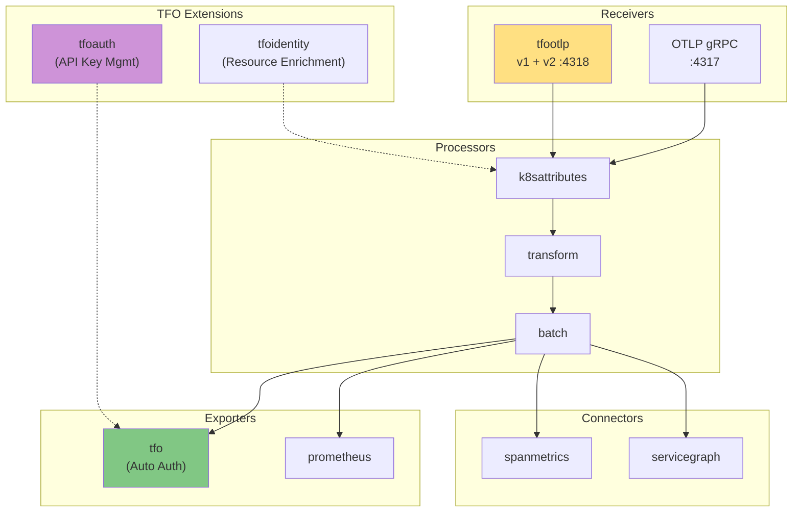
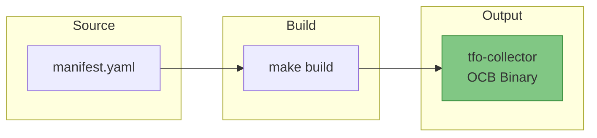

# TFO-OTEL-Collector Documentation

- **Version:** 1.4.0
- **Last Updated:** May 2026
- **Component:** TelemetryFlow Collector (OCB Native)
- **Collector Version:** v1.2.1
- **Go Version:** 1.26+
- **OpenTelemetry Core:** v1.58.0
- **OpenTelemetry Contrib:** v0.152.0
- **Status:** Production Ready

---

## Table of Contents

1. [Overview](#overview)
2. [OCB Build System](#ocb-build-system)
3. [Installation](#installation)
4. [Configuration](#configuration)
5. [CLI Commands](#cli-commands)
6. [TFO Custom Components](#tfo-custom-components)
7. [Components Reference](#components-reference)
8. [Monitoring](#monitoring)
9. [High Availability](#high-availability)
10. [Troubleshooting](#troubleshooting)
11. [Best Practices](#best-practices)

---

## Overview

**TFO-Collector v1.2.1** is an enterprise-grade OpenTelemetry Collector distribution built **100% natively** with the OpenTelemetry Collector Builder (OCB). It features **85+ community components** from OTEL Core v1.58.0 and Contrib v0.152.0, plus **4 custom TFO components** for platform-specific authentication and dual endpoint support.

### Key Capabilities

- **100% OCB Native**: Single binary, no dual build system
- **85+ Community Components**: Full OTEL ecosystem compatibility
- **4 TFO Custom Components**: `tfootlp` receiver, `tfo` exporter, `tfoauth` + `tfoidentity` extensions
- **Dual Endpoint Support**: Community v1 (`/v1/*`) + Platform v2 (`/v2/*`) on same port 4318
- **Connectors**: spanmetrics (exemplars), servicegraph (service dependency maps)
- **High Throughput**: 100K+ data points/second per instance
- **Multi-Tenancy**: Built-in workspace and tenant context via tfoauth

### Architecture Role

```mermaid
graph LR
    subgraph "Data Sources"
        AGENTS[TFO-Agents]
        APPS[Applications]
        INFRA[Infrastructure]
    end

    subgraph "TFO-Collector v1.2.1"
        RECEIVE[Receive & Validate<br/>tfootlp (v1 + v2)]
        PROCESS[Process & Enrich<br/>tfoauth + tfoidentity]
        EXPORT[Export via tfo<br/>Auto Auth Injection]
    end

    subgraph "Backends"
        TFO[TelemetryFlow Platform]
        PROM[Prometheus]
        LOKI[Loki]
    end

    AGENTS & APPS & INFRA --> RECEIVE
    RECEIVE --> PROCESS
    PROCESS --> EXPORT
    EXPORT --> TFO & PROM & LOKI

    style RECEIVE fill:#E1F5FE
    style PROCESS fill:#FFF9C4
    style EXPORT fill:#C8E6C9
```

### Pipeline Architecture


```mermaid
flowchart TB
    subgraph Receivers["Receivers"]
        TFOOTLP["tfootlp<br/>v1 + v2 :4318"]
        GRPC["OTLP gRPC<br/>:4317"]
    end

    subgraph Extensions["TFO Extensions"]
        AUTH["tfoauth<br/>(API Key Mgmt)"]
        IDENTITY["tfoidentity<br/>(Resource Enrichment)"]
    end

    subgraph Processors["Processors"]
        K8S["k8sattributes"]
        TRANSFORM["transform"]
        BATCH["batch"]
    end

    subgraph Connectors["Connectors"]
        SPANMETRICS["spanmetrics"]
        SERVICEGRAPH["servicegraph"]
    end

    subgraph Exporters["Exporters"]
        TFO_EXP["tfo<br/>(Auto Auth)"]
        PROM_EXP["prometheus"]
    end

    TFOOTLP --> K8S
    GRPC --> K8S
    K8S --> TRANSFORM
    TRANSFORM --> BATCH
    BATCH --> TFO_EXP
    BATCH --> PROM_EXP
    BATCH --> SPANMETRICS
    BATCH --> SERVICEGRAPH

    AUTH -.-> TFO_EXP
    IDENTITY -.-> K8S

    style TFOOTLP fill:#FFE082
    style AUTH fill:#CE93D8
    style TFO_EXP fill:#81C784
```

### Project Structure

```text
telemetryflow-collector/
├── cmd/                     # Entry points
├── internal/
│   ├── collector/           # Core collector implementation
│   ├── config/              # Configuration management
│   └── version/             # Version and banner info
├── pkg/                     # LEGO Building Blocks
│   ├── banner/              # Startup banner
│   ├── config/              # Config loader utilities
│   └── plugin/              # Component registry
├── configs/
│   └── otel-collector.yaml  # OCB config (standard OTel format)
├── tests/
│   ├── unit/                # Unit tests
│   ├── integration/         # Integration tests
│   ├── e2e/                 # End-to-end tests
│   ├── mocks/               # Mock implementations
│   └── fixtures/            # Test fixtures
├── build/                   # Build output
│   └── tfo-collector        # OCB binary
├── manifest.yaml            # OCB manifest
├── Makefile
├── Dockerfile
├── docker-compose.yml
├── .env.example
└── README.md
```

---

## OCB Build System

TFO-Collector uses a **single OCB-native build** that produces one binary with all components.

### Build Process


```mermaid
graph LR
    subgraph "Source"
        MANIFEST[manifest.yaml]
    end

    subgraph "Build"
        OCB[make build]
    end

    subgraph "Output"
        BIN[tfo-collector<br/>OCB Binary]
    end

    MANIFEST --> OCB
    OCB --> BIN

    style BIN fill:#81C784,stroke:#388E3C
```

### OCB Manifest

The `manifest.yaml` defines all components:

```yaml
# manifest.yaml
dist:
  module: github.com/telemetryflow/telemetryflow-collector
  name: tfo-collector
  description: TelemetryFlow Collector (OCB Native)
  version: 1.2.1
  output_path: ./build
  otelcol_version: 0.152.0

receivers:
  - gomod: github.com/telemetryflow/tfootlp v1.2.1
  - gomod: github.com/open-telemetry/opentelemetry-collector/receiver/otlpreceiver v1.58.0

exporters:
  - gomod: github.com/telemetryflow/tfo v1.2.1
  - gomod: github.com/open-telemetry/opentelemetry-collector/exporter/otlphttpexporter v1.58.0

extensions:
  - gomod: github.com/telemetryflow/tfoauth v1.2.1
  - gomod: github.com/telemetryflow/tfoidentity v1.2.1

connectors:
  - gomod: github.com/open-telemetry/opentelemetry-collector-contrib/connector/spanmetricsconnector v0.152.0
  - gomod: github.com/open-telemetry/opentelemetry-collector-contrib/connector/servicegraphconnector v0.152.0
```

### Component Counts

| Category       | Count   | Source              |
| -------------- | ------- | ------------------- |
| Receivers      | 55+     | OTEL Contrib        |
| Processors     | 22+     | OTEL Core + Contrib |
| Exporters      | 45+     | OTEL Core + Contrib |
| Connectors     | 8       | OTEL Contrib        |
| Extensions     | 12      | OTEL Core + Contrib |
| **TFO Custom** | **4**   | TelemetryFlow       |
| **Total**      | **85+** |                     |

---

## Installation

### Method 1: From Source (OCB Build)

```bash
git clone https://github.com/telemetryflow/telemetryflow-collector.git
cd telemetryflow-collector

# Install OCB
make install-ocb

# Build with OCB
make build

# Run
./build/tfo-collector --config configs/otel-collector.yaml
```

### Method 2: Docker Compose

```bash
cp .env.example .env
vim .env
docker-compose up -d --build
docker-compose logs -f tfo-collector
```

### Method 3: Docker Directly

```bash
docker build \
  --build-arg VERSION=1.2.1 \
  --build-arg OTEL_VERSION=0.152.0 \
  -t telemetryflow/telemetryflow-collector:1.2.1 .

docker run -d --name tfo-collector \
  -p 4317:4317 -p 4318:4318 -p 8888:8888 -p 13133:13133 \
  -v /path/to/config.yaml:/etc/tfo-collector/otel-collector.yaml:ro \
  telemetryflow/telemetryflow-collector:1.2.1
```

### Method 4: Kubernetes Deployment

```yaml
apiVersion: v1
kind: Namespace
metadata:
  name: observability

---
apiVersion: v1
kind: ConfigMap
metadata:
  name: tfo-collector-config
  namespace: observability
data:
  otel-collector.yaml: |
    receivers:
      tfootlp:
        protocols:
          http:
            endpoint: "0.0.0.0:4318"
          grpc:
            endpoint: "0.0.0.0:4317"

    processors:
      k8sattributes:
        auth_type: "serviceAccount"
        passthrough: false
        extract:
          metadata:
            - k8s.pod.name
            - k8s.namespace.name
            - k8s.node.name
        pod_association:
          - sources:
              - from: resource_attribute
                name: k8s.pod.ip

      transform:
        error_mode: ignore
        metric_statements:
          - context: metric
            statements:
              - set(description, "") where name == ""

      batch:
        send_batch_size: 8192
        timeout: 200ms

    exporters:
      tfo:
        endpoint: "http://telemetryflow-api:3000/api"
        auth:
          authenticator: tfoauth

      prometheus:
        endpoint: "0.0.0.0:8889"

    connectors:
      spanmetrics:
        histogram:
          explicit:
            buckets: [2ms, 4ms, 6ms, 8ms, 10ms, 50ms, 100ms, 200ms, 400ms, 800ms, 1s, 1400ms, 2s, 5s, 10s, 15s]
        dimensions:
          - name: http.method
          - name: http.status_code
        aggregation_temporality: "AGGREGATION_TEMPORALITY_CUMULATIVE"
        metrics_flush_interval: 15s

      service_graph:
        latency_histogram_buckets: [100ms, 250ms, 500ms, 1s, 5s, 10s]
        dimensions: []
        store:
          ttl: 2s
          max_items: 200

    extensions:
      tfoauth:
        api_key_id: "${env:TELEMETRYFLOW_API_KEY_ID}"
        api_key_secret: "${env:TELEMETRYFLOW_API_KEY_SECRET}"

      tfoidentity:
        collector_id: "tfo-collector-k8s"
        labels:
          environment: "production"

      health_check:
        endpoint: "0.0.0.0:13133"

    service:
      extensions: [tfoauth, tfoidentity, health_check]
      pipelines:
        traces:
          receivers: [tfootlp]
          processors: [k8sattributes, batch]
          exporters: [tfo, spanmetrics, servicegraph]
        metrics:
          receivers: [tfootlp]
          processors: [k8sattributes, transform, batch]
          exporters: [tfo, prometheus]
        logs:
          receivers: [tfootlp]
          processors: [k8sattributes, batch]
          exporters: [tfo]

---
apiVersion: apps/v1
kind: Deployment
metadata:
  name: tfo-collector
  namespace: observability
  labels:
    app: tfo-collector
    version: "1.2.1"
spec:
  replicas: 3
  selector:
    matchLabels:
      app: tfo-collector
  template:
    metadata:
      labels:
        app: tfo-collector
        version: "1.2.1"
    spec:
      serviceAccountName: tfo-collector
      containers:
        - name: tfo-collector
          image: telemetryflow/telemetryflow-collector:1.2.1
          imagePullPolicy: IfNotPresent
          args:
            - --config=/etc/tfo-collector/otel-collector.yaml
          ports:
            - name: otlp-grpc
              containerPort: 4317
            - name: otlp-http
              containerPort: 4318
            - name: metrics
              containerPort: 8888
            - name: prometheus
              containerPort: 8889
            - name: health
              containerPort: 13133

          env:
            - name: TELEMETRYFLOW_API_KEY_ID
              valueFrom:
                secretKeyRef:
                  name: telemetryflow-secrets
                  key: api-key-id
            - name: TELEMETRYFLOW_API_KEY_SECRET
              valueFrom:
                secretKeyRef:
                  name: telemetryflow-secrets
                  key: api-key-secret

          resources:
            requests: { memory: "512Mi", cpu: "500m" }
            limits: { memory: "2Gi", cpu: "2000m" }

          volumeMounts:
            - name: config
              mountPath: /etc/tfo-collector

          livenessProbe:
            httpGet: { path: /, port: 13133 }
            initialDelaySeconds: 30
            periodSeconds: 10

          readinessProbe:
            httpGet: { path: /, port: 13133 }
            initialDelaySeconds: 10
            periodSeconds: 5

      volumes:
        - name: config
          configMap:
            name: tfo-collector-config

---
apiVersion: v1
kind: Service
metadata:
  name: tfo-collector
  namespace: observability
spec:
  type: ClusterIP
  ports:
    - { port: 4317, targetPort: 4317, name: otlp-grpc }
    - { port: 4318, targetPort: 4318, name: otlp-http }
    - { port: 8888, targetPort: 8888, name: metrics }
    - { port: 8889, targetPort: 8889, name: prometheus }
    - { port: 13133, targetPort: 13133, name: health }
  selector:
    app: tfo-collector
```

---

## Configuration

TFO-Collector uses **standard OTEL YAML format** (OCB native).

### Minimal Configuration

```yaml
receivers:
  tfootlp:
    protocols:
      http:
        endpoint: "0.0.0.0:4318"

processors:
  batch:
    send_batch_size: 8192
    timeout: 200ms

exporters:
  tfo:
    endpoint: "http://telemetryflow-api:3000/api"
    auth:
      authenticator: tfoauth

extensions:
  tfoauth:
    api_key_id: "${env:TELEMETRYFLOW_API_KEY_ID}"
    api_key_secret: "${env:TELEMETRYFLOW_API_KEY_SECRET}"

service:
  extensions: [tfoauth]
  pipelines:
    metrics:
      receivers: [tfootlp]
      processors: [batch]
      exporters: [tfo]
    logs:
      receivers: [tfootlp]
      processors: [batch]
      exporters: [tfo]
    traces:
      receivers: [tfootlp]
      processors: [batch]
      exporters: [tfo]
```

### Full Production Configuration

See [CONFIGURATION.md](CONFIGURATION.md) for the complete reference.

---

## CLI Commands

```bash
# Show help
tfo-collector --help

# Run with config
tfo-collector --config configs/otel-collector.yaml

# Validate config
tfo-collector validate --config configs/otel-collector.yaml

# Dry run
tfo-collector --config configs/otel-collector.yaml --dry-run
```

---

## TFO Custom Components

### tfootlp (Receiver)

OTLP receiver with **v1/v2 dual endpoint support** on same port 4318:

| Endpoint           | Path                                    | Auth              | Purpose                     |
| ------------------ | --------------------------------------- | ----------------- | --------------------------- |
| **v1 (Community)** | `/v1/metrics`, `/v1/logs`, `/v1/traces` | Open              | Standard OTEL compatibility |
| **v2 (Platform)**  | `/v2/metrics`, `/v2/logs`, `/v2/traces` | API Key (tfoauth) | TelemetryFlow Platform      |

```yaml
receivers:
  tfootlp:
    protocols:
      http:
        endpoint: "0.0.0.0:4318"
        cors:
          allowed_origins: ["https://app.telemetryflow.id"]
      grpc:
        endpoint: "0.0.0.0:4317"
```

### tfo (Exporter)

Platform exporter with **automatic authentication header injection**:

```yaml
exporters:
  tfo:
    endpoint: "http://telemetryflow-api:3000/api"
    auth:
      authenticator: tfoauth
    compression: gzip
    retry_on_failure:
      enabled: true
      initial_interval: 5s
      max_interval: 30s
    sending_queue:
      enabled: true
      num_consumers: 10
      queue_size: 5000
```

### tfoauth (Extension)

Centralized API key management for TFO authentication:

```yaml
extensions:
  tfoauth:
    api_key_id: "${env:TELEMETRYFLOW_API_KEY_ID}"
    api_key_secret: "${env:TELEMETRYFLOW_API_KEY_SECRET}"
    # AWS-style dual keys: tfk-*/tfs-*
    # Argon2id hashed on platform side
```

### tfoidentity (Extension)

Collector identity and resource enrichment:

```yaml
extensions:
  tfoidentity:
    collector_id: "tfo-collector-prod-01"
    labels:
      environment: "production"
      region: "us-east-1"
      cluster: "main"
```

---

## Components Reference

### Receivers

| Component     | Description                                 |
| ------------- | ------------------------------------------- |
| `tfootlp`     | TFO OTLP receiver with v1/v2 endpoints      |
| `otlp`        | Standard OTLP gRPC and HTTP receiver        |
| `prometheus`  | Prometheus metrics scraping                 |
| `filelog`     | File-based log collection                   |
| `kafka`       | Kafka message receiver                      |
| `k8s_cluster` | Kubernetes cluster metrics                  |
| `hostmetrics` | System metrics (CPU, memory, disk, network) |
| `syslog`      | Syslog receiver                             |
| + 47 more     | Full OTEL Contrib ecosystem                 |

### Processors

| Component           | Description                       |
| ------------------- | --------------------------------- |
| `batch`             | Batches data for efficient export |
| `memory_limiter`    | Prevents OOM conditions           |
| `k8sattributes`     | Add Kubernetes metadata           |
| `attributes`        | Modify/add/delete attributes      |
| `transform`         | Transform telemetry using OTTL    |
| `filter`            | Filter telemetry data             |
| `resource`          | Modify resource attributes        |
| `resourcedetection` | Auto-detect resource info         |
| `tail_sampling`     | Tail-based trace sampling         |

### Exporters

| Component               | Description                       |
| ----------------------- | --------------------------------- |
| `tfo`                   | TFO Platform exporter (auto auth) |
| `otlp`                  | OTLP gRPC exporter                |
| `otlphttp`              | OTLP HTTP exporter                |
| `prometheus`            | Prometheus metrics endpoint       |
| `prometheusremotewrite` | Prometheus remote write           |
| `loki`                  | Loki log exporter                 |
| `elasticsearch`         | Elasticsearch exporter            |
| `kafka`                 | Kafka exporter                    |
| `debug`                 | Debug output                      |

### Connectors

| Component      | Description                             |
| -------------- | --------------------------------------- |
| `spanmetrics`  | Generate metrics from spans (exemplars) |
| `servicegraph` | Generate service dependency maps        |
| `routing`      | Route telemetry based on attributes     |
| `count`        | Count telemetry items                   |
| + 4 more       | Full OTEL Contrib connectors            |

### Extensions

| Component         | Description                   |
| ----------------- | ----------------------------- |
| `tfoauth`         | TFO API key management        |
| `tfoidentity`     | Collector identity enrichment |
| `health_check`    | Health check endpoint         |
| `pprof`           | Performance profiling         |
| `zpages`          | Debug pages                   |
| `basicauth`       | Basic authentication          |
| `bearertokenauth` | Bearer token auth             |
| `file_storage`    | Persistent storage            |

---

## Exposed Ports

| Port  | Protocol | Description                |
| ----- | -------- | -------------------------- |
| 4317  | gRPC     | OTLP gRPC receiver         |
| 4318  | HTTP     | tfootlp receiver (v1 + v2) |
| 8888  | HTTP     | Prometheus metrics (self)  |
| 8889  | HTTP     | Prometheus exporter        |
| 13133 | HTTP     | Health check               |

---

## Monitoring

### Health Check

```bash
curl http://localhost:13133/
```

### Collector Metrics

```bash
curl http://localhost:8888/metrics
```

Key metrics:

```promql
otelcol_receiver_accepted_metric_points
otelcol_receiver_accepted_log_records
otelcol_receiver_accepted_spans
otelcol_exporter_sent_metric_points
otelcol_exporter_send_failed_metric_points
otelcol_exporter_queue_size
otelcol_process_runtime_heap_alloc_bytes
```

---

## High Availability

### Kubernetes HPA

```yaml
apiVersion: autoscaling/v2
kind: HorizontalPodAutoscaler
metadata:
  name: tfo-collector-hpa
  namespace: observability
spec:
  scaleTargetRef:
    apiVersion: apps/v1
    kind: Deployment
    name: tfo-collector
  minReplicas: 3
  maxReplicas: 10
  metrics:
    - type: Resource
      resource:
        name: cpu
        target:
          type: Utilization
          averageUtilization: 70
    - type: Resource
      resource:
        name: memory
        target:
          type: Utilization
          averageUtilization: 80
```

---

## Troubleshooting

### Issue: High Memory Usage

```yaml
processors:
  memory_limiter:
    check_interval: 1s
    limit_mib: 1024
    spike_limit_mib: 256
  batch:
    send_batch_size: 512
```

### Issue: Data Not Reaching Backend

```bash
docker logs tfo-collector --tail=100
curl http://localhost:8888/metrics | grep exporter_send_failed
```

### Issue: tfoauth Authentication Errors

```bash
echo $TELEMETRYFLOW_API_KEY_ID
echo $TELEMETRYFLOW_API_KEY_SECRET
# Verify format: tfk-* for key ID, tfs-* for secret
```

---

## Best Practices

1. **Always Use tfoauth**: Configure API key authentication for v2 endpoints
2. **Enable tfoidentity**: Add collector identity for resource enrichment
3. **Use Compression**: `compression: gzip` (70-90% bandwidth reduction)
4. **Configure Retries**: `retry_on_failure` with persistent queue
5. **Monitor Collector Health**: Enable health_check and internal metrics
6. **Use k8sattributes**: Enrich telemetry with Kubernetes metadata
7. **Enable Connectors**: spanmetrics + servicegraph for derived telemetry

---

## Development

```bash
make help
make build              # Build OCB collector
make run                # Run collector
make validate-config    # Validate configuration
make test               # Run tests
make lint               # Run linters
make clean              # Clean build artifacts
make version            # Show version information
```

---

## Links

- **Website**: [https://telemetryflow.id](https://telemetryflow.id)
- **Documentation**: [https://docs.telemetryflow.id](https://docs.telemetryflow.id)
- **Repository**: [https://github.com/telemetryflow/telemetryflow-collector](https://github.com/telemetryflow/telemetryflow-collector)
- **Developer**: [Telemetri Data Indonesia](https://telemetryflow.id)

---

**Version:** 1.4.0 | **Component:** TFO-Collector v1.2.1 | **OTEL Core:** v1.58.0 | **Contrib:** v0.152.0 | **Last Updated:** May 2026
